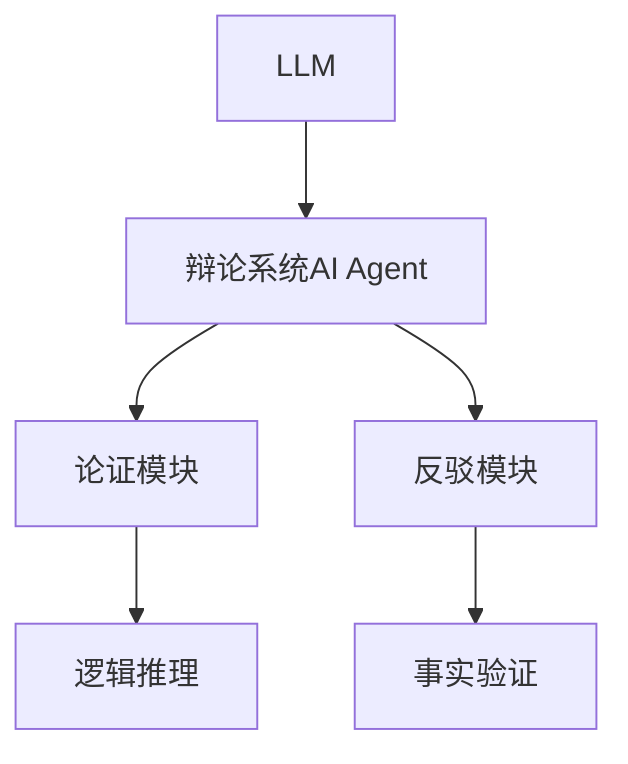
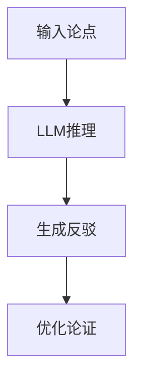
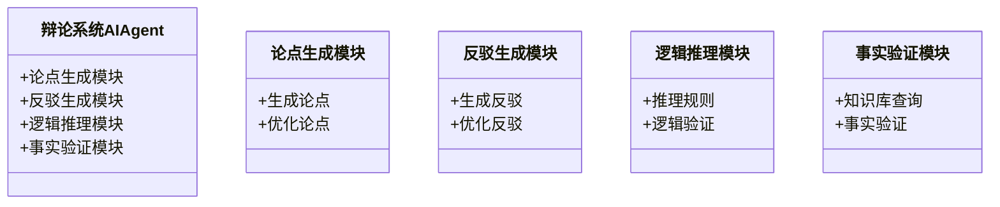
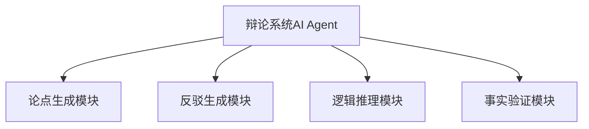
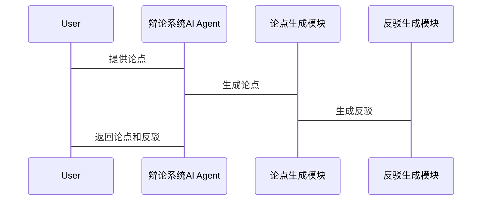

                 


# 辩论系统AI Agent：LLM驱动的论证与反驳能力

> **关键词**：LLM, 辩论系统, AI Agent, 论证, 反驳, 人工智能, 自然语言处理

> **摘要**：随着人工智能技术的快速发展，基于大语言模型（LLM）的辩论系统AI Agent正逐渐成为学术界和工业界的热点。本文将从背景介绍、核心概念、算法原理、数学模型、系统架构设计、项目实战等多个方面，详细探讨LLM驱动的论证与反驳能力。通过分析LLM在辩论系统中的应用，揭示其在逻辑推理、语言生成和知识表示等方面的优势，并结合实际案例，展示如何构建一个高效的辩论系统AI Agent。

---

# 第一部分: 背景介绍

## 第1章: 辩论系统AI Agent概述

### 1.1 问题背景

#### 1.1.1 辩论系统的核心问题
- **什么是辩论系统？**
  辩论系统是一种基于人工智能的系统，能够自动生成和反驳论点，模拟人类的辩论过程。
- **辩论系统的核心问题：**
  1. 如何自动生成合理的论点？
  2. 如何有效地反驳对手的论点？
  3. 如何在复杂场景中保持逻辑一致性和事实准确性？

#### 1.1.2 辩论系统的智能化需求
- 随着人工智能技术的发展，辩论系统需要具备以下能力：
  - 自动分析问题并生成论点。
  - 基于事实和逻辑进行反驳。
  - 理解上下文并进行动态调整。

#### 1.1.3 LLM驱动的辩论系统的优势
- LLM（Large Language Model）的出现，为辩论系统提供了强大的自然语言处理能力。
- 基于LLM的辩论系统能够：
  - 处理复杂的语言表达。
  - 生成多样化的论点。
  - 快速理解上下文并进行实时推理。

### 1.2 问题描述

#### 1.2.1 辩论系统的定义与特点
- **定义：** 辩论系统是一种人工智能系统，能够自动生成和反驳论点，模拟人类辩论过程。
- **特点：**
  - **逻辑性：** 辩论系统需要具备逻辑推理能力。
  - **知识性：** 需要依赖丰富的知识库。
  - **动态性：** 辩论过程是动态的，需要实时调整策略。

#### 1.2.2 辩论系统的应用场景
- **学术领域：** 辩论系统可以用于学术论文的自动反驳和论证。
- **司法领域：** 辩论系统可以辅助律师进行案件分析和辩论策略制定。
- **商业领域：** 辩论系统可以用于商业谈判和市场分析。

#### 1.2.3 辩论系统的边界与外延
- **边界：**
  - 辩论系统仅限于论点生成和反驳，不涉及实际的法律或道德判断。
- **外延：**
  - 辩论系统可以与其他AI系统（如知识图谱、推理引擎）结合，扩展功能。

### 1.3 问题解决

#### 1.3.1 辩论系统AI Agent的目标
- **目标：**
  - 提供高效的论点生成和反驳能力。
  - 实现与人类类似的辩论能力。

#### 1.3.2 辩论系统AI Agent的核心能力
- **核心能力：**
  - 论证生成。
  - 反驳生成。
  - 逻辑推理。
  - 事实验证。

#### 1.3.3 辩论系统AI Agent的实现路径
- **实现路径：**
  1. 基于LLM的论点生成。
  2. 基于事实的知识验证。
  3. 基于逻辑的反驳生成。

### 1.4 核心概念与联系

#### 1.4.1 核心概念对比表
| 概念 | 描述 | 属性 |
|------|------|------|
| LLM  | 大语言模型 | 基于Transformer架构，支持多任务学习 |
| 辩论系统 | 基于LLM的AI代理 | 用于自动论证与反驳 |
| 论证 | 逻辑推理过程 | 包括前提、结论和推理规则 |
| 反驳 | 对论证的否定 | 基于逻辑漏洞或事实依据 |

#### 1.4.2 实体关系图


---

## 第2章: LLM驱动的辩论系统核心原理

### 2.1 LLM的基本原理

#### 2.1.1 Transformer架构
- **Transformer架构：** 由Google提出，广泛应用于自然语言处理任务。
- **关键组件：**
  - 编码器。
  - 解码器。
  - 注意力机制。

#### 2.1.2 注意力机制
- **注意力机制：** 通过计算输入序列中每个词的重要性，生成上下文相关的表示。
- **计算公式：**
  $$\text{Attention}(Q, K, V) = \text{softmax}\left(\frac{QK^T}{\sqrt{d_k}}\right)V$$

#### 2.1.3 梯度下降与优化算法
- **常用优化算法：**
  - Adam优化器。
  - 小批量梯度下降。

### 2.2 辩论系统的算法原理

#### 2.2.1 论证生成算法
- **步骤：**
  1. 分析输入论点。
  2. 基于LLM生成多个可能的论点。
  3. 选择最优论点。

#### 2.2.2 反驳生成算法
- **步骤：**
  1. 分析对手论点。
  2. 基于LLM生成反驳论点。
  3. 优化反驳论点。

#### 2.2.3 论证优化算法
- **步骤：**
  1. 评估当前论点的质量。
  2. 进行优化调整。
  3. 输出优化后的论点。

### 2.3 算法流程图


### 2.4 核心公式

#### 2.4.1 概率论基础
$$P(A|B) = \frac{P(B|A)P(A)}{P(B)}$$

#### 2.4.2 损失函数
$$L = -\sum_{i} y_i \log p(y_i)$$

---

## 第3章: 辩论系统数学模型与公式

### 3.1 逻辑推理模型
- **命题逻辑：**
  - 基于命题逻辑的推理规则。
  - 例如：$A \rightarrow B$ 表示如果A为真，则B必须为真。

### 3.2 事实验证模型
- **事实验证公式：**
  $$\text{FactCheck}(S) = \sum_{i=1}^{n} w_i x_i$$
  其中，$w_i$ 是事实$x_i$的权重，$x_i$是事实的表示。

### 3.3 反驳生成模型
- **反驳生成公式：**
  $$\text{Counter}(A) = \neg \text{Arg}(A)$$
  其中，$\text{Arg}(A)$ 表示论点$A$的论证，$\neg$表示否定。

---

## 第4章: 辩论系统架构设计与实现

### 4.1 项目介绍
- **项目目标：** 实现一个基于LLM的辩论系统AI Agent。
- **项目范围：** 包括论点生成、事实验证、逻辑推理和反驳生成。

### 4.2 系统功能设计

#### 4.2.1 领域模型


#### 4.2.2 系统架构图


#### 4.2.3 系统接口设计
- **输入接口：**
  - 用户输入论点。
- **输出接口：**
  - 自动生成的论点。
  - 自动生成的反驳。

#### 4.2.4 系统交互图


---

## 第5章: 项目实战

### 5.1 环境配置
- **工具安装：**
  - Python 3.8+
  - PyTorch 1.9+
  - Hugging Face Transformers库

### 5.2 核心代码实现

#### 5.2.1 论点生成模块
```python
from transformers import AutoTokenizer, AutoModelForCausalLM

model_name = "gpt2-large"
tokenizer = AutoTokenizer.from_pretrained(model_name)
model = AutoModelForCausalLM.from_pretrained(model_name)

def generate_argument(prompt):
    inputs = tokenizer.encode(prompt, return_tensors="pt")
    outputs = model.generate(inputs, max_length=100, num_return_sequences=1)
    argument = tokenizer.decode(outputs[0], skip_special_tokens=True)
    return argument
```

#### 5.2.2 反驳生成模块
```python
def generate_counterargument(argument):
    prompt = f"反驳这个论点：{argument}"
    inputs = tokenizer.encode(prompt, return_tensors="pt")
    outputs = model.generate(inputs, max_length=100, num_return_sequences=1)
    counterargument = tokenizer.decode(outputs[0], skip_special_tokens=True)
    return counterargument
```

#### 5.2.3 事实验证模块
```python
def verify_fact(fact):
    # 假设有一个知识库，返回True或False
    knowledge_base = {
        "事实1": True,
        "事实2": False
    }
    return knowledge_base.get(fact, False)
```

### 5.3 案例分析
- **案例1：**
  - 输入论点：气候变化是人类活动导致的。
  - 生成的反驳：气候变化主要是自然周期的结果。

### 5.4 项目总结
- **总结：**
  - 基于LLM的辩论系统AI Agent能够有效地生成论点和反驳。
  - 系统性能依赖于LLM的训练数据和模型架构。

---

## 第6章: 最佳实践与拓展阅读

### 6.1 小结
- **小结：** 本文详细介绍了基于LLM的辩论系统AI Agent的构建过程，包括核心概念、算法原理、系统架构设计和项目实战。

### 6.2 注意事项
- **注意事项：**
  - 确保知识库的准确性。
  - 定期更新模型以适应新的知识。
  - 处理复杂场景时，需要结合其他AI技术。

### 6.3 拓展阅读
- **推荐书籍：**
  - 《深度学习》
  - 《自然语言处理实战》
- **推荐论文：**
  - "Attention Is All You Need"
  - "A Survey of Text Generation Using Large Language Models"

---

## 作者：AI天才研究院/AI Genius Institute & 禅与计算机程序设计艺术 /Zen And The Art of Computer Programming

---

通过本文的详细讲解，读者可以深入了解基于LLM的辩论系统AI Agent的构建过程，并掌握其在实际应用中的潜力。希望本文能为相关领域的研究和实践提供有价值的参考。

