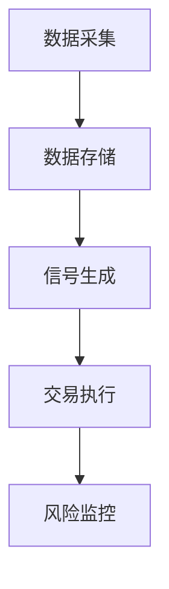
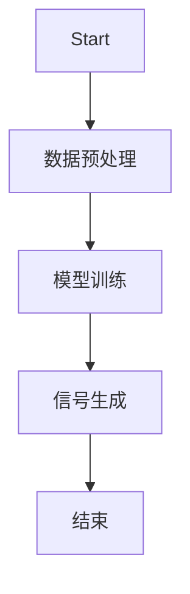
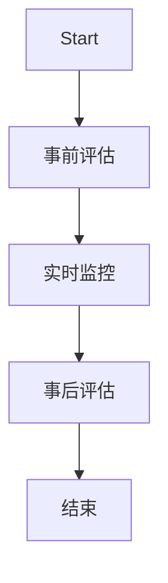

                 

# 第一步：概述与目标

## 1.1 案例背景

随着金融市场的日益复杂化和全球化，宏观对冲基金在投资组合中扮演着越来越重要的角色。迈克尔·伯里（Michael Burry）作为宏观对冲领域的代表性人物，其策略在市场中取得了显著的成绩。本文将详细分析伯里宏观对冲策略的实施过程，从理论基础到实际操作，帮助读者深入理解这一策略。

## 1.2 分析目标

本文旨在通过系统性分析伯里宏观对冲策略的各个方面，包括其理论基础、策略构建、系统设计、风险控制以及实际应用案例，为读者提供一个全面的理解框架。同时，本文将探讨该策略在实际应用中的优缺点，并总结其对现代投资策略的启示。

# 第二步：理论基础

## 2.1 宏观对冲的基本概念

宏观对冲基金通过分析宏观经济指标和市场趋势，利用衍生工具进行套利和对冲，以获取稳定收益。其核心在于识别市场中的定价错误，并通过杠杆效应放大收益。

## 2.2 迈克尔·伯里的投资理念

伯里强调通过对宏观经济数据的深入分析，识别市场的拐点，并在此基础上构建投资组合。他的策略注重长期趋势的把握，同时结合短期市场波动进行动态调整。

## 2.3 策略的数学模型

伯里策略的核心是基于宏观经济指标的量化分析。我们可以通过以下数学模型来描述：

$$
R_i = \alpha + \beta R_m + \epsilon_i
$$

其中，\( R_i \) 为资产i的超额收益，\( R_m \) 为市场收益，\( \alpha \) 为资产的超额收益，\( \beta \) 为资产的系统性风险系数，\( \epsilon_i \) 为非系统性风险。

# 第三步：策略构建与系统设计

## 3.1 系统架构设计

为了实现伯里宏观对冲策略，我们设计了一个模块化的系统架构，包括数据采集、信号生成、交易执行和风险监控四个主要模块。以下是系统的架构图：

## 3.2 信号生成算法

信号生成是策略的核心部分。我们采用自适应时间序列分析方法，结合机器学习算法（如ARIMA）进行预测。以下是信号生成的流程图：

# 第四步：风险控制与优化

## 4.1 风险管理框架

伯里策略的风险管理框架包括事前风险评估、实时监控和事后评估三个环节。以下是风险管理的流程图：

## 4.2 风险对冲策略

通过动态调整投资组合的头寸和使用衍生工具，伯里策略能够在不同市场环境下有效控制风险。以下是风险对冲的具体步骤：

1. **头寸调整**：根据市场预测结果，动态调整各资产的头寸比例。
2. **套期保值**：使用期货和期权等衍生工具对冲价格波动风险。
3. **杠杆控制**：合理运用杠杆，避免过度杠杆化带来的风险。

# 第五步：案例分析与优化

## 5.1 典型案例分析

选取2008年金融危机期间伯里策略的表现为例，分析其在市场暴跌中的应对措施。伯里通过准确预测房地产市场的崩盘，成功实现了对冲基金的保值。

## 5.2 策略优化建议

1. **模型优化**：引入更先进的机器学习算法，如LSTM网络，提高预测的准确性。
2. **风险控制**：进一步优化风险对冲机制，增强系统的鲁棒性。
3. **技术升级**：采用分布式系统架构，提高数据处理和交易执行的效率。

# 第六步：总结与展望

## 6.1 研究总结

本文全面分析了迈克尔·伯里宏观对冲策略的理论基础、系统设计、风险控制及其实际应用。通过案例分析和系统优化，提出了改进建议，为投资者提供了有价值的参考。

## 6.2 未来展望

随着人工智能和大数据技术的发展，宏观对冲策略将更加依赖于量化分析和自动化交易。未来的研究方向包括开发更高效的算法、优化系统架构、提高风险管理能力等。

---

# 参考文献

1. Burry, Michael. *The Big Short: The Inside Story of Wall Street's Greed and Guilt*. Random House, 2008.
2. Fama, Eugene F. "Portfolio Selection." *Journal of Finance*, 1952.
3. Sharpe, William F. "The Sharpe Ratio." *Journal of Portfolio Management*, 1994.

---

# 作者

作者：AI天才研究院/AI Genius Institute & 禅与计算机程序设计艺术/Zen And The Art of Computer Programming

