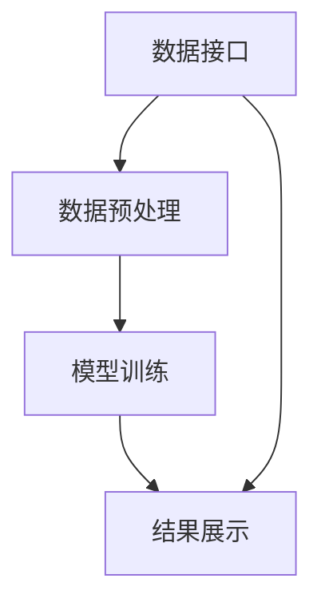
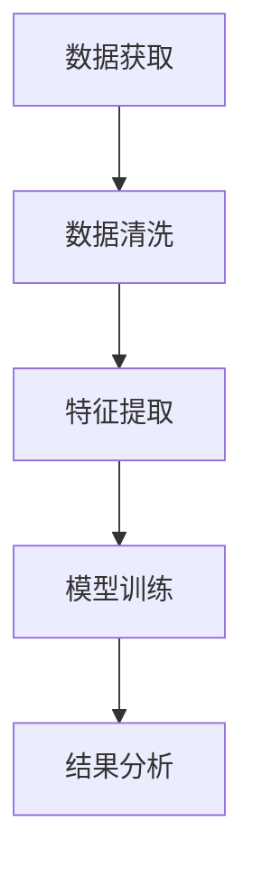

                 


# 迈克尔·莫布森的价值投资定量分析

**关键词：** 价值投资、定量分析、迈克尔·莫布森、股票估值、投资策略、数据分析、机器学习

**摘要：**  
本文深入探讨了迈克尔·莫布森的价值投资理念，并结合定量分析方法，系统地分析了股票估值的核心指标、投资策略的构建与优化。通过详细阐述数据分析与建模的过程，以及实际案例的分析，本文展示了如何将价值投资与定量分析相结合，帮助投资者制定科学的投资策略。文章还讨论了系统架构与算法实现，提供了从理论到实践的全面指导。

---

## 第一部分: 价值投资与定量分析的基础

### 第1章: 价值投资的核心概念

#### 1.1 价值投资的基本原理

- **1.1.1 价值投资的定义与核心思想**  
  价值投资是一种以基本面分析为基础的投资策略，强调购买低于其内在价值的资产。莫布森的价值投资理念强调安全边际和长期持有的重要性，认为市场波动为理性投资者提供了低价买入的机会。

- **1.1.2 迈克尔·莫布森的价值投资理念**  
  莫布森认为，市场并非总是有效，投资者可以通过分析公司的基本面，寻找被市场低估的股票。他的投资策略强调长期持有、分散投资以及对安全边际的追求。

- **1.1.3 价值投资与市场有效性的关系**  
  尽管市场存在一定程度的有效性，但短期波动和市场情绪可能导致股票价格偏离其内在价值。价值投资者通过识别这种偏差，捕捉长期的超额收益。

#### 1.2 定量分析的基本概念

- **1.2.1 定量分析的定义与特点**  
  定量分析是一种基于数据和数学模型的投资方法，通过分析历史数据和统计规律，寻找投资机会。其特点是客观、可重复和基于逻辑推理。

- **1.2.2 定量分析在投资中的作用**  
  定量分析可以帮助投资者识别市场趋势、评估风险、优化投资组合，并提高决策的科学性。在价值投资中，定量分析用于筛选低估股票、评估安全边际以及量化风险。

- **1.2.3 定量分析与价值投资的结合**  
  通过结合价值投资的基本理念和定量分析的技术，投资者可以更系统地识别低估股票，并制定科学的投资策略。

---

### 第2章: 股票估值的核心指标

#### 2.1 常用估值指标解析

- **2.1.1 市盈率（P/E）**  
  市盈率是股票价格与每股收益的比率，用于衡量股票的相对估值。P/E低于行业平均水平可能表明股票被低估。

- **2.1.2 市净率（P/B）**  
  市净率是股票价格与每股净资产的比率，适用于评估资产密集型企业的估值。

- **2.1.3 股息率（Dividend Yield）**  
  股息率是股息与股票价格的比率，高股息率可能表明股票具有较高的分红潜力。

- **2.1.4 内在价值（Intrinsic Value）**  
  内在价值是基于公司基本面的理论价值，可以通过现金流折现模型（DCF）计算。

#### 2.2 股票估值模型

- **2.2.1 现金流折现模型（DCF）**  
  DCF模型通过预测公司的自由现金流，并以合适的折现率计算其现值，得出公司的内在价值。

- **2.2.2 市盈率模型**  
  市盈率模型基于可比公司的P/E比率，估算目标公司的估值。

- **2.2.3 市净率模型**  
  市净率模型通过比较公司与可比公司的P/B比率，评估公司的估值。

- **2.2.4 股息贴现模型（DDM）**  
  DDM模型通过预测股息现金流，并以股息增长率计算股票的内在价值。

---

### 第3章: 股票筛选策略

#### 3.1 股票筛选的基本原则

- **3.1.1 低估值原则**  
  选择P/E、P/B等估值指标低于行业平均水平的股票。

- **3.1.2 高质量原则**  
  选择ROE（净资产收益率）高、负债率低的公司。

- **3.1.3 可持续性原则**  
  选择具有稳定盈利能力、良好管理团队和竞争优势的公司。

#### 3.2 股票筛选的定量指标

- **3.2.1 市盈率低于行业平均**  
  通过比较P/E比率，筛选低估股票。

- **3.2.2 市净率低于行业平均**  
  通过比较P/B比率，识别具有潜在价值的股票。

- **3.2.3 股息率高于行业平均**  
  高股息率的股票可能提供稳定的收益。

- **3.2.4 财务指标健康性评估**  
  通过分析ROE、净利率、资产负债率等指标，评估公司的财务健康状况。

---

## 第二部分: 系统架构与算法实现

### 第4章: 系统架构设计

#### 4.1 数据接口设计

- 数据来源：包括股票价格、财务报表、行业数据等。
- 数据格式：结构化数据，便于处理和分析。

#### 4.2 算法模块设计

- 数据预处理：清洗、标准化、特征提取。
- 模型训练：回归分析、时间序列分析、机器学习算法。

#### 4.3 结果展示模块设计

- 可视化：图表展示股票筛选结果、估值模型预测结果。
- 报告生成：自动生成投资建议和策略报告。

#### 4.4 系统架构图（Mermaid）



### 第5章: 算法实现与流程图

#### 5.1 数据预处理流程

- 数据清洗：处理缺失值、异常值。
- 数据标准化：归一化处理。
- 特征提取：选择关键财务指标。

#### 5.2 算法流程图（Mermaid）



#### 5.3 核心算法实现（Python代码）

```python
import pandas as pd
import numpy as np
from sklearn.linear_model import LinearRegression

# 数据预处理
data = pd.read_csv('stock_data.csv')
data = data.dropna()
features = data[['PE', 'PB', 'ROE']]
target = data['Price']

# 模型训练
model = LinearRegression()
model.fit(features, target)

# 预测结果
predictions = model.predict(features)
```

---

## 第三部分: 项目实战与案例分析

### 第6章: 项目实战

#### 6.1 环境配置

- Python版本：3.8以上
- 库：pandas、numpy、scikit-learn

#### 6.2 核心算法实现

- 数据获取与预处理
- 模型训练与预测
- 结果分析与可视化

#### 6.3 实际案例分析

- 数据来源：假设从Yahoo Finance获取股票数据。
- 筛选标准：P/E < 行业平均，ROE > 行业平均。
- 结果展示：筛选出符合条件的股票列表及估值分析。

---

## 小结与注意事项

### 7.1 小结

本文系统地分析了迈克尔·莫布森的价值投资理念，并结合定量分析方法，展示了如何通过数据分析和建模优化投资策略。通过实际案例和系统架构设计，本文为投资者提供了从理论到实践的全面指导。

### 7.2 注意事项

- 数据的准确性和及时性对模型的准确性至关重要。
- 定量分析结果应结合市场环境和公司基本面进行综合判断。
- 投资者应保持对市场的持续学习和对策略的动态调整。

---

## 拓展阅读

- 莫布森的《投资中最简单的事》
- 《量化投资入门到精通》
- 《机器学习在金融中的应用》

---

**作者：** AI天才研究院/AI Genius Institute & 禅与计算机程序设计艺术/Zen And The Art of Computer Programming

