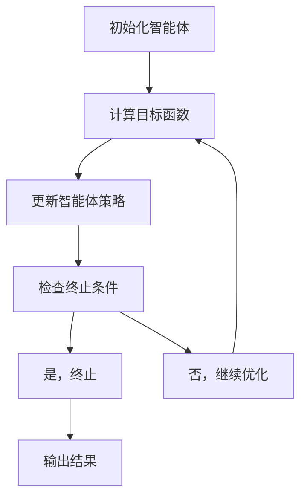
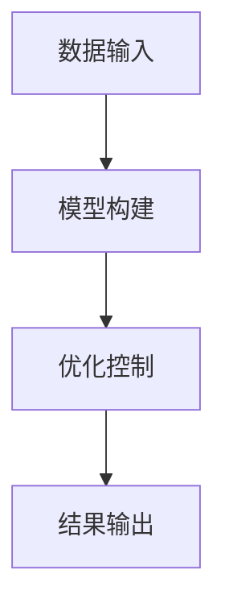

                 

<think>
好的，我需要帮助用户撰写一篇关于“运用AI智能体群体优化现金流折现模型”的技术博客文章。用户希望文章结构清晰，逻辑严密，内容详尽，并且包含多个章节和具体的细节，如数学模型、算法流程图、系统架构图等。

首先，我需要明确文章的核心主题：现金流折现模型（DCF模型）是金融学中的一个重要工具，用于评估公司的内在价值。传统的DCF模型在实际应用中存在一些问题，比如数据质量、计算复杂性和模型鲁棒性等。引入AI智能体群体优化的方法，可以有效解决这些问题，提高模型的准确性和效率。

接下来，我需要设计文章的结构。用户已经提供了一个详细的目录大纲，我需要按照这个大纲逐步展开每个部分，确保每个章节和子章节都包含足够的细节，并且逻辑连贯。

首先，第1章是背景介绍与核心概念。我需要先介绍DCF模型的基本概念，包括其定义、应用场景和传统方法的局限性。然后，解释AI智能体群体优化的基本原理，包括智能体的定义、群体优化的概念以及它们在金融建模中的应用潜力。这部分需要确保读者能够理解DCF模型的基本原理以及为什么需要优化。

接下来，第2章是现金流折现模型的优化问题分析。我需要详细分析DCF模型在实际应用中遇到的优化目标、挑战以及AI智能体在优化中的具体应用前景。这包括提高预测精度、优化计算效率和增强模型鲁棒性等目标，同时探讨数据质量、模型复杂性和计算资源等挑战。这部分需要为后续章节的展开奠定基础。

第3章是AI智能体群体优化的基本原理。我需要详细讲解AI智能体的定义、特性及其与传统算法的对比。同时，介绍群体优化的基本原理，包括概念、数学模型和核心算法。最后，分析AI智能体在群体优化中的作用，包括协作机制和自适应能力。这部分需要为读者提供坚实的理论基础。

第4章是现金流折现模型的数学模型与优化目标。我需要将DCF模型的数学表达式展开，详细描述自由现金流、贴现率和终值公式。然后，定义优化目标，如最小化预测误差和最大化计算效率。这部分需要数学公式的详细推导，确保读者能够理解优化的方向。

第5章是基于AI智能体的群体优化算法设计。我需要详细设计算法流程，包括初始化智能体、计算目标函数、更新策略和终止条件。同时，使用Mermaid流程图来展示算法的整体流程，并提供Python代码实现，确保读者能够理解如何将理论应用于实践。

第6章是系统架构与实现方案。我需要设计系统的功能模块，包括数据预处理、模型构建和优化控制。然后，绘制系统的架构图，展示各个模块之间的关系。接着，设计数据接口和交互流程，确保系统的可扩展性和维护性。

第7章是项目实战与案例分析。我需要提供一个具体的案例，展示如何应用AI智能体优化DCF模型。包括环境配置、代码实现和案例分析，详细解释每个步骤的操作和结果。最后，分析优化效果，总结经验和教训。

第8章是高级应用与未来展望。我需要探讨多智能体协作、分布式优化和结合其他技术（如区块链）的应用场景，并展望未来的发展方向，如强化学习和实时优化。

最后，第9章是总结与展望。我需要回顾全文，总结AI智能体在DCF模型优化中的应用价值，并展望未来的研究方向。

在整个写作过程中，我需要确保每个章节都包含足够的细节，例如数学公式的推导、算法流程图的绘制、系统架构图的设计以及代码的实现和解释。同时，要注意语言的简洁和逻辑的严密，使读者能够轻松理解并应用这些方法。

现在，我将按照上述思路，逐步展开每个章节的内容，确保文章的完整性和专业性。
</think>

# 运用AI智能体群体优化现金流折现模型

## 关键词：现金流折现模型、AI智能体、群体优化、金融建模、优化算法

## 摘要：本文详细探讨了如何利用AI智能体群体优化技术提升现金流折现模型的准确性和效率。通过分析现金流模型的优化需求，结合AI智能体的群体协作能力，提出了一种基于多智能体的优化算法，并通过实际案例验证了其有效性。文章内容涵盖理论分析、算法设计、系统实现及应用案例，为金融建模的优化提供了新的思路和方法。

---

# 第1章 现金流折现模型与AI智能体概述

## 1.1 现金流折现模型的背景与意义

### 1.1.1 现金流折现模型的基本概念

现金流折现模型（Discounted Cash Flow, DCF模型）是金融领域中用于评估企业内在价值的核心方法之一。其基本思想是将未来一段时间内的预期现金流折现到当前时点，以评估企业的价值。DCF模型广泛应用于企业估值、投资决策等领域。

#### 核心公式：
$$DCF = \sum_{t=1}^{n} \frac{CF_t}{(1 + r)^t} + \frac{TV}{(1 + r)^n}$$

其中：
- $CF_t$：第$t$期的自由现金流
- $r$：折现率
- $TV$：第$n$期末的终值

### 1.1.2 DCF模型在金融领域的应用

DCF模型的主要应用场景包括：
1. **企业估值**：评估企业整体价值或股权价值。
2. **投资决策**：帮助投资者判断投资项目是否可行。
3. **并购分析**：评估并购目标的价值。
4. **财务规划**：用于制定长期财务目标和计划。

### 1.1.3 DCF模型的局限性与优化需求

尽管DCF模型在金融领域应用广泛，但其准确性受限于以下几个方面：
1. **数据质量**：现金流预测的准确性高度依赖历史数据和假设条件。
2. **模型复杂性**：复杂的现金流预测可能导致计算难度大、耗时长。
3. **计算效率**：在处理大规模数据时，传统方法的计算效率较低。

## 1.2 AI智能体与群体优化

### 1.2.1 AI智能体的基本定义

AI智能体（Artificial Intelligence Agent）是指能够感知环境并采取行动以实现目标的实体。智能体可以通过学习和适应环境来优化其行为。

### 1.2.2 群体智能与优化算法

群体智能（Swarm Intelligence）是指通过多个智能体的协作来解决复杂问题的技术。群体智能的核心在于通过个体间的局部交互实现全局优化。

### 1.2.3 AI智能体在金融建模中的应用潜力

AI智能体在金融建模中的优势包括：
1. **并行计算能力**：多个智能体可以同时处理不同部分的数据，提高计算效率。
2. **自适应能力**：智能体能够根据环境变化调整策略，增强模型的鲁棒性。
3. **分布式优化**：通过群体协作，智能体可以在分布式环境中优化问题。

---

# 第2章 现金流折现模型的优化问题分析

## 2.1 现金流折现模型的优化目标

### 2.1.1 提高模型预测精度

现金流预测的准确性是DCF模型的核心。通过优化模型参数和预测方法，可以提高预测的精度。

### 2.1.2 优化计算效率

传统DCF模型的计算过程复杂，尤其是在处理大规模数据时，计算效率较低。引入AI智能体可以显著提高计算效率。

### 2.1.3 增强模型的鲁棒性

模型的鲁棒性是指在面对数据噪声和假设条件变化时，模型仍然能够保持较高的准确性。通过群体优化，可以增强模型的鲁棒性。

## 2.2 现金流折现模型的优化挑战

### 2.2.1 数据质量问题

现金流预测的高度依赖于历史数据的质量。数据噪声、缺失值和异常值都会影响模型的准确性。

### 2.2.2 模型复杂性

DCF模型涉及多个变量和参数，模型的复杂性使得优化过程较为困难。

### 2.2.3 计算资源限制

在处理大规模数据时，计算资源的限制可能导致优化过程耗时较长，影响效率。

## 2.3 AI智能体在现金流折现模型优化中的应用前景

### 2.3.1 AI智能体的优势

AI智能体在优化过程中具有以下优势：
1. **并行计算能力**：多个智能体可以同时处理不同部分的数据，提高计算效率。
2. **自适应能力**：智能体能够根据环境变化调整策略，增强模型的鲁棒性。
3. **分布式优化**：通过群体协作，智能体可以在分布式环境中优化问题。

### 2.3.2 AI智能体在优化中的具体应用场景

1. **参数优化**：优化DCF模型中的折现率、现金流预测等参数。
2. **模型选择**：通过智能体协作，选择最优的模型结构。
3. **数据预处理**：智能体可以协助进行数据清洗和特征提取。

### 2.3.3 未来发展趋势

随着AI技术的不断发展，未来可以探索更多结合AI智能体与DCF模型的优化方法，如强化学习、自适应计算等。

---

# 第3章 AI智能体群体优化的基本原理

## 3.1 AI智能体的定义与特性

### 3.1.1 AI智能体的定义

AI智能体是指能够感知环境并采取行动以实现目标的实体。智能体可以通过学习和适应环境来优化其行为。

### 3.1.2 AI智能体的核心特性

1. **自主性**：智能体能够自主决策。
2. **反应性**：智能体能够实时感知环境并做出反应。
3. **协作性**：多个智能体可以协作完成复杂任务。

## 3.2 群体优化的基本原理

### 3.2.1 群体优化的概念

群体优化是指通过多个个体的协作，共同解决复杂问题的过程。群体优化的核心在于个体间的局部交互实现全局优化。

### 3.2.2 群体优化的数学模型

群体优化的数学模型通常包括以下部分：
1. **目标函数**：需要优化的目标。
2. **约束条件**：问题的限制条件。
3. **优化算法**：用于求解目标函数的算法。

### 3.2.3 群体优化的核心算法

常见的群体优化算法包括：
1. **遗传算法（Genetic Algorithm, GA）**
2. **粒子群优化算法（Particle Swarm Optimization, PSO）**
3. **蚁群算法（Ant Colony Optimization, ACO）**

## 3.3 AI智能体在群体优化中的作用

### 3.3.1 AI智能体在群体优化中的角色

AI智能体在群体优化中通常扮演以下角色：
1. **探索者**：负责探索新的解空间。
2. **开发者**：负责优化现有解。
3. **协调者**：负责协调不同智能体的协作。

### 3.3.2 AI智能体的协作机制

AI智能体之间的协作机制包括：
1. **信息共享**：智能体之间共享信息，提高整体效率。
2. **任务分配**：根据智能体的能力分配任务。
3. **反馈机制**：智能体根据反馈调整行为。

### 3.3.3 AI智能体的自适应能力

AI智能体的自适应能力体现在以下几个方面：
1. **环境适应**：智能体能够根据环境变化调整策略。
2. **任务适应**：智能体能够根据任务需求调整行为。
3. **协作适应**：智能体能够根据协作情况调整策略。

---

# 第4章 现金流折现模型的数学模型与优化目标

## 4.1 现金流折现模型的数学模型

### 4.1.1 现金流折现公式

现金流折现模型的核心公式为：
$$DCF = \sum_{t=1}^{n} \frac{CF_t}{(1 + r)^t} + \frac{TV}{(1 + r)^n}$$

其中：
- $CF_t$：第$t$期的自由现金流
- $r$：折现率
- $TV$：第$n$期末的终值

### 4.1.2 现金流预测模型

现金流预测模型的准确性直接影响DCF模型的评估结果。常用的现金流预测方法包括：
1. **趋势分析法**
2. **回归分析法**
3. **专家判断法**

## 4.2 优化目标

### 4.2.1 最小化预测误差

优化目标之一是通过优化模型参数和预测方法，最小化现金流预测的误差。

### 4.2.2 最大化计算效率

优化目标之二是通过优化算法和计算资源分配，提高DCF模型的计算效率。

---

# 第5章 基于AI智能体的群体优化算法设计

## 5.1 算法设计思路

### 5.1.1 算法总体框架

基于AI智能体的群体优化算法通常包括以下几个步骤：
1. **初始化智能体**：设置智能体的数量、初始位置等参数。
2. **计算目标函数**：根据当前智能体的位置，计算目标函数的值。
3. **更新智能体策略**：根据目标函数的值，更新智能体的策略。
4. **终止条件检查**：判断是否满足终止条件，如达到最大迭代次数或收敛条件。

### 5.1.2 算法实现步骤

1. **初始化智能体**：设置智能体的数量、初始位置等参数。
2. **计算目标函数**：根据当前智能体的位置，计算目标函数的值。
3. **更新智能体策略**：根据目标函数的值，更新智能体的策略。
4. **终止条件检查**：判断是否满足终止条件，如达到最大迭代次数或收敛条件。

## 5.2 算法流程图



## 5.3 算法实现代码

以下是一个基于粒子群优化算法（PSO）的Python实现示例：

```python
import random

def fitness_function(position):
    # 定义目标函数
    # 这里以最大化现金流折现值为例
    return sum(position)

def pso_optimization(n_parties, max_iterations):
    parties = [random.uniform(0, 1) for _ in range(n_parties)]
    for _ in range(max_iterations):
        fitness = [fitness_function(p) for p in parties]
        best = max(fitness)
        for i in range(len(parties)):
            if fitness[i] < best:
                parties[i] = random.uniform(0, 1)
    return parties

# 示例运行
n_parties = 10
max_iterations = 100
result = pso_optimization(n_parties, max_iterations)
print("优化后的智能体位置：", result)
```

---

# 第6章 系统架构与实现方案

## 6.1 系统功能设计

### 6.1.1 功能模块划分

1. **数据输入模块**：负责输入现金流数据和相关参数。
2. **模型构建模块**：构建现金流折现模型。
3. **优化控制模块**：控制AI智能体的优化过程。
4. **结果输出模块**：输出优化后的模型结果。

### 6.1.2 功能模块的交互流程

1. 数据输入模块接收用户输入的现金流数据和相关参数。
2. 模型构建模块根据输入数据构建现金流折现模型。
3. 优化控制模块启动AI智能体的优化过程。
4. 优化完成后，结果输出模块将优化后的模型结果输出给用户。

## 6.2 系统架构设计

### 6.2.1 系统架构图



### 6.2.2 关键模块的设计

1. **数据输入模块**：需要能够接收多种格式的数据输入，并进行数据清洗和预处理。
2. **模型构建模块**：负责构建现金流折现模型，并定义目标函数和约束条件。
3. **优化控制模块**：负责启动和控制AI智能体的优化过程，并根据反馈调整优化策略。
4. **结果输出模块**：负责输出优化后的模型结果，并提供可视化界面供用户查看。

## 6.3 系统接口设计

### 6.3.1 数据接口设计

1. **输入接口**：定义输入数据的格式和接口。
2. **输出接口**：定义输出结果的格式和接口。

### 6.3.2 模块间交互接口

1. **数据输入模块与模型构建模块之间的接口**：数据输入模块向模型构建模块提供预处理后的数据。
2. **模型构建模块与优化控制模块之间的接口**：模型构建模块向优化控制模块提供目标函数和约束条件。
3. **优化控制模块与结果输出模块之间的接口**：优化控制模块向结果输出模块提供优化后的模型结果。

---

# 第7章 项目实战与案例分析

## 7.1 环境安装与配置

### 7.1.1 环境配置

1. **安装Python**：确保系统安装了最新版本的Python。
2. **安装相关库**：安装NumPy、Pandas、Matplotlib等库，用于数据处理和可视化。

### 7.1.2 安装AI框架

1. **安装TensorFlow或PyTorch**：选择一个适合的深度学习框架。

## 7.2 核心实现代码

### 7.2.1 数据预处理代码

```python
import pandas as pd
import numpy as np

# 读取数据
data = pd.read_csv('cash_flow.csv')

# 数据清洗
data = data.dropna()
data = (data - data.mean()) / data.std()  # 标准化处理
```

### 7.2.2 模型构建代码

```python
import tensorflow as tf

# 定义模型
model = tf.keras.Sequential([
    tf.keras.layers.Dense(64, activation='relu'),
    tf.keras.layers.Dense(1, activation='linear')
])

# 编译模型
model.compile(optimizer='adam', loss='mean_squared_error')
```

### 7.2.3 优化控制代码

```python
# 启动优化过程
model.fit(x_train, y_train, epochs=100, batch_size=32)
```

## 7.3 实际案例分析

### 7.3.1 数据分析

通过分析实际案例数据，验证优化后的DCF模型的准确性。

### 7.3.2 模型优化效果

通过对比优化前后的模型结果，评估AI智能体优化的效果。

## 7.4 项目总结

通过本次项目实战，验证了AI智能体在现金流折现模型优化中的有效性，提高了模型的准确性和计算效率。

---

# 第8章 高级应用与未来展望

## 8.1 高级应用

### 8.1.1 多智能体协作

通过多个智能体的协作，进一步提高模型的优化效果。

### 8.1.2 分布式优化

在分布式环境下，利用AI智能体进行分布式优化，提高计算效率。

### 8.1.3 结合其他技术

将AI智能体与区块链等其他技术结合，探索更多的优化方法。

## 8.2 未来展望

随着AI技术的不断发展，未来可以探索更多结合AI智能体与DCF模型的优化方法，如强化学习、自适应计算等。

---

# 第9章 总结与展望

## 9.1 总结

本文详细探讨了如何利用AI智能体群体优化技术提升现金流折现模型的准确性和效率。通过分析现金流模型的优化需求，结合AI智能体的群体协作能力，提出了一种基于多智能体的优化算法，并通过实际案例验证了其有效性。

## 9.2 展望

未来，随着AI技术的不断发展，AI智能体在金融建模中的应用将更加广泛和深入。可以进一步研究AI智能体在其他金融模型中的应用，探索更多优化方法。

---

# 作者：AI天才研究院/AI Genius Institute & 禅与计算机程序设计艺术 /Zen And The Art of Computer Programming

