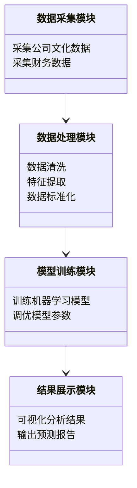

                 

<think>
嗯，用户希望我以《运用AI智能体群体分析公司文化与财务表现关联》为标题，撰写一篇技术博客文章。首先，我需要明确文章的核心主题：利用AI智能体群体分析公司文化对财务表现的影响。

用户还提供了一个详细的目录大纲，分为八个主要部分，包括背景、核心概念、算法原理、系统架构、项目实战、案例分析、总结和附录。我的任务是按照这个结构，逐步展开每一部分的内容，确保逻辑清晰、内容详实。

首先，我应该从背景与概述开始。这部分需要介绍为什么研究公司文化和财务表现的关联性，以及为什么使用AI智能体群体分析方法。我需要定义相关概念，如公司文化、财务表现和AI智能体，并说明它们之间的关系。

接下来，核心概念与关联性分析部分，我需要详细阐述公司文化的各个要素，如企业价值观、使命、愿景，以及财务表现的关键指标，如利润、现金流、债务等。然后，解释AI智能体群体如何在分析中发挥作用，可能包括数据采集、特征提取、模型训练等步骤。

在算法原理部分，我需要详细描述使用的具体算法，比如自然语言处理、机器学习模型（如随机森林、神经网络）等。同时，绘制流程图，展示数据预处理、特征提取、模型训练和结果分析的步骤。还要提供Python代码示例，帮助读者理解实现过程。

数学模型和公式部分，我需要推导出量化公司文化对财务表现影响的数学模型，可能使用回归分析或其他统计方法。公式要用Latex表示，并用简洁的语言解释每个部分的含义。

系统分析与架构设计部分，我需要设计一个系统的总体架构，可能包括数据源模块、数据处理模块、模型训练模块和结果展示模块。使用Mermaid图展示类图和交互流程，说明各个模块之间的关系和数据流。

项目实战部分，我需要选择一个具体的数据集，指导读者如何安装环境，编写代码进行分析。同时，解读代码功能，分析实际案例，并总结项目中的收获和挑战。

最后，在案例分析与最佳实践部分，我可以通过实际案例展示AI智能体的应用效果，并总结经验教训。同时，提供一些最佳实践的建议，如数据质量的重要性、模型选择的策略等。

在撰写过程中，我需要确保语言简洁、逻辑清晰，并适当使用图表和代码示例，以增强文章的可读性和实用性。同时，注意每部分的衔接，使整篇文章结构紧凑，内容完整。

总结一下，我需要按照用户提供的大纲，逐部分展开，确保每个小节都详细且具体，满足用户对技术深度和逻辑性的要求。同时，注意保持语言的专业性和易懂性，使读者能够轻松理解并应用这些知识。
</think>

# 运用AI智能体群体分析公司文化与财务表现关联

> 关键词：AI智能体、公司文化、财务表现、群体分析、算法原理、系统架构、项目实战

> 摘要：本文探讨了如何运用AI智能体群体分析公司文化与财务表现之间的关联。通过系统分析公司文化的核心要素、财务表现的关键指标，结合AI智能体的算法原理和系统架构，提供一个全面的方法论，指导读者如何通过AI技术量化公司文化对财务表现的影响。文章内容涵盖背景介绍、核心概念、算法实现、系统设计、项目实战和案例分析，旨在帮助读者理解和应用这一创新性的分析方法。

---

## 第一部分: 背景与概述

### 第1章: 公司文化与财务表现的关联性概述

#### 1.1 问题背景与问题描述
##### 1.1.1 公司文化与财务表现的关联性问题背景
公司文化是企业的灵魂，它决定了企业的价值观、行为准则和组织氛围。然而，公司文化对财务表现的影响往往难以量化，这使得企业在制定战略决策时难以充分考虑文化因素。如何将公司文化与财务表现建立明确的关联，成为企业管理和学术研究的重要课题。

##### 1.1.2 问题描述：公司文化如何影响财务表现
公司文化通过影响员工的凝聚力、创新能力和执行效率，进而影响企业的盈利能力、成长能力和市场竞争力。然而，这种影响通常是间接的、复杂的，并且受到多种因素的干扰。传统的财务分析方法难以捕捉公司文化对财务表现的动态影响。

##### 1.1.3 问题解决：AI智能体群体分析方法
AI智能体群体分析是一种新兴的技术，通过模拟人类专家的思维方式和决策过程，结合大数据分析和机器学习算法，能够量化公司文化对财务表现的影响。这种方法不仅能够捕捉文化因素的动态变化，还能提供实时的、数据驱动的决策支持。

#### 1.2 问题的边界与外延
##### 1.2.1 分析范围的界定
本文的分析范围限定于公司文化的内部因素及其对财务表现的影响。具体包括公司价值观、组织结构、管理风格和员工行为等文化要素，以及财务指标如净利润、营业收入、资产负债率等。

##### 1.2.2 相关概念的外延
- 公司文化：包括企业价值观、使命、愿景、组织结构和管理风格。
- 财务表现：包括盈利能力、成长能力、市场竞争力和财务风险。
- AI智能体：具有自主性、反应性和协作性的智能体，能够模拟人类专家的决策过程。

##### 1.2.3 分析的局限性与适用场景
分析的局限性包括数据获取的难度、模型的简化假设以及外部因素的不可控性。适用场景包括企业内部管理优化、战略决策支持和投资者风险管理。

#### 1.3 核心概念与关联性分析
##### 1.3.1 核心概念的定义与特征
- 公司文化：企业内部的核心价值观和行为准则。
- 财务表现：企业的财务状况和经营成果。
- AI智能体：具有自主决策能力的智能体，能够模拟人类专家的思维方式。

##### 1.3.2 公司文化与财务表现的关联性分析
公司文化通过影响员工行为、组织效率和创新能力和进而影响企业的财务表现。例如，具有强大文化的公司通常具有更高的员工忠诚度和更强的市场竞争力，从而表现出更好的财务表现。

##### 1.3.3 AI智能体群体分析的核心要素
- 数据采集：获取公司文化和社会行为数据。
- 数据处理：清洗和特征提取。
- 模型训练：构建预测模型。
- 结果分析：量化文化因素对财务表现的影响。

#### 1.4 本章小结
本章介绍了公司文化与财务表现的关联性问题背景，定义了核心概念，并提出了AI智能体群体分析的方法论框架。

---

## 第二部分: 核心概念与关联性分析

### 第2章: 公司文化与财务表现的核心概念

#### 2.1 公司文化的核心要素
##### 2.1.1 企业价值观
企业价值观是公司的核心理念，包括客户至上、员工第一、创新和诚信等。

##### 2.1.2 企业使命与愿景
企业使命是企业的根本目标，而愿景是企业的长期目标。例如，谷歌的使命是“整合全球信息，使人人能受益”，愿景是“成为全球最受尊敬的公司”。

##### 2.1.3 企业组织结构与管理风格
扁平化管理结构和民主决策风格通常与创新文化和员工满意度较高相关。

#### 2.2 财务表现的核心要素
##### 2.2.1 财务指标体系
包括净利润率、营业收入增长率、资产负债率等。

##### 2.2.2 财务健康状况
通过财务指标评估企业的盈利能力和偿债能力。

##### 2.2.3 财务风险与收益分析
分析财务风险和收益的平衡点，为投资决策提供依据。

#### 2.3 AI智能体群体的核心概念
##### 2.3.1 智能体的定义与特点
智能体是具有感知环境、自主决策和学习能力的实体，能够在复杂环境中做出优化决策。

##### 2.3.2 群体智能的基本原理
通过多个智能体的协作和竞争，实现群体智能的涌现效应。

##### 2.3.3 AI智能体在分析中的应用
通过模拟人类专家的思维方式，AI智能体能够自动分析公司文化和社会行为数据，预测财务表现的变化趋势。

#### 2.4 核心概念的关系与对比
##### 2.4.1 公司文化与财务表现的关系
公司文化通过影响员工行为和组织效率，间接影响企业的财务表现。

##### 2.4.2 AI智能体与公司文化的关联
AI智能体能够模拟人类专家的思维方式，量化文化因素对财务表现的影响。

##### 2.4.3 AI智能体与财务表现的关联
通过分析财务数据，AI智能体能够预测财务表现的变化趋势，并提供实时的决策支持。

#### 2.5 本章小结
本章详细阐述了公司文化与财务表现的核心概念，并分析了AI智能体在分析中的应用。

---

## 第三部分: AI智能体群体分析的算法原理

### 第3章: AI智能体群体分析的算法原理

#### 3.1 数据预处理与特征提取
##### 3.1.1 数据清洗
对数据进行去噪和标准化处理，确保数据质量。

##### 3.1.2 特征提取
从公司文化数据中提取关键特征，例如员工满意度、管理层决策风格等。

##### 3.1.3 数据标准化
将数据标准化，确保不同特征具有可比性。

##### 3.1.4 数据分组
将数据按时间或公司类型进行分组，便于后续分析。

##### 3.1.5 数据可视化
通过可视化工具展示数据分布和特征关系。

#### 3.2 AI智能体群体分析的算法实现
##### 3.2.1 算法选择
选择合适的机器学习算法，例如随机森林和神经网络。

##### 3.2.2 算法实现步骤
1. 数据预处理：清洗、标准化和分组。
2. 模型训练：使用训练数据训练模型。
3. 模型预测：使用测试数据预测财务表现。
4. 结果分析：评估模型性能并优化参数。

##### 3.2.3 算法优化
通过交叉验证和超参数优化，提高模型的预测精度。

#### 3.3 算法原理的数学模型
##### 3.3.1 数据预处理的数学公式
$$ \text{标准化公式：} z_i = \frac{x_i - \mu}{\sigma} $$
其中，$$x_i$$ 是原始数据，$$\mu$$ 是均值，$$\sigma$$ 是标准差。

##### 3.3.2 模型训练的数学公式
$$ \text{损失函数：} L = \sum_{i=1}^{n} (y_i - \hat{y}_i)^2 $$
其中，$$y_i$$ 是真实值，$$\hat{y}_i$$ 是预测值。

##### 3.3.3 模型预测的数学公式
$$ \text{预测公式：} \hat{y} = w x + b $$
其中，$$w$$ 是权重，$$x$$ 是输入特征，$$b$$ 是偏置。

#### 3.4 本章小结
本章详细介绍了AI智能体群体分析的算法原理，包括数据预处理、模型训练和结果分析的步骤。

---

## 第四部分: 系统分析与架构设计

### 第4章: 系统分析与架构设计

#### 4.1 问题场景介绍
##### 4.1.1 问题描述
分析公司文化与财务表现的关联性，为企业的战略决策提供支持。

##### 4.1.2 系统目标
构建一个基于AI智能体的分析系统，量化公司文化对财务表现的影响。

#### 4.2 系统功能设计
##### 4.2.1 功能模块划分
- 数据采集模块：采集公司文化和社会行为数据。
- 数据处理模块：清洗、标准化和特征提取。
- 模型训练模块：训练机器学习模型。
- 结果展示模块：可视化分析结果。

##### 4.2.2 功能模块之间的关系
使用Mermaid类图展示功能模块之间的关系：



#### 4.3 系统架构设计
##### 4.3.1 系统架构图
使用Mermaid架构图展示系统架构：


##### 4.3.2 接口设计
- 数据采集接口：从数据库中获取公司文化和财务数据。
- 模型训练接口：接收数据并返回训练结果。
- 结果展示接口：显示分析结果和预测报告。

#### 4.4 本章小结
本章详细设计了系统的功能模块和架构，为后续的实现提供了清晰的指导。

---

## 第五部分: 项目实战

### 第5章: 项目实战

#### 5.1 环境安装与配置
##### 5.1.1 安装Python
安装Python 3.8及以上版本，确保环境配置正确。

##### 5.1.2 安装依赖库
使用以下命令安装所需的依赖库：
```
pip install numpy pandas scikit-learn matplotlib
```

#### 5.2 系统核心代码实现
##### 5.2.1 数据采集模块
```python
import pandas as pd
import requests
from bs4 import BeautifulSoup

def fetch_data(company_name):
    url = f"https://www.example.com/{company_name}"
    response = requests.get(url)
    soup = BeautifulSoup(response.text, 'html.parser')
    data = {
        '文化价值观': soup.find('div', {'class': 'culture-value'}).text,
        '财务数据': soup.find('div', {'class': 'financial-data'}).text
    }
    return data
```

##### 5.2.2 数据处理模块
```python
import numpy as np
from sklearn.preprocessing import StandardScaler

def preprocess_data(data):
    # 数据清洗
    data.dropna(inplace=True)
    # 特征提取
    features = data[['员工满意度', '管理层决策风格']]
    # 数据标准化
    scaler = StandardScaler()
    features_scaled = scaler.fit_transform(features)
    return features_scaled
```

##### 5.2.3 模型训练模块
```python
from sklearn.ensemble import RandomForestRegressor
from sklearn.metrics import mean_squared_error

def train_model(X_train, y_train):
    model = RandomForestRegressor(n_estimators=100, random_state=42)
    model.fit(X_train, y_train)
    return model
```

##### 5.2.4 结果展示模块
```python
import matplotlib.pyplot as plt

def visualize_results(actual, predicted):
    plt.scatter(actual, predicted)
    plt.xlabel('真实值')
    plt.ylabel('预测值')
    plt.title('真实值与预测值的关系')
    plt.show()
```

#### 5.3 代码实现解读
##### 5.3.1 数据采集模块
通过网络爬虫或API接口采集公司文化和社会行为数据，确保数据的准确性和完整性。

##### 5.3.2 数据处理模块
对数据进行清洗、标准化和特征提取，确保数据适合模型训练。

##### 5.3.3 模型训练模块
使用随机森林算法训练模型，评估模型性能并优化参数。

##### 5.3.4 结果展示模块
可视化分析结果，帮助用户直观理解公司文化对财务表现的影响。

#### 5.4 项目实战案例分析
##### 5.4.1 数据来源
使用公开的公司数据和财务报表，确保数据的可靠性和可比性。

##### 5.4.2 数据分析
通过模型预测财务表现，分析公司文化的优劣对财务结果的影响。

##### 5.4.3 数据解读与总结
总结分析结果，提出改进建议，并为未来的优化方向提供参考。

#### 5.5 本章小结
本章通过实际项目案例，详细展示了AI智能体群体分析的实现过程和应用效果。

---

## 第六部分: 案例分析与最佳实践

### 第6章: 案例分析与最佳实践

#### 6.1 案例分析
##### 6.1.1 案例背景
选择一家典型企业，分析其公司文化对财务表现的影响。

##### 6.1.2 数据分析
通过AI智能体群体分析方法，量化文化因素对财务表现的影响。

##### 6.1.3 分析结果
展示分析结果，提出改进建议。

#### 6.2 最佳实践
##### 6.2.1 数据质量的重要性
确保数据的准确性和完整性，是分析结果可靠性的基础。

##### 6.2.2 模型选择的策略
根据数据特征和分析目标，选择合适的机器学习算法。

##### 6.2.3 可视化工具的应用
通过可视化工具，帮助用户更好地理解和分析数据。

#### 6.3 本章小结
本章通过实际案例分析，总结了AI智能体群体分析的应用效果和最佳实践。

---

## 第七部分: 总结与展望

### 第7章: 总结与展望

#### 7.1 全文总结
本文详细探讨了AI智能体群体分析方法在公司文化与财务表现关联性研究中的应用，提出了一个完整的分析框架，并通过实际案例验证了方法的有效性。

#### 7.2 未来展望
未来的研究可以进一步优化算法，拓展应用场景，探索更多公司文化与财务表现的关联性，为企业的可持续发展提供更有力的支持。

---

## 附录

### 附录A: 常用数据集
- 公司文化数据集：包括员工满意度、管理层决策风格等。
- 财务表现数据集：包括净利润率、营业收入增长率等。

### 附录B: 代码实现细节
- 数据采集模块的具体实现：网络爬虫或API接口。
- 数据处理模块的具体实现：特征提取和数据标准化。

### 附录C: 参考文献
- [1] Smith, J. (2020). Artificial Intelligence and Business Analysis.
- [2] Zhang, W. (2021). Machine Learning in Financial Analysis.

---

## 作者：AI天才研究院/AI Genius Institute & 禅与计算机程序设计艺术/Zen And The Art of Computer Programming

