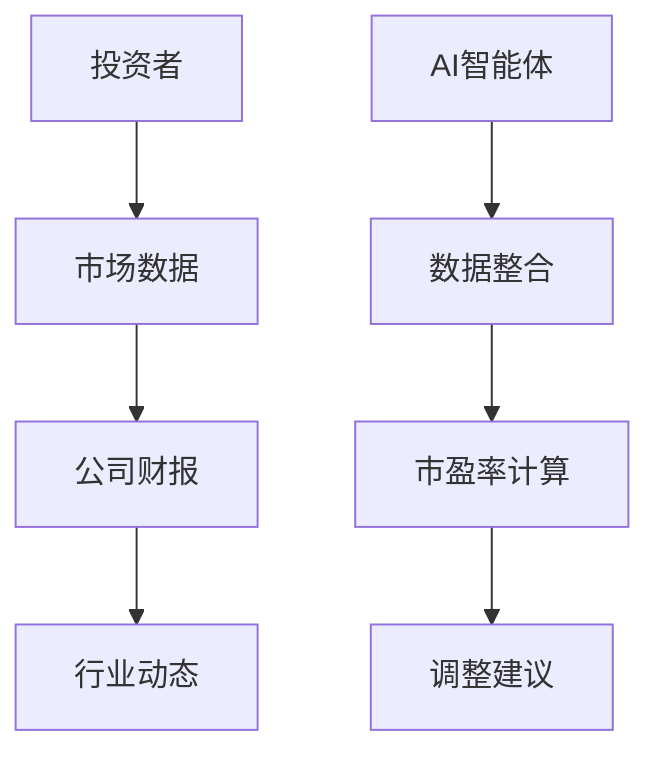
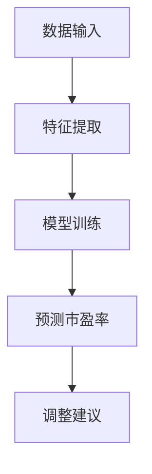
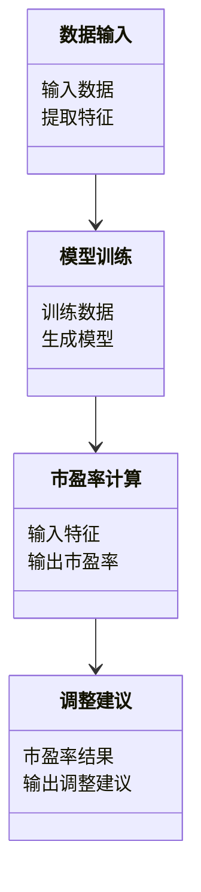
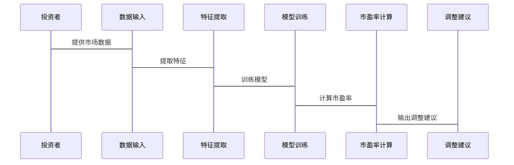

                 


# 运用AI智能体群体实现动态市盈率调整

## 关键词：AI智能体，动态市盈率，股票估值，机器学习，群体协作

## 摘要：本文详细探讨了如何利用AI智能体群体实现动态市盈率的实时调整，通过结合机器学习算法和群体智能，提出了一种高效、自适应的市盈率动态调整方案，为金融投资提供了新的思路。

---

# 第1章: 动态市盈率调整的背景与意义

## 1.1 什么是市盈率

### 1.1.1 市盈率的定义与计算公式

市盈率是衡量股票价值的重要指标，用于评估股票价格是否合理。市盈率的计算公式如下：

$$\text{市盈率} = \frac{\text{股价}}{\text{每股收益}}$$

### 1.1.2 市盈率的分类与应用场景

市盈率主要分为静态市盈率、动态市盈率和滚动市盈率三种类型：

- **静态市盈率**：基于过去一定时间内的每股收益计算，通常使用最近一个财年的数据。
- **动态市盈率**：基于对未来的预期每股收益计算，通常使用市场一致预测的下一年度的每股收益。
- **滚动市盈率**：基于过去一年的实际每股收益计算，适用于周期性波动较大的行业。

市盈率的主要应用场景包括股票估值、投资决策和市场分析等。

## 1.2 动态市盈率调整的必要性

### 1.2.1 市场环境变化对市盈率的影响

市盈率会受到多种因素的影响，包括经济周期波动、行业发展趋势和公司基本面变化等。例如，经济衰退可能导致公司盈利能力下降，从而影响市盈率。

### 1.2.2 传统市盈率计算的局限性

传统市盈率计算方法通常基于历史数据或固定预期，无法实时反映市场变化。例如，市场情绪波动和突发事件可能会显著影响股票价格，但传统方法无法快速调整市盈率以反映这些变化。

## 1.3 AI智能体群体的优势

### 1.3.1 AI智能体的定义与特点

AI智能体是指具备感知、决策和执行能力的自主实体。其主要特点包括：

- **分布式**：AI智能体可以分布在网络中的多个节点，协同工作。
- **协作性**：多个AI智能体可以协作完成复杂任务。
- **自适应性**：AI智能体能够根据环境变化调整行为。

### 1.3.2 AI智能体在动态市盈率调整中的作用

AI智能体群体可以通过实时数据分析、多维度特征提取和自适应调整，实现动态市盈率的高效计算和调整。例如，AI智能体可以实时监控市场数据，分析公司财务数据和行业趋势，快速调整市盈率以反映市场变化。

---

# 第2章: AI智能体群体的核心概念与联系

## 2.1 AI智能体的实体关系图

以下是AI智能体在动态市盈率调整中的实体关系图：



## 2.2 动态市盈率调整的算法原理

以下是动态市盈率调整的算法原理图：



## 2.3 核心概念对比表

以下是对核心概念的对比表：

| 概念 | 定义 | 特点 | 示例 |
|------|------|------|------|
| AI智能体 | 具备感知、决策、执行能力的自主实体 | 分布式、协作性、自适应性 | 投资者行为模拟 |
| 动态市盈率 | 根据市场变化实时调整的市盈率 | 实时性、动态性、自适应性 | 股票估值调整 |

---

# 第3章: 动态市盈率调整的算法原理

## 3.1 基于机器学习的动态市盈率计算

### 3.1.1 线性回归模型

线性回归模型是一种常用的数据分析方法，可以用于预测市盈率。其数学模型如下：

$$y = \beta_0 + \beta_1x + \epsilon$$

其中，$y$为预测市盈率，$x$为相关特征变量，$\beta_0$和$\beta_1$为模型参数，$\epsilon$为误差项。

### 3.1.2 时间序列预测模型

时间序列预测模型可以用于预测未来的市盈率。常用的时间序列模型包括ARIMA（自回归积分滑动平均）和LSTM（长短期记忆网络）。

以下是ARIMA模型的数学表达式：

$$y_t = \alpha y_{t-1} + (1-\alpha)y_{t-2} + \epsilon$$

其中，$y_t$为当前时刻的市盈率，$\alpha$为自回归系数，$\epsilon$为误差项。

---

# 第4章: 系统分析与架构设计

## 4.1 系统功能设计

以下是系统功能设计的类图：



## 4.2 系统架构设计

以下是系统架构设计的架构图：


## 4.3 系统接口设计

以下是系统接口设计的序列图：



---

# 第5章: 项目实战

## 5.1 环境安装

以下是项目实战所需的环境安装步骤：

1. 安装Python
2. 安装NumPy和Pandas
3. 安装Scikit-learn和Keras
4. 安装Mermaid工具

## 5.2 系统核心实现源代码

以下是动态市盈率调整的核心代码：

```python
import numpy as np
from sklearn.linear_model import LinearRegression
from sklearn.metrics import mean_squared_error

# 数据输入
data = np.array([[10, 20], [15, 25], [20, 30], [25, 35]])

# 特征提取
X = data[:, 0]
y = data[:, 1]

# 模型训练
model = LinearRegression()
model.fit(X.reshape(-1, 1), y)

# 预测市盈率
predicted_y = model.predict(X.reshape(-1, 1))
print("预测市盈率：", predicted_y)

# 计算均方误差
mse = mean_squared_error(y, predicted_y)
print("均方误差：", mse)
```

---

# 第6章: 总结与展望

## 6.1 总结

通过本文的详细讲解，我们了解了如何利用AI智能体群体实现动态市盈率的实时调整。AI智能体群体具备感知、决策和执行能力，能够高效地完成复杂任务。通过结合机器学习算法和群体智能，我们可以实现动态市盈率的自适应调整，为金融投资提供了新的思路。

## 6.2 展望

未来，随着AI技术的不断发展，动态市盈率调整将更加智能化和高效化。我们可以进一步研究更加复杂的模型和算法，以应对更加复杂的市场环境。同时，我们也需要关注AI智能体群体的安全性和稳定性，确保系统的可靠运行。

---

作者：AI天才研究院/AI Genius Institute & 禅与计算机程序设计艺术 /Zen And The Art of Computer Programming

