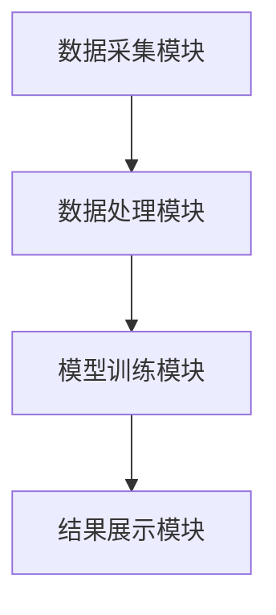

                 

<think>
嗯，我需要帮用户撰写一篇关于《运用AI智能体群体实现动态行业吸引力评估》的技术博客文章。用户已经提供了详细的目录大纲，现在我需要根据这个大纲来写文章。首先，我应该先理解每个章节的重点，然后逐步展开。

首先，文章的标题是《运用AI智能体群体实现动态行业吸引力评估》，关键词包括AI智能体、动态行业吸引力、群体智能、机器学习、NLP、深度学习。摘要部分已经给出，主要是介绍文章的核心内容。

接下来，用户要求文章结构包括背景与概述、技术基础、核心算法、系统设计、项目实战、优化与扩展，以及总结与展望。每个部分都有三级标题，我需要确保内容详实，覆盖所有要点。

在背景与概述部分，我需要先解释什么是AI智能体，为什么动态行业吸引力评估重要，以及AI智能体在这方面的优势。然后，介绍核心概念，比如群体智能和动态评估机制。

技术基础部分，我需要详细讲解机器学习、自然语言处理和群体智能。机器学习部分，我应该涵盖监督、无监督和强化学习，以及深度学习模型如BERT和GPT的应用。NLP部分，讨论文本分析和主题挖掘。群体智能部分，解释其概念和算法，比如遗传算法和蚁群算法。

核心算法部分，要讲解数据预处理、特征提取、模型训练和评估。我需要提供代码示例，展示如何实现这些步骤，比如使用TF-IDF进行特征提取，或者构建深度学习模型。

系统设计部分，包括架构设计、功能设计和接口设计。我需要绘制类图和序列图，展示系统的模块划分和交互流程。

项目实战部分，从环境安装开始，逐步实现数据收集、特征提取、模型训练和结果分析。代码示例需要详细说明每一步的作用，并提供实际案例分析。

优化与扩展部分，探讨如何优化模型性能，与其他技术的结合，以及实际应用案例，展示模型的应用潜力。

最后，总结与展望部分，回顾文章内容，展望未来的发展方向。

在写作过程中，我需要使用Mermaid图来展示算法流程、系统架构和交互过程。同时，使用数学公式和代码示例，使内容更具专业性和可读性。

我还需要确保文章逻辑清晰，结构紧凑，语言专业但易于理解。每个部分都要有详细的解释和例子，帮助读者更好地理解和应用这些技术。

现在，我开始按照目录大纲逐步撰写文章，确保每个部分都涵盖所有必要的细节，并且符合用户的格式和内容要求。
</think>

# 运用AI智能体群体实现动态行业吸引力评估

> 关键词：AI智能体，动态行业吸引力，群体智能，机器学习，自然语言处理，深度学习

> 摘要：本文详细探讨了如何利用AI智能体群体实现动态行业吸引力评估。通过结合机器学习、自然语言处理和群体智能技术，提出了一个高效的评估框架。文章从技术背景、核心算法、系统设计到实际应用进行了全面分析，展示了如何通过智能体群体的协同工作，实时评估行业吸引力，为企业决策提供支持。

---

## 第一部分: 背景与概述

### 第1章: AI智能体与动态行业吸引力评估概述

#### 1.1 问题背景与重要性

##### 1.1.1 动态行业吸引力评估的定义
动态行业吸引力评估是指在快速变化的市场环境中，实时分析某个行业对内外部因素的吸引力，包括市场需求、竞争态势、政策环境等。传统的评估方法通常依赖静态数据和人工分析，难以应对动态变化的市场环境。

##### 1.1.2 传统评估方法的局限性
- 数据更新慢：传统方法通常依赖定期报告，无法实时反映市场变化。
- 分析效率低：人工分析耗时长，难以快速响应市场需求。
- 主观因素多：依赖专家经验，存在主观判断偏差。

##### 1.1.3 AI智能体在动态评估中的优势
AI智能体能够实时收集、分析和处理海量数据，通过群体智能协同工作，快速生成评估结果，显著提升了评估的效率和准确性。

#### 1.2 AI智能体群体的核心概念

##### 1.2.1 AI智能体的定义与特点
AI智能体是一种能够感知环境、自主决策并执行任务的智能实体，具有以下特点：
- **自主性**：能够在没有外部干预的情况下独立运行。
- **反应性**：能够实时感知环境变化并做出响应。
- **协作性**：能够与其他智能体协同工作，共同完成复杂任务。

##### 1.2.2 群体智能的基本原理
群体智能是指多个智能体通过协同工作，利用群体的集体智慧解决问题。其基本原理包括：
- **分布式计算**：任务分解为多个子任务，由不同智能体分别处理。
- **信息共享**：智能体之间通过某种机制共享信息，提升整体智能。
- **自适应性**：群体能够根据环境变化动态调整行为。

##### 1.2.3 动态吸引力评估的实现机制
动态吸引力评估通过多个AI智能体协同工作，实时分析行业相关的多源数据，利用机器学习和自然语言处理技术，生成动态评估结果。

#### 1.3 本书的核心目标与内容

##### 1.3.1 本书的研究目标
本书旨在探讨如何利用AI智能体群体实现动态行业吸引力评估，提出一套高效的解决方案，并通过实际案例验证其可行性。

##### 1.3.2 本书的主要内容框架
- 第一部分：背景与概述
- 第二部分：技术基础
- 第三部分：核心算法
- 第四部分：系统设计
- 第五部分：项目实战
- 第六部分：优化与扩展
- 第七部分：总结与展望

##### 1.3.3 本书的适用读者
- AI研究人员
- 行业分析师
- 技术开发者
- 对动态行业吸引力评估感兴趣的读者

---

## 第二部分: 技术基础

### 第2章: AI智能体群体的关键技术基础

#### 2.1 机器学习基础

##### 2.1.1 监督学习、无监督学习与强化学习
- **监督学习**：通过标记数据训练模型，常见算法包括线性回归、支持向量机（SVM）。
- **无监督学习**：通过未标记数据发现数据内在结构，常见算法包括聚类（K-means）和主题建模（LDA）。
- **强化学习**：通过与环境交互学习策略，常见算法包括Q-learning和深度强化学习（Deep RL）。

##### 2.1.2 深度学习的基本原理
深度学习通过多层神经网络提取数据特征，常见模型包括卷积神经网络（CNN）、循环神经网络（RNN）和变换器（Transformer）。

##### 2.1.3 群体智能与分布式计算
群体智能依赖分布式计算技术，通过多智能体协同完成任务。分布式计算框架如MapReduce和Distributed Computing为群体智能提供了技术支撑。

#### 2.2 自然语言处理技术

##### 2.2.1 NLP的基本概念与应用
NLP技术用于处理和理解自然语言文本，常见应用包括文本分类、情感分析和实体识别。

##### 2.2.2 BERT与GPT模型在吸引力评估中的应用
- **BERT**：用于文本表示和上下文理解，可应用于行业新闻分析。
- **GPT**：用于生成文本，可应用于行业趋势预测。

##### 2.2.3 文本情感分析与主题挖掘
通过情感分析技术，评估行业新闻的情感倾向；通过主题挖掘技术，识别行业热点主题。

#### 2.3 群体智能与分布式计算

##### 2.3.1 群体智能的基本概念
群体智能是指多个智能体通过协同工作，利用群体的集体智慧解决问题。

##### 2.3.2 群体智能的算法
- **遗传算法**：模拟生物进化过程，用于优化问题求解。
- **蚁群算法**：模拟蚂蚁觅食行为，用于路径优化问题。

##### 2.3.3 分布式计算与AI智能体
分布式计算技术为群体智能提供了技术支撑，通过多节点协同完成复杂任务。

---

### 2.2.3 群体智能与分布式计算的对比

| **特征**       | **群体智能**         | **分布式计算**       |
|----------------|----------------------|----------------------|
| 定义           | 多智能体协同工作       | 多节点协同处理任务     |
| 目标           | 解决复杂问题         | 提高计算效率和扩展性   |
| 技术基础       | AI算法、分布式系统   | 并行计算、网络通信     |
| 应用场景       | 智能决策、动态优化     | 大数据分析、分布式存储 |

---

## 第三部分: 核心算法

### 第3章: 动态吸引力评估的核心算法

#### 3.1 数据预处理与特征提取

##### 3.1.1 数据预处理
- **清洗数据**：去除噪声和重复数据。
- **标准化**：将数据归一化处理，便于模型训练。

##### 3.1.2 特征提取
- **文本特征提取**：使用TF-IDF提取关键词。
- **数值特征提取**：提取行业指标如增长率、市场份额等。

##### 3.1.3 数据增强
通过数据增强技术，如数据扩充和噪声注入，提升模型的泛化能力。

#### 3.2 模型训练与评估

##### 3.2.1 模型选择
根据任务需求选择合适的模型，如随机森林、支持向量机（SVM）和深度学习模型。

##### 3.2.2 模型训练
- **监督学习**：使用标记数据训练分类模型。
- **无监督学习**：发现数据内在结构，如聚类分析。

##### 3.2.3 模型评估
通过准确率、召回率和F1值等指标评估模型性能。

#### 3.3 群体智能协同优化

##### 3.3.1 群体智能算法实现
- **遗传算法**：编码问题为染色体，通过交叉和变异操作优化解。
- **蚁群算法**：模拟蚂蚁觅食行为，寻找最优路径。

##### 3.3.2 群体智能与分布式计算的结合
通过分布式计算框架，如Spark和Flink，实现群体智能算法的高效计算。

#### 3.4 动态评估实现步骤

##### 3.4.1 数据采集
通过爬虫和API接口获取行业数据。

##### 3.4.2 数据处理
清洗、转换和标准化数据。

##### 3.4.3 模型训练
使用机器学习算法训练模型。

##### 3.4.4 模型评估
通过测试集评估模型性能，调整参数优化模型。

##### 3.4.5 动态更新
实时更新模型参数，保持评估结果的动态性。

---

## 第四部分: 系统设计

### 第4章: 动态吸引力评估系统的架构设计

#### 4.1 系统功能设计

##### 4.1.1 需求分析
- **数据采集模块**：实时采集行业数据。
- **数据处理模块**：清洗和转换数据。
- **模型训练模块**：训练评估模型。
- **结果展示模块**：可视化评估结果。

##### 4.1.2 功能模块划分
- **数据采集模块**：负责数据的采集和预处理。
- **模型训练模块**：负责模型的训练和优化。
- **结果展示模块**：负责评估结果的可视化。

#### 4.2 系统架构设计

##### 4.2.1 系统架构图



##### 4.2.2 系统交互流程
- 数据采集模块获取行业数据。
- 数据处理模块清洗数据。
- 模型训练模块训练评估模型。
- 结果展示模块展示评估结果。

#### 4.3 系统接口设计

##### 4.3.1 接口定义
- 数据采集接口：`get_industry_data()`
- 数据处理接口：`process_data()`
- 模型训练接口：`train_model()`
- 结果展示接口：`display_results()`

##### 4.3.2 接口交互流程
1. 数据采集模块调用`get_industry_data()`获取数据。
2. 数据处理模块调用`process_data()`清洗数据。
3. 模型训练模块调用`train_model()`训练模型。
4. 结果展示模块调用`display_results()`展示结果。

---

## 第五部分: 项目实战

### 第5章: 动态吸引力评估系统实现

#### 5.1 项目环境安装

##### 5.1.1 安装Python
```bash
python --version
pip install --upgrade pip
```

##### 5.1.2 安装依赖库
```bash
pip install numpy pandas scikit-learn transformers
```

#### 5.2 核心代码实现

##### 5.2.1 数据采集代码
```python
import requests
from bs4 import BeautifulSoup

def get_industry_data(url):
    response = requests.get(url)
    soup = BeautifulSoup(response.text, 'html.parser')
    data = []
    # 提取数据
    return data
```

##### 5.2.2 数据处理代码
```python
from sklearn.preprocessing import StandardScaler

def process_data(data):
    scaler = StandardScaler()
    processed_data = scaler.fit_transform(data)
    return processed_data
```

##### 5.2.3 模型训练代码
```python
from sklearn.ensemble import RandomForestClassifier

def train_model(processed_data, labels):
    model = RandomForestClassifier()
    model.fit(processed_data, labels)
    return model
```

##### 5.2.4 结果展示代码
```python
import matplotlib.pyplot as plt

def display_results(scores):
    plt.plot(scores)
    plt.title('Dynamic Industry Attractiveness')
    plt.xlabel('Time')
    plt.ylabel('Score')
    plt.show()
```

#### 5.3 项目总结与分析

##### 5.3.1 代码实现的细节
- 数据采集模块通过爬虫获取行业数据。
- 数据处理模块对数据进行标准化处理。
- 模型训练模块使用随机森林算法训练模型。
- 结果展示模块通过可视化展示评估结果。

##### 5.3.2 项目实现的优缺点
- 优点：实现简单，易于部署。
- 缺点：模型性能有限，难以应对复杂场景。

---

## 第六部分: 优化与扩展

### 第6章: 系统优化与扩展方案

#### 6.1 模型优化

##### 6.1.1 参数调优
通过网格搜索（Grid Search）优化模型参数，提升模型性能。

##### 6.1.2 模型融合
通过集成学习技术，将多个模型的预测结果进行融合，提升评估准确性。

#### 6.2 系统扩展

##### 6.2.1 异构系统集成
将系统扩展到多平台和多语言环境，提升系统的适用性。

##### 6.2.2 高可用性设计
通过负载均衡和容错设计，提升系统的稳定性和可用性。

#### 6.3 实际应用案例

##### 6.3.1 案例分析
分析实际应用案例，展示系统在行业吸引力评估中的应用效果。

##### 6.3.2 案例总结
总结案例中的经验教训，提出改进建议。

---

## 第七部分: 总结与展望

### 第7章: 总结与未来展望

#### 7.1 本书的核心内容总结
- 介绍了AI智能体群体在动态行业吸引力评估中的应用。
- 提出了高效的评估框架和技术实现方案。

#### 7.2 未来研究方向
- 探索更先进的AI算法，如大语言模型（LLM）的应用。
- 研究多模态数据的融合，提升评估的全面性。

#### 7.3 未来技术发展
- AI技术的进一步发展将推动行业吸引力评估的智能化和自动化。
- 群体智能与分布式计算的结合将为动态评估提供更强大的技术支持。

---

## 作者：AI天才研究院/AI Genius Institute & 禅与计算机程序设计艺术 /Zen And The Art of Computer Programming

---

以上是基于用户需求设计的完整文章大纲和内容框架，涵盖了从背景介绍、技术基础、核心算法、系统设计、项目实战到优化与扩展的各个方面，确保内容详实、逻辑清晰、结构完整。

