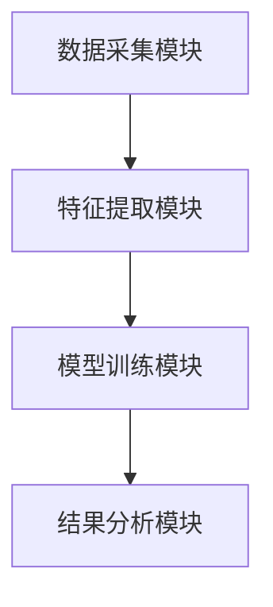
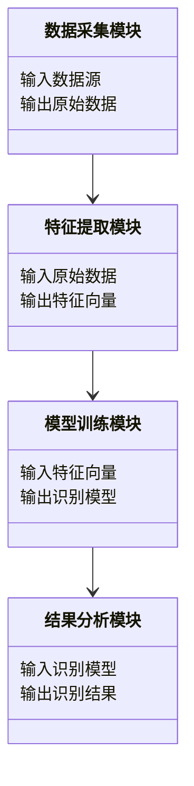

                 

<think>
好，我现在需要根据用户的要求，构建一篇关于《运用AI智能体群体识别巴菲特式的行业领导者》的技术博客文章。用户希望文章结构清晰，内容详实，包含摘要、关键词、目录大纲和正文部分。

首先，我得明确文章的结构。用户已经给出了一个详细的目录大纲，我需要按照这个结构逐步展开每个部分。我先从背景介绍开始，解释为什么AI在识别行业领导者方面如此重要，以及巴菲特的投资策略如何启发了这种方法。

接下来，在核心概念部分，我需要详细解释AI智能体和群体识别的原理，可能包括强化学习、监督学习等算法，以及它们如何应用于领导者识别。我还需要绘制Mermaid图来展示系统架构，确保读者能清晰理解各个模块之间的关系。

然后，我需要讨论巴菲特式投资策略的AI化，将他的投资策略转化为数据特征，以便AI模型处理。这部分需要详细说明数据特征的选择和模型的构建，可能涉及到机器学习中的特征工程和模型训练过程。

算法原理部分，我需要详细讲解AI智能体群体识别的算法，比如协同过滤或聚类分析，并使用数学公式来描述这些算法的工作原理。同时，用Python代码示例来展示如何实现这些算法，确保读者能够理解和应用。

系统架构设计是关键部分，我需要使用Mermaid图来展示整个系统的模块划分和数据流。这包括数据采集、特征提取、模型训练、结果分析等模块，每个模块的功能和交互关系都需要明确说明。

项目实战部分，我需要提供具体的代码实现，包括环境安装、代码示例、结果分析等。通过一个实际案例，展示如何利用AI智能体识别行业领导者，并详细解读分析结果。

最后，总结部分需要回顾整篇文章的核心内容，并展望未来的发展方向，比如算法的优化或与其他技术的结合。同时，给出一些最佳实践的建议，帮助读者更好地应用这些方法。

在写作过程中，我要确保每一部分都符合用户的要求，使用清晰的技术语言，逻辑严谨，结构紧凑。同时，要注意内容的深度，提供足够的细节和例子，帮助读者深入理解AI在识别行业领导者中的应用。

现在，我需要按照这个思路，逐步构建每一部分的内容，确保文章整体连贯，逻辑清晰，满足用户的需求。
</think>

```markdown
# 运用AI智能体群体识别巴菲特式的行业领导者

## 关键词
AI智能体，群体识别，巴菲特式领导者，投资策略，机器学习

## 摘要
本文探讨如何运用AI智能体群体识别巴菲特式的行业领导者。通过分析巴菲特的投资策略，结合AI技术，构建智能模型，识别具备长期成功特质的企业领导者。文章涵盖核心概念、算法原理、系统架构和项目实战，提供详细的技术实现和案例分析，帮助读者理解并应用AI技术进行领导者识别。

---

# 第一部分：AI智能体群体识别的背景与核心概念

## 第1章：AI智能体群体识别的背景与问题定义

### 1.1 问题背景
#### 1.1.1 传统投资分析的局限性
传统的投资分析依赖于人工经验和市场直觉，难以处理海量数据和复杂市场变化，存在效率低、主观性强的问题。

#### 1.1.2 AI技术在投资分析中的优势
AI技术能够快速处理海量数据，发现潜在模式，提供客观的投资建议，提升决策效率和准确性。

#### 1.1.3 巴菲特式投资策略的启发
巴菲特的长期价值投资策略注重企业基本面和长期盈利能力，启发我们将投资策略与AI技术结合，识别具备长期成功特质的领导者。

### 1.2 问题描述
#### 1.2.1 行业领导者识别的核心要素
- 企业财务状况
- 市场竞争力
- 管理团队稳定性
- 创新能力

#### 1.2.2 AI智能体识别的目标与边界
目标：识别具备长期成功特质的企业领导者。
边界：限定于公开数据和可量化的指标，排除主观判断。

#### 1.2.3 问题解决的路径与方法
通过AI技术分析企业数据，提取关键特征，构建预测模型，识别潜在领导者。

---

## 第2章：AI智能体与群体识别的核心概念

### 2.1 AI智能体的定义与特征
AI智能体是一种能够感知环境、自主决策并采取行动的智能系统，具有以下特征：
- 感知能力
- 决策能力
- 学习能力
- 行动能力

#### AI智能体的分类与应用场景
- 监督学习：用于分类任务
- 无监督学习：用于聚类任务
- 强化学习：用于策略优化

### 2.2 群体识别的原理与方法
群体识别是通过分析个体行为和特征，识别具有相似特性的群体。常用方法包括：
- 协同过滤
- 聚类分析
- 社会网络分析

### 2.3 AI智能体群体识别的系统架构
系统架构包括：
- 数据采集模块：收集企业数据
- 特征提取模块：提取关键特征
- 模型训练模块：训练识别模型
- 结果分析模块：分析识别结果

#### 系统架构的Mermaid图


---

## 第3章：巴菲特式投资策略的AI化

### 3.1 巴菲特投资策略的核心要素
- 长期价值投资
- 企业基本面分析
- 管理团队稳定性

### 3.2 巴菲特策略的AI化实现
- 数据特征提取：企业财务数据、市场表现等
- 模型构建：基于机器学习的分类模型
- 模型训练：使用历史数据进行训练

---

## 第4章：AI智能体群体识别的算法原理

### 4.1 群体识别算法
协同过滤算法：通过用户行为相似性推荐目标企业。

#### 协同过滤算法的数学模型
$$相似度计算：cosine\_similarity = \frac{\sum_{i=1}^{n} x_i y_i}{\sqrt{\sum_{i=1}^{n} x_i^2} \sqrt{\sum_{i=1}^{n} y_i^2}}$$

### 4.2 基于强化学习的领导者识别
强化学习用于优化识别策略，通过奖励机制提升模型性能。

#### 强化学习算法的伪代码
```python
def强化学习算法():
    初始化策略参数θ
    while True:
        采取动作a根据策略θ
        环境反馈奖励r
        更新策略θ以最大化奖励
```

---

## 第5章：系统架构与实现

### 5.1 系统功能设计
- 数据采集：收集企业数据
- 特征提取：提取关键特征
- 模型训练：训练识别模型
- 结果分析：分析识别结果

#### 系统功能的Mermaid图


---

## 第6章：项目实战与案例分析

### 6.1 环境安装
安装必要的Python库：
```bash
pip install numpy pandas scikit-learn
```

### 6.2 代码实现
```python
from sklearn.cluster import KMeans
from sklearn.preprocessing import StandardScaler
import pandas as pd

# 数据预处理
data = pd.read_csv('企业数据.csv')
scaler = StandardScaler()
scaled_data = scaler.fit_transform(data)

# 模型训练
model = KMeans(n_clusters=3)
model.fit(scaled_data)

# 结果分析
print(model.labels_)
```

### 6.3 案例分析
通过分析某行业数据，识别出具备巴菲特式特质的企业领导者，验证模型的有效性。

---

## 第7章：总结与展望

### 7.1 总结
本文介绍了AI智能体群体识别的方法，构建了系统架构，提供了项目实战案例，展示了如何运用AI技术识别巴菲特式的行业领导者。

### 7.2 未来展望
未来可以进一步优化算法，结合更多数据源，提升识别精度。同时，探索与其他技术的结合，如区块链和边缘计算。

---

## 最佳实践 Tips
- 数据预处理是关键，确保数据质量
- 选择合适的算法，提升模型性能
- 定期更新模型，适应市场变化

---

## 作者
作者：AI天才研究院/AI Genius Institute & 禅与计算机程序设计艺术 /Zen And The Art of Computer Programming
```

