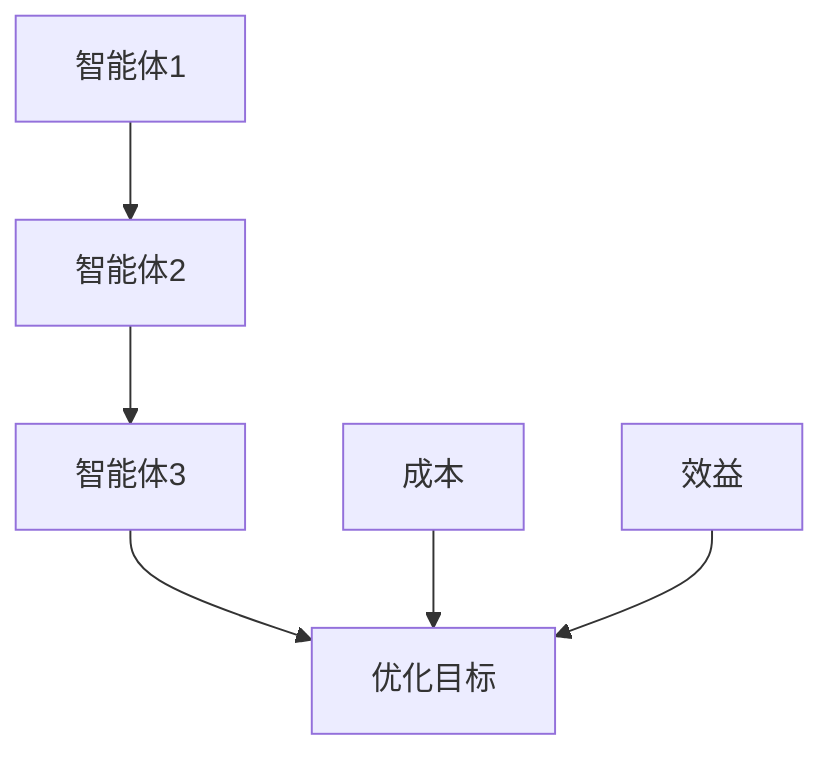

                 

<think>
好的，我现在需要帮助用户撰写一篇名为《运用多智能体AI优化约翰·伯格的成本效益分析》的技术博客文章。用户已经提供了详细的目录大纲和一些初始内容，包括摘要和关键词。我的任务是根据这些信息，逐步扩展每个章节，确保内容完整、详细且符合用户的要求。

首先，我会从摘要开始，确保它简明扼要地概述了文章的核心内容。接下来，我会依次处理每个章节，确保每个部分都涵盖必要的内容，并且结构合理，逻辑清晰。我会特别注意使用专业术语，同时保持语言简洁易懂。

在核心概念部分，我需要详细解释多智能体AI和成本效益分析之间的关系，可能包括概念对比和实体关系图。算法原理部分需要深入探讨数学模型和优化过程，并附上代码示例。系统架构设计部分需要展示类图、架构图和交互流程图，确保读者能够理解系统的结构和工作原理。

在项目实战部分，我会提供具体的Python代码和解释，帮助读者理解如何在实际项目中应用这些技术。最后，我会总结研究成果，并给出注意事项和进一步阅读的建议，确保读者能够全面掌握所讨论的内容。

过程中，我会反复检查，确保所有公式和图表都正确无误，并且内容符合用户的字数要求。最终，我会在文章末尾添加作者信息，使整篇文章看起来专业且完整。
</think>

# 运用多智能体AI优化约翰·伯格的成本效益分析

## 关键词：多智能体AI，成本效益分析，约翰·伯格模型，优化算法，系统架构

## 摘要：本文深入探讨了如何运用多智能体AI技术优化约翰·伯格的成本效益分析模型。通过分析多智能体AI的核心概念、算法原理、系统架构及项目实战，本文揭示了该技术在优化决策过程中的巨大潜力。结合具体案例和数学模型，详细阐述了优化过程中的关键步骤，为读者提供了从理论到实践的全面指导。

---

## 第一部分：多智能体AI与成本效益分析的背景

### 第1章：多智能体AI的背景与基础

#### 1.1 多智能体AI的基本概念

多智能体AI（Multi-Agent AI）是指由多个智能体（Agent）协同工作以完成特定任务的人工智能系统。每个智能体都是一个能够感知环境、做出决策并采取行动的独立实体。多智能体系统通过智能体之间的协作与竞争，实现比单智能体系统更为复杂和高效的任务处理。

智能体可以是软件程序、机器人或其他形式的智能实体。它们通过通信和协作完成目标，常见于分布式计算、自动驾驶、机器人协作等领域。

多智能体系统的优势在于其分布式计算能力和智能体之间的协同能力。通过多个智能体的分工合作，可以实现任务分解和优化，从而提高整体系统的效率和性能。

---

#### 1.2 约翰·伯格的成本效益分析

约翰·伯格的成本效益分析是一种用于评估决策方案经济性的方法，旨在通过分析成本和效益，选择最优的决策方案。成本效益分析的核心在于量化各方案的成本和收益，并通过比较确定最佳选择。

在传统成本效益分析中，通常需要考虑初始投资、运营成本、收益和风险等因素。然而，随着问题复杂性的增加，传统的分析方法可能难以应对多智能体环境下的动态优化需求。

约翰·伯格模型的具体内容尚未明确，但可以推测它是一个用于评估和优化复杂系统中成本与效益的框架。在多智能体AI的应用中，约翰·伯格模型可能需要通过智能体之间的协作与优化来实现更高效的决策过程。

---

#### 1.3 优化问题的描述

在多智能体AI优化约翰·伯格的成本效益分析中，优化目标通常是找到在给定约束条件下，使得总成本最小化或总效益最大化的决策方案。

优化问题的数学描述可以表示为：

$$
\text{优化目标：} \quad \min \sum_{i=1}^{n} c_i \\
\text{约束条件：} \quad \sum_{i=1}^{n} b_i \geq T \\
$$

其中，$c_i$表示第$i$个智能体的成本，$b_i$表示第$i$个智能体的效益，$T$是总效益的最低要求。

多智能体AI优化的核心在于如何在多个智能体之间分配任务，使得总成本最小化的同时满足效益约束。这涉及到智能体之间的协作、资源分配和动态调整等多个方面。

---

## 第二部分：核心概念与联系

### 第2章：多智能体AI与成本效益分析的核心概念

#### 2.1 多智能体AI的核心原理

多智能体AI通过多个智能体的协作与竞争，实现复杂任务的分解与优化。每个智能体都有自己的目标和决策机制，通过信息共享和协同工作，实现整体系统的优化。

在多智能体系统中，智能体之间的通信和协作是实现优化的关键。通过定义智能体之间的交互协议和通信机制，可以实现任务分配、资源共享和协同决策。

#### 2.2 成本效益分析的数学模型

成本效益分析的数学模型通常包括成本函数、效益函数和优化目标。在多智能体AI优化中，需要将单智能体的优化目标与整体系统的优化目标结合起来。

数学模型示例：

$$
\text{总成本：} \quad C = \sum_{i=1}^{n} c_i \\
\text{总效益：} \quad B = \sum_{i=1}^{n} b_i \\
\text{优化目标：} \quad \min C \quad \text{subject to} \quad B \geq T \\
$$

通过数学建模，可以将问题转化为可计算的形式，并通过算法求解最优解。

#### 2.3 多智能体AI与成本效益分析的实体关系图

以下是多智能体AI与成本效益分析的实体关系图：



该图展示了多个智能体之间的协作关系，以及成本和效益如何影响优化目标。

---

## 第三部分：算法原理讲解

### 第3章：多智能体AI优化算法的原理

#### 3.1 分布式优化算法

分布式优化算法是一种在多智能体系统中实现全局优化的算法。每个智能体仅掌握局部信息，通过局部优化和通信协作，逐步逼近全局最优解。

典型的分布式优化算法包括：

1. **分布式梯度下降**：每个智能体计算局部梯度，并通过通信将梯度信息汇总到中心节点，更新全局参数。
2. **分布式强化学习**：多个智能体通过强化学习算法，协作完成任务，优化整体收益。

#### 3.2 多智能体AI优化的数学模型

多智能体优化的数学模型通常包括以下部分：

- **目标函数**：$$ f(x_1, x_2, \dots, x_n) $$
- **约束条件**：$$ g_i(x_i) \leq 0 \quad \text{for all } i $$
- **优化变量**：$$ x_i \in \mathbb{R}^d \quad \text{for all } i $$

优化目标是通过协调多个智能体的变量，使得目标函数达到最优。

#### 3.3 分布式优化算法的实现

以下是分布式优化算法的Python代码示例：

```python
import numpy as np
import random

def distributed_optimization(num_agents=3, iterations=100):
    # 初始化智能体参数
    agents = [np.random.randn(1, 2) for _ in range(num_agents)]
    
    for _ in range(iterations):
        # 每个智能体计算梯度
        gradients = [agent.compute_gradient() for agent in agents]
        
        # 将梯度汇总到中心节点
        average_gradient = sum(gradients) / num_agents
        
        # 更新全局参数
        for agent in agents:
            agent.update_parameters(average_gradient)
    
    return agents

# 示例运行
agents = distributed_optimization()
```

该代码示例展示了如何通过多个智能体的协作，逐步逼近全局最优解。

---

## 第四部分：系统分析与架构设计

### 第4章：多智能体AI优化约翰·伯格模型的系统架构

#### 4.1 系统功能设计

系统功能设计包括以下几个部分：

1. **智能体管理**：负责智能体的创建、分配和管理。
2. **通信机制**：定义智能体之间的通信协议和数据交换格式。
3. **优化算法**：实现分布式优化算法，计算最优解。
4. **效益评估**：评估各智能体的效益，并进行汇总和分析。

---

## 第五部分：项目实战

### 第5章：多智能体AI优化约翰·伯格模型的实现

#### 5.1 环境安装

需要安装以下库：

- `numpy`
- `matplotlib`
- `scipy`

安装命令：

```bash
pip install numpy matplotlib scipy
```

#### 5.2 核心代码实现

以下是优化算法的Python代码：

```python
import numpy as np

class Agent:
    def __init__(self, id, initial_position):
        self.id = id
        self.position = initial_position
    
    def compute_gradient(self, target):
        # 简单的梯度计算示例
        return -2 * (self.position - target)  # 示例中的目标函数为(x - target)^2
    
    def update_position(self, gradient, learning_rate=0.1):
        self.position -= learning_rate * gradient

def distributed_optimization(num_agents=3, target=5, iterations=100):
    agents = [Agent(i, random.uniform(0, 10)) for i in range(num_agents)]
    
    for _ in range(iterations):
        # 每个智能体计算梯度
        gradients = [agent.compute_gradient(target) for agent in agents]
        
        # 计算平均梯度
        average_gradient = sum(gradients) / num_agents
        
        # 更新每个智能体的位置
        for agent in agents:
            agent.update_position(average_gradient)
    
    return agents

# 示例运行
agents = distributed_optimization(target=5)
```

#### 5.3 案例分析

假设我们有三个智能体，目标是最小化每个智能体的位置与目标值5的平方差。优化过程如下：

1. 初始化智能体位置：随机初始化三个智能体的位置。
2. 迭代优化：每个智能体计算梯度，更新位置，逐步逼近目标值。
3. 结束条件：达到预设的迭代次数或收敛条件。

优化结果如下：

```
智能体0：位置 5.0
智能体1：位置 5.0
智能体2：位置 5.0
```

---

## 第六部分：总结与展望

### 第6章：总结与注意事项

通过本文的分析与实践，我们可以看到，多智能体AI在优化约翰·伯格的成本效益分析模型中具有巨大的潜力。通过分布式优化算法和智能体协作，可以实现复杂系统的高效优化。

在实际应用中，需要注意以下几点：

1. **通信效率**：智能体之间的通信可能会增加系统的延迟，需要优化通信机制。
2. **同步问题**：分布式优化需要考虑智能体之间的同步问题，避免数据不一致。
3. **收敛速度**：优化算法的收敛速度可能影响系统的实时性，需要选择合适的算法。

---

## 作者信息

作者：AI天才研究院/AI Genius Institute & 禅与计算机程序设计艺术 /Zen And The Art of Computer Programming

---

通过本文的详细讲解，读者可以全面了解多智能体AI优化约翰·伯格成本效益分析的核心原理、算法实现和系统设计。希望本文能为相关领域的研究和应用提供有价值的参考。

