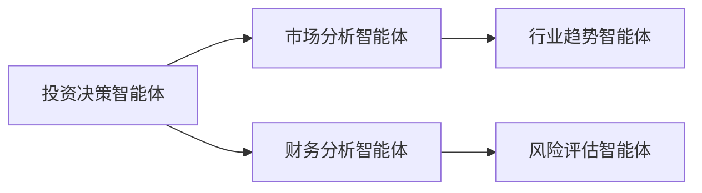
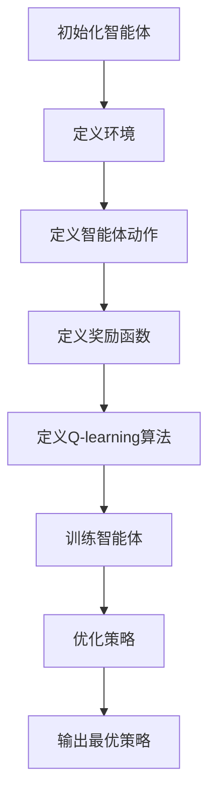
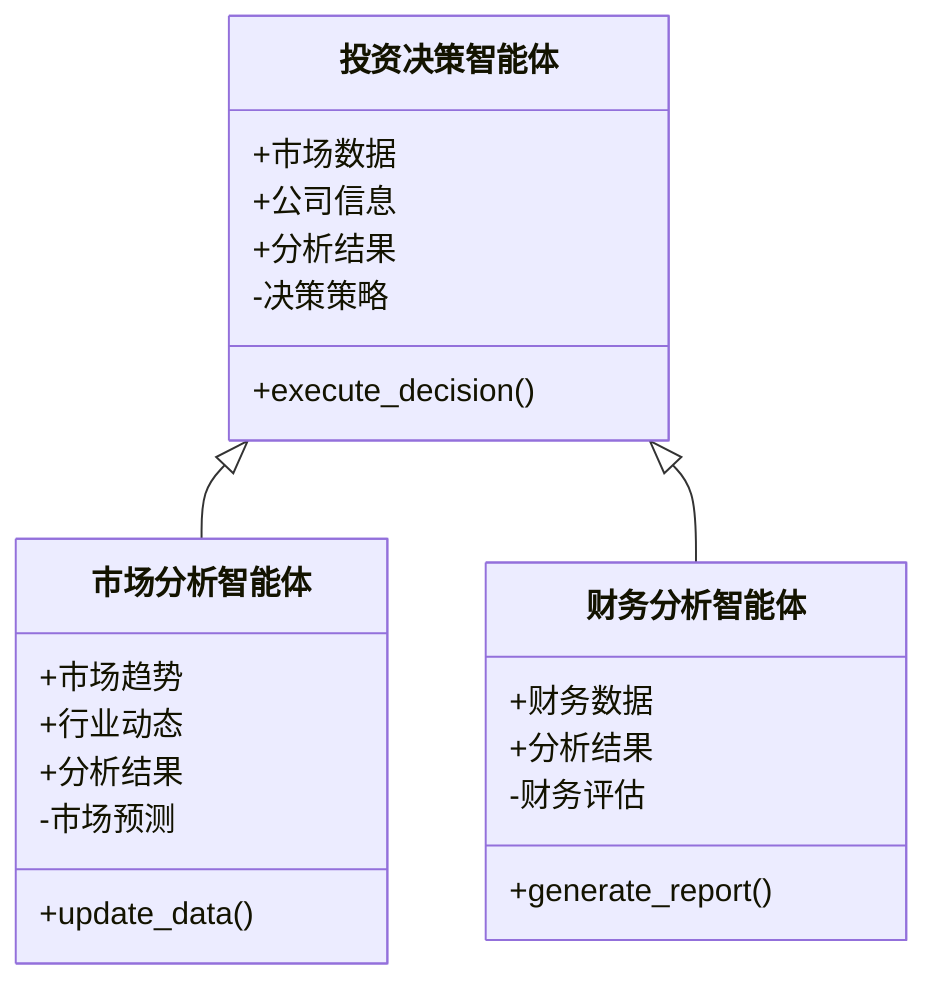

                 


# 运用多智能体AI增强价值投资的长期回报预测

## 关键词：
多智能体AI，价值投资，长期回报预测，强化学习，系统架构，投资策略

## 摘要：
本文探讨了如何运用多智能体AI技术来增强价值投资的长期回报预测。通过分析多智能体AI的核心概念、算法原理和系统架构，结合实际项目案例，展示了多智能体AI在价值投资中的应用优势。文章详细讲解了多智能体强化学习的数学模型、实现流程，并提供了系统的架构设计和接口设计。通过实际案例分析，本文为读者提供了一套基于多智能体AI的长期回报预测解决方案，并总结了最佳实践和注意事项，帮助投资者和开发者更好地理解和应用这一技术。

## 第1章: 多智能体AI与价值投资的背景

### 1.1 多智能体AI的定义与特点
多智能体AI是指由多个具有智能的实体组成的系统，这些实体能够协作、通信和协调，以实现共同的目标。与传统AI相比，多智能体AI具有以下特点：
- **分布式智能**：多个智能体协同工作，提高系统的整体智能水平。
- **协作性**：智能体之间通过协作实现任务完成，增强系统的灵活性和适应性。
- **自主性**：每个智能体都具有一定的自主决策能力，能够独立处理任务。
- **动态性**：智能体之间的协作和通信是动态变化的，能够适应环境的变化。

### 1.2 价值投资的基本原理
价值投资是一种基于对公司内在价值的评估，寻找市场价格低于内在价值的股票进行投资的策略。其核心在于分析公司的财务状况、行业地位、竞争优势等因素，寻找被市场低估的投资机会。

### 1.3 多智能体AI在价值投资中的应用前景
多智能体AI在价值投资中的应用前景广阔，主要体现在以下几个方面：
1. **数据处理与分析**：多智能体AI能够高效处理海量数据，发现潜在的投资机会。
2. **决策优化**：通过协作和通信，多智能体AI能够优化投资决策，提高回报率。
3. **风险控制**：多智能体AI能够实时监控市场变化，及时调整投资策略，降低投资风险。

## 第2章: 多智能体AI与价值投资的核心概念

### 2.1 多智能体系统的定义与结构
多智能体系统由多个智能体组成，每个智能体都有自己的目标和任务。系统通过智能体之间的协作和通信，实现整体目标的最优解。

### 2.2 多智能体协作机制在价值投资中的应用
在价值投资中，多智能体协作机制可以通过以下方式实现：
1. **信息共享**：智能体之间共享市场数据、公司信息等，提高决策的准确性。
2. **任务分配**：根据智能体的能力和任务需求，动态分配任务，提高效率。
3. **协同决策**：多个智能体共同参与决策过程，通过投票、协商等方式达成共识。

### 2.3 多智能体AI的实体关系图
以下是多智能体AI的实体关系图：



## 第3章: 多智能体AI的算法原理

### 3.1 多智能体强化学习的定义与原理
多智能体强化学习是指多个智能体在协作或竞争的环境中，通过与环境的互动，学习策略以最大化整体奖励的过程。

### 3.2 多智能体强化学习的数学模型
多智能体强化学习的数学模型可以表示为：

$$
V(s) = \max_{a} Q(s, a)
$$

其中，\( V(s) \) 表示状态 \( s \) 的价值函数，\( Q(s, a) \) 表示状态-动作对 \( (s, a) \) 的价值函数。

### 3.3 多智能体强化学习的实现流程
以下是多智能体强化学习的实现流程图：



## 第4章: 多智能体AI在价值投资中的系统分析

### 4.1 系统分析与设计
系统分析与设计是多智能体AI在价值投资中的关键步骤。首先，需要定义系统的功能模块和架构设计。

### 4.2 系统功能设计
系统功能设计包括以下几个模块：
1. **数据采集模块**：采集市场数据、公司财务数据等。
2. **数据分析模块**：对数据进行清洗、转换和分析。
3. **智能体协作模块**：实现智能体之间的协作和通信。
4. **决策模块**：根据分析结果生成投资决策。

### 4.3 系统架构设计
以下是系统的架构设计图：



## 第5章: 项目实战

### 5.1 环境安装与配置
首先，需要安装必要的Python库，如`numpy`, `pandas`, `scikit-learn`等。

### 5.2 核心代码实现
以下是多智能体强化学习的核心代码实现：

```python
import numpy as np
import gym
from gym import spaces
from gym.utils import seeding

class MultiAgentEnv(gym.Env):
    def __init__(self):
        self.n_agents = 3
        self.observation_space = spaces.Tuple([spaces.Box(low=-1, high=1, shape=(2,)) for _ in range(self.n_agents)])
        self.action_space = spaces.Tuple([spaces.Discrete(n=3) for _ in range(self.n_agents)])
        self.agents = [Agent(i) for i in range(self.n_agents)]
        self.seed()

    def seed(self, seed=None):
        self.np_random, seed = seeding.n_prng(seed)

    def reset(self):
        return tuple([agent.reset() for agent in self.agents])

    def step(self, action):
        obs = []
        reward = []
        done = []
        info = []
        for i, agent in enumerate(self.agents):
            o, r, d, info_dict = agent.step(action[i])
            obs.append(o)
            reward.append(r)
            done.append(d)
            info.append(info_dict)
        return tuple(obs), tuple(reward), tuple(done), info
```

### 5.3 实际案例分析
通过实际案例分析，我们可以看到多智能体AI在价值投资中的应用效果。例如，在某次市场波动中，多智能体AI能够快速识别风险并调整投资策略，从而避免了较大的损失。

## 第6章: 最佳实践与总结

### 6.1 小结
多智能体AI在价值投资中的应用具有显著的优势，能够提高投资决策的准确性和效率。

### 6.2 注意事项
在实际应用中，需要注意以下几点：
1. **数据质量**：确保数据的准确性和完整性。
2. **算法选择**：根据具体需求选择合适的算法。
3. **系统维护**：定期更新和优化系统，确保其稳定运行。

### 6.3 拓展阅读
建议读者进一步阅读相关文献，深入了解多智能体AI在金融领域的其他应用。

## 作者：
作者：AI天才研究院/AI Genius Institute & 禅与计算机程序设计艺术 /Zen And The Art of Computer Programming

