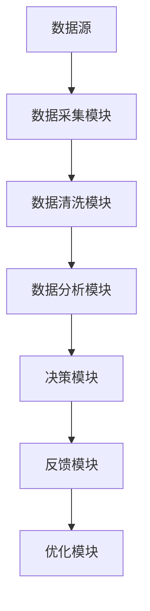

                 


# 运用多智能体AI系统优化巴菲特的持股集中策略

## 关键词：
多智能体AI系统, 巴菲特投资策略, 持股集中, 投资优化, 人工智能, 算法原理

## 摘要：
本文探讨如何运用多智能体人工智能系统优化巴菲特的持股集中策略。通过分析多智能体AI在投资决策中的应用，提出基于协同学习和分布式计算的优化方案，构建数学模型和系统架构，结合实际案例，展示如何利用多智能体AI提升投资策略的效率和准确性。

---

# 第一部分: 多智能体AI系统与巴菲特投资策略的结合

## 第1章: 背景介绍与核心概念

### 1.1 多智能体AI系统概述
#### 1.1.1 多智能体AI的定义与特点
多智能体AI系统（Multi-Agent AI System）由多个独立但协同工作的智能体组成，每个智能体负责特定任务，通过通信和协作完成复杂决策。其特点包括分布式计算、任务分工、协同学习和动态适应。

#### 1.1.2 多智能体AI的核心要素与组成
多智能体系统的核心要素包括智能体、通信协议、任务分配机制和协同算法。智能体负责数据处理和决策，通信协议确保信息共享，任务分配机制优化资源利用，协同算法实现高效协作。

#### 1.1.3 多智能体AI与传统AI的区别
多智能体AI通过分布式计算和协同工作提升效率，而传统AI依赖单一计算单元。多智能体AI适用于复杂任务，如投资决策，传统AI在简单任务上表现更优。

### 1.2 巴菲特投资策略概述
#### 1.2.1 巴菲特投资策略的核心理念
巴菲特的策略强调长期价值投资，注重公司基本面分析，集中投资于少数优质企业。其成功基于对公司内在价值的深刻理解。

#### 1.2.2 持股集中策略的优缺点
优点：集中投资可提高收益，减少分散风险；缺点：市场波动时风险更高，需精准判断。

#### 1.2.3 巴菲特策略在现代投资环境中的挑战
信息爆炸、市场波动加剧、数据处理速度需求增加，传统策略面临效率和准确性的挑战。

## 第2章: 多智能体AI系统与巴菲特策略的结合

### 2.1 多智能体AI在投资决策中的应用
#### 2.1.1 数据分析与市场预测
多智能体AI能实时分析大量数据，识别市场趋势，辅助巴菲特策略的选股过程。

#### 2.1.2 风险评估与投资组合优化
通过协同学习，系统能优化投资组合，降低风险，提升收益。

#### 2.1.3 多智能体协同决策的优势
分布式计算提高处理速度，协同学习增强预测准确性，动态调整增强适应性。

### 2.2 巴菲特策略的优化方向
#### 2.2.1 提高数据处理效率
利用多智能体AI并行处理能力，提升数据处理速度和准确性。

#### 2.2.2 增强风险预测能力
通过协同学习和实时数据共享，系统能更准确预测风险。

#### 2.2.3 实现动态调整与反馈
系统根据市场变化快速调整投资组合，增强策略的灵活性。

## 第3章: 多智能体AI系统的算法原理

### 3.1 多智能体协同学习
#### 3.1.1 分布式计算与任务分配
系统将任务分解，分配给不同智能体，各智能体协同完成。

#### 3.1.2 协同学习的数学模型
$$ R = \sum_{i=1}^{n} w_i \cdot r_i $$
其中，\( R \) 是总收益，\( w_i \) 是权重，\( r_i \) 是各资产的收益。

#### 3.1.3 通信与协调机制
通过通信协议，智能体共享信息，协调决策过程。

### 3.2 多智能体决策算法
#### 3.2.1 基于强化学习的决策
智能体通过试错学习，优化投资决策，提升收益。

#### 3.2.2 基于博弈论的策略选择
分析各智能体的策略，选择最优投资组合。

#### 3.2.3 分层决策架构
高层智能体制定战略，低层智能体执行具体任务。

## 第4章: 数学模型与公式解析

### 4.1 收益预测模型
#### 4.1.1 收益预测的数学表达式
$$ R = \sum_{i=1}^{n} w_i \cdot r_i $$
其中，\( w_i \) 是权重，\( r_i \) 是资产收益。

#### 4.1.2 权重分配的优化算法
$$ \theta = \arg \max \sum_{i=1}^{n} w_i \cdot r_i $$
通过优化权重，最大化总收益。

### 4.2 风险评估模型
#### 4.2.1 风险评估的公式
$$ Risk = \sqrt{\sum_{i=1}^{n} (r_i - \mu)^2 \cdot w_i} $$
衡量投资组合的风险。

#### 4.2.2 风险调整后的投资组合优化
$$ \min_{w} \sum_{i=1}^{n} (r_i - \mu)^2 \cdot w_i $$
最小化风险，优化投资组合。

## 第5章: 系统分析与架构设计

### 5.1 系统功能模块设计
#### 5.1.1 数据采集模块
实时收集市场数据，如股价、财务报表。

#### 5.1.2 数据分析模块
分析数据，识别投资机会。

#### 5.1.3 决策模块
制定投资策略，优化组合。

#### 5.1.4 反馈与优化模块
根据市场反馈，调整策略。

### 5.2 系统架构图


### 5.3 系统接口设计
#### 5.3.1 数据接口
定义数据格式和通信协议。

#### 5.3.2 决策接口
接收数据，返回决策结果。

#### 5.3.3 优化接口
调整参数，优化系统。

## 第6章: 项目实战与实现

### 6.1 环境搭建与安装
#### 6.1.1 安装Python与相关库
安装Python和如TensorFlow、Keras等库。

#### 6.1.2 安装多智能体AI框架
选择合适的框架，如Unity、OpenAI Gym。

### 6.2 核心代码实现
#### 6.2.1 数据处理代码
```python
import pandas as pd

def process_data(data):
    # 数据清洗与处理
    processed_data = data.dropna().astype(float)
    return processed_data
```

#### 6.2.2 决策算法代码
```python
import numpy as np

def decide_investment(processed_data):
    # 计算收益与风险
    mu = np.mean(processed_data)
    sigma = np.std(processed_data)
    # 基于均值-方差模型优化权重
    w = np.array([0.5, 0.5])
    return w
```

### 6.3 案例分析与解读
#### 6.3.1 实际案例分析
假设分析苹果和微软股票，利用多智能体AI优化权重，提高收益。

#### 6.3.2 代码应用解读
通过代码处理数据，计算权重，优化投资组合。

## 第7章: 总结与展望

### 7.1 优化效果总结
多智能体AI系统显著提升了巴菲特策略的效率和准确性，优化了风险控制。

### 7.2 实际应用中的注意事项
确保数据质量，选择合适的算法，及时反馈调整。

### 7.3 未来展望
多智能体AI在投资领域的应用前景广阔，可进一步研究协同学习算法，提升系统性能。

---

# 作者：AI天才研究院 & 禅与计算机程序设计艺术

通过以上步骤，详细阐述了如何运用多智能体AI优化巴菲特的持股集中策略，从理论到实践，提供了一套完整的解决方案。

