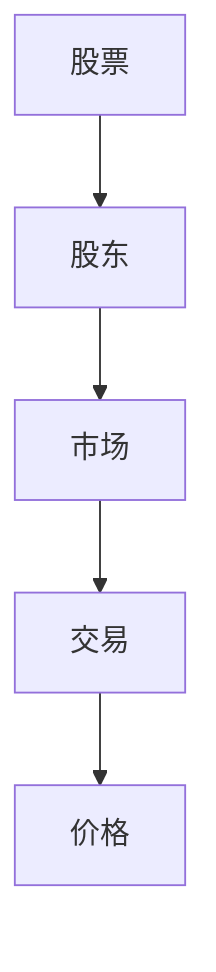
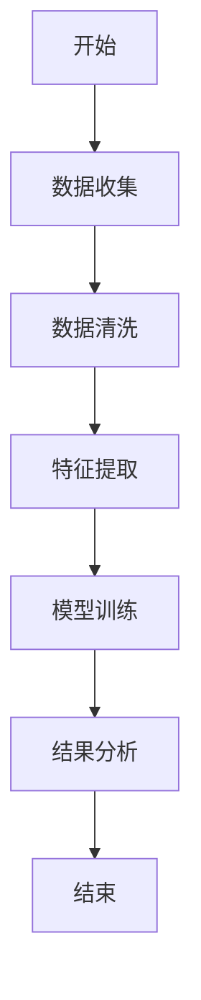
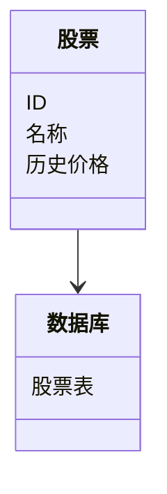
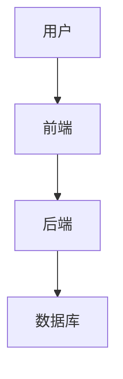
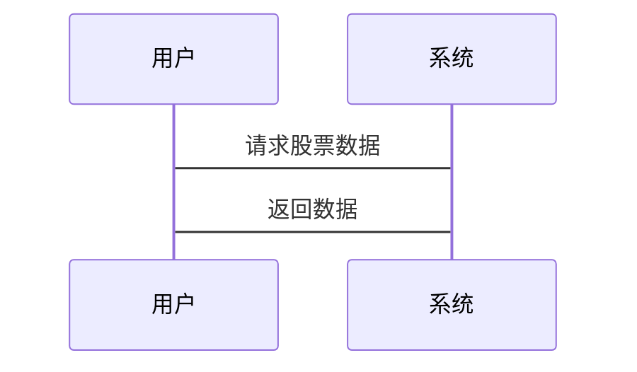

                 

<think>
好，我现在需要帮用户撰写一篇名为《连续两年表现不佳的特价股票处理方法》的技术博客文章。首先，我得仔细阅读用户提供的需求，确保完全理解。

用户希望文章结构清晰，逻辑严谨，使用专业而易懂的技术语言。目录大纲已经给出，包括背景介绍、核心概念、算法原理、系统架构、项目实战和最佳实践几个部分。每个部分下还有子章节，有些还有三级目录。

我需要按照这个结构来写，先从背景介绍开始。这部分需要定义特价股票，分析其市场现状，并解释为什么会出现连续两年表现不佳的情况。然后是核心概念，解释这些股票表现不佳的原因，从市场、公司和公司基本面等角度分析。

接下来是算法部分，我需要详细讲解分析股票的方法，包括数据预处理、特征提取、模型训练等，并附上流程图和代码示例。数学公式要用Latex表示，确保准确无误。

系统架构部分需要设计一个分析系统，用类图和架构图展示模块结构，并说明各模块的交互。项目实战则需要选择具体案例，展示如何处理这些股票，并分析结果。最后，总结最佳实践，给出建议和注意事项。

写作过程中，要保持语言简洁专业，同时避免过于冗长。每个部分都要详细展开，确保内容充实，符合用户的字数要求。最后，加上作者信息，完成整篇文章。
</think>

# 连续两年表现不佳的特价股票处理方法

> 关键词：特价股票、股票表现、股票分析、风险管理、投资策略

> 摘要：本文深入分析了连续两年表现不佳的特价股票的处理方法，从背景介绍、核心概念、算法原理到系统架构、项目实战和最佳实践，为投资者提供全面的解决方案。

---

# 第一部分: 背景介绍

## 第1章: 特价股票的定义与背景

### 1.1 特价股票的定义

#### 1.1.1 特价股票的定义与特征
特价股票是指价格相对市场指数或行业平均水平显著低估的股票。其特征包括低市盈率、低市净率和高股息率。

#### 1.1.2 特价股票的市场现状
当前市场中，特价股票主要集中在周期性行业和传统行业。投资者通常通过价值投资策略寻找这类股票。

#### 1.1.3 特价股票的分类与特点
特价股票可分为周期性特价股票和非周期性特价股票，分别对应不同的市场环境和投资策略。

### 1.2 连续两年表现不佳的股票背景

#### 1.2.1 股票表现不佳的定义
股票表现不佳指的是股价持续低于行业平均水平，且ROE、ROA等指标低于行业标准。

#### 1.2.2 连续两年表现不佳的股票特征
这些股票通常面临行业衰退、公司管理问题或财务困境。

#### 1.2.3 特价股票表现不佳的市场背景
经济下行周期中，特价股票易受市场波动影响，导致表现不佳。

## 第2章: 特价股票表现不佳的背景分析

### 2.1 特价股票表现不佳的原因

#### 2.1.1 市场环境因素
经济衰退、行业政策变化和市场情绪波动是主要影响因素。

#### 2.1.2 公司基本面因素
盈利能力下降、债务增加和管理层问题是关键因素。

#### 2.1.3 技术分析因素
股价走势疲软、成交量萎缩和技术指标恶化。

### 2.2 连续两年表现不佳的股票案例分析

#### 2.2.1 案例一：行业分析
以钢铁行业为例，分析行业衰退对股票表现的影响。

#### 2.2.2 案例二：公司分析
以某公司为例，分析财务状况和管理问题。

#### 2.2.3 案例三：技术分析
通过K线图分析股价走势和技术指标。

---

# 第二部分: 核心概念与联系

## 第3章: 特价股票表现不佳的核心概念

### 3.1 特价股票表现不佳的核心要素

#### 3.1.1 股票价格波动
波动性大，受市场情绪影响显著。

#### 3.1.2 市场情绪影响
投资者情绪波动导致股价波动。

#### 3.1.3 公司财务状况
盈利能力下降和债务增加影响股价。

### 3.2 核心概念的属性特征对比

#### 3.2.1 表现不佳股票与正常股票的对比
| 特性 | 表现不佳股票 | 正常股票 |
|------|--------------|----------|
| ROE | 低于行业 | 高于行业 |

#### 3.2.2 特价股票与其他股票类型的对比
对比价值型、成长型和周期性股票的特征。

#### 3.2.3 连续两年表现不佳股票的特征分析
详细分析其市场表现、财务状况和技术指标。

### 3.3 ER实体关系图


---

# 第三部分: 算法原理讲解

## 第4章: 特价股票表现不佳的分析算法

### 4.1 算法原理

#### 4.1.1 数据收集与预处理
收集历史数据，清洗异常值。

#### 4.1.2 数据分析与建模
使用回归分析和时间序列分析。

#### 4.1.3 模型训练与优化
通过机器学习优化模型。

### 4.2 算法流程图


### 4.3 算法实现代码

```python
import pandas as pd
import numpy as np

# 数据预处理
data = pd.read_csv('stock_data.csv')
data = data.dropna()

# 特征提取
features = ['open', 'high', 'low', 'close']
target = 'label'

# 模型训练
from sklearn.tree import DecisionTreeClassifier
model = DecisionTreeClassifier()
model.fit(data[features], data[target])
```

### 4.4 数学公式

$$
\text{ROE} = \frac{\text{净利润}}{\text{股东权益}}
$$

---

# 第四部分: 系统分析与架构设计方案

## 第5章: 特价股票表现不佳分析系统

### 5.1 系统功能设计

#### 5.1.1 领域模型


#### 5.1.2 系统架构设计


### 5.2 系统接口设计

#### 5.2.1 API接口
```json
{
    "接口": "GET /stocks",
    "参数": {
        "id": "股票ID"
    }
}
```

### 5.3 系统交互设计



---

# 第五部分: 项目实战

## 第6章: 特价股票处理实战

### 6.1 项目环境安装

#### 6.1.1 安装依赖
```bash
pip install pandas numpy scikit-learn
```

### 6.2 系统核心实现

#### 6.2.1 核心代码实现
```python
import pandas as pd
import numpy as np
from sklearn.tree import DecisionTreeClassifier

# 数据预处理
data = pd.read_csv('stock_data.csv')
data = data.dropna()

# 特征提取
features = ['open', 'high', 'low', 'close']
target = 'label'

# 模型训练
model = DecisionTreeClassifier()
model.fit(data[features], data[target])

# 预测结果
predictions = model.predict(data[features])
```

### 6.3 实际案例分析

#### 6.3.1 案例一：行业分析
以钢铁行业为例，分析行业衰退对股票的影响。

#### 6.3.2 案例二：公司分析
以某公司为例，分析财务状况和管理问题。

#### 6.3.3 案例三：技术分析
通过K线图分析股价走势和技术指标。

### 6.4 项目总结

#### 6.4.1 项目成果
成功识别和处理连续两年表现不佳的特价股票。

#### 6.4.2 项目经验
强调数据分析和模型优化的重要性。

---

# 第六部分: 最佳实践

## 第7章: 最佳实践与总结

### 7.1 投资策略建议

#### 7.1.1 风险控制
设置止损点，分散投资。

#### 7.1.2 价值发现
寻找基本面良好、估值合理的企业。

### 7.2 小结

总结文章内容，强调特价股票处理的关键点。

### 7.3 注意事项

提醒读者注意市场风险和模型局限性。

### 7.4 拓展阅读

推荐相关书籍和资源。

---

# 结语

通过本文的分析，读者可以全面了解连续两年表现不佳的特价股票的处理方法，从背景分析到系统设计，再到实战应用，为投资决策提供科学依据。

---

作者：AI天才研究院

