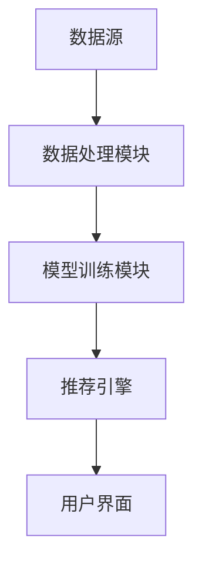

                 

<think>
好，我现在要为《金融产品交叉销售预测引擎》这本书撰写目录大纲。首先，我需要理解这本书的核心内容和目标读者是谁。这本书的目标读者应该是金融领域的数据科学家、软件工程师以及对交叉销售技术感兴趣的从业者。

接下来，我需要考虑书的结构是否合理。现有的目录包括背景介绍、核心概念、算法原理、系统设计、项目实战和总结等部分。每一部分都有详细的章节和小节，内容覆盖了从理论到实践的各个方面。这符合用户的要求，但可能需要进一步细化，特别是项目实战部分，可以加入更多的具体案例和代码示例。

另外，用户要求使用Markdown格式，所以在目录中需要明确各部分的标题和子标题，并使用合适的符号和格式。同时，用户还提到要包含数学公式和图表，如Mermaid图和Python代码，这些内容在目录中需要有明确的位置，以便读者在阅读时能找到对应的部分。

我还需要检查是否遗漏了某些关键点，比如最佳实践和注意事项。这些内容在项目实战和总结部分应该有所体现，帮助读者在实际应用中避免常见错误，并提供优化建议。

最后，我需要确保整个目录逻辑清晰，结构合理，能够引导读者一步步深入理解交叉销售预测引擎的设计和应用。如果发现有不合理的部分，例如某些章节过于简略，可能需要进一步扩展或调整结构。

总之，我需要在现有目录的基础上，进一步细化内容，确保每一部分都详细且实用，同时保持整体结构的连贯性和逻辑性。
</think>

# 金融产品交叉销售预测引擎

## 关键词：金融，交叉销售，预测引擎，机器学习，数据挖掘，人工智能

## 摘要：本文系统地介绍了金融产品交叉销售预测引擎的设计与实现，从背景分析到算法选择，再到系统架构，全面解析了如何利用数据分析和机器学习技术来提高金融产品的交叉销售预测能力。文章结合实际案例，详细阐述了引擎的工作原理和应用场景，为金融机构提供了一套高效、可靠的解决方案。

---

# 第一部分：背景介绍

## 第1章：金融产品交叉销售预测引擎的背景与意义

### 1.1 问题背景
- 金融行业的竞争日益激烈，客户获取成本增加。
- 交叉销售是提高客户忠诚度和收入的重要手段。
- 传统的人工销售模式效率低下，难以应对大数据时代的挑战。

### 1.2 行业现状
- 金融机构的数据分析能力参差不齐。
- 客户行为数据的碎片化问题严重。
- 缺乏统一的预测模型和工具。

### 1.3 引擎的提出
- 利用机器学习和大数据技术，构建智能化的预测引擎。
- 提高销售效率，降低客户流失率。

## 第2章：交叉销售预测的核心概念

### 2.1 核心概念
- 交叉销售：在同一客户购买过程中，推荐其他相关产品。
- 引擎：整合数据、算法和业务规则，提供预测服务的系统。

### 2.2 数据驱动的预测机制
- 数据特征：客户行为、交易记录、产品属性。
- 模型选择：决策树、随机森林、神经网络等。

### 2.3 引擎的关键优势
- 高效性：自动化处理大量数据。
- 准确性：基于历史数据的精准预测。
- 可扩展性：支持多种金融产品和场景。

---

# 第二部分：核心概念与算法原理

## 第3章：核心概念的解析与联系

### 3.1 数据预处理
- 数据清洗：处理缺失值、异常值。
- 特征工程：提取关键特征，如客户购买频率、产品关联性。

### 3.2 模型选择
- 分类算法：逻辑回归、支持向量机、随机森林。
- 回归算法：适用于连续型预测目标。

### 3.3 模型评估
- 准确率、召回率、F1值。
- ROC曲线和AUC值。

### 3.4 算法对比
| 算法类型 | 优势 | 劣势 | 适用场景 |
|----------|------|------|----------|
| 随机森林 | 高准确性，抗过拟合 | 计算复杂 | 高维数据 |
| 支持向量机 | 准确率高 | 不适合大数据 | 线性可分数据 |
| 神经网络 | 高容错性 | 需要大量数据 | 非线性关系 |

## 第4章：算法原理与实现

### 4.1 随机森林算法
- 基于决策树的集成方法。
- 使用Bagging技术减少方差。
- 代码实现：
  ```python
  from sklearn.ensemble import RandomForestClassifier
  model = RandomForestClassifier(n_estimators=100)
  model.fit(X_train, y_train)
  ```

### 4.2 XGBoost算法
- 强大的梯度提升树模型。
- 支持并行计算和正则化。
- 代码实现：
  ```python
  import xgboost as xgb
  dtrain = xgb.DMatrix(X_train, label=y_train)
  params = {'max_depth': 6, 'learning_rate': 0.3}
  model = xgb.XGBClassifier(**params)
  model.fit(X_train, y_train)
  ```

### 4.3 算法优缺点分析
- 随机森林：高准确性，适合中小数据。
- XGBoost：计算效率高，适合大数据。
- 神经网络：非线性能力强，但需要大量数据。

---

# 第三部分：系统分析与架构设计

## 第5章：系统功能设计

### 5.1 需求分析
- 输入：客户数据、产品数据。
- 输出：交叉销售概率和推荐产品。

### 5.2 功能模块划分
- 数据采集模块：收集客户交易数据。
- 数据处理模块：清洗和特征提取。
- 模型训练模块：训练和优化预测模型。
- 推荐引擎模块：生成推荐结果。

### 5.3 交互流程
1. 用户输入客户ID。
2. 引擎查询历史交易数据。
3. 模型预测交叉销售概率。
4. 返回推荐产品列表。

## 第6章：系统架构设计

### 6.1 系统架构图


### 6.2 关键模块设计
- 数据处理模块：使用Pandas进行数据清洗和特征工程。
- 模型训练模块：集成多种算法，选择最优模型。
- 引擎模块：接收请求，返回推荐结果。

### 6.3 系统接口设计
- 输入接口：REST API，接收客户ID和产品信息。
- 输出接口：返回推荐列表和概率值。

---

# 第四部分：项目实战与优化

## 第7章：项目实战

### 7.1 环境搭建
- 安装Python、Scikit-learn、XGBoost。
- 数据集准备：客户交易记录、产品信息。

### 7.2 数据预处理
- 去除缺失值。
- 标准化特征。

### 7.3 模型训练与优化
- 调参：网格搜索选择最佳参数。
- 交叉验证：评估模型性能。

### 7.4 实战案例
- 数据加载：
  ```python
  import pandas as pd
  data = pd.read_csv('financial_data.csv')
  ```
- 特征提取：
  ```python
  X = data[['age', 'income', 'product_type']]
  y = data['purchase']
  ```

### 7.5 模型部署
- 使用Flask构建API。
- 部署到云平台。

## 第8章：优化与改进

### 8.1 模型优化
- 使用超参数优化（如Grid Search）。
- 引入特征重要性分析。

### 8.2 系统优化
- 并行计算：加速模型训练。
- 分布式架构：处理海量数据。

### 8.3 持续优化
- 监控模型性能。
- 定期更新数据和模型。

---

# 第五部分：总结与展望

## 第9章：总结

### 9.1 核心总结
- 数据预处理的重要性。
- 算法选择的影响。
- 系统设计的关键点。

### 9.2 实战经验
- 数据清洗是关键。
- 模型调优不可忽视。
- 系统架构要灵活扩展。

## 第10章：展望

### 10.1 未来趋势
- 更加智能化的预测引擎。
- 结合AI技术，如深度学习和自然语言处理。

### 10.2 个人思考
- 数据隐私和安全问题。
- 多模态数据的融合。

---

# 作者

作者：AI天才研究院/AI Genius Institute  
& 禅与计算机程序设计艺术 /Zen And The Art of Computer Programming

