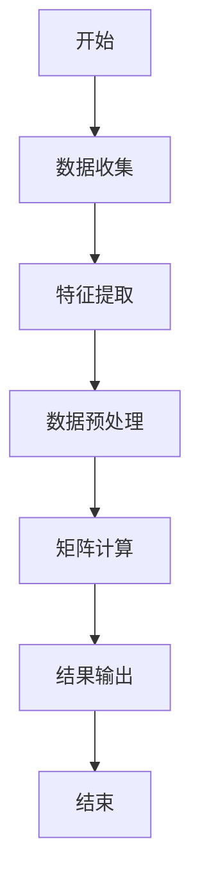
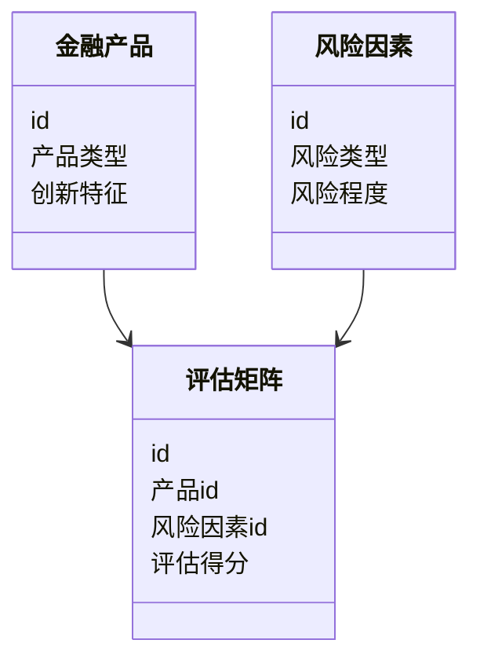
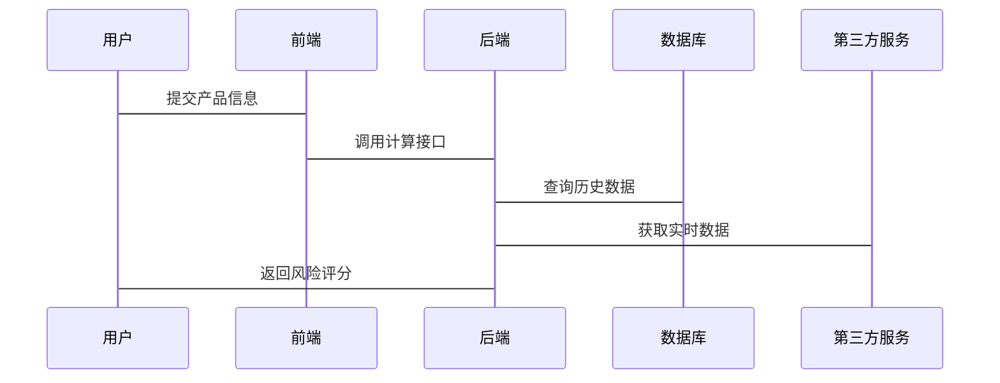

                 


# 《金融产品创新风险评估矩阵设计》

---

## 关键词：金融创新、风险评估、矩阵设计、算法原理、系统架构

---

## 摘要：本文系统地探讨了金融产品创新风险评估矩阵的设计方法，从背景、核心概念、算法原理、数学模型、系统架构到项目实战，全面解析了如何构建有效的风险评估矩阵。文章通过详细的流程图、表格和代码示例，结合实际案例，展示了如何在金融创新中平衡风险与收益，为金融从业者和科技开发者提供了实用的理论指导和实践参考。

---

# 第一部分：金融产品创新风险评估矩阵的背景与核心概念

## 第1章：金融产品创新与风险评估概述

### 1.1 金融产品创新的背景与意义

#### 1.1.1 金融创新的定义与特征

金融创新是指在金融市场上引入新的金融工具、产品、服务或交易机制，以满足市场参与者的需求或提高市场效率的过程。其主要特征包括：

1. **创新性**：与现有产品或服务有显著区别。
2. **风险性**：创新过程中可能带来新的风险。
3. **收益性**：通过创新实现更高的收益或效率。
4. **复杂性**：涉及多学科知识，如金融学、经济学、技术学等。

#### 1.1.2 金融创新对金融市场的推动作用

金融创新是金融市场发展的主要驱动力。通过引入新产品、新服务和新机制，金融市场能够更好地满足多样化的投资需求，优化资源配置，降低交易成本，并提高市场流动性。

#### 1.1.3 金融创新的风险与挑战

尽管金融创新带来了诸多好处，但其内在的风险不容忽视：

1. **市场风险**：创新产品可能引发市场价格波动。
2. **信用风险**：创新型金融工具可能增加债务风险。
3. **操作风险**：创新过程中的技术或人为失误可能引发风险。
4. **监管风险**：创新可能引发监管框架的不适应性。

### 1.2 风险评估在金融创新中的重要性

#### 1.2.1 风险评估的基本概念

风险评估是通过分析潜在风险因素及其影响程度，对金融产品或服务的稳定性进行评估的过程。

#### 1.2.2 金融创新中的主要风险类型

1. **市场风险**：由于市场价格波动导致的损失。
2. **信用风险**：由于债务人违约导致的损失。
3. **流动性风险**：由于无法迅速变现资产导致的损失。
4. **操作风险**：由于内部操作失误或外部事件导致的损失。
5. **法律风险**：由于法律变更或诉讼导致的损失。

#### 1.2.3 风险评估在金融决策中的作用

风险评估是金融创新决策的核心依据，能够帮助金融机构在创新过程中合理控制风险，确保创新活动的可持续性。

### 1.3 本章小结

本章从金融创新的背景、意义及风险挑战入手，强调了风险评估在金融创新中的重要性，为后续矩阵设计奠定了基础。

---

## 第2章：金融产品创新风险评估矩阵的核心概念

### 2.1 金融产品的基本属性

#### 2.1.1 产品类型与创新维度

金融产品可以分为以下几类：

1. **债务工具**：如债券、贷款等。
2. **股权工具**：如股票、股权众筹等。
3. **衍生品**：如期货、期权等。
4. **基金产品**：如共同基金、对冲基金等。

创新维度包括产品结构创新、交易机制创新和风险管理创新。

#### 2.1.2 产品生命周期与创新阶段

金融产品的生命周期分为引入期、成长期、成熟期和衰退期。创新阶段通常发生在引入期和成长期。

#### 2.1.3 创新与风险的内在联系

创新通常伴随着较高的风险，但成功的创新能够降低风险或带来新的风险管理工具。

### 2.2 风险评估矩阵的定义与构成

#### 2.2.1 矩阵的基本定义

风险评估矩阵是一种用于量化金融产品创新风险的工具，通过多维度评估和综合分析，提供风险评分和管理建议。

#### 2.2.2 矩阵的维度与指标

矩阵的主要维度包括：

1. **产品类型**：如债务工具、股权工具等。
2. **创新维度**：如结构创新、交易机制创新等。
3. **风险类型**：如市场风险、信用风险等。
4. **时间维度**：如产品生命周期的不同阶段。

指标包括风险评分、风险暴露程度、风险缓解措施等。

#### 2.2.3 矩阵的构建逻辑

构建逻辑包括数据收集、特征提取、风险量化和矩阵计算等步骤。

### 2.3 核心概念的ER实体关系图

```mermaid
er
    entity(金融产品) {
        id
        产品类型
        产品名称
        创新特征
    }
    entity(风险因素) {
        id
        风险类型
        风险程度
        影响范围
    }
    entity(评估矩阵) {
        id
        产品id
        风险因素id
        评估得分
        评估时间
    }
    relationship(属于, 金融产品, 评估矩阵)
    relationship(影响, 风险因素, 评估矩阵)
```

### 2.4 本章小结

本章详细介绍了金融产品创新风险评估矩阵的核心概念及其构成，为后续的矩阵设计奠定了理论基础。

---

# 第二部分：金融产品创新风险评估矩阵的算法原理与数学模型

## 第3章：风险评估矩阵的算法原理

### 3.1 数据收集与特征提取

#### 3.1.1 数据来源与处理

数据来源包括市场数据、历史交易数据、新闻数据等。数据处理包括清洗、转换和标准化。

#### 3.1.2 创新特征的提取方法

特征提取方法包括文本挖掘、统计分析和机器学习等。

#### 3.1.3 风险因素的量化指标

量化指标包括波动率、VaR（在险价值）和信用评级等。

### 3.2 矩阵构建的算法流程

#### 3.2.1 算法概述

矩阵构建算法包括数据预处理、特征提取、风险量化和矩阵计算。

#### 3.2.2 数据预处理步骤

1. 数据清洗：去除无效数据。
2. 数据转换：标准化或归一化处理。
3. 数据增强：增加额外特征。

#### 3.2.3 矩阵计算逻辑

通过多维度评估和加权计算，得到风险评分。

### 3.3 算法流程图



### 3.4 算法实现的Python代码示例

```python
import pandas as pd
import numpy as np

def preprocess_data(data):
    # 数据清洗
    data = data.dropna()
    # 数据标准化
    data = (data - data.mean()) / data.std()
    return data

def calculate_risk_score(data, weights):
    return np.dot(data, weights)

# 示例数据
data = pd.DataFrame({
    '特征1': [1, 2, 3],
    '特征2': [4, 5, 6]
})

weights = [0.5, 0.5]
processed_data = preprocess_data(data)
risk_scores = calculate_risk_score(processed_data, weights)
print(risk_scores)
```

### 3.5 本章小结

本章详细讲解了风险评估矩阵的算法原理，包括数据处理、特征提取和矩阵计算等步骤，并通过代码示例展示了实现过程。

---

## 第4章：数学模型与公式推导

### 4.1 风险评估的数学模型

#### 4.1.1 风险评分公式

$$ \text{风险评分} = \sum_{i=1}^{n} w_i \times f_i $$

其中，$w_i$ 是第$i$个风险因素的权重，$f_i$ 是第$i$个风险因素的评分。

#### 4.1.2 矩阵计算的数学表达

$$ M = W \times F $$

其中，$M$ 是风险评估矩阵，$W$ 是权重矩阵，$F$ 是风险因素矩阵。

### 4.2 案例分析

假设某金融产品的风险因素包括市场风险（权重0.4）和信用风险（权重0.6），评分分别为80分和70分。

$$ \text{风险评分} = 0.4 \times 80 + 0.6 \times 70 = 32 + 42 = 74 $$

---

# 第三部分：系统架构与实现方案

## 第5章：系统架构设计

### 5.1 系统功能设计

#### 5.1.1 领域模型类图



#### 5.1.2 系统架构图


### 5.2 接口设计

系统接口包括数据接口、计算接口和结果展示接口。

### 5.3 交互流程图



---

## 第6章：项目实战与案例分析

### 6.1 环境安装与配置

安装Python、Pandas、NumPy等依赖库。

### 6.2 核心代码实现

```python
import pandas as pd
import numpy as np

def build_assessment_matrix(products, risks):
    # 数据预处理
    processed_products = preprocess(products)
    processed_risks = preprocess(risks)
    # 矩阵计算
    matrix = np.dot(processed_products, processed_risks.T)
    return matrix

# 示例数据
products = pd.DataFrame({
    '产品类型': ['债券', '股票', '衍生品'],
    '创新特征': [0.8, 0.6, 0.7]
})

risks = pd.DataFrame({
    '风险类型': ['市场风险', '信用风险'],
    '风险程度': [0.6, 0.4]
})

# 构建矩阵
matrix = build_assessment_matrix(products, risks)
print(matrix)
```

### 6.3 案例分析

以某创新型债券产品为例，分析其风险评估矩阵的构建过程，并解读结果。

### 6.4 本章小结

通过实际案例分析，验证了风险评估矩阵的有效性，并总结了项目实施的关键点。

---

## 第7章：最佳实践与注意事项

### 7.1 最佳实践

1. 数据质量：确保数据来源可靠，处理准确。
2. 模型选择：根据实际需求选择合适的评估模型。
3. 持续优化：定期更新模型和数据，适应市场变化。

### 7.2 小结

本章总结了实施风险评估矩阵的注意事项和最佳实践，为实际应用提供了指导。

---

## 第8章：拓展阅读与深入学习

### 8.1 拓展阅读

推荐相关书籍和论文，帮助读者深入学习风险评估和金融创新的理论与实践。

### 8.2 未来研究方向

探讨风险评估矩阵的进一步优化和应用扩展，如引入人工智能技术等。

---

## 作者：AI天才研究院/AI Genius Institute & 禅与计算机程序设计艺术 /Zen And The Art of Computer Programming

---

以上是文章的完整目录大纲和部分内容示例，具体内容可以根据实际需求进一步扩展和详细阐述。

