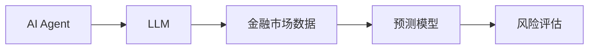
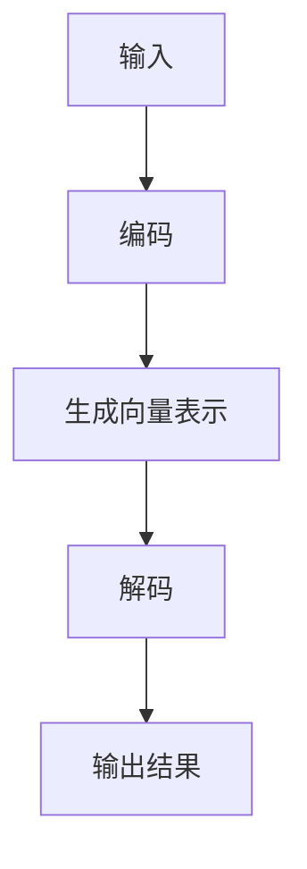
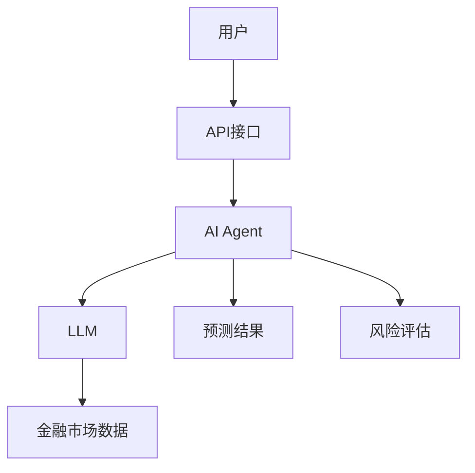

                 


# 金融分析 AI Agent：利用 LLM 进行市场预测与风险评估

## 关键词：
- 金融分析
- AI Agent
- LLM
- 市场预测
- 风险评估

## 摘要：
本文探讨了利用大语言模型（LLM）构建金融分析人工智能代理（AI Agent）的方法，详细分析了其在市场预测和风险评估中的应用。通过理论分析、算法设计和实战案例，展示了如何利用LLM技术提升金融分析的效率和准确性，为金融从业者提供新的工具和思路。

---

## 第一部分: 引言

### 第1章: 背景介绍

#### 1.1 问题背景
金融市场日益复杂，投资者和机构面临巨大的挑战。传统金融分析方法依赖人工经验，存在效率低、主观性强等问题。AI Agent通过自动化处理数据、识别模式和提供决策支持，为金融分析注入了新的活力。

#### 1.2 核心概念与联系
- **AI Agent**：能够感知环境、自主决策并执行任务的智能实体，具备学习、推理和自适应能力。
- **LLM**：基于深度学习的大语言模型，擅长处理自然语言数据，能够进行文本生成、理解和推理。

### 第2章: 核心概念与联系

#### 2.1 AI Agent与LLM的实体关系图


#### 2.2 LLM的算法流程图


---

## 第二部分: LLM的算法原理

### 第3章: 算法原理讲解

#### 3.1 LLM的训练过程
- **数据预处理**：清洗、格式化和标注金融数据。
- **模型训练**：使用大规模数据训练，采用Transformer架构。
- **调参与优化**：调整超参数，优化模型性能。

#### 3.2 概率计算公式
- **条件概率公式**
$$ P(y|x) = \frac{P(x,y)}{P(x)} $$
- **贝叶斯定理**
$$ P(y|x) = \frac{P(x|y)P(y)}{P(x)} $$

---

## 第三部分: 金融市场预测

### 第4章: 金融市场预测

#### 4.1 数据收集与特征提取
- 数据来源：股票价格、经济指标、新闻等。
- 特征提取：技术指标、市场情绪、宏观经济数据。

#### 4.2 LLM驱动的预测模型
- **模型训练**：使用历史数据训练LLM，生成预测结果。
- **结果分析**：通过回测验证模型的有效性。

---

## 第四部分: 风险评估

### 第5章: 风险评估模型

#### 5.1 风险因子分析
- 市场风险、信用风险、流动性风险。
- 使用因子模型量化风险。

#### 5.2 模型选择与实现
- **风险评分**：基于LLM生成风险评估报告。
- **压力测试**：模拟极端市场条件下的表现。

---

## 第五部分: 系统架构设计

### 第6章: 系统分析与架构设计

#### 6.1 问题场景介绍
- 用户需求：实时市场分析、风险预警。
- 系统目标：构建高效、准确的金融分析平台。

#### 6.2 系统架构设计


---

## 第六部分: 项目实战

### 第7章: 项目实战

#### 7.1 环境安装
- 安装Python、TensorFlow、Keras等工具。

#### 7.2 核心代码实现
```python
import tensorflow as tf
from tensorflow.keras import layers

# 定义模型
model = tf.keras.Sequential([
    layers.Embedding(input_dim=10000, output_dim=16),
    layers.LSTM(64),
    layers.Dense(1, activation='sigmoid')
])

# 编译模型
model.compile(optimizer='adam', loss='binary_crossentropy', metrics=['accuracy'])
```

#### 7.3 案例分析
- 使用实际数据训练模型，评估其准确性和稳定性。

---

## 第七部分: 案例分析与未来展望

### 第8章: 案例分析与未来展望

#### 8.1 案例分析
- 分析模型在实际中的表现，总结经验教训。

#### 8.2 未来展望
- 深度学习的进一步应用、多模态数据融合、实时分析能力提升。

---

## 第八部分: 最佳实践

### 第9章: 最佳实践 tips

#### 9.1 小结
- LLM在金融分析中的潜力巨大，但需要结合具体场景使用。

#### 9.2 注意事项
- 数据质量、模型调优、实时性等关键点需重点关注。

#### 9.3 拓展阅读
- 建议阅读相关技术论文和书籍，深入理解AI在金融中的应用。

---

## 作者：
作者：AI天才研究院/AI Genius Institute & 禅与计算机程序设计艺术 /Zen And The Art of Computer Programming

---

本文通过系统化的分析和实战案例，详细阐述了利用LLM构建AI Agent在金融分析中的应用，为读者提供了理论与实践相结合的指导。希望本文能为金融从业者和技术爱好者提供新的思路和启示。

