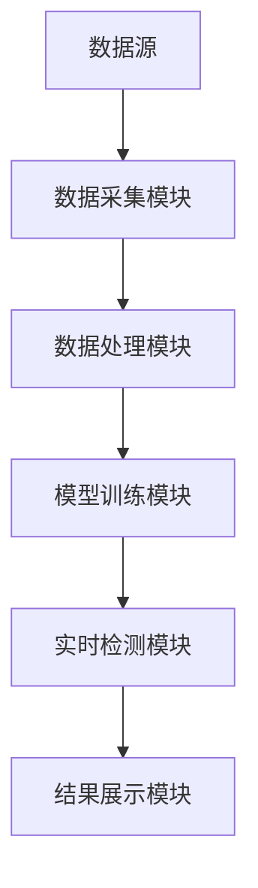
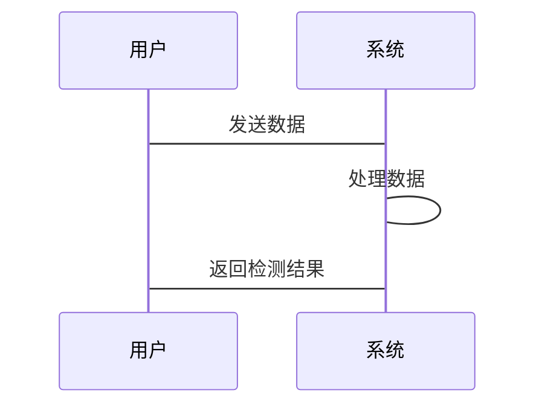

                 

<think>
好的，我现在需要帮助用户撰写一篇关于《金融大数据实时异常检测平台》的技术博客文章。用户希望文章结构清晰，内容详实，包含多个章节，每章都有详细的讲解，包括背景、核心概念、算法原理、系统架构、项目实战等部分。

首先，我得先理清文章的整体结构。用户已经给出了一个详细的目录大纲，包括背景介绍、核心概念、算法原理、系统架构、项目实战、高级主题和总结展望。我需要确保每个章节都涵盖必要的内容，并且每个部分都有足够的细节。

接下来，我需要考虑每一章的具体内容。例如，在背景与问题背景部分，我需要介绍金融大数据的定义、特点，以及实时异常检测的重要性。这部分需要让读者明白为什么实时检测异常是必要的，以及它在金融风险管理中的作用。

在核心概念与技术原理部分，我需要详细讲解异常检测的基本概念，比如监督学习和无监督学习的区别，以及它们在金融中的应用。同时，还需要介绍一些具体的算法，如LOF和Isolation Forest，并给出它们的数学公式和实现代码。

系统架构设计部分，我需要使用Mermaid图来展示系统的各个组件和它们之间的关系。这部分需要清晰的架构图，帮助读者理解系统的整体结构和各个部分的功能。

项目实战部分，我需要从环境安装开始，逐步指导读者如何搭建系统，编写核心代码，并进行案例分析。这部分需要详细说明每一步的操作，确保读者能够跟随步骤完成项目。

高级主题部分，可以探讨模型优化和在线学习等高级技术，帮助读者进一步提升系统的性能和适应性。

最后，总结与展望部分，需要回顾文章的主要内容，并展望未来的发展方向，让读者对整个主题有一个全面的理解。

在写作过程中，我需要确保使用专业的技术语言，同时保持逻辑清晰，结构紧凑。每章开头要有吸引人的标题，内容要详细具体，包括数学公式、代码示例和图表，以增强文章的可读性和实用性。

此外，我还需要注意文章的字数，控制在10000到12000字之间，确保每个部分都有足够的篇幅进行详细阐述。同时，结尾部分要署上作者信息，符合用户的要求。

现在，我需要按照上述思考，逐步撰写每一章的内容，确保每章都符合用户的要求，内容丰富，结构合理，逻辑清晰。
</think>

# 《金融大数据实时异常检测平台》

## 关键词：
金融大数据，实时异常检测，机器学习，深度学习，大数据处理，金融风险管理

## 摘要：
金融大数据实时异常检测平台是金融行业中的关键工具，用于识别金融市场中的异常交易行为和潜在风险。本文从背景、核心概念、算法原理、系统架构、项目实战等多方面详细阐述了实时异常检测平台的构建过程，并结合实际案例分析，深入探讨了其在金融风险管理中的应用。文章还介绍了系统架构设计、算法实现及优化策略，帮助读者全面理解金融大数据实时异常检测的核心技术和实践应用。

---

## 第一部分: 金融大数据实时异常检测平台概述

### 第1章: 背景与问题背景

#### 1.1 金融大数据概述
- **1.1.1 金融大数据的定义与特点**
  金融大数据指的是金融行业中的海量、多样化、实时性强的数据集合。这些数据包括股票交易数据、债券信息、市场新闻、用户行为数据等。其特点包括高维性、异构性、实时性和关联性。

- **1.1.2 金融大数据的典型应用场景**
  金融大数据的应用场景广泛，包括实时交易监控、风险评估、客户画像构建、市场预测等。特别是在高频交易和量化投资中，实时数据处理和分析能力至关重要。

- **1.1.3 金融大数据与传统金融数据的区别**
  传统金融数据通常是指结构化数据，如股票价格、财务报表等。而金融大数据则包括非结构化数据（如文本、图像）和半结构化数据（如JSON、XML），数据量更大，处理复杂度更高。

#### 1.2 实时异常检测的必要性
- **1.2.1 金融交易中的异常行为**
  异常交易行为包括操纵市场、 insider trading、洗售交易等，这些行为可能导致市场波动和投资者损失。

- **1.2.2 异常检测在金融风险管理中的作用**
  异常检测可以帮助识别潜在的金融风险，如市场崩盘、机构破产等。通过实时监控和预警，可以提前采取措施，减少损失。

- **1.2.3 实时检测的优势与挑战**
  实时检测的优势在于能够快速响应，避免事后的巨大损失。然而，实时处理需要高性能计算和低延迟的系统架构，这对技术实现提出了高要求。

#### 1.3 问题描述与解决思路
- **1.3.1 问题背景分析**
  随着金融市场的全球化和复杂化，异常交易行为变得越来越隐蔽和复杂，传统的统计方法难以有效识别。

- **1.3.2 异常检测的核心问题**
  异常检测的核心问题在于如何在噪声数据中识别出异常点。由于金融数据的高维性和复杂性，传统的单变量分析方法往往效果不佳。

- **1.3.3 实时检测的技术挑战**
  实时检测需要处理高速数据流，要求算法具有低计算复杂度和高可扩展性。同时，金融市场的动态变化使得模型需要具备在线更新能力。

---

## 第2章: 金融大数据实时异常检测的核心概念

#### 2.1 异常检测的基本概念
- **2.1.1 异常检测的定义**
  异常检测是指通过分析数据，识别出与正常数据模式不符的异常点或行为。

- **2.1.2 异常检测的分类**
  异常检测可以分为基于统计的方法（如Z-score、LOF）、基于机器学习的方法（如聚类、SVM）和基于深度学习的方法（如Autoencoder、GAN）。

- **2.1.3 异常检测的评价指标**
  常见的评价指标包括精确率、召回率、F1分数、ROC-AUC等。由于异常样本通常较少，AUC-ROC曲线是一个常用的评价指标。

#### 2.2 金融大数据的特征分析
- **2.2.1 数据的高维性**
  金融数据通常包含大量特征，如时间戳、价格、成交量、用户行为等，导致数据维度高，增加了建模的复杂性。

- **2.2.2 数据的实时性**
  实时数据处理要求系统能够在数据生成的同时进行分析，这对系统的计算能力和响应速度提出了高要求。

- **2.2.3 数据的噪声与稀疏性**
  金融数据中常常存在噪声和稀疏性，这使得异常检测更加困难。例如，市场波动可能掩盖异常交易行为。

#### 2.3 异常检测与金融业务的结合
- **2.3.1 异常交易的识别**
  通过分析交易行为的特征，如交易频率、金额、地理位置等，识别异常交易行为。

- **2.3.2 风险预警的应用**
  异常检测可以用于识别潜在的市场风险，如杠杆率过高、资产价格异常波动等。

- **2.3.3 数据驱动的决策支持**
  通过异常检测，金融机构可以更快速地做出决策，优化投资策略，规避风险。

---

## 第3章: 金融大数据实时异常检测的核心要素

#### 3.1 数据采集与预处理
- **3.1.1 数据源的多样性**
  数据来源包括股票交易数据、债券信息、新闻数据、社交媒体数据等，需要进行多源数据的采集和融合。

- **3.1.2 数据清洗与标准化**
  数据清洗包括去除噪声、填补缺失值等。标准化是为了不同特征之间具有可比性，常用方法包括归一化和标准化。

- **3.1.3 数据流的实时处理**
  对于实时数据流，需要采用流处理技术，如Apache Kafka、Apache Flink等，进行实时数据处理和分析。

#### 3.2 异常检测算法的选择与优化
- **3.2.1 常见的异常检测算法**
  常用算法包括基于统计的LOF（局部 outlier factor）、基于聚类的DBSCAN、基于深度学习的Autoencoder等。

- **3.2.2 算法性能评估**
  除了传统的评价指标外，还需要考虑算法的计算效率和可扩展性。例如，LOF算法适用于低维数据，而Autoencoder适合高维数据。

- **3.2.3 算法的可解释性**
  在金融领域，模型的可解释性非常重要。例如，基于规则的异常检测方法比基于机器学习的方法更容易解释。

#### 3.3 系统架构与性能优化
- **3.3.1 系统架构设计**
  系统架构通常包括数据采集层、数据处理层、模型训练层、结果展示层等。

- **3.3.2 高可用性与扩展性**
  为了应对高并发和大数据量，系统需要设计为高可用和可扩展的。例如，采用分布式架构，使用容器化技术如Docker和Kubernetes进行部署。

- **3.3.3 性能优化策略**
  通过缓存技术、并行计算、优化算法复杂度等方法，提升系统的处理能力。

---

## 第4章: 金融大数据实时异常检测的数学模型与算法原理

#### 4.1 异常检测的数学模型
- **4.1.1 基于统计学的异常检测模型**
  例如，使用Z-score方法检测异常值。公式为：
  $$ Z = \frac{X - \mu}{\sigma} $$
  其中，$\mu$是均值，$\sigma$是标准差。

- **4.1.2 基于机器学习的异常检测模型**
  例如，使用Isolation Forest算法，通过构建随机树将数据点隔离出来。其核心思想是通过随机选择特征和划分数据，使得异常点更容易被隔离。

- **4.1.3 基于深度学习的异常检测模型**
  例如，使用Autoencoder进行异常检测。模型通过无监督学习方式学习数据的正常特征，异常点通常表现为重构误差较大。模型结构如下：

  ```python
  import keras
  from keras.layers import Input, Dense
  from keras.models import Model

  input_dim = 10  # 输入维度
  encoding_dim = 3  # 编码维度

  input_layer = Input(shape=(input_dim,))
  encoder_layer = Dense(encoding_dim, activation='relu')(input_layer)
  decoder_layer = Dense(input_dim, activation='sigmoid')(encoder_layer)
  autoencoder = Model(inputs=input_layer, outputs=decoder_layer)
  autoencoder.compile(optimizer='adam', loss='binary_crossentropy')
  ```

#### 4.2 监督学习与无监督学习的对比
- **4.2.1 监督学习的优缺点**
  监督学习需要标记好的数据，适用于已知异常类别的情况。优点是模型准确率高，缺点是需要大量标注数据。

- **4.2.2 无监督学习的优缺点**
  无监督学习适用于未知异常类型的情况，能够发现新的异常模式。缺点是模型的可解释性较差。

---

## 第5章: 金融大数据实时异常检测的系统架构设计

#### 5.1 系统功能设计
- **5.1.1 数据采集模块**
  负责从多种数据源采集实时数据，如股票交易数据、社交媒体数据等。

- **5.1.2 数据处理模块**
  对数据进行清洗、转换和标准化处理，确保数据质量。

- **5.1.3 模型训练模块**
  使用训练数据训练异常检测模型，如基于深度学习的Autoencoder。

- **5.1.4 实时检测模块**
  对实时数据流进行异常检测，输出检测结果。

- **5.1.5 结果展示模块**
  将检测结果可视化，便于用户观察和分析。

#### 5.2 系统架构图（使用Mermaid）


#### 5.3 系统接口设计
- **API接口**
  提供RESTful API接口，供其他系统调用检测结果。例如：
  ```
  POST /api/detect
  Body:
  {
    "data": [1, 2, 3, ...]
  }
  ```

- **数据格式**
  数据格式采用JSON格式，便于不同系统之间的数据交互。

#### 5.4 系统交互序列图（使用Mermaid）


---

## 第6章: 金融大数据实时异常检测的项目实战

#### 6.1 环境安装
- 安装Python环境
- 安装依赖库：numpy、pandas、keras、tensorflow、flask

#### 6.2 核心代码实现
```python
import numpy as np
from keras.models import Model
from keras.layers import Input, Dense

def build_autoencoder(input_dim):
    input_layer = Input(shape=(input_dim,))
    encoder_layer = Dense(3, activation='relu')(input_layer)
    decoder_layer = Dense(input_dim, activation='sigmoid')(encoder_layer)
    autoencoder = Model(inputs=input_layer, outputs=decoder_layer)
    autoencoder.compile(optimizer='adam', loss='binary_crossentropy')
    return autoencoder

def train_model(autoencoder, X_train, epochs=100):
    autoencoder.fit(X_train, X_train, epochs=epochs, batch_size=32)

def detect_anomalies(autoencoder, X_test, threshold=0.1):
    reconstructed = autoencoder.predict(X_test)
    reconstruction_error = np.mean(np.square(X_test - reconstructed), axis=1)
    anomalies = np.where(reconstruction_error > threshold)[0]
    return anomalies
```

#### 6.3 案例分析
- 数据集选择：使用股票交易数据，包含开盘价、收盘价、最高价、最低价、成交量等特征。
- 模型训练：使用历史交易数据训练Autoencoder模型。
- 实时检测：对实时交易数据进行异常检测，输出异常交易行为。

#### 6.4 项目小结
- 通过项目实战，验证了模型的有效性和系统的可行性。
- 在实际应用中，需要根据具体场景调整模型参数和优化算法。

---

## 第7章: 高级主题与未来展望

#### 7.1 模型优化与调优
- 使用超参数优化方法（如网格搜索、随机搜索）提升模型性能。
- 结合多种算法（如集成学习）提高检测准确率。

#### 7.2 在线学习与自适应模型
- 在线学习允许模型在实时数据流中不断更新，适应市场变化。
- 使用增量学习方法，提升模型的适应性。

#### 7.3 未来技术发展
- 结合区块链技术，提升数据的安全性和可信度。
- 利用联邦学习，实现跨机构的数据合作与隐私保护。

---

## 第8章: 总结与展望

#### 8.1 总结
本文详细介绍了金融大数据实时异常检测平台的构建过程，从背景、核心概念、算法原理到系统架构和项目实战，全面阐述了其技术实现和应用价值。

#### 8.2 未来展望
随着人工智能和大数据技术的不断发展，金融大数据实时异常检测将更加智能化和自动化。未来的研究方向包括模型的可解释性、多模态数据融合、实时性优化等。

---

## 作者：AI天才研究院 & 禅与计算机程序设计艺术

