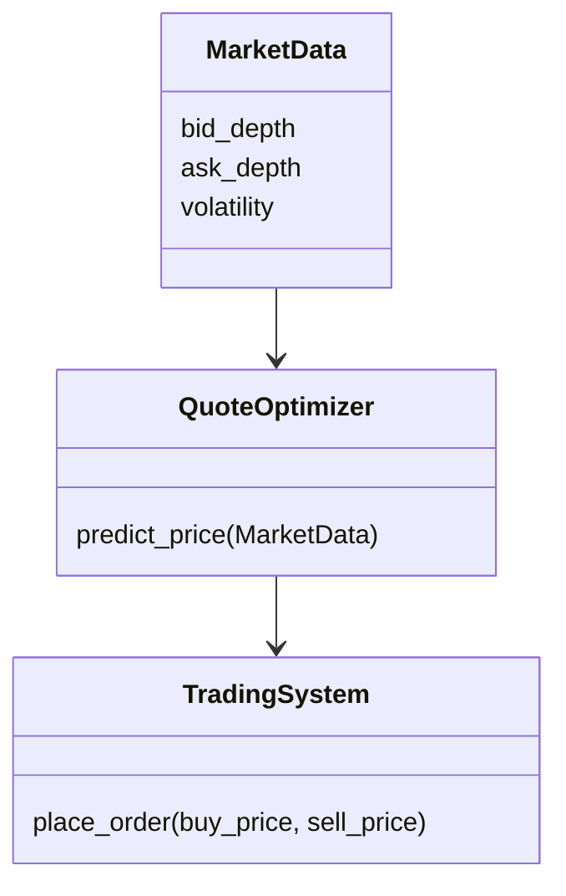
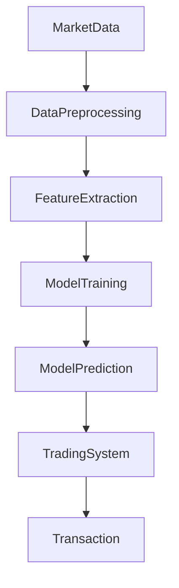

                 

<think>
好的，我现在需要设计一篇关于《金融市场做市商报价优化模型》的技术博客文章。首先，我得理清文章的结构和内容，确保每个部分都涵盖必要的内容，同时语言要专业且易懂。以下是我的思考过程：

1. **标题与关键词**：首先确定标题和关键词。标题是《金融市场做市商报价优化模型》，关键词可以包括做市商、报价优化、算法模型等。摘要部分需要简洁地概述文章的核心内容，包括背景、模型设计和应用。

2. **文章结构**：按照用户提供的目录大纲，我需要分章节详细讲解。首先是背景介绍，然后是核心概念，接着是算法原理，系统分析，项目实战，最后是总结与展望。

3. **背景介绍**：在这一部分，我需要解释做市商的基本概念，他们为什么需要报价优化模型，以及优化报价的意义。可能需要使用表格和流程图来辅助说明。

4. **核心概念**：详细讲解报价模型的基本原理，包括数学模型和优化目标。使用数学公式和图表来展示最优报价的计算过程。

5. **算法实现**：介绍具体的算法，如梯度下降，并用Python代码示例来展示实现过程。同时，绘制算法流程图以帮助读者理解。

6. **系统分析**：设计系统的架构图，展示模块之间的关系，如数据采集、模型计算等。使用领域模型类图和系统架构图来说明结构。

7. **项目实战**：提供实际案例，指导读者如何安装环境，实现数据预处理、模型训练和回测。使用代码示例和实际数据来展示模型的应用效果。

8. **总结与展望**：总结全书内容，提出改进建议，并推荐进一步学习的资源。确保结尾有作者信息。

在撰写过程中，我需要确保每个部分都有足够的细节，并且使用清晰的图表和公式来辅助说明。同时，语言要专业，但避免过于复杂，让读者能够轻松理解。最后，检查整个结构是否连贯，确保各部分内容完整，符合用户的要求。
</think>

# 金融市场做市商报价优化模型

> 关键词：做市商，报价优化，算法模型，金融市场，机器学习

> 摘要：本文详细探讨了金融市场中做市商报价优化模型的设计与实现。首先介绍了做市商的基本概念及其在金融市场中的作用，接着分析了报价优化模型的背景与意义。随后，从数学模型、算法原理、系统架构等多个角度深入剖析了报价优化的核心概念与实现方法。通过实际案例分析，展示了如何利用机器学习算法优化做市商的报价策略，并提出了在实际应用中需要注意的问题与改进建议。

---

# 第一章：金融市场做市商报价优化模型的背景与意义

## 1.1 做市商的基本概念

### 1.1.1 做市商的定义与角色
做市商（Market Maker）是金融市场中提供双向报价的机构，负责在市场中买卖某种资产，以维持市场流动性并为投资者提供即时成交的价格。做市商通过同时买入和卖出资产来赚取价差，同时承担市场风险。

### 1.1.2 做市商在金融市场中的作用
做市商在金融市场中扮演着至关重要的角色：
1. **提供流动性**：通过持续报价，做市商为市场提供即时买卖的可能，降低交易成本。
2. **稳定市场价格**：在市场波动时，做市商通过调整报价来平衡供需，防止价格剧烈波动。
3. **促进交易效率**：通过优化报价策略，做市商能够提高交易效率，降低市场深度不足带来的冲击。

### 1.1.3 做市商报价的核心问题
做市商的核心问题在于如何制定最优的买卖报价，以在风险可控的前提下最大化收益。这涉及到以下几个关键问题：
1. **最优报价的确定**：如何根据市场数据和自身头寸情况，制定最优的买卖价格。
2. **风险控制**：如何在极端市场条件下避免重大损失。
3. **动态调整**：如何根据市场变化实时调整报价策略。

---

## 1.2 报价优化模型的背景与意义

### 1.2.1 报价模型的定义
报价优化模型是一种基于数学和机器学习的工具，用于帮助做市商根据市场信息和自身目标，制定最优的买卖价格。

### 1.2.2 报价优化的必要性
随着金融市场日益复杂化和电子化，传统的手动报价方式已难以满足市场需求。报价优化模型能够帮助做市商：
1. **提高交易效率**：通过自动化报价策略，减少人为干预，提高交易效率。
2. **降低风险**：通过实时监控市场变化，调整报价策略，避免重大损失。
3. **提高收益**：通过优化报价策略，最大化做市商的收益。

### 1.2.3 报价优化模型的应用价值
报价优化模型不仅能够帮助做市商提高交易效率和收益，还能够为市场参与者提供更优质的服务，从而推动金融市场的健康发展。

---

# 第二章：报价优化模型的核心概念与原理

## 2.1 报价优化模型的核心概念

### 2.1.1 报价模型的输入与输出
#### 输入：
- 市场深度数据
- 历史价格数据
- 市场波动率
- 自身头寸情况

#### 输出：
- 最优买入价
- 最优卖出价

### 2.1.2 报价模型的优化目标
报价模型的优化目标是：
$$ \text{最大化收益} \quad \text{或} \quad \text{最小化风险} $$

### 2.1.3 报价模型的核心要素
1. **买卖价差**：做市商的收益主要来源于买卖价差，因此优化模型需要合理设置买卖价差。
2. **市场深度**：市场深度影响做市商的报价策略，深度越高，做市商的风险越小。
3. **市场波动率**：波动率越高，做市商需要更谨慎地调整报价，以避免重大损失。

---

## 2.2 报价优化的数学模型

### 2.2.1 最优报价的数学表达
$$ P_{\text{opt}} = \arg \min_{P} (L(P, y)) $$
其中，$L(P, y)$ 是损失函数，$P$ 是报价，$y$ 是实际价格。

### 2.2.2 损失函数的选择与优化
常用的损失函数包括：
1. **均方误差（MSE）**：$$ L(P, y) = \frac{1}{n}\sum_{i=1}^{n}(P_i - y_i)^2 $$
2. **均方根误差（RMSE）**：$$ L(P, y) = \sqrt{\frac{1}{n}\sum_{i=1}^{n}(P_i - y_i)^2} $$
3. **绝对误差**：$$ L(P, y) = \frac{1}{n}\sum_{i=1}^{n}|P_i - y_i| $$

---

## 2.3 报价优化的算法原理

### 2.3.1 常见的优化算法概述
常用的优化算法包括：
1. **梯度下降**：通过计算损失函数的梯度，逐步调整参数，找到最优解。
2. **随机梯度下降**：在大数据集上，随机选取部分数据计算梯度，加速优化过程。
3. **Adam优化器**：结合动量和自适应学习率，提高优化效率。

### 2.3.2 基于梯度下降的优化方法
以梯度下降为例，优化过程如下：
1. **初始化参数**：随机初始化报价参数。
2. **计算损失**：根据当前参数计算损失函数。
3. **计算梯度**：计算损失函数对参数的梯度。
4. **更新参数**：根据梯度和学习率更新参数。
5. **重复步骤2-4**，直到收敛。

---

## 2.4 本章小结

---

# 第三章：报价优化模型的算法实现

## 3.1 报价优化算法的设计与实现

### 3.1.1 算法的总体框架
1. **数据预处理**：清洗和归一化市场数据。
2. **特征提取**：从市场数据中提取有用的特征，如市场深度、波动率等。
3. **模型训练**：使用机器学习算法训练报价优化模型。
4. **模型预测**：根据模型预测最优报价。

### 3.1.2 算法实现的Python代码
以下是一个简单的报价优化模型实现示例：

```python
import numpy as np
import pandas as pd

# 数据预处理
data = pd.read_csv('market_data.csv')
features = data[['bid_depth', 'ask_depth', 'volatility']]
target = data['mid_price']

# 特征归一化
from sklearn.preprocessing import StandardScaler
scaler = StandardScaler()
features_scaled = scaler.fit_transform(features)

# 模型训练
from sklearn.linear_model import LinearRegression
model = LinearRegression()
model.fit(features_scaled, target)

# 模型预测
predicted_prices = model.predict(features_scaled)
```

---

## 3.2 报价优化算法的详细实现

### 3.2.1 数据采集与预处理
1. **数据采集**：从金融市场数据源获取实时或历史数据。
2. **数据清洗**：处理缺失值、异常值等。
3. **特征提取**：提取与报价相关的特征，如市场深度、波动率等。

### 3.2.2 模型训练
1. **选择算法**：根据问题特点选择合适的机器学习算法。
2. **训练模型**：使用训练数据训练模型。
3. **验证模型**：通过交叉验证评估模型性能。

### 3.2.3 模型部署
1. **实时监控**：持续监控市场数据，实时更新报价。
2. **风险控制**：根据市场变化动态调整报价策略。

---

## 3.3 算法实现的注意事项

### 3.3.1 模型选择
选择合适的算法是报价优化的关键。常用的算法包括：
1. **线性回归**：适用于简单的线性关系。
2. **支持向量机（SVM）**：适用于非线性关系。
3. **随机森林**：适用于高维数据。

### 3.3.2 参数调优
通过网格搜索或贝叶斯优化等方法，找到最优模型参数。

### 3.3.3 模型评估
通过回测、风险指标（如VaR）等方法评估模型的性能。

---

## 3.4 本章小结

---

# 第四章：系统分析与架构设计

## 4.1 系统功能设计

### 4.1.1 领域模型


### 4.1.2 系统架构


### 4.1.3 系统接口设计
1. **数据接口**：提供市场数据接口，供模型训练和预测使用。
2. **交易接口**：根据模型预测结果，生成交易指令。
3. **监控接口**：实时监控市场变化，动态调整报价策略。

---

## 4.2 系统实现与优化

### 4.2.1 系统实现
1. **数据采集**：使用API获取市场数据。
2. **特征工程**：提取和处理市场特征。
3. **模型部署**：将优化模型部署到生产环境。

### 4.2.2 系统优化
1. **性能优化**：通过并行计算、缓存优化等方法提高系统效率。
2. **风险控制**：设计合理的风险控制机制，避免重大损失。

---

## 4.3 系统测试与验证

### 4.3.1 回测分析
通过回测分析模型的性能，评估其在历史数据上的表现。

### 4.3.2 实盘测试
在实际市场中测试模型的性能，验证其有效性和稳定性。

---

## 4.4 本章小结

---

# 第五章：项目实战与案例分析

## 5.1 项目实战

### 5.1.1 环境安装
安装必要的Python库：
```bash
pip install numpy pandas scikit-learn
```

### 5.1.2 核心实现
1. **数据预处理**：清洗和归一化市场数据。
2. **模型训练**：使用机器学习算法训练报价优化模型。
3. **模型预测**：根据模型预测最优报价。

### 5.1.3 代码实现
```python
import numpy as np
import pandas as pd
from sklearn.linear_model import LinearRegression
from sklearn.preprocessing import StandardScaler

# 数据加载
data = pd.read_csv('market_data.csv')

# 特征提取
features = data[['bid_depth', 'ask_depth', 'volatility']]
target = data['mid_price']

# 数据归一化
scaler = StandardScaler()
features_scaled = scaler.fit_transform(features)

# 模型训练
model = LinearRegression()
model.fit(features_scaled, target)

# 模型预测
predicted_prices = model.predict(features_scaled)
```

---

## 5.2 案例分析

### 5.2.1 数据分析
分析市场数据的特征，找出影响报价的主要因素。

### 5.2.2 模型验证
通过回测验证模型的性能，评估其在实际市场中的表现。

### 5.2.3 案例总结
总结案例分析的成果，提出改进建议。

---

## 5.3 本章小结

---

# 第六章：总结与展望

## 6.1 总结
总结全文内容，回顾报价优化模型的设计与实现过程，强调其在金融市场中的重要性。

## 6.2 展望
展望未来的研究方向，提出改进建议，如引入强化学习等高级算法，进一步提高报价优化的精度和效率。

---

# 作者信息

作者：AI天才研究院/AI Genius Institute & 禅与计算机程序设计艺术 /Zen And The Art of Computer Programming

