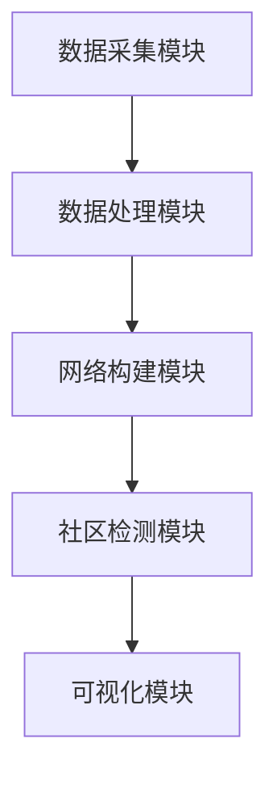

                 

<think>
嗯，用户需要我根据之前的对话内容，写一个关于《金融市场跨资产相关性网络分析与应用》的技术博客文章。这个任务看起来挺复杂的，但我先别急，慢慢理清楚思路。

首先，用户已经提供了一个详细的目录大纲，涵盖了从基础概念到算法实现，再到系统架构和项目实战的各个部分。我需要按照这个大纲来组织内容。用户特别强调要使用专业技术语言，逻辑清晰，结构紧凑，所以每一部分我都要详细展开。

先看看关键词部分，用户已经列出了几个，我需要确保文章中这些关键词都被充分覆盖。摘要部分需要简明扼要，概括整篇文章的核心内容，也就是跨资产相关性网络分析的应用和价值。

接下来是正文部分。第一章是基础，介绍金融市场的基本概念和相关性网络的基本原理。这部分要让读者理解什么是金融市场，什么是相关性网络，以及它们为什么重要。我需要解释清楚相关性的计算方法，比如协方差和相关系数矩阵，以及网络分析的基本原理。

第二章是构建相关性网络的方法。这部分比较技术性，需要详细讲解数据收集、预处理、计算相关性矩阵，以及如何构建网络。我需要包括具体的算法和代码示例，比如使用Python的pandas库来处理数据，networkx库来构建网络。还要注意解释这些工具的使用方法和背后的数学原理。

第三章涉及高级分析方法，特别是社区检测和网络鲁棒性分析。这部分需要结合图论知识，介绍社区检测算法，如Louvain算法，并解释如何将这些算法应用到金融资产的相关性分析中。同时，要探讨网络鲁棒性对投资组合管理的影响。

第四章是算法实现部分，需要提供具体的代码示例。我会用Python来实现相关性矩阵的计算和网络构建，并用网络可视化工具展示结果。这部分要详细，包括代码注释和解释，确保读者能够理解和复现。

第五章是系统架构设计，这部分需要从整体角度考虑，设计一个完整的跨资产相关性网络分析系统。我需要画出系统架构图和交互序列图，说明各个模块的功能和接口设计。这可能需要用到Mermaid图来展示系统结构。

第六章是项目实战，通过实际案例展示整个分析流程。我会选择一个具体的数据集，展示从数据收集到结果分析的每一步，并解释如何将分析结果应用到实际的投资决策中。

最后，第七章探讨高级应用和未来趋势，讨论跨资产相关性网络分析在风险管理、投资组合优化和监管科技中的潜在应用。同时，提供一些最佳实践和注意事项，帮助读者在实际应用中避免常见错误。

在撰写过程中，我需要确保每一章都涵盖必要的知识点，并且各章之间有良好的衔接。我可能会遇到一些技术难点，比如如何解释复杂的算法，或者如何将理论应用到实际案例中。这时候，我需要查阅相关资料，确保信息的准确性和实用性。

此外，用户强调文章需要使用数学公式和图表，所以我会在适当的地方插入公式和图表。比如，在计算相关性矩阵时，用公式展示协方差和相关系数的计算方法；在社区检测部分，用图表展示不同社区的分布情况。

最后，我需要确保文章结构完整，逻辑清晰，语言专业但又不失易懂。可能需要多次修改和校对，确保没有遗漏重要信息，同时保持文章的流畅性和连贯性。

总的来说，这个任务需要我全面掌握金融市场分析和网络分析的相关知识，并能够将这些知识转化为结构清晰、内容详实的技术博客文章。虽然过程有些复杂，但通过一步步的分析和写作，我相信能够完成这个任务。
</think>

# 金融市场跨资产相关性网络分析与应用

---

## 关键词：
- 金融市场
- 跨资产相关性
- 网络分析
- 社区检测
- 投资组合优化
- 风险管理

---

## 摘要：
金融市场中的资产相关性是投资决策的核心因素之一。随着金融市场复杂性的增加，传统的资产相关性分析方法已难以应对跨资产、多市场环境下的复杂关系。本文通过网络分析的方法，构建跨资产相关性网络，分析其在金融市场中的应用价值。通过网络社区检测、网络鲁棒性分析等方法，揭示资产之间的隐含相关性，并将其应用于投资组合优化、风险管理等领域。本文结合理论分析、算法实现和实际案例，全面探讨跨资产相关性网络分析的实践意义和技术实现。

---

## 第1章: 金融市场与相关性网络概述

### 1.1 金融市场的基本概念

#### 1.1.1 金融市场的定义与分类
金融市场是指通过金融资产交易进行资金配置的市场。根据交易对象的不同，金融市场可以分为股票市场、债券市场、外汇市场、衍生品市场等。金融市场具有信息不对称、价格波动性高等特点。

#### 1.1.2 资产的定义与类型
资产是指具有价值的金融工具或权利。常见的资产类型包括股票、债券、基金、外汇、黄金等。每种资产都有其独特的风险收益特征。

#### 1.1.3 金融市场中的相关性概念
相关性是指资产价格变动之间的统计关系。正相关表示资产价格同向变动，负相关表示资产价格反向变动。相关性是投资组合优化和风险管理的重要依据。

---

### 1.2 相关性网络的基本原理

#### 1.2.1 相关性的定义与计算方法
相关性可以通过协方差和相关系数来衡量。协方差反映资产价格变动的相似程度，相关系数是对协方差标准化后的结果，取值范围为[-1, 1]。

#### 1.2.2 网络分析的基本概念
网络分析是一种通过图论方法研究节点间关系的方法。在金融市场中，资产可以看作网络的节点，资产之间的相关性可以看作网络的边。

#### 1.2.3 跨资产相关性网络的构建逻辑
跨资产相关性网络将不同市场、不同类型的资产连接起来，通过网络结构揭示资产之间的复杂关系。

---

## 第2章: 跨资产相关性网络的构建方法

### 2.1 数据收集与预处理

#### 2.1.1 数据来源与获取方法
数据来源包括金融数据供应商（如 Bloomberg、Reuters）、开源数据集（如 Yahoo Finance）等。

#### 2.1.2 数据清洗与标准化
数据清洗包括处理缺失值、异常值等。标准化是将数据转化为统一的格式，便于后续分析。

#### 2.1.3 数据窗口的选择
数据窗口是指用于计算相关性的历史数据范围。窗口长度的选择会影响相关性计算的稳定性。

---

### 2.2 相关性矩阵的计算

#### 2.2.1 协方差矩阵的计算
协方差矩阵的计算公式为：
$$ \text{Cov}(X, Y) = \frac{1}{n-1} \sum_{i=1}^{n} (X_i - \bar{X})(Y_i - \bar{Y}) $$
其中，$\bar{X}$和$\bar{Y}$是资产X和Y的平均值。

#### 2.2.2 相关系数矩阵的计算
相关系数矩阵的计算公式为：
$$ \text{Corr}(X, Y) = \frac{\text{Cov}(X, Y)}{\sigma_X \sigma_Y} $$
其中，$\sigma_X$和$\sigma_Y$是资产X和Y的标准差。

#### 2.2.3 稀疏性处理方法
稀疏性处理方法包括基于阈值的筛选、主成分分析（PCA）等。

---

### 2.3 网络构建与边权重确定

#### 2.3.1 网络节点的定义
网络节点对应具体的资产或资产组合。

#### 2.3.2 网络边的权重计算
边权重可以是相关系数的绝对值，也可以是其他度量指标。

#### 2.3.3 网络构建的算法选择
常用的网络构建算法包括基于相关性矩阵的边生成方法、基于聚类的方法等。

---

## 第3章: 跨资产相关性网络的高级分析方法

### 3.1 网络社区检测

#### 3.1.1 社区检测的定义与意义
社区检测是指在图中识别出具有高度内部连通性的子图。在金融市场中，社区检测可以帮助发现具有相似价格变动模式的资产组合。

#### 3.1.2 常见的社区检测算法
常用的社区检测算法包括Louvain算法、Leiden算法、标签传播算法等。

#### 3.1.3 网络社区与资产相关性的关联分析
通过社区检测，可以发现资产之间的隐含相关性，并对投资组合进行优化。

---

### 3.2 网络鲁棒性分析

#### 3.2.1 网络鲁棒性的定义
网络鲁棒性是指网络在受到部分节点或边损失时，仍然保持连通性和功能的能力。

#### 3.2.2 网络鲁棒性的影响因素
网络鲁棒性受到节点度数、网络密度、社区结构等多方面因素的影响。

#### 3.2.3 网络鲁棒性与资产组合管理的关系
网络鲁棒性分析可以为资产组合的风险管理提供重要参考。

---

## 第4章: 跨资产相关性网络分析的算法实现

### 4.1 相关性矩阵计算的算法实现

#### 4.1.1 数据预处理代码
```python
import pandas as pd

# 假设data是一个包含资产价格的数据框
data = pd.DataFrame({'Asset1': [1, 2, 3], 'Asset2': [4, 5, 6], 'Asset3': [7, 8, 9]})

# 计算协方差矩阵
cov_matrix = data.cov()

# 计算相关系数矩阵
corr_matrix = data.corr()
```

#### 4.1.2 协方差矩阵计算代码
```python
import numpy as np

def compute_covariance_matrix(data):
    n = len(data)
    mean = np.mean(data, axis=0)
    cov_matrix = np.zeros((n, n))
    for i in range(n):
        for j in range(n):
            cov_matrix[i, j] = np.sum((data[i] - mean[i]) * (data[j] - mean[j])) / (n - 1)
    return cov_matrix

# 示例数据
data = np.array([[1, 2, 3], [4, 5, 6], [7, 8, 9]])
cov = compute_covariance_matrix(data)
print(cov)
```

#### 4.1.3 相关系数矩阵计算代码
```python
import numpy as np

def compute_correlation_matrix(data):
    n = len(data)
    std = np.std(data, axis=0)
    correlation_matrix = np.zeros((n, n))
    for i in range(n):
        for j in range(n):
            if std[i] == 0 or std[j] == 0:
                correlation_matrix[i, j] = 0
            else:
                correlation_matrix[i, j] = np.sum((data[i] - np.mean(data[i])) * (data[j] - np.mean(data[j]))) / ((n - 1) * std[i] * std[j])
    return correlation_matrix

data = np.array([[1, 2, 3], [4, 5, 6], [7, 8, 9]])
corr = compute_correlation_matrix(data)
print(corr)
```

---

### 4.2 网络构建与可视化

#### 4.2.1 网络节点与边的定义
节点：资产  
边：资产之间的相关性

#### 4.2.2 网络构建的Python代码实现
```python
import networkx as nx

# 示例数据
assets = ['Asset1', 'Asset2', 'Asset3']
correlations = {'Asset1': {'Asset2': 0.8, 'Asset3': 0.5},
                'Asset2': {'Asset3': 0.6}}

G = nx.Graph()
G.add_nodes_from(assets)
for i in correlations:
    for j in correlations[i]:
        if i != j:
            G.add_edge(i, j, weight=correlations[i][j])

nx.draw(G, with_labels=True)
```

#### 4.2.3 网络可视化的工具与方法
常用的网络可视化工具包括NetworkX、Gephi、Plotly等。

---

## 第5章: 跨资产相关性网络分析的系统架构设计

### 5.1 系统功能设计

#### 5.1.1 系统功能模块
- 数据采集模块
- 数据处理模块
- 网络构建模块
- 社区检测模块
- 可视化模块

#### 5.1.2 系统功能流程
1. 数据采集：获取金融市场数据
2. 数据处理：清洗和标准化
3. 网络构建：计算相关性矩阵，构建网络
4. 社区检测：识别网络社区
5. 可视化：展示网络结构和社区结果

---

### 5.2 系统架构设计

#### 5.2.1 系统架构图


#### 5.2.2 系统接口设计
- 数据采集模块接口：提供数据输入接口
- 数据处理模块接口：提供数据清洗和标准化接口
- 网络构建模块接口：提供相关性矩阵计算接口
- 社区检测模块接口：提供社区检测算法接口
- 可视化模块接口：提供网络可视化展示接口

---

## 第6章: 跨资产相关性网络分析的项目实战

### 6.1 实际案例分析

#### 6.1.1 数据收集与预处理
以股票数据为例，收集某段时间内的股票价格数据。

#### 6.1.2 网络构建与可视化
基于相关系数矩阵构建网络，并使用NetworkX进行可视化。

#### 6.1.3 社区检测与分析
使用Louvain算法进行社区检测，分析不同社区的资产相关性。

---

### 6.2 代码实现与结果解读

#### 6.2.1 数据收集代码
```python
import yfinance as yf

# 下载股票数据
data = yf.download(['AAPL', 'GOOGL', 'MSFT'], start='2020-01-01', end='2020-12-31')
```

#### 6.2.2 网络构建与可视化代码
```python
import networkx as nx
import matplotlib.pyplot as plt

# 计算相关系数矩阵
corr_matrix = data.corr()

# 构建网络
G = nx.Graph()
assets = corr_matrix.columns.tolist()
G.add_nodes_from(assets)
for i in range(len(assets)):
    for j in range(i+1, len(assets)):
        weight = corr_matrix.iloc[i, j]
        if weight > 0.5:
            G.add_edge(assets[i], assets[j], weight=weight)

# 可视化网络
nx.draw(G, with_labels=True, node_size=500, edge_color='blue')
plt.show()
```

---

## 第7章: 跨资产相关性网络分析的高级应用与未来趋势

### 7.1 高级应用

#### 7.1.1 风险管理
通过网络分析识别系统性风险，优化资产组合配置。

#### 7.1.2 投资组合优化
基于网络社区结构，构建风险分散的投资组合。

#### 7.1.3 监管科技（RegTech）
利用网络分析技术，提高金融监管的效率和准确性。

---

### 7.2 未来趋势

#### 7.2.1 多模态数据融合
结合文本、社交媒体等多模态数据，提升网络分析的准确性。

#### 7.2.2 人工智能与网络分析的结合
利用机器学习算法，自动识别网络结构和相关性变化。

#### 7.2.3 高频交易中的应用
在网络分析的基础上，开发高频交易策略。

---

## 结语

金融市场跨资产相关性网络分析是一项具有重要理论意义和实践价值的研究。通过网络分析方法，可以更好地理解资产之间的复杂关系，并为投资决策提供科学依据。未来，随着人工智能和大数据技术的发展，跨资产相关性网络分析将在金融领域发挥更大的作用。

---

## 作者：AI天才研究院/AI Genius Institute & 禅与计算机程序设计艺术 /Zen And The Art of Computer Programming

