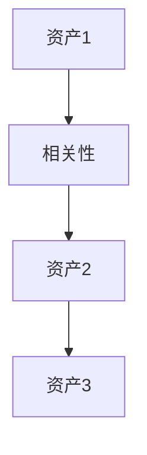

                 


# 金融市场跨资产相关性网络分析工具

> 关键词：金融市场，跨资产相关性，网络分析，社区检测，算法原理，系统架构

> 摘要：本文详细介绍了金融市场跨资产相关性网络分析工具的构建与应用。从背景介绍、核心概念、算法原理到系统架构和项目实战，全面解析了如何利用网络分析技术揭示资产之间的复杂关系。通过数学模型、算法流程和实际案例分析，展示了如何利用该工具进行风险评估、投资组合优化和市场趋势预测。

---

# 第一部分: 金融市场跨资产相关性网络分析工具概述

---

## 第1章: 金融市场与跨资产相关性概述

### 1.1 金融市场背景与问题背景

#### 1.1.1 金融市场的基本概念

金融市场是资金流动的核心场所，涵盖了股票、债券、期货、外汇等多种资产类别。不同资产之间存在复杂的相互影响关系，这种关系可以通过相关性来量化和分析。

#### 1.1.2 跨资产相关性的定义与重要性

跨资产相关性是指不同资产价格变动之间的关联程度。理解这种相关性对于风险管理和投资决策至关重要。例如，股票和债券的相关性可能在市场波动时发生变化，影响投资组合的风险水平。

#### 1.1.3 问题背景与研究意义

传统的资产分析方法往往局限于单一资产或资产类别，忽略了资产之间的相互作用。通过网络分析工具，可以更全面地理解资产之间的复杂关系，揭示潜在的系统性风险。

---

### 1.2 跨资产相关性网络分析的必要性

#### 1.2.1 跨资产相关性的应用场景

- **风险评估**：通过分析资产之间的相关性，识别潜在的系统性风险。
- **投资组合优化**：利用相关性网络构建优化的投资组合，降低风险。
- **市场趋势预测**：通过网络结构的变化预测市场趋势。

#### 1.2.2 网络分析在金融领域的优势

- **全局视角**：网络分析能够捕捉资产之间的全局关系，而非仅仅关注局部。
- **复杂关系建模**：通过网络图，可以直观展示资产之间的复杂关系。

#### 1.2.3 当前研究的局限性与挑战

- 数据量大：金融市场数据庞大，计算和存储成本高。
- 动态变化：资产相关性会随市场环境变化，需要实时更新。

---

### 1.3 本章小结

本章介绍了金融市场的基本概念，强调了跨资产相关性的重要性，并指出了网络分析在金融领域中的必要性和优势。

---

## 第2章: 跨资产相关性网络的核心概念

### 2.1 資產相关性网络的基本原理

#### 2.1.1 資產相关性的计算方法

- **Pearson相关系数**：衡量线性相关性。
- **Spearman秩相关系数**：衡量单调相关性。

#### 2.1.2 网络图的基本概念

- **节点**：代表资产。
- **边**：代表资产之间的相关性。

#### 2.1.3 資產网络的构建逻辑

1. 计算资产对之间的相关性。
2. 根据相关性阈值构建网络图。
3. 可视化网络图。

### 2.2 資產相关性网络的属性特征

#### 2.2.1 資產相关性网络的节点属性

- **度数**：节点的连接边数。
- **度数中心性**：节点在网络中的重要性。

#### 2.2.2 資產相关性网络的边属性

- **边权重**：相关性系数。
- **边方向**：相关性方向（正或负）。

#### 2.2.3 資產相关性网络的全局属性

- **网络密度**：网络中边的密度。
- **网络直径**：网络中最长的最短路径。

### 2.3 資產相关性网络的ER实体关系图



---

### 2.4 本章小结

本章详细讲解了资产相关性网络的基本概念和属性特征，为后续的网络分析工具开发奠定了基础。

---

## 第3章: 跨资产相关性网络分析工具的算法原理

### 3.1 資產相关性计算算法

#### 3.1.1 相关性计算的数学模型

- **Pearson相关系数公式**

$$ r = \frac{\sum (x_i - \bar{x})(y_i - \bar{y})}{\sqrt{\sum (x_i - \bar{x})^2 \sum (y_i - \bar{y})^2}} $$

- **Spearman秩相关系数公式**

$$ \rho = \frac{\sum (R_i - \bar{R})(S_i - \bar{S})}{\sqrt{\sum (R_i - \bar{R})^2 \sum (S_i - \bar{S})^2}} $$

#### 3.1.2 相关性计算的步骤

1. 数据预处理：去除缺失值和异常值。
2. 计算每对资产的相关系数。
3. 根据相关系数构建网络图。

### 3.2 資產相关性网络构建算法

#### 3.2.1 网络图的构建逻辑

1. 确定相关性阈值。
2. 根据阈值筛选相关性边。
3. 可视化网络图。

#### 3.2.2 网络图的可视化方法

- **节点布局**：使用Spring布局算法。
- **边权重**：使用边的宽度表示相关性大小。

### 3.3 資產相关性网络的社区检测算法

#### 3.3.1 社区检测的定义与意义

社区检测是将网络图中的节点划分为若干个社区的过程，有助于发现资产之间的集群关系。

#### 3.3.2 基于层次聚类的社区检测算法

1. 计算资产之间的相关性矩阵。
2. 使用层次聚类算法进行聚类。
3. 根据聚类结果划分社区。

#### 3.3.3 基于Louvain算法的社区检测流程

1. 初始化每个节点为一个社区。
2. 计算社区内的边权重和社区间的边权重。
3. 根据模数函数优化社区划分。

---

### 3.4 本章小结

本章详细讲解了资产相关性网络分析工具的算法原理，包括相关性计算、网络构建和社区检测的实现方法。

---

## 第4章: 跨资产相关性网络分析工具的系统架构

### 4.1 系统架构设计

#### 4.1.1 项目介绍

- **项目名称**：金融市场跨资产相关性网络分析工具。
- **项目目标**：构建一个可视化、可扩展的网络分析平台。

#### 4.1.2 系统功能设计

- **数据处理模块**：负责数据预处理和相关性计算。
- **网络构建模块**：负责网络图的构建和可视化。
- **社区检测模块**：负责资产社区的划分和分析。

#### 4.1.3 系统架构图


### 4.2 系统接口设计

#### 4.2.1 数据接口

- **输入接口**：接收金融市场数据。
- **输出接口**：输出网络图和社区划分结果。

#### 4.2.2 用户接口

- **输入接口**：接收用户输入的相关性阈值。
- **输出接口**：输出可视化界面和分析结果。

---

### 4.3 本章小结

本章详细讲解了跨资产相关性网络分析工具的系统架构设计，包括模块划分和接口设计。

---

## 第5章: 跨资产相关性网络分析工具的项目实战

### 5.1 环境安装

- **Python环境**：建议使用Anaconda。
- **依赖库安装**：使用pip安装networkx、matplotlib、scipy等库。

### 5.2 系统核心实现

#### 5.2.1 数据处理模块实现

```python
import numpy as np
import pandas as pd

def compute_correlation(matrix):
    n = len(matrix)
    correlation_matrix = np.zeros((n, n))
    for i in range(n):
        for j in range(n):
            if i == j:
                correlation_matrix[i][j] = 1
            else:
                correlation_matrix[i][j] = np.corrcoef(matrix[i], matrix[j])[0, 1]
    return correlation_matrix
```

#### 5.2.2 网络构建模块实现

```python
import networkx as nx
import matplotlib.pyplot as plt

def build_network(correlation_matrix, threshold=0.3):
    G = nx.Graph()
    n = len(correlation_matrix)
    for i in range(n):
        for j in range(i+1, n):
            if correlation_matrix[i][j] > threshold:
                G.add_edge(i, j, weight=correlation_matrix[i][j])
    return G
```

#### 5.2.3 社区检测模块实现

```python
def detect_communities(G):
    communities = nx.community_louvain(G)
    return communities
```

### 5.3 案例分析与解读

#### 5.3.1 数据来源与预处理

假设我们有以下资产数据：

```python
import pandas as pd
import numpy as np

# 创建随机资产数据
np.random.seed(42)
n_assets = 10
n_days = 100
data = np.random.randn(n_assets, n_days)
df = pd.DataFrame(data, columns=['Asset {}'.format(i) for i in range(n_assets)])
```

#### 5.3.2 网络构建与可视化

```python
correlation_matrix = compute_correlation(df.values)
G = build_network(correlation_matrix, threshold=0.3)
nx.draw(G, with_labels=True, edge_color='blue', node_color='red')
plt.show()
```

#### 5.3.3 社区检测与分析

```python
communities = detect_communities(G)
print("Number of communities:", len(communities))
for community in communities:
    print("Community nodes:", community)
```

---

### 5.4 本章小结

本章通过实际案例展示了跨资产相关性网络分析工具的实现过程，包括数据处理、网络构建和社区检测。

---

## 第6章: 总结与展望

### 6.1 本章总结

本文详细介绍了金融市场跨资产相关性网络分析工具的构建与应用，包括背景、核心概念、算法原理、系统架构和项目实战。

### 6.2 研究的局限性

- 数据质量和实时性问题。
- 网络分析的计算复杂度较高。

### 6.3 未来研究方向

- 开发实时网络分析工具。
- 研究多模态数据的网络分析方法。

### 6.4 本章小结

---

## 第7章: 最佳实践 tips

### 7.1 项目开发中的注意事项

- 数据预处理是关键，确保数据质量。
- 网络图的可视化要直观，便于用户理解。

### 7.2 工具使用中的注意事项

- 确定相关性阈值时要结合实际业务需求。
- 社区检测结果要结合市场背景进行解读。

### 7.3 本章小结

---

## 附录: 参考文献

- [1] 网络分析相关文献
- [2] 相关性计算相关文献
- [3] 社区检测相关文献

---

## 作者：AI天才研究院/AI Genius Institute & 禅与计算机程序设计艺术 /Zen And The Art of Computer Programming

---

