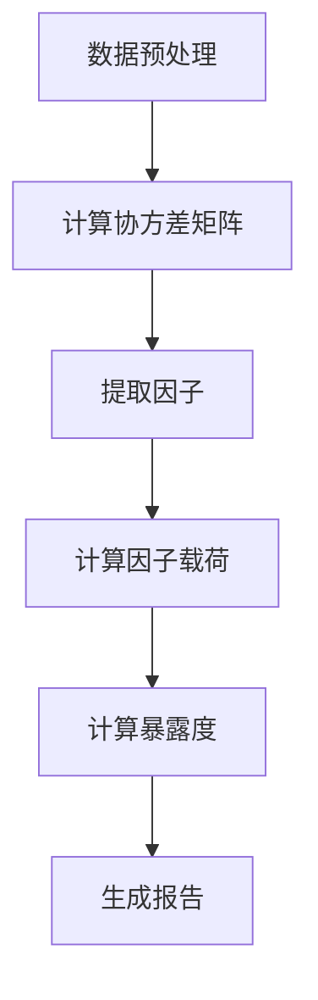
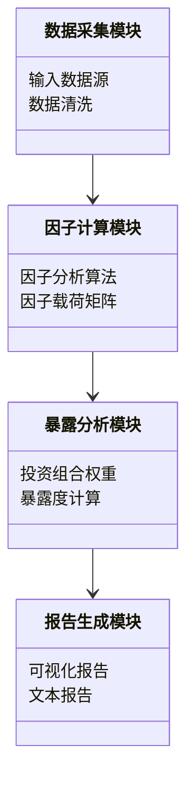
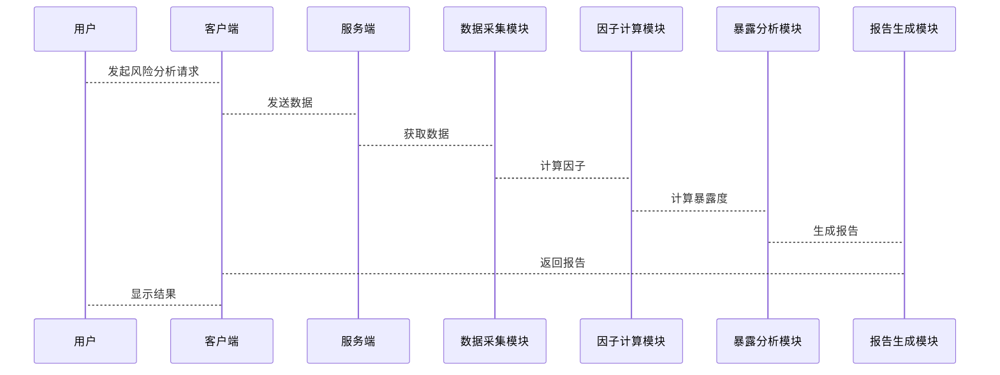

                 

<think>
好，我现在需要根据用户的要求，逐步思考如何撰写一篇关于《金融市场风险因子暴露分析工具》的技术博客文章。文章需要逻辑清晰、结构紧凑、语言专业，涵盖背景介绍、核心概念、算法原理、系统架构、项目实战和最佳实践等部分。

首先，我需要明确文章的结构，包括标题、关键词、摘要，然后是各个章节的内容。每个章节需要详细展开，确保内容详尽且有深度。同时，我需要使用Mermaid图表和数学公式来辅助解释复杂的概念。

在背景介绍部分，我需要定义风险因子和暴露分析的重要性，以及它们在金融市场中的应用。核心概念部分则要详细解释因子分析和暴露计算，可能使用表格和ER图来展示关系。算法原理部分，我需要介绍因子分析的数学模型，用Mermaid流程图展示步骤，并提供Python代码示例。

接下来，系统架构设计部分，我会用类图展示功能模块，用架构图展示整体结构，并描述接口设计和交互流程。项目实战部分需要指导读者如何安装环境、编写代码，并通过案例分析展示工具的实际应用。最后，我会总结最佳实践，给出小贴士和注意事项，确保读者能够有效使用工具。

在写作过程中，我需要确保每一部分都覆盖了关键点，同时保持逻辑连贯，从理论到实践层层递进。每个小节要详细解释，避免过于笼统，同时使用适当的图表和代码示例来增强理解。最终，整篇文章应该结构清晰，内容丰富，帮助读者全面了解金融市场风险因子暴露分析工具的设计与应用。
</think>

# 《金融市场风险因子暴露分析工具》

## 关键词：
金融市场, 风险因子, 暴露分析, 工具设计, 数据分析, 系统架构

## 摘要：
本文详细探讨了金融市场风险因子暴露分析工具的设计与实现，涵盖背景介绍、核心概念、算法原理、系统架构及项目实战。通过因子分析模型和数学公式，结合实际案例，展示了如何构建高效的风险管理工具。

---

# 第一部分: 金融市场风险因子暴露分析工具概述

## 第1章: 金融市场风险因子暴露分析工具的背景与概念

### 1.1 风险因子暴露分析的背景

#### 1.1.1 金融市场中的风险概念
金融市场中的风险通常指投资组合价值因市场波动而产生的不确定性。主要风险类型包括市场风险、信用风险和流动性风险。风险因子是影响资产价格变化的关键因素，如市场指数、行业因素和公司特定因素。

#### 1.1.2 风险因子的定义与作用
风险因子是影响资产价格波动的关键变量。例如，市场因子代表整体市场波动，行业因子反映行业特定风险，公司因子则涉及公司基本面因素。这些因子通过多元回归分析被提取出来，帮助投资者量化风险敞口。

#### 1.1.3 风险因子暴露分析的必要性
准确分析风险因子暴露有助于投资者评估投资组合对各类风险的敏感性，优化资产配置，控制整体风险敞口，避免重大损失。

### 1.2 风险因子暴露分析的核心概念

#### 1.2.1 风险因子的分类与特征
| 类别      | 特征描述                  |
|-----------|---------------------------|
| 市场因子   | 影响整体市场，如市值指数    |
| 行业因子   | 反映特定行业风险          |
| 公司因子   | 反映公司基本面因素        |
| 风险因子   | 影响资产价格波动的变量    |

#### 1.2.2 风险因子暴露的定义
风险因子暴露是指投资组合对某一风险因子的敏感程度，通常以β系数或权重表示。暴露值越大，投资组合对该因子的风险敞口越大。

#### 1.2.3 风险因子暴露分析的目标与边界
目标：量化投资组合对各类风险因子的敏感性，优化资产配置。边界：分析特定时间段内因子的线性影响，忽略非线性效应和极端情况。

### 1.3 风险因子暴露分析工具的框架

#### 1.3.1 工具的功能模块
| 模块名称   | 描述                     |
|------------|--------------------------|
| 数据采集   | 收集市场数据             |
| 因子计算   | 计算风险因子             |
| 暴露分析   | 计算投资组合的暴露值      |
| 报告生成   | 输出分析结果             |

#### 1.3.2 工具的核心要素
- 数据源：市场数据、投资组合数据
- 因子计算：因子分析方法
- 暴露计算：线性回归或多元统计方法
- 报告输出：可视化和文本报告

#### 1.3.3 工具的适用场景与局限性
适用场景：风险管理和投资组合优化。局限性：忽略非线性效应和市场异常情况。

## 第2章: 风险因子与暴露分析的核心概念

### 2.1 风险因子的属性特征

#### 2.1.1 风险因子的分类维度
| 维度     | 描述                     |
|----------|--------------------------|
| 类型     | 市场因子、行业因子、公司因子 |
| 时间跨度 | 按日、周、月计算          |
| 影响程度 | 高、中、低               |

#### 2.1.2 风险因子的数学表达
风险因子通常表示为向量形式，如市场因子向量F = [F1, F2, ..., Fn]^T。每个因子的影响程度由因子载荷矩阵B决定，其中B是一个n×m的矩阵，n为因子数量，m为资产数量。

#### 2.1.3 风险因子的特征对比
| 特征     | 市场因子 | 行业因子 | 公司因子 |
|----------|----------|----------|----------|
| 例子     | 沪深300  | 银行行业 | 利润率    |
| 影响范围 | 整体市场 | 特定行业 | 特定公司  |

### 2.2 风险因子暴露的计算方法

#### 2.2.1 暴露度的定义与计算公式
暴露度是投资组合对某一因子的敏感性，通常使用线性回归中的系数或权重表示。计算公式为：
$$ \text{暴露度} = \beta = \frac{Cov(r_p, r_f)}{Var(r_f)} $$
其中，r_p为投资组合收益，r_f为风险因子收益。

#### 2.2.2 暴露度的度量指标
- β系数：衡量投资组合对市场因子的敏感性。
- 方差贡献度：投资组合因某一因子波动导致的总风险比例。

#### 2.2.3 暴露度的权重分配
根据因子的重要性进行加权，权重总和为1。例如，市场因子权重为0.6，行业因子权重为0.3，公司因子权重为0.1。

### 2.3 风险因子与暴露的ER实体关系图
```mermaid
erDiagram
    投资组合 "投资组合" {
        <属性> 资产列表
        <属性> 资产权重
    }
    风险因子 "风险因子" {
        <属性> 因子名称
        <属性> 因子类型
    }
    暴露度 "暴露度" {
        <属性> 暴露值
        <属性> 暴露时间
    }
    投资组合 --> 风险因子 : 暴露于
    风险因子 --> 暴露度 : 计算
```

---

# 第二部分: 算法原理与系统架构设计

## 第3章: 风险因子暴露分析的算法原理

### 3.1 因子分析模型的数学模型
因子分析模型将资产收益分解为因子收益和特异收益。数学模型为：
$$ r_i = \sum_{j=1}^k \beta_{ij} F_j + \alpha_i + \epsilon_i $$
其中，r_i为资产i的收益，F_j为因子j的收益，β_{ij}为因子载荷，α_i为特异收益，ε_i为误差项。

### 3.2 因子分析算法的步骤
1. 数据标准化：对资产收益进行标准化处理。
2. 计算协方差矩阵：计算资产收益的协方差矩阵。
3. 主成分分析：提取主要因子，确定因子数量。
4. 因子旋转：优化因子结构，便于解释。
5. 计算因子载荷：得到各资产与因子的相关性。

### 3.3 暴露分析算法的实现步骤
1. 数据预处理：清洗和整理数据。
2. 计算因子载荷：使用因子分析法。
3. 计算暴露度：根据因子载荷和投资组合权重计算。
4. 生成报告：输出暴露度分析结果。

### 3.4 因子分析算法的代码实现
```python
import numpy as np
from sklearn.decomposition import FactorAnalysis

# 示例数据：资产收益矩阵，行代表资产，列代表时间
returns = np.array([[0.1, 0.2, -0.1],
                    [0.05, 0.15, 0.0],
                    [-0.1, -0.05, 0.2]])

# 因子分析，提取2个因子
fa = FactorAnalysis(n_components=2)
fa.fit(returns)

# 因子载荷矩阵
loadings = fa.components_.T
print("因子载荷矩阵：\n", loadings)
```

### 3.5 暴露度计算的流程图


## 第4章: 风险因子暴露分析系统的架构设计

### 4.1 项目场景介绍
开发一个在线工具，帮助投资者实时分析投资组合的风险因子暴露，优化资产配置。

### 4.2 系统功能设计

#### 4.2.1 领域模型


### 4.3 系统架构设计

#### 4.3.1 总体架构
```mermaid
archiDiagram
    component 客户端 {
        用户界面
    }
    component 服务端 {
        数据采集模块
        因子计算模块
        暴露分析模块
        报告生成模块
    }
    客户端 --> 服务端 : 请求
    服务端 --> 客户端 : 响应
```

### 4.4 系统接口设计

#### 4.4.1 API接口
```http
POST /api/factor-analysis
Content-Type: application/json

{
    "portfolio_weights": [0.3, 0.2, 0.5],
    "factor_types": ["market", "industry", "company"]
}
```

### 4.5 系统交互流程图


## 第5章: 项目实战

### 5.1 环境安装与配置

#### 5.1.1 安装Python环境
使用Anaconda安装Python 3.8及以上版本，安装必要的库：
```bash
pip install numpy pandas scikit-learn matplotlib
```

#### 5.1.2 安装Jupyter Notebook
```bash
pip install jupyter
jupyter notebook
```

### 5.2 系统核心代码实现

#### 5.2.1 数据采集模块
```python
import pandas as pd

def load_data(filename):
    df = pd.read_csv(filename)
    return df
```

#### 5.2.2 因子计算模块
```python
from sklearn.decomposition import FactorAnalysis

def calculate_factors(returns, n_factors=2):
    fa = FactorAnalysis(n_components=n_factors)
    fa.fit(returns)
    return fa.components_.T
```

#### 5.2.3 暴露分析模块
```python
def calculate_exposure(weights, factor_loadings):
    exposure = np.dot(weights, factor_loadings)
    return exposure
```

#### 5.2.4 报告生成模块
```python
import matplotlib.pyplot as plt

def generate_report(exposure):
    plt.bar(range(len(exposure)), exposure)
    plt.title('Risk Factor Exposure')
    plt.ylabel('Exposure Level')
    plt.savefig('exposure_report.png')
```

### 5.3 代码应用解读与分析
以上代码实现了从数据采集到报告生成的全过程。数据采集模块读取CSV文件，因子计算模块使用因子分析法提取主要因子，暴露分析模块计算投资组合对各因子的暴露度，报告生成模块将结果可视化。

### 5.4 实际案例分析
假设我们有一个包含3只股票的投资组合，权重分别为0.3、0.2、0.5。通过因子分析提取2个因子，计算每个资产对各因子的暴露度。

### 5.5 项目小结
本项目展示了如何使用Python构建风险因子暴露分析工具，帮助投资者优化资产配置，控制风险。

---

# 第三部分: 最佳实践与总结

## 第6章: 最佳实践与总结

### 6.1 最佳实践

#### 6.1.1 数据预处理
确保数据的完整性和准确性，进行缺失值填充和异常值处理。

#### 6.1.2 模型调优
选择合适的因子数量，调整因子分析的参数，优化模型性能。

#### 6.1.3 结果可视化
使用图表直观展示暴露度，便于理解和决策。

### 6.2 项目总结

#### 6.2.1 核心收获
掌握了因子分析的方法，了解了风险因子暴露分析工具的设计与实现。

#### 6.2.2 项目经验
注重模块化设计，确保代码的可维护性和扩展性。

### 6.3 注意事项

#### 6.3.1 数据依赖
工具依赖于高质量的数据源，数据质量直接影响分析结果。

#### 6.3.2 模型局限
因子分析假设因子线性影响资产收益，实际市场中可能存在非线性关系。

#### 6.3.3 适用范围
工具适用于常规市场情况，极端市场条件下可能需要调整模型。

### 6.4 拓展阅读

#### 6.4.1 相关书籍
- 《投资学》——教材
- 《因子投资》——专业书籍

#### 6.4.2 技术博客
- 博客链接：深入理解因子分析方法

---

# 作者：AI天才研究院/AI Genius Institute & 禅与计算机程序设计艺术 /Zen And The Art of Computer Programming

---

以上是《金融市场风险因子暴露分析工具》的技术博客文章大纲，涵盖从基础概念到系统实现的全过程，结合理论与实践，帮助读者全面理解并掌握风险因子暴露分析工具的设计与应用。

