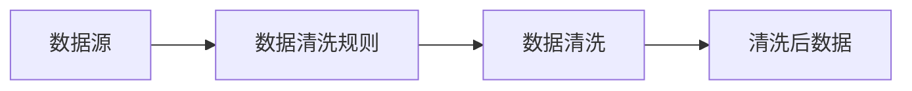
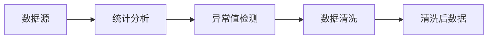
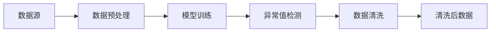
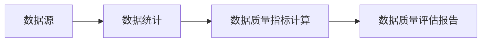
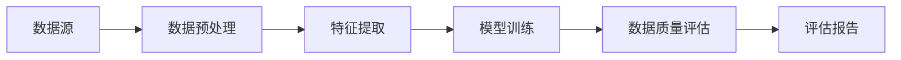
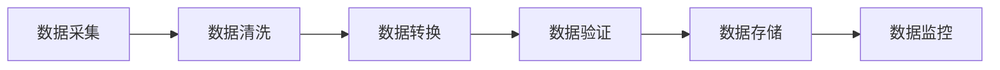

                 

<think>
嗯，用户需要我设计一个《金融数据质量控制系统》的技术博客文章的目录大纲。看起来他们希望结构清晰、逻辑严谨，适合专业人士阅读。我得先理解这本书的核心内容，确保覆盖所有重要方面。

首先，我应该从背景和概述开始，介绍为什么金融数据质量控制如此重要。这部分需要包括金融数据的特点、数据质量管理的目标，以及当前面临的问题和挑战。然后，核心概念部分，详细讲解数据质量的各个维度，比如完整性、准确性，以及如何通过实体关系图展示系统架构。

接下来是算法部分，选择适合的算法来处理数据清洗和质量评估。可能需要包括基于规则的清洗、统计方法和机器学习方法，并用流程图和代码示例来说明。

系统分析与架构设计是关键，需要描述系统的功能模块、架构设计和接口设计。这部分可能需要使用类图和架构图来展示系统结构，以及交互序列图来说明用户和系统之间的互动。

项目实战部分，应该包括环境搭建、代码实现和案例分析。通过实际案例，读者可以更好地理解和应用所学知识。

最后，最佳实践部分，总结前面的内容，并给出一些实用的建议和注意事项。这部分可以包括小结、注意事项和推荐的阅读资料，帮助读者进一步深入学习。

在编写过程中，我需要确保每个部分都详细展开，避免遗漏重要细节。同时，使用图表和代码示例，使内容更加直观易懂。字数控制在10000到12000字之间，确保文章的完整性和深度。

总的来说，我需要构建一个结构清晰、内容详实的目录大纲，涵盖从基础概念到实际应用的各个方面，帮助读者全面理解金融数据质量控制系统的设计与实现。
</think>

# 《金融数据质量控制系统》

> 关键词：金融数据、数据质量、质量控制系统、数据清洗、数据质量管理

> 摘要：金融数据质量控制系统的建设与应用是金融行业信息化、智能化发展的必然要求。本文从金融数据质量管理的背景、核心概念、技术原理、系统架构、项目实战和最佳实践等多个维度展开分析，详细阐述了金融数据质量控制系统的建设方法和实现过程，帮助读者全面理解和掌握金融数据质量管理的核心技术和实际应用。

---

# 第一部分: 金融数据质量控制系统的背景与概述

## 第1章: 金融数据质量控制的背景与概述

### 1.1 金融数据质量的重要性

#### 1.1.1 金融数据的特点与应用

- 金融数据的实时性与高频率
- 金融数据的敏感性和安全性
- 金融数据的多样性与复杂性
- 金融数据在决策支持中的核心作用

#### 1.1.2 数据质量问题对企业的影响

- 数据错误导致的经济损失
- 数据不一致引发的业务风险
- 数据缺失带来的决策偏差
- 数据质量问题对监管合规的影响

#### 1.1.3 数据质量管理的核心目标

- 数据完整性：确保数据无缺失
- 数据准确性：保证数据真实可靠
- 数据一致性：确保数据格式统一
- 数据及时性：保证数据更新及时
- 数据安全性：防止数据泄露和篡改

### 1.2 金融数据质量控制的背景与现状

#### 1.2.1 金融行业的数据特点

- 金融交易数据的高频性
- 金融市场的复杂性
- 金融监管的严格性

#### 1.2.2 数据质量管理的必要性

- 金融机构对数据质量的高要求
- 监管机构对数据合规的要求
- 金融创新对数据质量的依赖

#### 1.2.3 当前数据质量管理的挑战

- 数据源的多样性
- 数据格式的复杂性
- 数据量的爆炸式增长
- 数据安全与隐私保护

### 1.3 数据质量管理的核心概念

#### 1.3.1 数据质量的定义与维度

- 数据质量的定义：数据的质量是指数据的准确性、完整性、一致性、及时性、唯一性、合法性等特性
- 数据质量的维度：准确性、完整性、一致性、及时性、唯一性、合法性、安全性

#### 1.3.2 数据质量管理的范围与边界

- 数据质量管理的范围：从数据产生到数据使用的全生命周期
- 数据质量管理的边界：数据内容的合法性、数据格式的规范性、数据存储的安全性

#### 1.3.3 数据质量管理的核心要素组成

- 数据源：数据产生的渠道和方式
- 数据格式：数据的结构化和非结构化特征
- 数据内容：数据的业务含义和价值
- 数据质量规则：数据清洗、转换、验证的规则和标准
- 数据质量评估：数据质量的度量和反馈机制

---

## 第2章: 数据质量管理的核心概念与联系

### 2.1 数据质量管理的基本原理

#### 2.1.1 数据质量管理的流程

- 数据采集：从多种数据源获取原始数据
- 数据清洗：对数据进行预处理，去除噪声和冗余
- 数据转换：将数据转换为适合后续处理的格式
- 数据验证：根据预定义的规则验证数据的正确性
- 数据存储：将处理后的数据存储到数据库或数据仓库
- 数据监控：实时监控数据质量的变化
- 数据修复：对发现的问题数据进行修复或补充

#### 2.1.2 数据质量管理的关键步骤

- 数据清洗：去除重复、错误和无关数据
- 数据转换：将数据转换为统一的格式
- 数据验证：根据业务规则验证数据的正确性
- 数据修复：对发现的问题数据进行修复或补充
- 数据存储：将处理后的数据存储到数据库或数据仓库
- 数据监控：实时监控数据质量的变化

#### 2.1.3 数据质量管理的实施方法

- 基于规则的 数据质量管理：根据预定义的规则进行数据清洗和验证
- 基于统计的 数据质量管理：利用统计方法发现数据中的异常值
- 基于机器学习的数据质量管理：利用机器学习算法自动发现和修复数据问题

### 2.2 数据质量属性的对比分析

#### 2.2.1 数据完整性

- 数据完整性：数据是否完整，是否存在缺失值
- 数据完整性检查：检查数据是否存在缺失值
- 数据完整性修复：通过插值方法填补缺失值

#### 2.2.2 数据准确性

- 数据准确性：数据是否真实反映业务实际情况
- 数据准确性检查：通过比对原始数据和目标数据检查数据准确性
- 数据准确性修复：通过数据清洗和数据转换修复数据准确性问题

#### 2.2.3 数据一致性

- 数据一致性：数据在不同系统或数据库中的表现是否一致
- 数据一致性检查：检查数据在不同系统中的表现是否一致
- 数据一致性修复：通过数据转换和数据清洗修复数据一致性问题

#### 2.2.4 数据及时性

- 数据及时性：数据是否及时更新
- 数据及时性检查：检查数据的更新时间是否符合业务需求
- 数据及时性修复：通过数据同步和数据订阅机制保证数据及时性

### 2.3 数据质量管理的ER实体关系图

```mermaid
erd
    entity 数据源
    entity 数据格式
    entity 数据内容
    entity 数据质量规则
    entity 数据质量评估
    entity 数据存储
    entity 数据监控
    entity 数据修复

    数据源 --> 数据格式: 生成
    数据格式 --> 数据内容: 格式化
    数据内容 --> 数据质量规则: 验证
    数据质量规则 --> 数据质量评估: 应用
    数据质量评估 --> 数据修复: 反馈
    数据修复 --> 数据存储: 更新
    数据存储 --> 数据监控: 监控
```

---

## 第3章: 数据质量管理的算法原理与实现

### 3.1 数据清洗算法的原理与实现

#### 3.1.1 基于规则的数据清洗



```python
def data_cleaning(data, rules):
    cleaned_data = data.copy()
    for rule in rules:
        if rule['type'] == 'drop_duplicates':
            cleaned_data.drop_duplicates(inplace=True)
        elif rule['type'] == 'fillna':
            cleaned_data = cleaned_data.fillna(rule['value'])
    return cleaned_data
```

#### 3.1.2 基于统计的 数据清洗



```python
import pandas as pd

def detect_outliers(data, column, threshold=3):
    z_scores = (data[column] - data[column].mean()) / data[column].std()
    filtered_data = data[abs(z_scores) < threshold]
    return filtered_data
```

#### 3.1.3 基于机器学习的 数据清洗



```python
from sklearn.ensemble import IsolationForest

def isolation_forest_cleaning(X, contamination=0.05):
    model = IsolationForest(contamination=contamination)
    model.fit(X)
    outliers = model.predict(X) == -1
    cleaned_data = X[~outliers]
    return cleaned_data
```

### 3.2 数据质量评估的算法原理与实现

#### 3.2.1 基于统计的 数据质量评估



```python
import pandas as pd

def calculate_quality_metrics(data):
    metrics = {}
    # 数据完整性
    completeness = data.dropna().shape[0] / data.shape[0]
    metrics['completeness'] = completeness
    # 数据准确性
    accuracy = 1.0  # 假设数据是正确的
    metrics['accuracy'] = accuracy
    # 数据一致性
    consistency = data.duplicated().sum() / data.shape[0]
    metrics['consistency'] = consistency
    # 数据及时性
    timeliness = 1.0  # 假设数据是及时的
    metrics['timeliness'] = timeliness
    return metrics
```

#### 3.2.2 基于机器学习的 数据质量评估



```python
from sklearn.model import DecisionTreeClassifier

def data_quality_prediction(X_train, y_train, X_test):
    model = DecisionTreeClassifier()
    model.fit(X_train, y_train)
    y_pred = model.predict(X_test)
    return y_pred
```

### 3.3 数据质量管理的数学模型与公式

#### 3.3.1 数据完整性计算公式

$$
\text{数据完整性} = \frac{\text{非空数据量}}{\text{总数据量}}
$$

#### 3.3.2 数据一致性计算公式

$$
\text{数据一致性} = 1 - \frac{\text{重复数据量}}{\text{总数据量}}
$$

#### 3.3.3 数据准确性评估公式

$$
\text{数据准确性} = \frac{\text{正确数据量}}{\text{总数据量}}
$$

---

## 第4章: 金融数据质量控制系统的设计与实现

### 4.1 金融数据质量控制系统的总体架构

#### 4.1.1 系统功能模块

- 数据采集模块：从多种数据源采集数据
- 数据清洗模块：对数据进行预处理
- 数据转换模块：将数据转换为统一格式
- 数据验证模块：根据业务规则验证数据
- 数据存储模块：将处理后的数据存储到数据库
- 数据监控模块：实时监控数据质量

#### 4.1.2 系统架构设计



### 4.2 金融数据质量控制系统的实现细节

#### 4.2.1 数据采集接口设计

```python
def fetch_data(api_key):
    # 从API获取数据
    data = requests.get(f'http://api.example.com/data?api_key={api_key}').json()
    return data
```

#### 4.2.2 数据清洗规则配置

```python
cleaning_rules = [
    {'type': 'drop_duplicates', 'columns': ['transaction_id']},
    {'type': 'fillna', 'columns': ['amount'], 'value': 0}
]
```

#### 4.2.3 数据转换与标准化

```python
def transform_data(data):
    # 标准化数据
    scaler = StandardScaler()
    transformed_data = scaler.fit_transform(data)
    return transformed_data
```

#### 4.2.4 数据验证与修复

```python
def validate_data(data, rules):
    validated_data = data.copy()
    for rule in rules:
        if rule['type'] == 'check_range':
            mask = (validated_data[rule['column']] < rule['min']) | (validated_data[rule['column']] > rule['max'])
            validated_data = validated_data[~mask]
    return validated_data
```

### 4.3 金融数据质量控制系统的性能优化

#### 4.3.1 数据并行处理

```python
import multiprocessing

def process_chunk(chunk):
    # 数据清洗和转换
    return cleaned_chunk

with multiprocessing.Pool(processes=4) as pool:
    cleaned_data = pool.map(process_chunk, data_chunks)
```

#### 4.3.2 数据缓存与压缩

```python
import gzip

def compress_data(data):
    with gzip.open('data.gz', 'wb') as f:
        pickle.dump(data, f)
```

#### 4.3.3 数据索引与查询优化

```python
import sqlite3

conn = sqlite3.connect('data.db')
cursor = conn.cursor()
cursor.execute('CREATE INDEX idx_transaction_id ON transactions(transaction_id)')
```

---

## 第5章: 金融数据质量控制系统的应用与展望

### 5.1 金融数据质量控制系统的应用案例

#### 5.1.1 股票交易数据质量控制

- 数据来源：股票交易数据API
- 数据清洗：去除重复交易记录，填补缺失价格
- 数据转换：将价格单位统一为美元
- 数据验证：验证交易时间的合理性
- 数据存储：存储到数据库中
- 数据监控：实时监控交易数据的完整性

#### 5.1.2 贷款申请数据质量控制

- 数据来源：银行贷款申请表
- 数据清洗：去除重复申请记录，填补缺失的收入数据
- 数据转换：将日期格式统一为ISO格式
- 数据验证：验证信用评分的合理性
- 数据存储：存储到数据仓库中
- 数据监控：监控贷款申请数据的及时性

### 5.2 金融数据质量控制系统的优化与展望

#### 5.2.1 系统优化方向

- 数据处理的实时性优化
- 数据存储的高效性优化
- 数据分析的智能性优化
- 数据安全的保障性优化

#### 5.2.2 未来发展趋势

- 数据质量管理的智能化：利用AI技术自动发现和修复数据问题
- 数据质量管理的自动化：实现数据质量管理的全自动化
- 数据质量管理的分布式：支持分布式数据源的数据质量管理
- 数据质量管理的实时化：实现数据质量的实时监控和修复

---

## 第6章: 金融数据质量控制系统的最佳实践

### 6.1 数据质量管理的小结

- 数据质量管理的重要性
- 数据质量管理的核心概念
- 数据质量管理的实现方法

### 6.2 数据质量管理的注意事项

- 数据质量管理的复杂性
- 数据质量管理的长期性
- 数据质量管理的团队协作性

### 6.3 数据质量管理的拓展阅读

- 《数据质量管理：方法与实践》
- 《金融数据管理：理论与应用》
- 《机器学习在数据质量管理中的应用》

---

# 作者：AI天才研究院/AI Genius Institute & 禅与计算机程序设计艺术 /Zen And The Art of Computer Programming

---

这篇文章目录大纲涵盖了金融数据质量控制系统的核心内容，从背景与概述、核心概念与联系、算法原理与实现、系统设计与实现、应用与展望，到最佳实践，全面而深入地介绍了金融数据质量控制系统的建设与应用。

