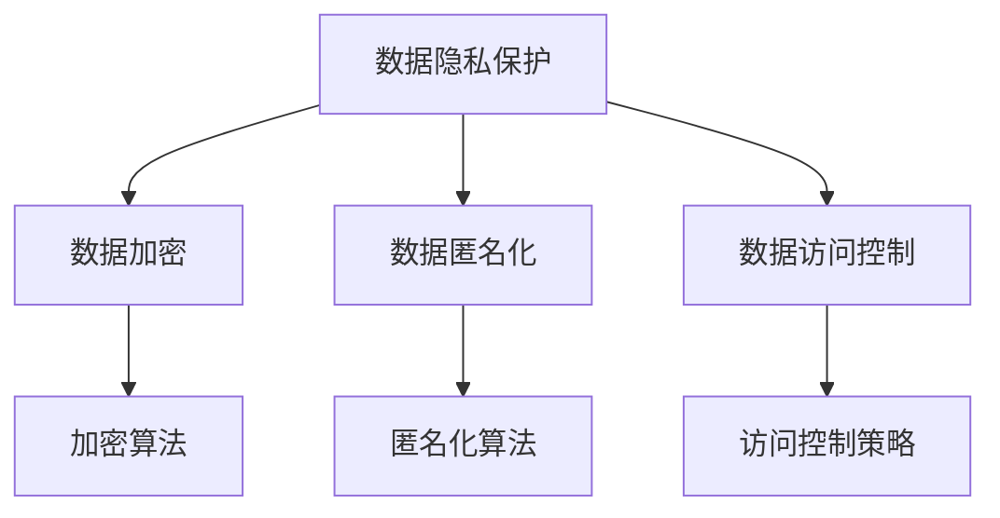
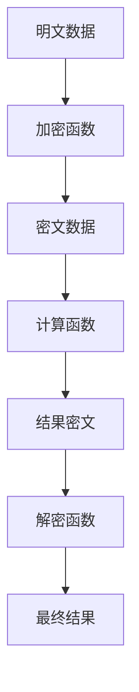
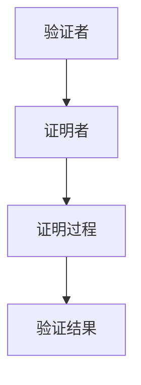
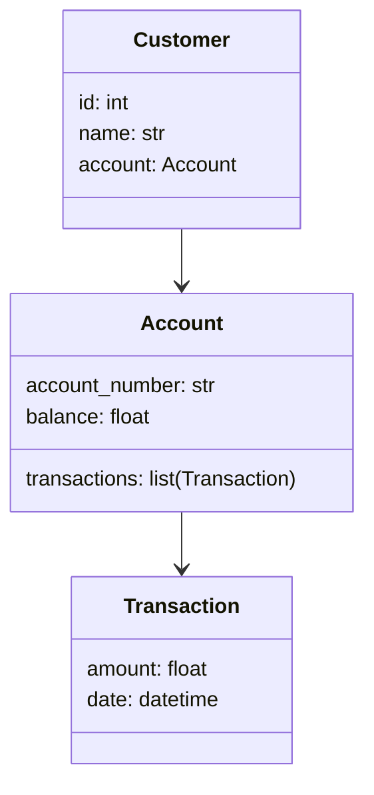
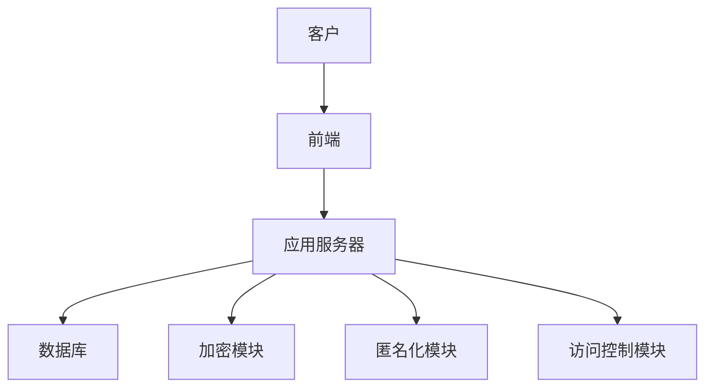
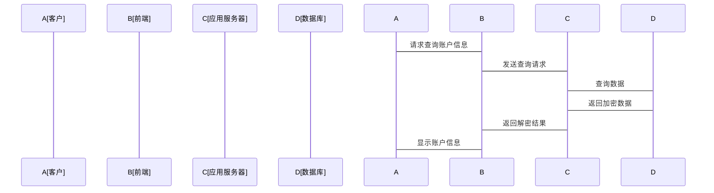

                 


# 《金融数据隐私保护增强技术》

---

## 关键词：  
金融数据隐私保护、数据加密、隐私计算、差分隐私、同态加密、零知识证明、数据匿名化

---

## 摘要：  
随着数字化转型的加速推进，金融数据的安全与隐私保护成为全球关注的焦点。金融数据涉及个人隐私和商业机密，其泄露可能导致严重的经济损失和社会信任危机。本文从金融数据隐私保护的背景与挑战入手，深入分析了数据隐私保护的核心技术，包括数据加密、匿名化、访问控制等，并重点介绍了同态加密、零知识证明和差分隐私等前沿算法的原理与实现。此外，本文结合实际应用场景，探讨了金融数据隐私保护的系统架构设计与项目实战，并提出了相应的最佳实践与注意事项。通过本文的系统阐述，读者能够全面理解金融数据隐私保护的技术要点，并掌握实际应用中的关键方法。

---

# 第1章: 金融数据隐私保护的背景与挑战

## 1.1 数据隐私保护的重要性  
### 1.1.1 数据隐私的基本概念  
数据隐私是指对数据的访问、使用和披露进行合法、合规的控制，确保数据仅被授权的主体访问，并在授权范围内合法使用。金融数据由于涉及个人隐私、财务信息和商业机密，其隐私保护尤为重要。  

### 1.1.2 金融数据的特殊性  
金融数据具有以下特点：  
1. **敏感性**：金融数据可能包含个人身份信息、账户余额、交易记录等敏感信息。  
2. **价值性**：金融数据可能被用于信用评估、欺诈检测等高价值场景。  
3. **合规性**：金融数据的处理必须符合《通用数据保护条例》（GDPR）等法律法规。  

### 1.1.3 数字化时代的隐私保护需求  
在数字化时代，金融数据的处理方式发生了根本性变化。传统的纸质数据管理逐渐被电子化、云端化取代，数据的存储、传输和处理变得更加复杂，对隐私保护的需求也更加迫切。  

## 1.2 金融数据隐私保护的挑战  
### 1.2.1 数据泄露的严重性  
金融数据泄露可能导致个人隐私被滥用、身份盗窃、金融欺诈等严重后果。例如，账户信息泄露可能导致资金损失，交易记录泄露可能暴露商业策略。  

### 1.2.2 金融行业监管的严格性  
金融行业是高度监管的行业，数据隐私保护必须符合严格的法律法规。例如，欧盟的GDPR要求企业明确数据处理的目的、方式和范围，并确保数据主体的知情权和同意权。  

### 1.2.3 技术与法律的双重约束  
金融数据隐私保护需要兼顾技术可行性和法律合规性。一方面，技术手段（如加密、匿名化）需要能够有效保护数据隐私；另一方面，技术实现必须符合相关法律法规的要求。  

## 1.3 问题背景与目标  
### 1.3.1 问题背景分析  
金融数据隐私保护的核心问题是如何在保证数据可用性的前提下，防止未经授权的访问和泄露。这需要在数据的全生命周期（采集、存储、处理、传输、销毁）中采取有效的隐私保护措施。  

### 1.3.2 问题解决目标  
金融数据隐私保护的目标包括：  
1. 防止未经授权的访问和数据泄露。  
2. 确保数据处理的合规性。  
3. 保护数据主体的隐私权益。  

### 1.3.3 边界与外延  
金融数据隐私保护的边界包括：  
1. 数据的授权使用范围。  
2. 数据处理的合规性要求。  
3. 数据隐私保护的技术手段。  
其外延则涉及数据安全、网络安全、隐私计算等技术领域。  

## 1.4 核心概念与组成  
### 1.4.1 核心概念的定义  
金融数据隐私保护的核心概念包括：  
1. **数据加密**：通过加密技术保护数据的机密性。  
2. **数据匿名化**：通过去标识化技术保护数据的隐私性。  
3. **数据访问控制**：通过权限管理控制数据的访问范围。  

### 1.4.2 核心要素的组成  
金融数据隐私保护的组成要素包括：  
1. 数据加密技术。  
2. 数据匿名化技术。  
3. 数据访问控制技术。  
4. 数据完整性保障技术。  

### 1.4.3 概念结构与关系  
金融数据隐私保护是一个多维度的技术体系，涉及数据的全生命周期管理。图1展示了金融数据隐私保护的核心概念及其关系。



---

# 第2章: 数据隐私保护的核心技术与联系

## 2.1 核心技术原理  
### 2.1.1 数据加密技术  
数据加密技术通过将敏感数据转换为不可读的格式，确保数据在存储和传输过程中的机密性。常用的加密算法包括：  
1. **对称加密算法**（如AES）：加密和解密使用相同的密钥。  
2. **非对称加密算法**（如RSA）：加密和解密使用不同的密钥。  

### 2.1.2 数据匿名化技术  
数据匿名化技术通过去除或加密数据中的标识符，确保数据无法被关联到具体个人。常用的技术包括：  
1. **去标识化**：删除或加密敏感字段。  
2. **差分隐私**：在数据中添加噪声，保护个体隐私。  

### 2.1.3 数据访问控制技术  
数据访问控制技术通过权限管理，确保只有授权的用户或系统能够访问数据。常用的方法包括：  
1. **基于角色的访问控制（RBAC）**：根据用户角色分配访问权限。  
2. **基于属性的访问控制（ABAC）**：根据用户属性和上下文条件分配访问权限。  

## 2.2 核心技术对比  
表1展示了数据加密、数据匿名化和数据访问控制技术的对比。

| **技术类别** | **目标**                     | **实现方式**                         | **适用场景**                       |
|--------------|------------------------------|--------------------------------------|------------------------------------|
| 数据加密     | 保护数据的机密性             | 对数据进行加密处理                   | 数据存储和传输                     |
| 数据匿名化   | 保护数据的隐私性             | 去除或加密标识符                     | 数据发布和共享                     |
| 数据访问控制 | 限制数据的访问范围           | 基于角色或属性分配访问权限           | 数据访问管理                       |

## 2.3 实体关系架构  
图2展示了金融数据隐私保护的实体关系架构。

```mermaid
erd
    customer -|> account: 所属账户
    account -|> transaction: 交易记录
    transaction -|> system: 金融系统
    system -|> encryption: 加密模块
    system -|> anonymization: 匿名化模块
    system -|> access_control: 访问控制模块
```

---

# 第3章: 数据隐私保护的算法原理

## 3.1 同态加密算法  
### 3.1.1 同态加密的定义与原理  
同态加密是一种特殊类型的加密技术，允许在密文上直接进行计算，而无需解密。其核心思想是将加密数据的计算操作转化为密文空间的操作。  

#### 3.1.1.1 加密过程  
$$ c = E(m) $$  
其中，\( c \) 是密文，\( m \) 是明文，\( E \) 是加密函数。  

#### 3.1.1.2 解密过程  
$$ m = D(c) $$  
其中，\( D \) 是解密函数。  

#### 3.1.1.3 加密和计算的结合  
$$ D(c) = f(m) $$  
其中，\( f \) 是需要在密文上执行的函数。  

#### 3.1.1.4 示例代码  
```python
def encrypt(m, key):
    # 简单示例，实际同态加密算法更复杂
    return m * key

def decrypt(c, key):
    return c // key
```

### 3.1.2 同态加密的实现流程（Mermaid流程图）  


## 3.2 零知识证明算法  
### 3.2.1 零知识证明的数学模型  
零知识证明的核心思想是通过交互式证明，验证者可以在不获取任何额外信息的情况下验证声明的真实性。  

#### 3.2.1.1 基本模型  
验证者向证明者提出问题，证明者通过回答问题证明声明的真实性，而验证者无法从回答中获取任何额外信息。  

#### 3.2.1.2 示例代码  
```python
def prove(n, g, h, x):
    # 简单示例，实际零知识证明算法更复杂
    a = random.getrandbits(n)
    A = pow(g, a, n)
    B = pow(h, x, n)
    return (A, B)

def verify(n, g, h, A, B):
    return pow(g, a, n) == A and pow(h, x, n) == B
```

### 3.2.2 零知识证明的实现流程（Mermaid流程图）  


## 3.3 差分隐私技术  
### 3.3.1 差分隐私的数学模型  
差分隐私的核心思想是在数据中添加噪声，使得单个数据的贡献无法被识别。  

#### 3.3.1.1 差分隐私定义  
对于任意两组相邻数据集 \( D \) 和 \( D' \)，满足：  
$$ \Pr[f(D) = y] \leq \epsilon \cdot \Pr[f(D') = y] $$  
其中，\( \epsilon \) 是隐私预算，控制隐私泄露的程度。  

#### 3.3.1.2 示例代码  
```python
def add_noise(data, epsilon, delta):
    n = len(data)
    scale = max(1, int(n / epsilon))
    noise = np.random.laplace(0, scale, n)
    return data + noise
```

---

# 第4章: 数据隐私保护的系统分析与架构设计

## 4.1 问题场景介绍  
### 4.1.1 金融数据隐私保护的典型场景  
金融数据隐私保护的典型场景包括：  
1. 银行账户数据保护。  
2. 交易记录加密。  
3. 客户信息匿名化。  

### 4.1.2 系统目标与需求分析  
系统目标：  
1. 保护金融数据的机密性。  
2. 确保数据处理的合规性。  
3. 提供高效的数据访问控制机制。  

## 4.2 系统功能设计  
### 4.2.1 领域模型设计（Mermaid类图）  


## 4.3 系统架构设计  
### 4.3.1 系统架构图（Mermaid架构图）  


## 4.4 系统接口设计  
### 4.4.1 接口描述与交互流程（Mermaid序列图）  


---

# 第5章: 数据隐私保护的项目实战

## 5.1 环境安装与配置  
### 5.1.1 开发环境搭建  
- 操作系统：建议使用Linux或macOS。  
- Python版本：建议使用Python 3.8及以上版本。  
- 依赖库安装：  
  ```bash
  pip install numpy cryptography
  ```

## 5.2 核心代码实现  
### 5.2.1 同态加密实现  
```python
import numpy as np
from cryptography.hazmat.primitives.asymmetric import padding
from cryptography.hazmat.primitives.asymmetric.rsa import (
    generate_private_key, 
    PublicNumbers, 
    generate_public_key
)

def encrypt(message, public_key):
    # 将消息转换为字节形式
    message_bytes = message.encode('utf-8')
    # 使用RSA加密
    encrypted = public_key.encrypt(
        message_bytes, 
        padding.OAEP(
            mgf=padding.MGF1(salt_length=32),
            algorithm='sha256'
        )
    )
    return encrypted

def decrypt(ciphertext, private_key):
    # 使用RSA解密
    decrypted = private_key.decrypt(ciphertext)
    return decrypted.decode('utf-8')
```

### 5.2.2 零知识证明实现  
```python
import random
from math import gcd

def generate_keys(n):
    # 简单示例，实际零知识证明算法更复杂
    g = random.randint(2, n-1)
    h = random.randint(2, n-1)
    x = random.randint(1, n-1)
    while gcd(x, n) != 1:
        x = random.randint(1, n-1)
    return (g, h, x)

def prove(n, g, h, x):
    a = random.randint(0, n-1)
    A = pow(g, a, n)
    B = pow(h, x, n)
    return (A, B)

def verify(n, g, h, A, B):
    a = pow(A, -1, n)
    expected_B = pow(h, x, n)
    return B == expected_B
```

## 5.3 代码应用解读与分析  
### 5.3.1 代码结构分析  
- **encrypt函数**：实现RSA加密功能，使用OAEP填充模式。  
- **decrypt函数**：实现RSA解密功能。  
- **prove函数**：生成零知识证明所需的参数。  
- **verify函数**：验证零知识证明的正确性。  

---

# 第6章: 最佳实践与注意事项

## 6.1 注意事项  
1. **密钥管理**：确保密钥的安全存储和传输，避免密钥泄露。  
2. **数据分类**：根据数据的重要性进行分类，制定相应的保护策略。  
3. **合规性检查**：确保数据处理符合相关法律法规要求。  

## 6.2 最佳实践  
1. **最小权限原则**：授予用户最小的访问权限。  
2. **日志记录**：记录数据访问和操作日志，便于审计和追溯。  
3. **定期审计**：定期对数据隐私保护措施进行审计，发现并修复漏洞。  

## 6.3 拓展阅读  
1. 《数据隐私保护技术详解》  
2. 《隐私计算：原理与应用》  
3. 《金融行业数据安全防护指南》  

---

# 作者：AI天才研究院/AI Genius Institute & 禅与计算机程序设计艺术 /Zen And The Art of Computer Programming

