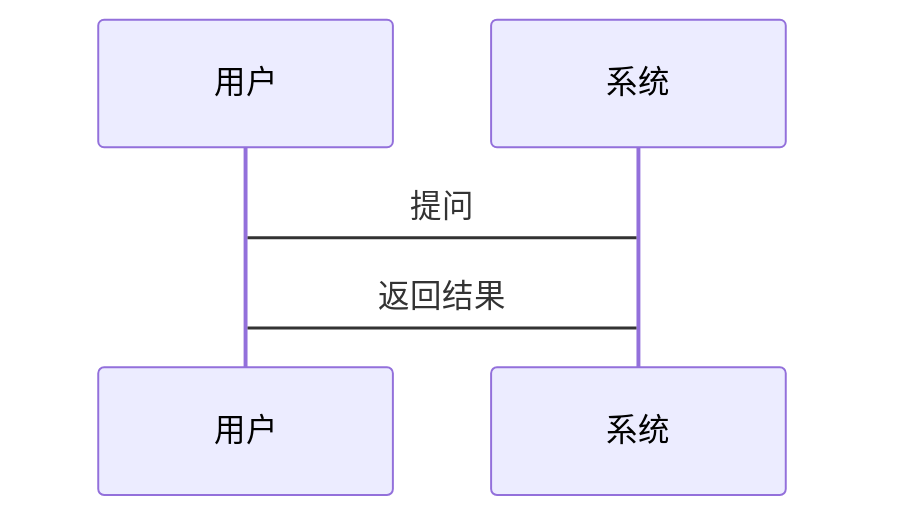

                 


# 《金融文本挖掘技术在智能助手中的应用》

---

## 关键词：金融文本挖掘、智能助手、NLP、深度学习、自然语言处理

---

## 摘要：  
金融文本挖掘是将自然语言处理技术应用于金融领域的关键技术，能够从大量非结构化金融文本中提取有价值的信息。本文详细探讨了金融文本挖掘的核心技术，包括文本预处理、特征提取、分类模型等，并结合智能助手的系统架构设计，分析了金融文本挖掘在智能助手中的具体应用场景。通过实际案例和系统实现，本文展示了如何利用金融文本挖掘技术提升智能助手的金融信息服务能力，并总结了该领域的未来发展方向。

---

## 第一章: 金融文本挖掘技术的背景与意义

### 1.1 问题背景与问题描述  
金融领域的数据呈现出高度的非结构化特征，例如新闻报道、财务报表、市场评论等。如何从这些文本中提取有价值的信息，是金融领域面临的重要挑战。  
金融文本挖掘的目标是从非结构化的金融文本中提取关键信息，例如公司财务状况、市场趋势、风险预警等。  

**问题解决：**  
金融文本挖掘通过自然语言处理（NLP）技术，将非结构化的金融文本转化为结构化的信息，为智能助手提供数据支持。  

**边界与外延：**  
金融文本挖掘主要关注文本数据的分析与处理，其外延包括文本分类、实体识别、情感分析等NLP任务。

---

### 1.2 金融文本挖掘技术的应用场景  
#### 1.2.1 金融领域的文本数据特点  
- 数据量大：金融领域每天产生大量文本数据。  
- 数据复杂：文本中包含专业术语、行业知识等。  

#### 1.2.2 金融文本挖掘的典型应用场景  
- **信息提取：** 从财务报表中提取公司财务数据。  
- **风险预警：** 通过分析新闻和社交媒体，识别潜在风险。  
- **市场分析：** 从市场评论中提取市场情绪。  

#### 1.2.3 金融文本挖掘的潜在价值  
- 提高金融信息服务的效率和准确性。  
- 帮助投资者做出更明智的决策。  

---

### 1.3 智能助手的定义与技术基础  
#### 1.3.1 智能助手的定义  
智能助手是一种基于NLP技术的交互系统，能够理解用户的自然语言输入，并提供相应的服务和信息。  

#### 1.3.2 智能助手的核心技术  
- 自然语言处理（NLP）：理解用户输入的文本。  
- 机器学习：基于历史数据进行模式识别。  
- 对话系统：实现与用户的自然语言交互。  

---

## 第二章: 金融文本挖掘的核心概念与技术

### 2.1 文本挖掘技术的核心原理  
#### 2.1.1 文本预处理  
文本预处理是文本挖掘的基础，主要包括以下步骤：  
1. **分词：** 将文本分割成词语或短语。  
2. **去停用词：** 去除无意义的词汇（如“的”、“了”等）。  
3. **词干提取：** 将词语还原为词干（例如，将“running”还原为“run”）。  

#### 2.1.2 文本特征提取  
特征提取是将文本转化为数值特征的过程，常用的特征包括：  
- TF-IDF：计算词语的重要性。  
- 词嵌入（Word Embedding）：将词语表示为向量。  

#### 2.1.3 文本分类与聚类  
- **文本分类：** 根据预定义的类别对文本进行分类。  
- **文本聚类：** 根据文本内容的相似性进行分组。  

---

### 2.2 金融文本挖掘的关键技术  
#### 2.2.1 基于规则的文本挖掘  
基于规则的文本挖掘通过预定义的规则提取信息，例如：  
- 从财务报表中提取公司收入。  

#### 2.2.2 基于统计的文本挖掘  
基于统计的文本挖掘通过统计方法提取信息，例如：  
- 使用TF-IDF提取关键词。  

#### 2.2.3 基于深度学习的文本挖掘  
基于深度学习的文本挖掘通过神经网络模型（如LSTM、BERT）进行文本分析，例如：  
- 使用BERT进行文本分类。  

---

### 2.3 金融文本挖掘的算法对比  
#### 2.3.1 常见文本挖掘算法对比表格  
| 算法类型         | 优点                       | 缺点                       |
|------------------|--------------------------|--------------------------|
| 基于规则的挖掘   | 简单易实现                 | 需要大量人工规则         |
| 基于统计的挖掘   | 不需要人工规则             | 分类性能有限               |
| 基于深度学习的挖掘 | 分类性能高                 | 需要大量数据和计算资源    |

#### 2.3.2 ER实体关系图  
以下是一个简单的实体关系图（ER图）：  
```mermaid
erDiagram
    customer {
        name : string
        id : integer
    }
    transaction {
        amount : float
        date : date
    }
    customer -> transaction : "进行"
```

---

## 第三章: 金融文本挖掘技术的实现

### 3.1 金融文本挖掘的算法实现  
#### 3.1.1 文本预处理流程  
1. 文本分词：使用分词工具（如jieba）对文本进行分词。  
2. 去停用词：去除无意义的词汇。  
3. 词干提取：将词语还原为词干。  

#### 3.1.2 特征提取方法  
- 使用TF-IDF提取关键词。  
- 使用Word2Vec生成词嵌入。  

#### 3.1.3 文本分类模型  
- **朴素贝叶斯（Naive Bayes）：** 常用于文本分类。  
- **支持向量机（SVM）：** 适用于小规模数据。  
- **随机森林（Random Forest）：** 适用于高维数据。  

---

### 3.2 基于深度学习的金融文本挖掘  
#### 3.2.1 神经网络模型在文本挖掘中的应用  
神经网络模型可以用于文本分类、情感分析等任务。  

#### 3.2.2 LSTM在金融文本分析中的应用  
LSTM（长短期记忆网络）可以用于处理时间序列数据，例如：  
- 从历史新闻中预测股票价格走势。  

#### 3.2.3 Transformer模型的改进与优化  
Transformer模型在自然语言处理领域表现出色，可以用于金融文本挖掘任务。  

---

### 3.3 金融文本挖掘的数学模型与公式  
#### 3.3.1 文本相似度计算公式  
文本相似度可以使用余弦相似度计算：  
$$ \text{similarity}(A, B) = \frac{A \cdot B}{\|A\| \|B\|} $$  

#### 3.3.2 文本分类的损失函数  
文本分类可以使用交叉熵损失函数：  
$$ \text{loss} = -\sum_{i=1}^{n} y_i \log(p_i) $$  

#### 3.3.3 模型训练的优化算法  
常用的优化算法包括：  
- 随机梯度下降（SGD）  
- 动量优化（Momentum）  
- Adam优化器  

---

## 第四章: 智能助手的系统架构设计

### 4.1 智能助手的系统架构  
智能助手的系统架构可以分为以下模块：  
1. **用户输入模块：** 接收用户的自然语言输入。  
2. **文本处理模块：** 对文本进行预处理和特征提取。  
3. **模型推理模块：** 使用预训练模型进行分析。  
4. **结果输出模块：** 将结果返回给用户。  

---

### 4.2 智能助手的系统接口设计  
#### 4.2.1 系统接口定义  
- **输入接口：** 用户输入的自然语言文本。  
- **输出接口：** 系统返回的结果。  

#### 4.2.2 接口调用流程  
1. 用户输入问题。  
2. 系统接收输入并进行处理。  
3. 系统返回结果。  

---

### 4.3 智能助手的交互设计  
#### 4.3.1 用户需求分析  
用户需求包括：  
- 查询公司财务数据。  
- 获取市场分析报告。  

#### 4.3.2 系统交互流程图  


---

## 第五章: 金融文本挖掘在智能助手中的应用

### 5.1 金融文本挖掘在智能助手中的应用场景  
#### 5.1.1 金融信息提取  
从财务报表中提取公司收入数据。  

#### 5.1.2 金融情感分析  
从社交媒体评论中分析市场情绪。  

#### 5.1.3 金融实体识别  
识别文本中的公司名称、日期等实体。  

---

### 5.2 智能助手的金融文本挖掘实现  
#### 5.2.1 系统功能实现  
- 实现文本分类功能。  
- 实现实体识别功能。  

#### 5.2.2 项目实战  
##### 5.2.2.1 环境搭建  
- 安装Python、TensorFlow、Keras等工具。  

##### 5.2.2.2 数据采集  
从新闻网站爬取金融新闻。  

##### 5.2.2.3 模型训练  
使用LSTM模型进行文本分类。  

##### 5.2.2.4 系统实现  
编写代码实现智能助手的交互功能。  

##### 5.2.2.5 系统测试  
测试系统的准确率和响应时间。  

---

## 结论

金融文本挖掘技术在智能助手中的应用前景广阔。通过结合NLP技术和深度学习模型，智能助手能够更高效地处理金融文本数据，为用户提供更精准的金融服务。未来，随着技术的不断进步，金融文本挖掘将在智能助手中发挥更大的作用。

---

## 作者：AI天才研究院/AI Genius Institute & 禅与计算机程序设计艺术 /Zen And The Art of Computer Programming

