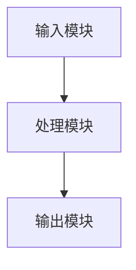

                 


# 金融文本摘要生成的深度学习方法

> 关键词：金融文本摘要，深度学习，文本摘要生成，预训练语言模型，自然语言处理，金融NLP

> 摘要：本文探讨了金融文本摘要生成的深度学习方法，从背景、挑战到具体的深度学习模型和算法进行了详细分析。文章介绍了预训练语言模型如BERT、GPT在金融文本处理中的应用，以及如何设计高效的摘要生成系统。通过实际案例分析和系统架构设计，展示了如何利用深度学习技术提升金融文本摘要的准确性和效率。

---

# 第一部分: 金融文本摘要生成的背景与概述

## 第1章: 金融文本摘要的背景与重要性

### 1.1 金融文本摘要的定义与背景

金融文本摘要是指对金融领域的文本（如财经新闻、财务报告、市场分析等）进行压缩和概括，提取关键信息的过程。金融文本摘要的应用场景广泛，包括金融新闻聚合、投资决策支持、风险管理等。随着金融数据的爆炸式增长，如何高效地生成准确的金融文本摘要成为亟待解决的问题。

金融文本摘要的背景可以追溯到自然语言处理（NLP）的发展。传统上，文本摘要主要依赖基于统计的方法或基于规则的专家系统，但这些方法在处理复杂金融文本时存在诸多限制，如难以捕捉上下文信息、处理多义词困难等。深度学习的兴起为金融文本摘要提供了新的解决方案。

### 1.2 深度学习与文本摘要的结合

深度学习是一种基于人工神经网络的机器学习方法，具有强大的特征提取能力和自动学习能力。与传统文本摘要方法相比，深度学习能够更好地处理非线性关系和复杂模式，适合金融文本中多义词、专业术语和复杂句式的处理。

文本摘要的生成可以分为两类：抽取式摘要和生成式摘要。抽取式摘要从原文中选择重要句子或短语；生成式摘要则通过模型生成新的文本。深度学习在生成式摘要中表现尤为突出，尤其是基于Transformer架构的模型。

### 1.3 金融文本摘要的重要性和应用领域

金融文本摘要在多个领域具有重要应用：

- **金融新闻聚合**：将多篇金融新闻自动摘要，便于用户快速阅读。
- **投资决策支持**：通过摘要快速获取关键市场信息，辅助投资决策。
- **风险管理**：实时监控金融市场动态，生成风险预警摘要。
- **财务报告分析**：对财务报告进行摘要，便于管理层快速了解公司财务状况。

---

## 第2章: 金融文本的特点与挑战

### 2.1 金融文本的特点

金融文本具有以下特点：

1. **专业术语密集**：金融领域有大量的专业术语，如“每股收益”、“市盈率”等，这些术语的理解对摘要生成至关重要。
2. **文本结构复杂**：金融文本通常包含复杂的句子结构，如长句、嵌套结构等，增加了摘要生成的难度。
3. **数据时序性**：金融数据具有很强的时序性，摘要需要考虑上下文的时间关系。
4. **信息密度高**：金融文本通常包含大量关键信息，摘要需要准确提取核心内容。

### 2.2 金融文本摘要的挑战

1. **数据稀疏性问题**：金融领域的数据通常较难获取，且标注数据有限，导致模型训练效果受限。
2. **领域适应性问题**：预训练语言模型通常在通用领域训练，需要在金融领域进行微调，以适应特定领域的需求。
3. **多义性和歧义性问题**：金融术语在不同上下文中可能有不同的含义，增加了模型理解的难度。
4. **上下文依赖性**：金融文本的信息往往依赖于上下文，摘要生成需要考虑整体语境。

### 2.3 金融文本摘要的评价指标

评价文本摘要的质量可以从以下几个方面入手：

1. **准确性**：摘要是否准确反映了原文内容。
2. **简洁性**：摘要是否简洁明了，避免冗余信息。
3. **相关性**：摘要是否包含与目标任务相关的信息。
4. **流畅性**：摘要是否通顺，符合语言表达习惯。
5. **领域适应性**：摘要是否适应金融领域的特定需求。

---

# 第二部分: 深度学习方法与文本摘要生成

## 第3章: 预训练语言模型与文本摘要

### 3.1 预训练语言模型概述

预训练语言模型（Pre-trained Language Models）是近年来自然语言处理领域的重要进展，代表模型包括BERT、GPT、RoBERTa等。这些模型通过在大规模通用文本数据上预训练，学习到了丰富的语言特征，能够在多种任务上实现优异性能。

#### BERT模型的基本原理

BERT（Bidirectional Encoder Representations from Transformers）是一种基于Transformer的预训练模型，通过双向编码器结构，能够同时捕捉文本的前后语境信息。BERT的训练目标包括掩码语言模型任务和下一个句子预测任务，从而学习到丰富的上下文表示。

#### GPT模型的基本原理

GPT（Generative Pre-trained Transformer）是一种基于Transformer的生成式模型，通过自回归方式生成文本。GPT的核心思想是利用上下文信息生成下一个词，从而实现文本生成任务。

#### 其他主流预训练模型的介绍

除了BERT和GPT，还有许多其他预训练模型，如RoBERTa、DeBERTa等。这些模型在不同程度上优化了BERT的训练策略，进一步提升了模型性能。

### 3.2 预训练语言模型在金融领域的应用

#### 预训练模型在金融文本处理中的优势

1. **强大的上下文理解能力**：预训练模型能够理解金融文本中的复杂句式和专业术语。
2. **减少数据依赖**：通过预训练，模型可以在有限标注数据的情况下实现良好性能。
3. **可扩展性**：预训练模型可以快速适应新的金融领域任务。

#### 预训练模型在金融文本摘要中的应用案例

1. **基于BERT的金融新闻摘要**：利用BERT模型对金融新闻进行摘要，提取关键信息。
2. **基于GPT的市场分析报告生成**：通过GPT模型生成市场分析报告的摘要，辅助投资决策。

#### 预训练模型的领域适应性问题

尽管预训练模型在通用任务上表现优异，但在特定领域如金融领域，模型需要进行领域微调。通过在金融领域数据上进行微调，模型可以更好地适应金融文本的特点。

---

## 第4章: 文本摘要生成的核心算法

### 4.1 基于序列到序列模型的摘要生成

#### Seq2Seq模型的基本结构

Seq2Seq（Sequence to Sequence）模型由编码器和解码器两个部分组成。编码器将输入序列编码为一个固定长度的向量，解码器根据编码结果生成输出序列。

#### 注意力机制在摘要生成中的应用

注意力机制（Attention）是一种基于上下文信息的加权机制，能够帮助模型关注输入文本中的重要部分。在摘要生成中，注意力机制可以有效捕捉文本的关键信息。

#### 基于Transformer的摘要生成模型

Transformer是一种基于注意力机制的深度学习模型，由编码器和解码器组成。其核心思想是利用全局注意力机制捕捉文本的长距离依赖关系，从而生成高质量的摘要。

### 4.2 摘要生成算法的改进与优化

#### 多任务学习在摘要生成中的应用

多任务学习（Multi-task Learning）是一种通过同时学习多个任务来提升模型性能的方法。在摘要生成中，可以通过多任务学习同时优化文本生成和相关性评价，从而提升摘要质量。

#### 基于强化学习的摘要生成方法

强化学习（Reinforcement Learning）是一种通过奖励机制优化模型行为的方法。在摘要生成中，可以通过强化学习优化生成文本的流畅性和相关性。

#### 跨领域适应性优化方法

跨领域适应性优化方法旨在提升模型在不同领域的适应能力，通常通过领域适配层或领域特定参数优化实现。

### 4.3 摘要生成算法的数学模型

#### Transformer模型的数学公式

Transformer模型的编码器和解码器均由多头注意力机制和前馈网络组成。其数学公式如下：

$$
\text{Attention}(Q, K, V) = \text{softmax}\left(\frac{QK^T}{\sqrt{d_k}}\right)V
$$

其中，\( Q \)、\( K \)、\( V \) 分别为查询、键、值向量，\( d_k \) 为向量维度。

#### 注意力机制的数学推导

注意力机制通过计算查询与键的相似性，生成注意力权重，并利用这些权重加权值向量，得到最终的注意力输出。

$$
\alpha_i = \text{softmax}(QK^T)
$$

$$
\text{Output} = \sum_{i=1}^{n} \alpha_i V_i
$$

#### 摘要生成的损失函数与优化目标

摘要生成的损失函数通常采用交叉熵损失函数，优化目标是通过最小化损失函数，提升生成文本的质量。

$$
\text{Loss} = -\sum_{i=1}^{n} \text{log}(p(y_i | y_{<i}))
$$

---

# 第三部分: 金融文本摘要生成的系统设计与实现

## 第5章: 金融文本摘要生成系统的架构设计

### 5.1 系统需求分析

#### 系统功能需求

1. **文本输入**：支持多种格式的金融文本输入，如文本文件、数据库等。
2. **摘要生成**：根据输入文本生成摘要。
3. **结果输出**：输出生成的摘要，并支持多种格式（如文本、JSON等）。

#### 系统性能需求

1. **处理速度**：在合理时间内处理大量金融文本。
2. **摘要质量**：生成准确、简洁的摘要。

#### 系统可扩展性需求

1. **模型更新**：支持模型的持续优化和更新。
2. **多语言支持**：支持多种语言的金融文本摘要。

### 5.2 系统架构设计

#### 模块划分与功能分配

1. **输入模块**：负责接收输入文本数据。
2. **处理模块**：包括文本预处理、模型推理等。
3. **输出模块**：生成并输出摘要结果。

#### 数据流与控制流设计

1. **数据流**：文本数据从输入模块进入，经过预处理后，输入模型进行摘要生成，生成结果输出。
2. **控制流**：系统通过控制模块协调各部分工作，确保流程顺畅。

#### 系统架构的Mermaid图



### 5.3 系统接口设计

#### 输入接口设计

1. **文本输入接口**：支持文本文件上传或直接输入。
2. **参数设置接口**：允许用户设置摘要长度、生成策略等参数。

#### 输出接口设计

1. **摘要输出接口**：输出生成的摘要文本。
2. **结果导出接口**：支持将摘要结果导出为文件或数据库。

#### API接口设计

1. **RESTful API**：提供HTTP接口，方便其他系统调用。

---

## 第6章: 金融文本摘要生成系统的实现

### 6.1 环境

---

### 6.2 核心代码实现

```python
import torch
import torch.nn as nn
import torch.optim as optim

class Transformer(nn.Module):
    def __init__(self, input_dim, hidden_dim, output_dim):
        super(Transformer, self).__init__()
        self.encoder = nn.TransformerEncoder(
            d_model=input_dim,
            nhead=2,
            dim_feedforward=hidden_dim,
            dropout=0.1
        )
        self.decoder = nn.TransformerDecoder(
            d_model=input_dim,
            nhead=2,
            dim_feedforward=hidden_dim,
            dropout=0.1
        )
        self.fc = nn.Linear(input_dim, output_dim)

    def forward(self, x):
        encoded = self.encoder(x)
        decoded = self.decoder(encoded)
        output = self.fc(decoded.mean(dim=1))
        return output

# 示例数据
input_data = torch.randn(10, 512)
model = Transformer(input_dim=512, hidden_dim=1024, output_dim=256)
output = model(input_data)
print(output.size())
```

### 6.3 系统功能设计

#### 6.3.1 系统功能模块

1. **文本预处理模块**：包括文本清洗、分词、停用词处理等。
2. **模型推理模块**：负责加载预训练模型，进行摘要生成。
3. **结果后处理模块**：包括结果格式化、输出等。

#### 6.3.2 系统功能流程

1. **输入处理**：接收金融文本数据。
2. **文本预处理**：清洗文本，提取关键信息。
3. **模型推理**：加载预训练模型，生成摘要。
4. **结果输出**：输出摘要结果。

---

## 第7章: 项目实战

### 7.1 环境安装

```bash
pip install torch transformers
```

### 7.2 核心代码实现

```python
from transformers import BartTokenizer, BartForConditionalGeneration
import torch

# 初始化模型和分词器
tokenizer = BartTokenizer.from_pretrained('facebook/bart-large')
model = BartForConditionalGeneration.from_pretrained('facebook/bart-large')

# 输入文本
input_text = "The company reported a profit of $1.2 billion in the third quarter, beating expectations."

# 编码输入
inputs = tokenizer(input_text, return_tensors='pt')

# 模型推理
with torch.no_grad():
    outputs = model.generate(inputs.input_ids, max_length=50, num_beams=5)

# 解码输出
summary = tokenizer.decode(outputs[0], skip_special_tokens=True)
print(summary)
```

### 7.3 代码应用解读与分析

1. **环境安装**：安装必要的Python库，如PyTorch和Transformers。
2. **模型加载**：使用预训练好的Bart模型进行摘要生成。
3. **输入处理**：将输入文本编码为模型可处理的格式。
4. **模型推理**：生成摘要文本。
5. **结果输出**：将生成的摘要解码为字符串，输出结果。

---

## 第8章: 扩展阅读与未来展望

### 8.1 扩展阅读

1. **预训练语言模型的最新进展**：了解BERT、GPT等模型的最新发展。
2. **文本摘要的前沿技术**：探索基于生成式模型的新方法。
3. **金融NLP的其他应用**：了解金融领域其他NLP任务，如情感分析、实体识别等。

### 8.2 未来展望

1. **多模态摘要**：结合图像、语音等多模态信息，生成更全面的摘要。
2. **实时摘要生成**：开发实时金融摘要生成系统，满足动态金融信息的需求。
3. **自适应摘要生成**：根据用户需求动态调整摘要内容和风格。

---

# 作者：AI天才研究院/AI Genius Institute & 禅与计算机程序设计艺术 /Zen And The Art of Computer Programming

