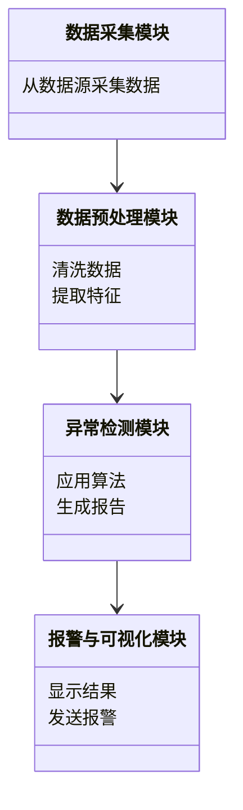
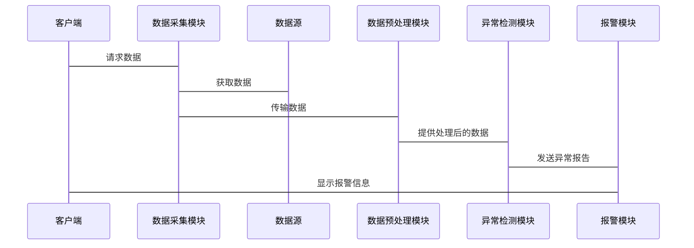

                 


# 金融时序数据异常检测的AI方法

> 关键词：金融时序数据，异常检测，人工智能，深度学习，机器学习，时间序列分析

> 摘要：本文详细探讨了在金融领域中使用人工智能方法进行时序数据异常检测的核心概念、算法原理、系统设计以及项目实战。通过分析金融数据的特征，比较了多种异常检测方法，并重点介绍了ARIMA、LSTM和Isolation Forest等算法的原理与实现。同时，结合实际项目，展示了系统设计与架构，并通过代码实现和案例分析，帮助读者理解如何在金融场景中应用这些方法。

---

## 第一部分: 金融时序数据异常检测的背景与基础

### 第1章: 异常检测的背景与问题定义

#### 1.1 金融时序数据的特点

##### 1.1.1 金融数据的时间依赖性

金融数据通常具有强烈的时间依赖性，这意味着当前的值往往与过去的值密切相关。例如，股票价格、汇率和利率等金融指标都表现出显著的时序特性。这种依赖性使得时间序列分析在金融领域尤为重要。

##### 1.1.2 金融数据的波动性与周期性

金融数据常常表现出高度的波动性和周期性。例如，股票价格可能会因为市场情绪、公司新闻或宏观经济指标的变化而剧烈波动。周期性则体现在某些金融指标可能会定期重复，如季度性收益报告或经济周期。

##### 1.1.3 金融数据的复杂性与不确定性

金融数据的复杂性主要体现在其受到多种因素的影响，包括市场行为、政策变化、经济指标等。这种复杂性使得预测和异常检测变得更加困难，尤其是在面对黑天鹅事件时，数据可能表现出非线性或突发性的变化。

#### 1.2 异常检测的定义与意义

##### 1.2.1 异常检测的定义

异常检测是指识别数据中与预期模式或行为显著不同的点、时间段或事件。在金融领域，异常检测可以帮助识别市场操纵、欺诈交易或潜在的金融危机。

##### 1.2.2 异常检测在金融领域的应用

异常检测在金融领域的应用广泛，包括检测市场操纵、识别欺诈交易、监控交易行为、评估投资组合风险等。例如，在高频交易中，异常检测可以帮助识别异常交易行为，从而避免潜在的损失。

##### 1.2.3 异常检测的重要性与挑战

异常检测的重要性体现在其能够帮助金融机构及时发现潜在风险，从而采取措施减少损失。然而，异常检测也面临许多挑战，如数据噪声多、异常样本少、数据高维性等。这些问题使得异常检测成为一个具有挑战性的任务。

#### 1.3 金融时序数据异常检测的场景

##### 1.3.1 市场异常检测

市场异常检测旨在识别市场整体的异常行为，如市场崩盘或闪崩。例如，2010年的“闪电股灾”就是一个典型的市场异常事件，异常检测算法可以帮助识别此类事件。

##### 1.3.2 交易行为异常检测

交易行为异常检测关注于识别异常的交易行为，如 insider trading 或高频交易中的异常订单流。例如，检测大量异常订单可能帮助识别市场操纵行为。

##### 1.3.3 风险预警与控制

通过异常检测，金融机构可以提前预警潜在风险，从而采取措施控制风险。例如，检测到投资组合的异常波动可以帮助机构及时调整投资策略。

#### 1.4 本章小结

本章介绍了金融时序数据的特征，阐述了异常检测的定义、意义和应用场景，并指出了异常检测在金融领域中的重要性和挑战。

---

### 第2章: 异常检测的核心概念与联系

#### 2.1 时序数据的特征分析

##### 2.1.1 时间序列的分解

时间序列可以分解为趋势、季节性、周期性和随机性成分。例如，股票价格可能具有长期上涨的趋势，同时受到季节性因素的影响。

##### 2.1.2 时序数据的平稳性与非平稳性

平稳时间序列是指其统计特性在时间上是不变的，而非平稳时间序列则表现出趋势或周期性变化。平稳性是许多时间序列模型的基础假设。

##### 2.1.3 时序数据的变点检测

变点检测旨在识别时间序列中分布或生成机制发生显著变化的点。例如，在金融数据中，变点可能表示市场状态的变化。

#### 2.2 异常检测的核心概念

##### 2.2.1 异常点与异常区间

异常点是指单个数据点偏离正常行为，而异常区间则指一段时间内的异常行为。例如，某只股票的价格在某段时间内异常波动，可能构成异常区间。

##### 2.2.2 群集异常与孤立点

群集异常是指一组数据点共同偏离正常行为，而孤立点则是指单个异常点。例如，某些交易时间内的异常订单可能构成群集异常。

##### 2.2.3 上行异常与下行异常

上行异常指数据高于正常范围，下行异常指数据低于正常范围。例如，某只股票的价格突然大幅上涨，可能构成上行异常。

#### 2.3 异常检测方法的对比分析

##### 2.3.1 统计方法与机器学习方法的对比

统计方法如Z-score和箱线图适用于数据分布已知的情况，而机器学习方法如聚类和深度学习则适用于复杂场景。

##### 2.3.2 监督学习与无监督学习的对比

监督学习需要标记数据，而无监督学习适用于无标记数据。金融数据通常缺乏标记的异常样本，因此无监督学习更为常用。

##### 2.3.3 基于规则的方法与基于模型的方法的对比

基于规则的方法依赖于预定义的规则，而基于模型的方法则依赖于数据驱动的模型。基于规则的方法适用于简单场景，而基于模型的方法适用于复杂场景。

#### 2.4 本章小结

本章详细分析了时序数据的特征，并对比了不同的异常检测方法，为后续算法的选择提供了理论基础。

---

### 第3章: 异常检测的核心算法原理

#### 3.1 统计方法

##### 3.1.1 基于均值与标准差的异常检测

该方法假设数据服从正态分布，通过计算数据点与均值的距离来判断是否异常。

$$ z = \frac{x - \mu}{\sigma} $$

其中，$x$ 是数据点，$\mu$ 是均值，$\sigma$ 是标准差。如果 $|z| > 3$，则认为 $x$ 是异常点。

##### 3.1.2 基于经验分布的异常检测

该方法通过经验分布函数来计算数据点的概率密度，密度较低的点可能为异常点。

##### 3.1.3 基于假设检验的异常检测

该方法假设数据服从某种分布，通过假设检验来判断数据点是否异常。

#### 3.2 机器学习方法

##### 3.2.1 基于聚类的异常检测

聚类方法将数据分成簇，异常点通常位于远离大多数簇的区域。例如，使用K-means算法将数据分成簇，然后判断数据点是否远离簇中心。

##### 3.2.2 基于分类的异常检测

分类方法需要标记数据，通常使用监督学习算法如决策树和随机森林来分类正常点和异常点。

##### 3.2.3 基于深度学习的异常检测

深度学习方法如RNN和LSTM适用于复杂场景，能够捕捉时间序列中的长期依赖关系。

#### 3.3 深度学习方法

##### 3.3.1 基于RNN的异常检测

RNN通过处理时间序列数据，捕捉短期依赖关系。然而，RNN在捕捉长期依赖关系时表现较差。

##### 3.3.2 基于LSTM的异常检测

LSTM通过门控机制捕捉长期依赖关系，适用于复杂的时间序列数据。

##### 3.3.3 基于Transformer的异常检测

Transformer架构通过自注意力机制捕捉全局依赖关系，但计算成本较高。

#### 3.4 本章小结

本章详细介绍了异常检测的核心算法，包括统计方法、机器学习方法和深度学习方法，并分析了它们的优缺点。

---

## 第二部分: 系统分析与架构设计

### 第4章: 金融时序数据异常检测系统设计

#### 4.1 项目场景介绍

本项目旨在设计一个实时金融时序数据异常检测系统，帮助金融机构及时发现市场异常行为，从而避免潜在损失。

#### 4.2 系统功能设计

##### 4.2.1 数据采集模块

负责从多种数据源（如股票市场、外汇市场）采集时序数据。

##### 4.2.2 数据预处理模块

对采集到的数据进行清洗、标准化和特征提取。

##### 4.2.3 异常检测模块

选择合适的算法对数据进行异常检测，生成异常报告。

##### 4.2.4 报警与可视化模块

将异常报告可视化，并通过邮件或消息队列通知相关人员。

#### 4.3 系统架构设计

##### 4.3.1 领域模型

使用Mermaid类图展示系统功能模块及其交互关系。



##### 4.3.2 系统架构

使用Mermaid架构图展示系统的分层结构。


##### 4.3.3 接口设计

使用Mermaid序列图展示系统接口的交互流程。



#### 4.4 本章小结

本章详细设计了金融时序数据异常检测系统的功能模块、架构和接口，为后续实现提供了理论基础。

---

## 第三部分: 项目实战

### 第5章: 项目实现与分析

#### 5.1 环境安装

安装必要的库，如numpy、pandas、keras、tensorflow等。

#### 5.2 核心代码实现

##### 5.2.1 数据预处理

```python
import pandas as pd
import numpy as np

# 读取数据
data = pd.read_csv('financial_data.csv')

# 数据清洗
data.dropna()

# 标准化
from sklearn.preprocessing import StandardScaler
scaler = StandardScaler()
data_scaled = scaler.fit_transform(data)
```

##### 5.2.2 异常检测算法实现

使用LSTM进行异常检测：

```python
from keras.models import Sequential
from keras.layers import LSTM, Dense

# 构建模型
model = Sequential()
model.add(LSTM(64, input_shape=(timesteps, features)))
model.add(Dense(1))
model.compile(optimizer='adam', loss='binary_crossentropy')

# 训练模型
model.fit(X_train, y_train, epochs=10, batch_size=32)
```

##### 5.2.3 报警与可视化

```python
import matplotlib.pyplot as plt

# 可视化异常点
plt.plot(data, label='Normal')
plt.plot(anomalies, label='Anomalies')
plt.legend()
plt.show()
```

#### 5.3 代码解读与分析

解释上述代码的功能和实现细节。

#### 5.4 案例分析

通过具体案例分析异常检测的结果，评估算法的性能。

#### 5.5 本章小结

本章通过实际项目展示了如何实现金融时序数据异常检测系统，从环境安装到代码实现，再到结果分析，为读者提供了完整的实现过程。

---

## 第四部分: 总结与展望

### 第6章: 总结与展望

#### 6.1 最佳实践 tips

- 数据预处理是关键，尤其是标准化和特征提取。
- 选择合适的算法，如LSTM适用于复杂场景，而统计方法适用于简单场景。
- 系统设计要考虑实时性和可扩展性。

#### 6.2 小结

本文详细探讨了金融时序数据异常检测的核心概念、算法原理、系统设计和项目实战，为读者提供了全面的指导。

#### 6.3 注意事项

- 数据隐私和安全问题需要重视。
- 异常检测模型需要定期更新，以适应数据分布的变化。
- 结合多种方法进行验证，避免单一算法的局限性。

#### 6.4 拓展阅读

推荐一些相关书籍和论文，供读者进一步学习。

---

## 作者：AI天才研究院/AI Genius Institute & 禅与计算机程序设计艺术 /Zen And The Art of Computer Programming

---

**结束**

