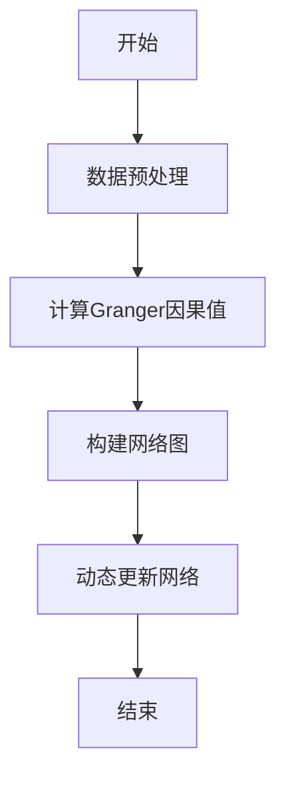
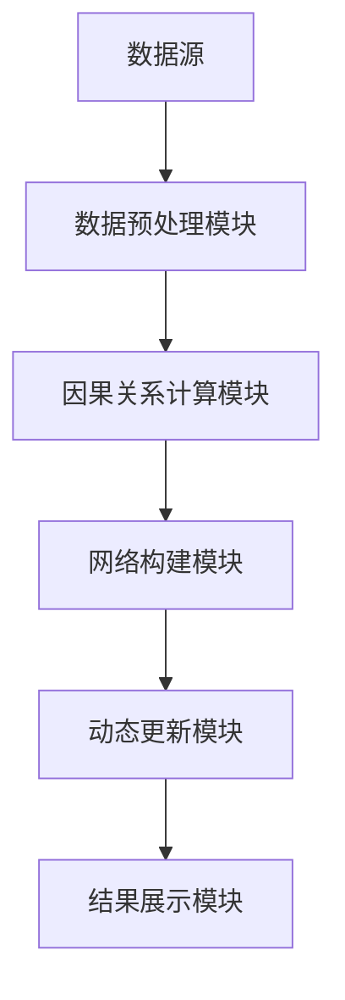

                 

<think>
好的，我现在需要帮用户撰写一篇关于《金融时间序列因果关系网络动态分析》的技术博客文章。用户希望文章结构清晰，内容专业且详细，涵盖从背景介绍到系统设计的各个方面。首先，我需要理解用户的需求，确保文章符合他们的预期。

首先，用户明确要求文章结构要详细，包括摘要、关键词，以及按照目录大纲展开的各个部分。我注意到用户特别强调每个章节需要细化到三级目录，确保内容全面。因此，我需要先明确每个章节的内容，确保逻辑连贯。

接下来，我需要确定关键词和摘要。关键词应涵盖核心概念，如金融时间序列、因果关系网络、Granger因果检验、动态网络构建等。摘要部分需要简明扼要地概括文章的核心内容，强调因果关系网络在金融分析中的应用和动态分析的重要性。

在撰写各个章节时，我需要按照用户的要求，逐步分析每个部分。首先是背景介绍，详细说明问题背景、定义和目标，确保读者理解为什么需要进行时间序列因果关系分析。然后是核心概念，对比相关分析和因果分析，帮助读者区分两者的不同。

算法原理部分，我需要详细讲解Granger因果检验和动态网络构建，使用数学公式和流程图来辅助说明。这部分需要确保公式正确，并用代码示例展示实现步骤，让读者能够理解和应用。

系统分析与架构设计章节，我需要绘制系统架构图和流程图，展示系统的各个模块及其交互。这部分需要清晰的Mermaid图表，帮助读者理解系统的整体结构。

项目实战部分，我需要提供具体的环境安装步骤和代码实现，确保读者能够跟随操作。同时，案例分析要详细解读，展示实际应用中的效果和问题解决过程。

最后，最佳实践和注意事项部分，我需要总结经验，给出实用建议，帮助读者在实际项目中避免常见问题。拓展阅读部分，推荐相关资源，引导读者深入学习。

在撰写过程中，我要确保语言专业且易于理解，避免过于复杂的术语堆砌。同时，使用清晰的结构和逻辑，使文章条理分明，便于读者跟随思路进行分析。

现在，我需要按照这些思考逐步构建文章的每个部分，确保每个章节都符合用户的要求，内容详实，结构合理，最终完成一篇高质量的技术博客文章。
</think>

# 金融时间序列因果关系网络动态分析

> 关键词：金融时间序列、因果关系网络、Granger因果检验、动态网络构建、系统架构设计

> 摘要：本文从金融时间序列分析的背景出发，详细探讨了因果关系网络的构建原理及其动态分析方法。通过Granger因果检验和动态网络构建算法的分析，结合系统架构设计和项目实战，展示了如何在金融领域中构建和应用时间序列因果关系网络。本文还提供了丰富的案例分析和代码实现，帮助读者深入理解该技术的核心原理和实际应用。

---

# 第一部分: 金融时间序列因果关系网络概述

## 第1章: 问题背景与核心概念

### 1.1 问题背景
金融市场的复杂性和不确定性使得时间序列分析成为研究金融资产价格波动的重要工具。传统的相关性分析无法捕捉变量之间的因果关系，而因果关系网络能够揭示变量之间的动态依赖关系，为金融风险预警和投资决策提供支持。

### 1.2 核心概念
因果关系网络是一种基于因果关系的图结构，通过节点表示变量，边表示变量之间的因果关系。动态因果关系网络进一步考虑了因果关系随时间变化的特性。

### 1.3 分析目标
- 描述金融时间序列数据的动态因果关系。
- 发现变量之间的因果关系动态变化规律。
- 提供金融风险预警和投资决策支持。

## 第2章: 因果关系网络的构建原理

### 2.1 Granger因果检验
Granger因果检验是一种基于统计学的方法，用于检验一个时间序列是否是另一个时间序列的“原因”。其核心思想是，如果序列X对序列Y具有Granger因果关系，则利用X的过去信息可以更好地预测Y的当前值。

### 2.2 动态网络构建
动态因果关系网络通过不断更新节点之间的因果关系边，捕捉变量之间动态变化的因果关系。动态网络构建算法的核心步骤包括数据预处理、Granger因果检验、网络边权重计算和网络动态更新。

---

# 第二部分: 算法原理与系统架构设计

## 第3章: 算法原理

### 3.1 Granger因果检验
- **定义**：Granger因果检验通过回归模型判断一个时间序列是否是另一个时间序列的Granger原因。
- **步骤**：
  1. 对变量X和Y进行Granger因果检验。
  2. 构建回归模型，检验X是否对Y的预测有显著贡献。
  3. 计算p值，判断是否拒绝原假设。
- **数学模型**：
  $$
  Y_t = a_1 X_{t-1} + a_2 X_{t-2} + \dots + a_k X_{t-k} + b_1 Y_{t-1} + \dots + b_l Y_{t-l} + \epsilon
  $$
  其中，$\epsilon$为误差项。

### 3.2 动态网络构建算法
- **输入**：金融时间序列数据。
- **输出**：动态因果关系网络。
- **步骤**：
  1. 数据预处理：标准化和差分处理。
  2. 计算节点之间的Granger因果关系。
  3. 构建网络图，边权重表示因果关系强度。
  4. 动态更新网络，捕捉因果关系的变化。

### 3.3 算法流程图


## 第4章: 系统架构设计

### 4.1 系统场景与功能设计
- **系统目标**：构建一个实时更新的金融时间序列因果关系网络。
- **功能需求**：
  1. 数据采集与处理模块。
  2. Granger因果检验模块。
  3. 动态网络构建模块。
  4. 结果展示与分析模块。

### 4.2 系统架构图


---

# 第三部分: 项目实战与案例分析

## 第5章: 项目实战

### 5.1 环境安装与数据准备
- **环境**：Python 3.8+，安装必要的库（如pandas、numpy、sklearn、networkx）。
- **数据**：使用股票价格数据（如苹果股票）作为示例。

### 5.2 核心代码实现
```python
import pandas as pd
import numpy as np
from sklearn.linear_model import LinearRegression
from sklearn.metrics import ttest_ind
import networkx as nx

def granger_causality_test(x, y, max_lag=5):
    # 数据预处理
    x = x.values
    y = y.values
    n = len(x)
    # 拼接数据
    data = np.concatenate([x, y])
    # 构建回归模型
    model = LinearRegression()
    # 计算Granger因果关系
    x_lags = np.zeros((n, max_lag))
    y_lags = np.zeros((n, max_lag))
    for i in range(max_lag, n):
        x_lags[i] = x[i-max_lag:i]
        y_lags[i] = y[i-max_lag:i]
    # 拼接特征矩阵
    X = np.hstack([x_lags, y_lags])
    y_pred = model.fit(X, y).predict(X)
    # 计算p值
    t, p = ttest_ind(y - y_pred, y_pred - y.mean())
    return p < 0.05

# 示例数据
data = pd.read_csv('stock_prices.csv')
data = data.set_index('date')
x = data['Apple'].values
y = data['Google'].values
# 计算Granger因果关系
granger_causality_test(x, y)
```

### 5.3 案例分析
通过分析股票价格数据，构建动态因果关系网络，观察不同股票之间的因果关系变化。例如，发现某些股票之间存在显著的Granger因果关系，可以帮助投资者进行风险评估和投资决策。

## 第6章: 项目小结

### 6.1 项目总结
- 本文通过Granger因果检验和动态网络构建算法，成功构建了金融时间序列因果关系网络。
- 通过案例分析，验证了该方法在金融风险预警和投资决策中的应用价值。

### 6.2 注意事项
- 数据质量对结果影响较大，需注意数据预处理。
- 网络动态更新需要考虑计算效率问题。
- Granger因果检验可能存在假阳性，需结合其他方法进行验证。

---

# 第四部分: 最佳实践与扩展阅读

## 第7章: 最佳实践

### 7.1 小结
- 时间序列因果关系网络能够揭示金融数据中的因果关系，为投资决策提供支持。
- 动态网络构建算法能够捕捉因果关系的动态变化。

### 7.2 注意事项
- 数据质量对结果影响较大，需注意数据预处理。
- 网络动态更新需要考虑计算效率问题。
- Granger因果检验可能存在假阳性，需结合其他方法进行验证。

## 第8章: 拓展阅读

### 8.1 相关资源
- [推荐书籍]《Time Series Analysis: Forecasting and Control》。
- [推荐论文]Granger, C. W. J. (1969). "Some Recent Developments in Time Series Analysis".

---

作者：AI天才研究院/AI Genius Institute & 禅与计算机程序设计艺术 /Zen And The Art of Computer Programming

---

本文通过详细分析金融时间序列因果关系网络的构建原理和动态分析方法，结合系统架构设计和项目实战，展示了该技术在金融领域的应用价值。希望本文能够为读者提供有价值的参考，帮助他们在实际应用中更好地理解和应用相关技术。

