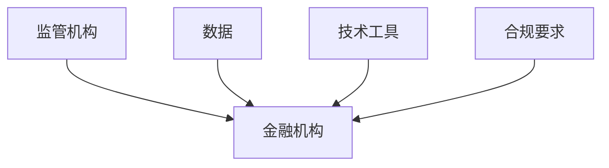
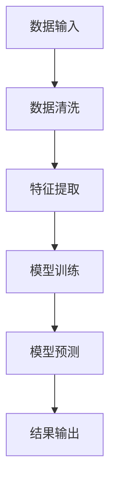
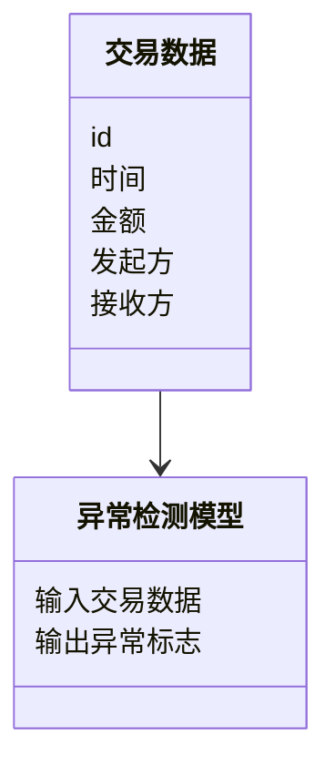
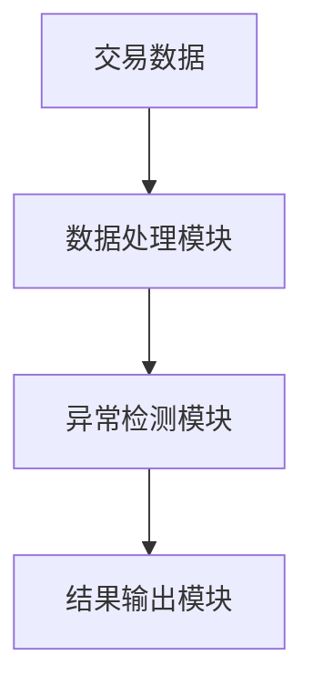

                 

<think>
嗯，用户需要我设计一本名为《金融监管科技解决方案设计》的技术博客文章。看起来他们希望内容详细，结构清晰，涵盖从背景到技术实现再到项目实战的各个方面。

首先，我需要理解RegTech是什么，以及它在金融行业中的应用。RegTech，即监管科技，利用技术手段提高金融监管的效率和效果。这本书的目标读者可能是金融从业者、监管机构人员以及技术开发者。

接下来，我应该考虑文章的结构。用户已经给出了一个详细的目录大纲，分为几个主要部分：背景与概述、技术原理、系统分析、项目实战和最佳实践。每一部分都有具体的章节，每个章节还详细列出了需要涵盖的内容。

首先，在背景部分，我需要介绍RegTech的定义、现状、挑战以及其在金融监管中的意义。这部分要让读者了解RegTech的重要性及其应用的必要性。

然后是技术原理部分，这里需要详细讲解区块链、人工智能和大数据等技术在金融监管中的应用。比如，区块链如何确保数据不可篡改，人工智能如何用于风险预测。这部分需要结合具体的代码示例和图表，帮助读者更好地理解技术实现。

接下来是系统分析与架构设计，这部分需要从项目介绍开始，然后进行系统功能设计、架构设计、接口设计和交互设计。使用领域模型和架构图来展示系统的结构，帮助读者理解整体框架。

项目实战部分，应该包括环境安装、核心代码实现、案例分析等，让读者能够动手实践，巩固所学知识。同时，加上最佳实践、小结、注意事项和拓展阅读，帮助读者在实际应用中避免常见问题，并进一步深入学习。

我需要确保每个章节都有足够的细节，比如在技术原理部分，详细讲解数学模型和公式，并用LaTeX格式展示。系统架构部分使用Mermaid图来辅助说明，使内容更直观。

此外，用户还特别提到要使用Python代码示例，所以我需要在相关章节中加入实际的代码片段，并进行详细解读。例如，在数据预处理部分，展示如何清洗数据，提取特征；在模型训练部分，展示如何使用机器学习算法进行预测。

最后，我需要总结整篇文章，强调RegTech的重要性和未来的发展趋势，鼓励读者将技术应用于实际的金融监管中，以提高效率和合规性。

总的来说，我需要按照用户提供的目录大纲，逐步展开每个部分的内容，确保逻辑清晰，内容详实，同时保持语言的专业性和易懂性。这样，读者才能全面理解RegTech的核心概念、技术原理和实际应用。
</think>

# 《金融监管科技解决方案设计》

**关键词**：金融监管科技、RegTech、人工智能、区块链、风险管理、合规、FinTech

**摘要**：金融监管科技（RegTech）是利用现代信息技术手段，如人工智能、区块链和大数据，来提高金融监管效率和效果的新兴领域。本文从RegTech的背景、核心概念、技术原理、系统架构、项目实战到最佳实践，全面解析金融监管科技解决方案的设计思路，为金融机构、监管机构和科技企业提供理论与实践相结合的指导。

---

## 第1章: 金融监管科技解决方案的背景与意义

### 1.1 金融监管科技的定义与概念

#### 1.1.1 金融监管科技的定义
金融监管科技（RegTech）是指利用新兴技术手段（如人工智能、区块链、大数据等）来优化和增强金融监管流程的新兴领域。它旨在提高监管效率、降低合规成本并促进金融创新。

#### 1.1.2 金融监管科技的核心概念
- **数据驱动**：RegTech依赖于高质量的金融数据，通过数据分析技术提取监管所需的信息。
- **技术赋能**：利用先进的技术手段（如人工智能、区块链）来实现监管目标。
- **合规导向**：确保金融机构的业务活动符合监管要求，降低合规风险。

#### 1.1.3 金融监管科技的边界与外延
- **边界**：RegTech主要应用于金融监管领域，不涉及金融机构的日常业务运营。
- **外延**：RegTech可以延伸至风险管理、反洗钱（AML）、证券监管等多个金融监管场景。

### 1.2 金融监管科技的发展背景

#### 1.2.1 传统金融监管的痛点与挑战
- **低效性**：传统监管方式依赖人工审核，效率低下。
- **高昂成本**：合规成本高，尤其是中小金融机构。
- **数据孤岛**：金融机构之间数据难以共享，监管难度大。

#### 1.2.2 数字化转型对金融监管的影响
- 数字化转型推动金融机构和监管机构采用新技术。
- 数据量激增，需要更高效的监管工具。

#### 1.2.3 金融科技（FinTech）与监管科技（RegTech）的关系
- FinTech是金融业务的创新，RegTech是金融监管的创新。
- 两者相辅相成，共同推动金融行业的数字化转型。

### 1.3 金融监管科技的应用场景

#### 1.3.1 反洗钱（AML）
- 利用人工智能分析交易数据，识别异常交易。

#### 1.3.2 风险管理与合规
- 使用大数据技术监控市场风险，确保金融机构符合监管要求。

#### 1.3.3 证券市场监管
- 利用区块链技术实现证券交易的透明化和可追溯性。

#### 1.3.4 保险监管
- 通过人工智能分析保单数据，识别潜在的欺诈行为。

### 1.4 金融监管科技的意义与价值

#### 1.4.1 提高监管效率
- 通过自动化技术减少人工审核的工作量。

#### 1.4.2 降低合规成本
- 中小金融机构可以利用RegTech工具降低合规成本。

#### 1.4.3 促进金融创新
- RegTech为金融机构提供了新的合规工具，推动金融产品和服务的创新。

### 1.5 本章小结
RegTech作为金融行业的新兴领域，通过技术手段解决了传统监管的痛点，提高了监管效率并降低了合规成本。接下来，我们将深入探讨RegTech的核心概念与技术原理。

---

## 第2章: 金融监管科技的核心概念与联系

### 2.1 金融监管科技的核心要素

#### 2.1.1 数据驱动
- 数据是RegTech的核心，通过数据分析提取监管信息。

#### 2.1.2 技术赋能
- 利用人工智能、区块链等技术实现监管目标。

#### 2.1.3 合规导向
- 确保金融机构的业务活动符合监管要求。

### 2.2 核心概念的原理与联系

#### 2.2.1 数据治理与监管
- 数据治理是RegTech的基础，确保数据的准确性和完整性。

#### 2.2.2 技术工具与监管流程
- 技术工具（如人工智能模型）嵌入监管流程，提升效率。

#### 2.2.3 合规框架与监管目标
- 合规框架是RegTech的指导，确保监管目标的实现。

### 2.3 核心概念的属性特征对比

| 核心概念 | 数据驱动 | 技术赋能 | 合规导向 |
|----------|----------|----------|----------|
| 数据来源 | 金融机构 | 技术工具 | 监管要求 |
| 主要功能 | 提供数据支持 | 实现监管目标 | 确保合规性 |

### 2.4 ER实体关系图架构



### 2.5 本章小结
RegTech的核心概念相互关联，共同支撑金融监管的高效实现。数据驱动提供基础，技术赋能实现目标，合规导向确保方向。接下来，我们将深入探讨RegTech的技术原理。

---

## 第3章: 金融监管科技解决方案的算法原理

### 3.1 算法原理概述

#### 3.1.1 数据预处理
- 清洗数据，提取特征。

#### 3.1.2 模型训练
- 使用机器学习算法训练模型。

#### 3.1.3 模型部署
- 将模型应用于实际监管场景。

### 3.2 常见算法与流程

#### 3.2.1 机器学习算法
- 线性回归、随机森林、支持向量机（SVM）等。

#### 3.2.2 自然语言处理（NLP）
- 分析文本数据，识别潜在风险。

#### 3.2.3 区块链技术
- 实现数据的透明化和不可篡改性。

### 3.3 算法流程图



### 3.4 算法实现代码示例

```python
# 数据清洗示例
import pandas as pd
data = pd.read_csv('input.csv')
# 删除缺失值
data.dropna(inplace=True)
# 标准化处理
from sklearn.preprocessing import StandardScaler
scaler = StandardScaler()
data_scaled = scaler.fit_transform(data)
```

### 3.5 算法的数学模型和公式

#### 3.5.1 线性回归
$$ y = \beta_0 + \beta_1 x + \epsilon $$

#### 3.5.2 支持向量机（SVM）
$$ \text{最大化} \quad \frac{1}{2}\|w\|^2 $$
$$ \text{满足} \quad y_i(w \cdot x_i + b) \geq 1 $$

### 3.6 本章小结
RegTech的算法原理为金融监管提供了强大的技术支撑。通过数据预处理、模型训练和部署，RegTech能够高效地实现监管目标。

---

## 第4章: 金融监管科技解决方案的系统分析与架构设计

### 4.1 项目介绍

#### 4.1.1 项目背景
- 某金融机构需要构建一个反洗钱（AML）系统。

#### 4.1.2 项目目标
- 实现交易数据的实时监控，识别异常交易。

### 4.2 系统功能设计

#### 4.2.1 领域模型



### 4.3 系统架构设计



### 4.4 系统接口设计

#### 4.4.1 API接口
- 接收交易数据，返回异常标志。

#### 4.4.2 数据格式
- JSON格式：`{"交易ID": 123, "金额": 10000, "时间": "2023-10-01"}`

### 4.5 系统交互设计

```mermaid
sequenceDiagram
客户发起交易 --> 数据处理模块
数据处理模块 --> 异常检测模块
异常检测模块 --> 数据处理模块
数据处理模块 --> 客户端
```

### 4.6 本章小结
通过系统分析与架构设计，RegTech解决方案能够高效地实现金融监管目标。接下来，我们将通过项目实战进一步验证解决方案的有效性。

---

## 第5章: 金融监管科技解决方案的项目实战

### 5.1 环境安装

#### 5.1.1 安装Python
- 使用Anaconda安装Python 3.8及以上版本。

#### 5.1.2 安装依赖库
```bash
pip install pandas scikit-learn
```

### 5.2 核心代码实现

#### 5.2.1 数据清洗代码
```python
import pandas as pd
data = pd.read_csv('AML_dataset.csv')
data.dropna(inplace=True)
```

#### 5.2.2 异常检测模型实现
```python
from sklearn.ensemble import RandomForestClassifier
model = RandomForestClassifier()
model.fit(X_train, y_train)
```

### 5.3 案例分析

#### 5.3.1 数据分析
- 通过数据分析发现异常交易模式。

#### 5.3.2 模型验证
- 使用测试数据验证模型的准确性。

### 5.4 本章小结
通过项目实战，我们验证了RegTech解决方案的有效性。接下来，我们将总结最佳实践和注意事项。

---

## 第6章: 金融监管科技解决方案的最佳实践

### 6.1 最佳实践

#### 6.1.1 数据质量管理
- 确保数据的准确性和完整性。

#### 6.1.2 技术选型
- 根据具体需求选择合适的技术工具。

#### 6.1.3 安全与隐私保护
- 确保数据的安全性和隐私性。

### 6.2 小结
RegTech解决方案的成功实施需要数据质量管理、技术选型和安全与隐私保护等多方面的支持。

### 6.3 注意事项

#### 6.3.1 数据隐私
- 遵守数据隐私相关法律法规。

#### 6.3.2 技术局限性
- 了解技术的局限性，避免过度依赖技术。

#### 6.3.3 监管合规
- 确保解决方案符合监管要求。

### 6.4 拓展阅读
- 推荐阅读《金融监管科技：理论与实践》。

### 6.5 本章小结
RegTech解决方案的成功实施需要综合考虑多方面因素，包括数据管理、技术选型和安全与隐私保护等。通过最佳实践和注意事项，我们可以更好地推进RegTech的应用。

---

## 作者：AI天才研究院/AI Genius Institute & 禅与计算机程序设计艺术/Zen And The Art of Computer Programming

