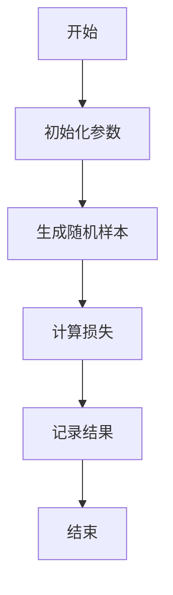
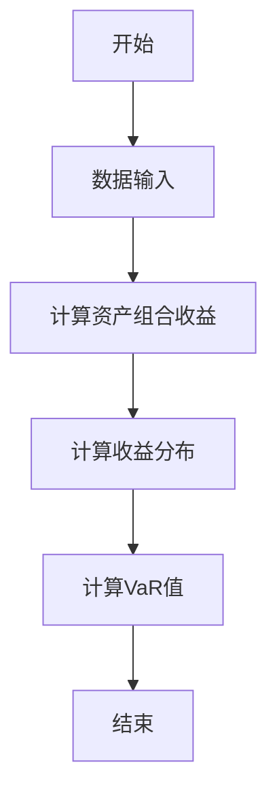
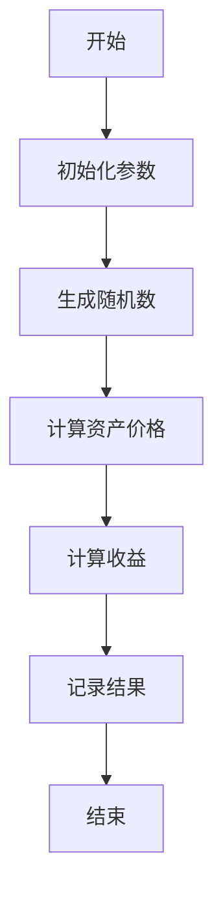
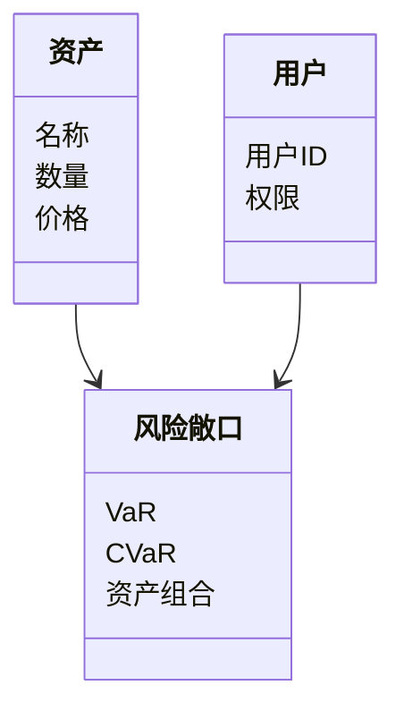
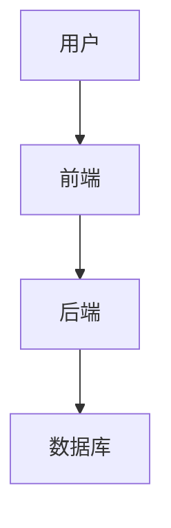
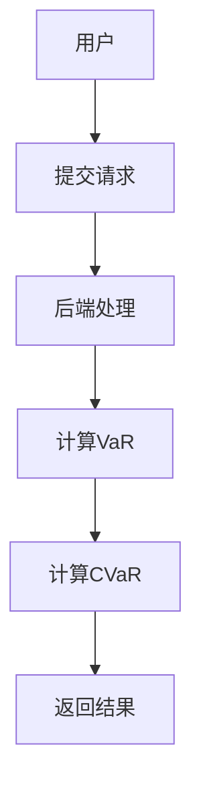

                 


# 《金融衍生品风险敞口分析》

---

## 关键词：  
金融衍生品，风险敞口，VaR，CVaR，蒙特卡洛模拟，风险管理，金融建模  

---

## 摘要：  
金融衍生品是现代金融体系的重要组成部分，但其复杂性和杠杆效应使得风险敞口分析成为金融机构和投资者关注的核心问题。本文系统地介绍金融衍生品的基本概念、风险敞口的度量方法，以及基于定量分析的金融风险管理策略。通过结合理论与实践，本文深入探讨了如何利用VaR、CVaR等风险指标，结合蒙特卡洛模拟等算法，构建高效的金融衍生品风险敞口分析系统。  

---

# 第1章: 金融衍生品与风险敞口概述  

## 1.1 金融衍生品的定义与特点  

### 1.1.1 金融衍生品的定义  
金融衍生品（Financial Derivatives）是基于基础金融资产（如股票、债券、商品等）或市场变量（如利率、汇率、指数等）的衍生金融工具。其价值取决于基础资产的价格变动。  

### 1.1.2 金融衍生品的核心特点  
- **杠杆效应**：衍生品通常具有高杠杆性，小的价格波动可能导致较大的收益或损失。  
- **非线性收益**：衍生品的收益与价格变动并非线性关系，例如期权的收益曲线是非线性的。  
- **复杂性**：衍生品的定价和风险分析需要复杂的数学模型和假设条件。  

### 1.1.3 金融衍生品的分类与应用场景  
- **期权**：买方有权在特定时间以特定价格买入或卖出标的资产。  
- **期货**：双方约定在未来特定时间以特定价格买卖标的资产。  
- **互换**：双方约定在未来特定时间交换现金流。  
- **掉期**：类似于互换，但通常涉及资产或负债的交换。  

---

## 1.2 风险敞口的定义与重要性  

### 1.2.1 风险敞口的定义  
风险敞口（Risk Exposure）是指在特定市场条件下，资产或投资组合的潜在损失或收益。它反映了资产或组合对市场风险因素（如价格波动、利率变化等）的敏感性。  

### 1.2.2 风险敞口的分类与度量  
- **市场风险**：由于市场价格波动导致的损失。  
- **信用风险**：由于交易对手违约导致的损失。  
- **流动性风险**：由于资产无法快速变现导致的损失。  

### 1.2.3 风险敞口分析的目的与意义  
- **风险识别**：识别投资组合中可能存在的潜在风险。  
- **风险量化**：量化风险敞口的大小和影响。  
- **风险控制**：制定风险管理策略，降低潜在损失。  

---

## 1.3 金融衍生品风险敞口分析的背景与挑战  

### 1.3.1 金融危机案例分析  
2008年全球金融危机就是一个典型的案例，许多金融机构因过度依赖复杂的衍生品（如 mortgage-backed securities）而遭受巨大损失。  

### 1.3.2 风险敞口分析的复杂性  
- 衍生品的非线性定价模型。  
- 多重风险因素的相互作用。  

### 1.3.3 数字化与智能化分析的必要性  
随着计算能力的提升，金融机构开始依赖于量化方法和算法，以更精确地分析和管理风险敞口。  

---

## 1.4 本章小结  
本章介绍了金融衍生品的基本概念、分类及其风险敞口分析的重要性。通过案例分析，我们认识到在复杂市场环境下，准确分析风险敞口是金融机构稳健经营的关键。  

---

# 第2章: 金融衍生品风险敞口分析的核心概念  

## 2.1 风险敞口分析的理论基础  

### 2.1.1 风险中性定价原理  
风险中性定价假设市场参与者对风险持中性态度，即在定价时仅考虑风险调整后的收益率。  

### 2.1.2 市场风险与信用风险的区分  
- **市场风险**：与市场价格波动相关。  
- **信用风险**：与交易对手违约相关。  

### 2.1.3 VaR与CVaR的定义与区别  

---

## 2.2 风险敞口分析的关键指标  

### 2.2.1 VaR的计算方法  
VaR是指在给定置信水平下，投资组合可能的最大损失。  

$$ VaR = \text{损失的分位数} $$  

### 2.2.2 CVaR的计算方法  
CVaR是指在VaR的基础上，计算超过VaR的平均损失。  

$$ CVaR = \frac{1}{1 - \alpha} \int_{\alpha}^{1} \text{损失} dF $$  

---

## 2.3 风险敞口分析的数学模型  

### 2.3.1 风险敞口的线性与非线性模型  
- 线性模型：适用于资产价格呈线性关系的情况。  
- 非线性模型：适用于资产价格呈非线性关系的情况。  

### 2.3.2 风险敞口的蒙特卡洛模拟方法  



---

## 2.4 核心概念对比表  

### 表2.1: VaR与CVaR的对比  
| 特性      | VaR                | CVaR               |  
|-----------|--------------------|--------------------|  
| 定义      | 损失的分位数        | 超过VaR的平均损失    |  
| 优点      | 计算简单            | 更全面考虑尾部风险    |  
| 缺点      | 仅考虑分位数，可能低估风险 | 计算复杂            |  

---

## 2.5 VaR计算流程图  



---

## 2.6 本章小结  
本章介绍了风险敞口分析的核心概念，包括VaR和CVaR的定义、计算方法以及蒙特卡洛模拟的应用。通过对比分析，我们理解了不同风险指标的特点与适用场景。  

---

# 第3章: 金融衍生品风险敞口分析的算法原理  

## 3.1 蒙特卡洛模拟的原理与实现  

### 3.1.1 蒙特卡洛模拟的原理  
蒙特卡洛模拟是一种通过随机采样方法，模拟资产价格波动，从而计算风险敞口的方法。  

### 3.1.2 蒙特卡洛模拟的实现步骤  



### 3.1.3 Python代码实现  

```python
import numpy as np

def monte_carlo_simulation(assets, num_simulations=1000):
    returns = np.random.normal(0, 1, size=(num_simulations, len(assets)))
    asset_prices = np.exp(returns.cumsum())
    return asset_prices
```

---

## 3.2 波动率建模与风险计算  

### 3.2.1 波动率模型的原理  
波动率建模是蒙特卡洛模拟的重要部分，常用GARCH模型来估计资产价格的波动率。  

### 3.2.2 波动率建模的实现  

```python
import arch

def estimate_volatility(returns, lags=1):
    model = arch.arch_model(returns, lags=lags)
    res = model.fit()
    return res.params['omega'] + res.params['alpha'] * res.params['alpha']
```

---

## 3.3 数学模型与公式解析  

### 3.3.1 VaR的数学公式  
$$ VaR = \mu + z \cdot \sigma $$  
其中，$\mu$是均值，$z$是分位数，$\sigma$是标准差。  

### 3.3.2 CVaR的数学公式  
$$ CVaR = \frac{1}{1 - \alpha} \int_{\alpha}^{1} x dF(x) $$  

---

## 3.4 本章小结  
本章详细讲解了蒙特卡洛模拟的原理与实现，以及波动率建模的方法。通过Python代码示例，我们理解了如何将理论应用于实际的风险敞口分析。  

---

# 第4章: 金融衍生品风险敞口分析的系统架构设计  

## 4.1 问题场景介绍  
本章以一个金融机构的投资组合管理为例，设计一个风险敞口分析系统。  

## 4.2 系统功能设计  

### 4.2.1 领域模型设计  



---

## 4.3 系统架构设计  



---

## 4.4 系统接口设计  
- 前端接口：用户输入资产组合信息。  
- 后端接口：接收输入，计算VaR和CVaR，返回结果。  

---

## 4.5 系统交互流程  



---

## 4.6 本章小结  
本章通过系统架构设计，展示了如何将风险敞口分析技术应用于实际场景。通过领域模型和架构图，我们理解了系统的组成与交互流程。  

---

# 第5章: 金融衍生品风险敞口分析的项目实战  

## 5.1 项目背景与目标  
以股票期权的风险敞口分析为例，设计一个完整的分析系统。  

## 5.2 环境配置  

### 5.2.1 Python环境  
- 安装必要的库：`numpy`, `pandas`, `arch`, `scipy`。  

### 5.2.2 数据准备  
- 获取标的股票的历史价格数据。  

---

## 5.3 核心代码实现  

### 5.3.1 数据处理  

```python
import pandas as pd
import numpy as np

# 读取数据
data = pd.read_csv('stock_prices.csv')
returns = data.pct_change().dropna()
```

### 5.3.2 风险计算  

```python
from arch import arch_model

# 计算波动率
model = arch_model(returns)
res = model.fit()
variance = res.params['omega'] + res.params['alpha'] * res.params['alpha']
```

### 5.3.3 蒙特卡洛模拟  

```python
def simulate_prices(returns, num_simulations=1000):
    mu = returns.mean()
    sigma = returns.std()
    simulations = np.random.normal(mu, sigma, size=(num_simulations, len(returns)))
    prices = np.exp(simulations.cumsum())
    return prices
```

---

## 5.4 结果分析与解读  
- VaR和CVaR的结果反映了期权的风险敞口。  
- 通过对比分析，优化风险控制策略。  

---

## 5.5 项目小结  
本章通过一个具体的案例，展示了如何将理论应用于实际的金融衍生品风险敞口分析。通过代码实现，我们理解了风险计算的全过程。  

---

# 第6章: 最佳实践与小结  

## 6.1 最佳实践 tips  
- 在实际应用中，建议结合多种风险指标进行综合分析。  
- 定期更新模型参数，以适应市场变化。  

## 6.2 小结  
本文系统地介绍了金融衍生品风险敞口分析的核心概念、算法原理和系统设计。通过项目实战，我们理解了如何将理论应用于实际。  

## 6.3 注意事项  
- 风险分析结果仅供参考，实际操作需结合市场环境和机构策略。  
- 模型假设可能与实际情况存在偏差，需谨慎使用。  

## 6.4 拓展阅读  
- 建议深入学习GARCH模型和更复杂的蒙特卡洛模拟方法。  

---

# 作者：AI天才研究院/AI Genius Institute & 禅与计算机程序设计艺术/Zen And The Art of Computer Programming  

--- 

希望这篇文章能为您提供深入的金融衍生品风险敞口分析的洞见！如果需要进一步探讨或扩展内容，请随时告知！

