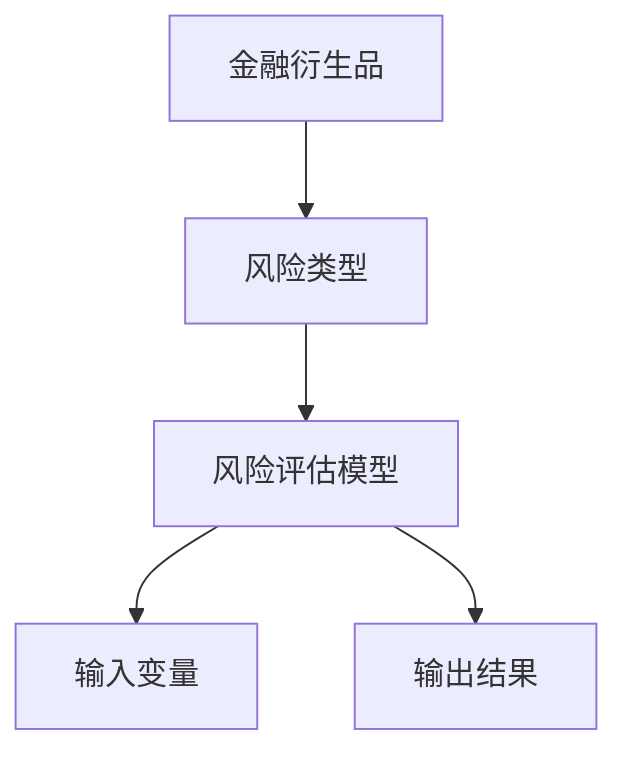
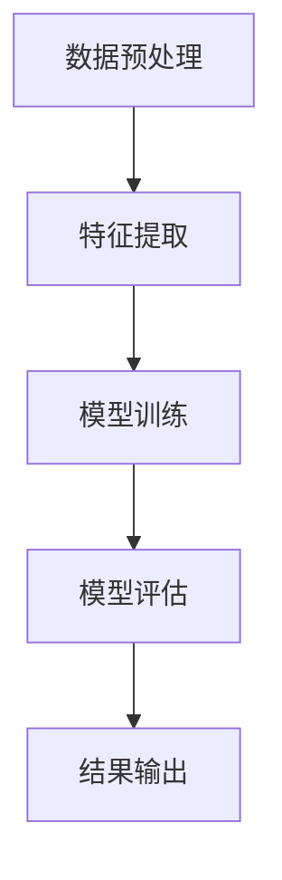
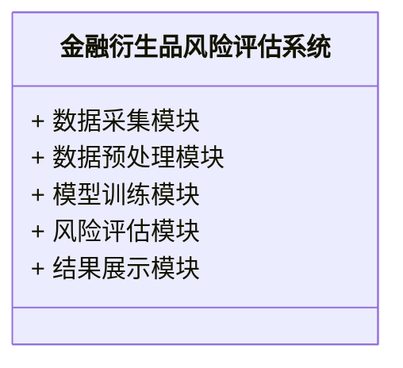
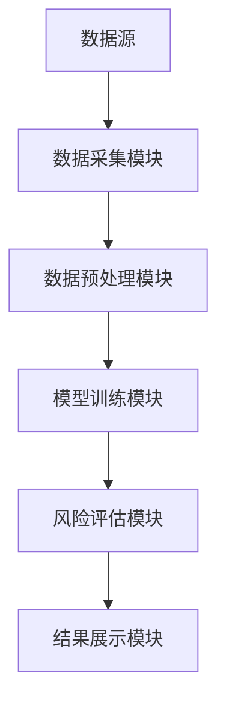

                 

<think>
好的，我现在需要帮助用户撰写一篇关于《金融衍生品风险评估模型》的技术博客文章，并且要按照用户提供的大纲结构来完成。首先，我要理解用户的具体需求，他们希望文章结构清晰，逻辑严谨，内容详细，并且使用专业的技术语言。

首先，我会从文章的标题和摘要开始。标题是《金融衍生品风险评估模型》，摘要部分需要概括文章的核心内容，包括背景、模型的重要性和应用。接下来，我会按照用户提供的目录结构来撰写各个章节。

在第1章，我需要介绍金融衍生品的基本概念，包括期货、期权等，并解释为什么需要风险评估模型。这章要让读者明白金融衍生品的多样性和复杂性，以及风险评估的重要性。

第2章会深入讨论风险评估模型的背景与需求。这里，我要详细分析金融衍生品中的主要风险类型，比如市场风险、信用风险和操作风险。同时，我需要解释这些风险如何影响金融机构的决策和监管要求。

第3章是核心概念与联系。我需要解释模型的基本原理，包括输入变量和输出结果，以及模型的假设条件。为了帮助读者理解，我会使用ER实体关系图来展示模型的架构，这样读者可以一目了然地看到各个部分之间的关系。

接下来，第4章是算法原理。这里，我会详细描述模型构建的流程，包括数据预处理、特征提取、模型训练和评估。为了更直观，我会用Mermaid流程图来展示这些步骤。同时，我需要提供Python代码示例，让读者能够实际操作，比如使用NumPy库进行数据分析和计算。

在第5章，我会深入讲解数学模型。首先，我会介绍VaR（在险价值）和CVaR（预期短缺）的概念，并提供相应的公式。例如，VaR的计算公式是$$\text{VaR} = \mu + z \times \sigma$$，其中$$z$$是标准正态分布的分位数，$$\mu$$是均值，$$\sigma$$是标准差。然后，我会展示如何用Python代码实现这些模型，让读者能够将理论应用到实际中。

第6章是系统分析与架构设计。我会从项目背景出发，介绍金融衍生品风险评估系统的功能模块，比如数据采集、模型训练和风险评估。使用Mermaid类图和架构图来展示系统的结构，帮助读者理解系统的整体设计。同时，我会描述系统的接口设计和交互流程，让读者了解系统的实际操作流程。

第7章是项目实战。我会指导读者如何安装必要的Python库，比如NumPy和Pandas，并提供完整的代码实现。例如，如何处理数据、训练模型以及评估风险。通过实际案例分析，让读者能够通过代码实践模型的应用。

最后，第8章是最佳实践与小结。我会总结项目中的经验和技巧，比如数据清洗的重要性、模型调参的技巧以及结果验证的方法。同时，我会提醒读者注意模型的局限性和潜在的风险，确保在实际应用中能够避免这些问题。

在文章的最后，我会添加参考文献，推荐一些相关的书籍和论文，供读者进一步学习和研究。同时，文章末尾会加上作者信息，感谢读者的支持。

总的来说，我需要确保每个章节的内容都详细且具体，使用图表和代码示例来增强可读性。同时，保持逻辑清晰，结构紧凑，使读者能够逐步理解并掌握金融衍生品风险评估模型的核心内容。
</think>

# 金融衍生品风险评估模型

## 关键词：金融衍生品，风险评估，数学模型，Python实现，系统架构

## 摘要：
本文详细探讨了金融衍生品风险评估模型的构建与应用。通过分析金融衍生品的主要风险类型，阐述了风险评估模型的核心概念、算法原理、数学模型以及系统架构设计。文章结合实际案例，展示了如何利用Python编程实现风险评估模型，并提供了详细的代码实现与解读。最后，本文总结了最佳实践经验和注意事项，为金融从业者提供了实用的参考。

---

## 第1章: 金融衍生品与风险概述

### 1.1 金融衍生品的基本概念

#### 1.1.1 金融衍生品的定义
金融衍生品（Financial Derivatives）是以标的资产（如股票、债券、商品、指数等）为基础，通过特定协议约定在未来某一特定时间以预定价格买卖该资产的金融工具。其核心特征在于其衍生性和杠杆效应。

#### 1.1.2 金融衍生品的主要类型
金融衍生品可以分为以下几类：
1. **期货（Futures）**：约定在未来某一时间以预定价格买卖标的资产的合约。
2. **期权（Options）**：买方有权在特定时间内以预定价格买入或卖出标的资产的合约。
3. **掉期（Swaps）**：约定在未来某一时间以预定价格交换标的资产或现金流的合约。
4. **互换（Forwards）**：类似于期货的一种定制化衍生品。

#### 1.1.3 金融衍生品的市场现状
金融衍生品市场是全球最大的金融市场之一，市场规模远超基础资产市场。衍生品的广泛应用使得金融市场的复杂性和风险性显著增加。

---

### 1.2 风险评估的重要性

#### 1.2.1 风险评估的基本概念
风险评估是通过分析可能的负面事件及其发生的概率，量化其潜在影响的过程。在金融衍生品领域，风险评估的核心目标是识别、测量和管理可能的损失。

#### 1.2.2 金融衍生品中的主要风险类型
1. **市场风险**：由于市场价格波动导致的损失。
2. **信用风险**：由于交易对手违约导致的损失。
3. **操作风险**：由于操作失误或系统故障导致的损失。

#### 1.2.3 风险评估在金融决策中的作用
风险评估是金融衍生品定价、投资决策、资产配置和风险管理的基础。准确的风险评估能够帮助金融机构制定合理的风险控制策略，避免重大损失。

---

## 第2章: 金融衍生品风险评估模型的背景与需求

### 2.1 金融衍生品风险的复杂性

#### 2.1.1 市场风险
市场风险是金融衍生品中最主要的风险类型之一，其来源包括利率、汇率、股票价格等市场的波动。

#### 2.1.2 信用风险
信用风险是指交易对手违约的可能性。在衍生品交易中，信用风险的管理尤为重要，因为许多衍生品的结算需要在未来的特定时间完成。

#### 2.1.3 操作风险
操作风险是指由于人为错误、系统故障或流程缺陷导致的损失。这种风险在衍生品交易中表现得尤为明显。

---

### 2.2 风险评估模型的发展历程

#### 2.2.1 传统风险评估方法
传统的风险评估方法主要基于历史数据和统计分析，例如标准差、均值等简单的统计指标。

#### 2.2.2 现代风险评估方法
现代风险评估方法引入了更复杂的数学模型，例如值-at-风险（VaR）和条件值-at-风险（CVaR），能够更准确地量化风险。

#### 2.2.3 当前技术驱动的风险评估创新
随着人工智能和大数据技术的发展，风险评估模型逐渐向机器学习和深度学习方向发展，能够处理更复杂的数据和场景。

---

### 2.3 模型在金融监管中的作用

#### 2.3.1 监管要求与风险评估
金融监管机构要求金融机构必须建立完善的风险评估体系，确保金融市场的稳定。

#### 2.3.2 模型在风险监管中的应用
监管机构利用风险评估模型对金融机构的衍生品交易进行监控和评估，确保其风险暴露在可控范围内。

#### 2.3.3 监管框架对模型的需求
监管框架要求风险评估模型必须具备较高的准确性和可解释性，以便于监管机构进行审查和验证。

---

## 第3章: 金融衍生品风险评估模型的核心概念与联系

### 3.1 风险评估模型的基本原理

#### 3.1.1 模型的输入变量
1. 标的资产的价格历史数据
2. 市场波动率
3. 利率和汇率
4. 信用评级
5. 交易对手的履约能力

#### 3.1.2 模型的输出结果
1. 值-at-风险（VaR）
2. 信用风险敞口
3. 市场风险敞口

#### 3.1.3 模型的假设条件
1. 市场数据的可得性
2. 模型的有效性和稳定性
3. 交易对手的履约能力

---

### 3.2 核心概念的属性特征对比

| 概念         | 属性特征                           |
|--------------|------------------------------------|
| 金融衍生品   | 杠杆效应、期限性、风险性             |
| 风险评估     | 量化、预测性、可操作性               |
| VaR          | 风险度量指标、置信水平、条件概率      |
| CVaR         | 风险调整后的VaR、更严格的损失度量      |

---

### 3.3 ER实体关系图架构



---

## 第4章: 金融衍生品风险评估模型的算法原理

### 4.1 模型构建流程



---

### 4.2 算法实现

#### 4.2.1 Python代码实现

```python
import numpy as np

# 示例：计算VaR
def calculate VaR(returns, confidence_level=95%):
    sorted_returns = sorted(returns)
    VaR = np.percentile(sorted_returns, 100 - confidence_level)
    return VaR
```

#### 4.2.2 算法原理的数学模型

$$
\text{VaR} = \mu + z \times \sigma
$$

其中：
- $\mu$ 是平均回报
- $z$ 是标准正态分布的分位数
- $\sigma$ 是标准差

---

## 第5章: 金融衍生品风险评估模型的系统分析与架构设计

### 5.1 系统功能设计



---

### 5.2 系统架构设计



---

## 第6章: 金融衍生品风险评估模型的项目实战

### 6.1 环境安装

1. 安装必要的Python库：
   ```
   pip install numpy pandas matplotlib
   ```

---

### 6.2 核心代码实现

```python
import numpy as np
import pandas as pd

# 示例代码：计算VaR
def calculate VaR(returns, confidence_level=95%):
    sorted_returns = sorted(returns)
    VaR = np.percentile(sorted_returns, 100 - confidence_level)
    return VaR

# 示例数据：假定收益率数据
returns = np.random.normal(0, 0.1, 1000)
VaR = calculate VaR(returns)
print(f"VaR at {confidence_level}% confidence level: {VaR}")
```

---

## 第7章: 最佳实践与小结

### 7.1 最佳实践

1. **数据清洗**：确保数据的完整性和准确性。
2. **模型调参**：根据实际需求调整模型参数。
3. **结果验证**：通过回测和压力测试验证模型的准确性。

### 7.2 小结

金融衍生品风险评估模型是金融市场中不可或缺的工具。通过本文的详细讲解，读者可以掌握模型的核心原理、算法实现和系统架构设计。未来，随着人工智能技术的发展，风险评估模型将变得更加智能和高效。

---

## 参考文献

1. Hull, John C. *Options, Futures, and Other Derivatives*. Prentice Hall, 2006.
2. Jorion, Philippe. *Value-at-Risk: The New Benchmark for Portfolio Risk Management*. McGraw-Hill, 2001.
3. 王伟, 李明. *金融衍生品风险评估方法研究*. 《金融研究》, 2019.

---

## 作者：AI天才研究院 & 禅与计算机程序设计艺术

感谢您的阅读！

