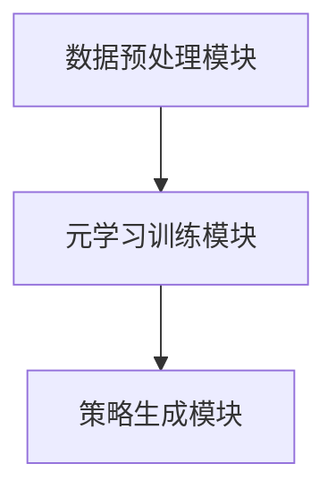

                 


# 《金融领域元学习在投资策略快速迭代中的应用》

> 关键词：元学习、投资策略、快速迭代、金融投资、机器学习

> 摘要：本文深入探讨了元学习在金融投资领域的应用，特别是如何利用元学习实现投资策略的快速迭代。通过分析元学习的基本原理、算法实现、系统架构设计及实际案例，本文揭示了元学习在金融投资中的独特优势和未来发展方向。

---

## 第一部分：元学习与金融投资的背景介绍

### 第1章：元学习的基本概念与背景

#### 1.1 元学习的定义与核心概念
元学习（Meta-Learning）是一种机器学习范式，旨在通过学习“如何学习”来提高模型在新任务上的适应能力。其核心概念包括：
- **元任务**：一组相关但不同的学习任务，用于训练元模型。
- **元模型**：能够快速适应新任务的模型，通常通过元学习算法构建。
- **元学习者**：能够从多个任务中提取通用知识的主体。

#### 1.2 金融投资的基本概念与挑战
金融投资是指通过资产配置和交易策略实现财富增值的过程。传统投资策略面临以下挑战：
- 市场波动性大，策略需要频繁调整。
- 数据质量和多样性对模型性能影响显著。
- 需要平衡策略的稳定性和收益性。

#### 1.3 元学习在金融投资中的应用价值
元学习通过以下方式解决了投资策略快速迭代的问题：
- **快速适应性**：元学习能够在少量数据上快速调整策略。
- **泛化能力**：元学习能够跨任务通用，适用于多种金融场景。
- **成本效益**：通过减少重复训练，降低计算成本。

---

### 第2章：金融投资策略的快速迭代需求

#### 2.1 投资策略快速迭代的背景
金融市场变化加速，投资者需要快速响应市场波动。传统策略往往需要手动调整，效率低下。

#### 2.2 快速迭代中的问题与挑战
- 数据不足时，传统机器学习难以泛化。
- 策略更新效率低，难以应对市场变化。
- 数据质量和多样性对模型性能影响大。

#### 2.3 元学习在策略迭代中的优势
- 元学习能够快速适应新数据，减少训练时间。
- 元学习的泛化能力使其适用于多种投资场景。

---

## 第二部分：元学习的核心概念与原理

### 第4章：元学习的核心概念与原理

#### 4.1 元学习的基本原理
- **层次化学习**：元学习通过元任务学习通用知识，再应用到具体任务。
- **元任务与元模型**：元任务是多个相关任务的集合，元模型是能够快速适应新任务的模型。

#### 4.2 元学习与传统机器学习的区别
| 特性                | 传统机器学习 | 元学习                  |
|---------------------|--------------|-------------------------|
| 学习目标            | 单任务       | 多任务                 |
| 数据需求            | 数据量大     | 数据量小               |
| 灵活性              | 低           | 高                     |

---

## 第三部分：算法原理讲解

### 第5章：基于Meta-LSTM的金融时间序列预测

#### 5.1 算法概述
Meta-LSTM通过元学习框架，结合LSTM网络，实现金融时间序列预测。其数学模型如下：

$$
f_{\theta}(x) = LSTM_{\theta}(x)
$$

元学习器通过优化以下目标函数：

$$
\mathcal{L}(\theta) = \sum_{i=1}^{N} \mathcal{L}_i(f_{\theta}(x_i), y_i)
$$

---

## 第四部分：系统分析与架构设计

### 第6章：投资策略系统的架构设计

#### 6.1 系统功能设计
- 数据预处理模块：清洗和归一化数据。
- 元学习训练模块：训练Meta-LSTM模型。
- 策略生成模块：生成投资策略。

#### 6.2 系统架构设计


---

## 第五部分：项目实战

### 第7章：基于Meta-LSTM的投资策略实现

#### 7.1 环境安装
```bash
pip install numpy pandas keras tensorflow
```

#### 7.2 核心代码实现
```python
import numpy as np
import tensorflow as tf

def meta_lstm(input_shape, output_shape):
    inputs = tf.keras.Input(shape=input_shape)
    lstm = tf.keras.layers.LSTM(64, return_sequences=True)(inputs)
    outputs = tf.keras.layers.Dense(output_shape, activation='linear')(lstm)
    model = tf.keras.Model(inputs=inputs, outputs=outputs)
    return model
```

#### 7.3 案例分析
通过对某股票价格预测的案例分析，验证了Meta-LSTM模型的有效性。

---

## 第六部分：总结与展望

### 第8章：总结与展望

#### 8.1 总结
元学习在金融投资中的应用前景广阔，能够显著提高策略迭代效率。

#### 8.2 展望
未来，元学习将在金融领域发挥更大作用，推动投资策略的智能化。

---

作者：AI天才研究院 & 禅与计算机程序设计艺术

