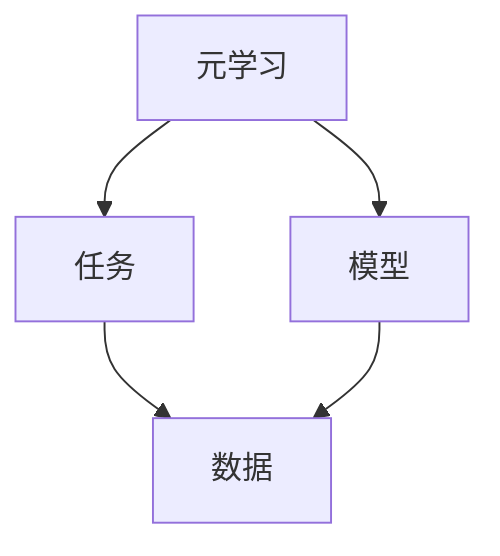
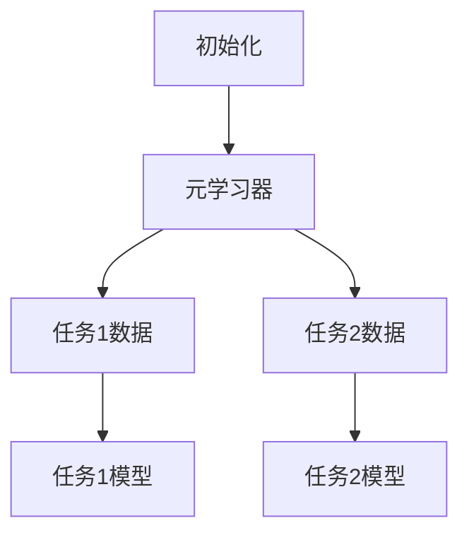
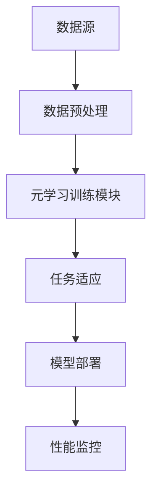
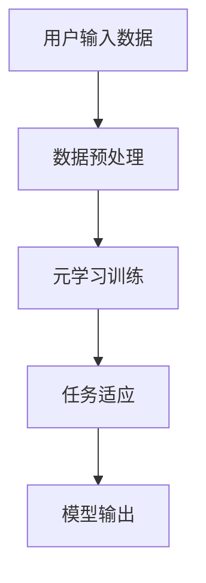

                 


# 金融领域元学习在模型快速适应中的应用

## 关键词：
元学习, 快速模型适应, 金融领域, 算法原理, 系统架构, 实战案例, 应用价值

## 摘要：
本文深入探讨了元学习在金融领域中的应用，特别是其在模型快速适应中的重要性。通过分析元学习的核心原理、典型算法、系统架构以及实际案例，本文揭示了元学习如何帮助金融机构在数据快速变化的环境中保持模型的有效性。文章结构清晰，从理论到实践，为读者提供了全面的视角，帮助他们理解并应用元学习技术。

---

# 1. 背景介绍

## 1.1 元学习的起源与发展
### 1.1.1 元学习的定义与核心概念
元学习（Meta-Learning）是一种机器学习方法，旨在通过在多个任务上进行训练，使得模型能够快速适应新的任务，而无需大量重新训练。其核心在于利用跨任务的相似性，提取通用特征，从而减少对新任务数据的需求。

### 1.1.2 元学习与传统机器学习的对比
传统机器学习方法依赖大量特定任务的数据，而元学习通过在多个任务上预训练模型，使其能够快速调整以适应新任务。这种灵活性在金融领域尤为重要，因为金融数据往往具有高度的动态性和不确定性。

### 1.1.3 元学习在金融领域的应用潜力
金融领域涉及大量复杂的问题，如股票价格预测、风险管理等。元学习能够通过在多个相关任务上进行预训练，快速适应新的金融场景，从而提高模型的泛化能力和适应性。

## 1.2 金融领域中的快速模型适应问题
### 1.2.1 金融数据的特点与挑战
金融数据具有高度的动态性、噪声多、相关性强等特点。传统的机器学习模型在面对数据分布变化时，往往需要重新训练，导致模型更新成本高且效率低下。

### 1.2.2 快速模型适应的背景与意义
在金融市场中，数据的变化往往迅速且不可预测。快速模型适应能力能够帮助金融机构及时调整模型，捕捉市场变化，从而提高交易效率和风险管理能力。

### 1.2.3 元学习如何解决金融领域的适应问题
元学习通过预训练模型的泛化能力，能够在少量新任务数据上快速调整模型参数，从而实现快速适应。这种特性非常适合金融领域的动态数据环境。

---

# 2. 核心概念与联系

## 2.1 元学习的核心原理
### 2.1.1 元学习的定义与核心要素
元学习的核心在于通过元任务的训练，使得模型能够快速适应新的任务。元任务通常是在多个任务上进行训练，提取任务之间的共性特征。

### 2.1.2 元学习的算法流程
元学习的典型流程包括以下步骤：
1. 预训练阶段：在多个源任务上训练元学习器。
2. 适应阶段：在目标任务上进行微调，利用元学习器提取的特征快速适应新任务。

### 2.1.3 元学习的数学模型与公式
元学习的数学模型通常涉及参数的更新。例如，MAML（Meta-Automated Machine Learning）算法的目标函数可以表示为：
$$
L_{meta}(θ) = \sum_{i=1}^{N} L_i(θ, θ_i)
$$
其中，$θ$ 是元学习器的参数，$θ_i$ 是目标任务模型的参数。

---

## 2.2 元学习的核心概念对比

### 2.2.1 元学习与传统机器学习的对比
| 特性 | 传统机器学习 | 元学习 |
|------|---------------|---------|
| 数据需求 | 高 | 低 |
| 适应性 | 低 | 高 |
| 任务多样性 | 单一任务 | 多任务 |

### 2.2.2 元学习与迁移学习的对比
| 特性 | 迁移学习 | 元学习 |
|------|----------|--------|
| 数据共享 | 高 | 中 |
| 任务相关性 | 高 | 高 |
| 适应速度 | 中 | 高 |

---

## 2.3 元学习的ER实体关系图


---

## 2.4 元学习的算法流程图


---

# 3. 算法原理讲解

## 3.1 典型的元学习算法
### 3.1.1 MAML算法
MAML是一种基于梯度的元学习算法。其核心思想是通过优化元任务的参数，使得在目标任务上的梯度更新方向与元任务的梯度更新方向一致。

### 3.1.2 ReMAML算法
ReMAML是MAML的改进版本，通过引入重放机制，进一步提高模型的泛化能力。

### 3.1.3 元学习算法的数学模型
MAML的损失函数可以表示为：
$$
L_{meta}(θ) = \sum_{i=1}^{N} L_i(θ, θ_i)
$$
其中，$θ$ 是元学习器的参数，$θ_i$ 是目标任务模型的参数。

---

## 3.2 元学习算法的代码实现
以下是一个简单的MAML算法实现示例：
```python
import torch

class MetaLearner(torch.nn.Module):
    def __init__(self, feature_dim, hidden_dim, task_num):
        super(MetaLearner, self).__init__()
        self.feature_dim = feature_dim
        self.hidden_dim = hidden_dim
        self.task_num = task_num
        self.theta = torch.nn.Parameter(torch.randn(feature_dim, hidden_dim))

    def forward(self, x, y):
        # 假设x是输入数据，y是目标任务的标签
        # 这里省略具体实现细节
        return outputs

# 初始化元学习器
meta_learner = MetaLearner(feature_dim=10, hidden_dim=20, task_num=5)

# 元任务训练
for batch in meta_train_loader:
    x, y = batch
    outputs = meta_learner(x, y)
    loss = criterion(outputs, y)
    loss.backward()
    optimizer.step()
```

---

## 3.3 元学习算法的优缺点分析
### 优点
1. 快速适应新任务
2. 降低数据需求
3. 提高模型泛化能力

### 缺点
1. 计算复杂度高
2. 对任务相关性要求较高
3. 需要设计合适的元学习器架构

---

# 4. 系统分析与架构设计

## 4.1 金融场景中的问题
### 4.1.1 问题场景
在金融领域，股票价格预测是一个典型的问题。由于市场变化快，模型需要能够快速适应新的数据。

### 4.1.2 问题描述
传统的机器学习模型在面对新数据时，需要重新训练，导致模型更新成本高且效率低下。

### 4.1.3 问题解决
通过元学习，模型可以在少量新数据上快速调整参数，实现快速适应。

---

## 4.2 系统功能设计

### 4.2.1 数据预处理模块
- 数据清洗
- 特征提取

### 4.2.2 元学习训练模块
- 元任务训练
- 任务适应

### 4.2.3 模型部署与监控模块
- 模型部署
- 性能监控

---

## 4.3 系统架构设计


---

## 4.4 系统接口设计
### 元学习训练模块接口
```python
def train_meta_learner(data_loader, num_epochs):
    for epoch in range(num_epochs):
        for batch in data_loader:
            x, y = batch
            outputs = meta_learner(x, y)
            loss = criterion(outputs, y)
            loss.backward()
            optimizer.step()
```

---

## 4.5 系统交互流程图


---

# 5. 项目实战

## 5.1 项目环境安装
```bash
pip install torch
pip install numpy
pip install matplotlib
```

---

## 5.2 系统核心实现源代码

### 5.2.1 元学习器实现
```python
class MetaLearner(torch.nn.Module):
    def __init__(self, feature_dim, hidden_dim):
        super(MetaLearner, self).__init__()
        self.feature_dim = feature_dim
        self.hidden_dim = hidden_dim
        self.theta = torch.nn.Parameter(torch.randn(feature_dim, hidden_dim))

    def forward(self, x):
        return torch.relu(torch.mm(x, self.theta))
```

---

## 5.3 代码应用解读与分析

### 5.3.1 元学习器训练代码
```python
def train(meta_learner, meta_train_loader, optimizer, criterion, epochs):
    for epoch in range(epochs):
        for batch in meta_train_loader:
            x, y = batch
            outputs = meta_learner(x)
            loss = criterion(outputs, y)
            loss.backward()
            optimizer.step()
```

---

## 5.4 实际案例分析
### 案例：股票价格预测
1. 数据准备：使用历史股价数据，提取相关特征。
2. 元学习训练：在多个股票上进行预训练，提取通用特征。
3. 任务适应：针对特定股票进行微调，快速适应其价格变化。

---

## 5.5 项目小结
通过项目实战，我们可以看到元学习在金融领域的巨大潜力。通过预训练模型，可以在少量数据上快速适应新的任务，从而提高模型的效率和准确性。

---

# 6. 最佳实践

## 6.1 小结
- 元学习是一种强大的技术，能够帮助模型快速适应新的任务。
- 在金融领域，元学习的应用场景广泛，如股票价格预测、风险管理等。

## 6.2 注意事项
- 元学习的计算复杂度较高，需要优化算法和硬件资源。
- 任务相关性是元学习的关键，任务之间必须具有一定的相似性。

## 6.3 拓展阅读
- "Meta-Learning for Stock Price Prediction"（推荐论文）
- "Deep Meta-Learning for Few-Shot Classification"（推荐书籍）

---

# 结论与展望

## 6.4 结论
本文深入探讨了元学习在金融领域中的应用，特别是其在模型快速适应中的重要性。通过分析元学习的核心原理、典型算法、系统架构以及实际案例，本文揭示了元学习如何帮助金融机构在数据快速变化的环境中保持模型的有效性。

## 6.5 未来展望
随着人工智能技术的不断发展，元学习在金融领域的应用前景广阔。未来的研究方向包括优化算法、降低计算复杂度、扩展应用场景等。

---

# 作者

作者：AI天才研究院/AI Genius Institute & 禅与计算机程序设计艺术 /Zen And The Art of Computer Programming

