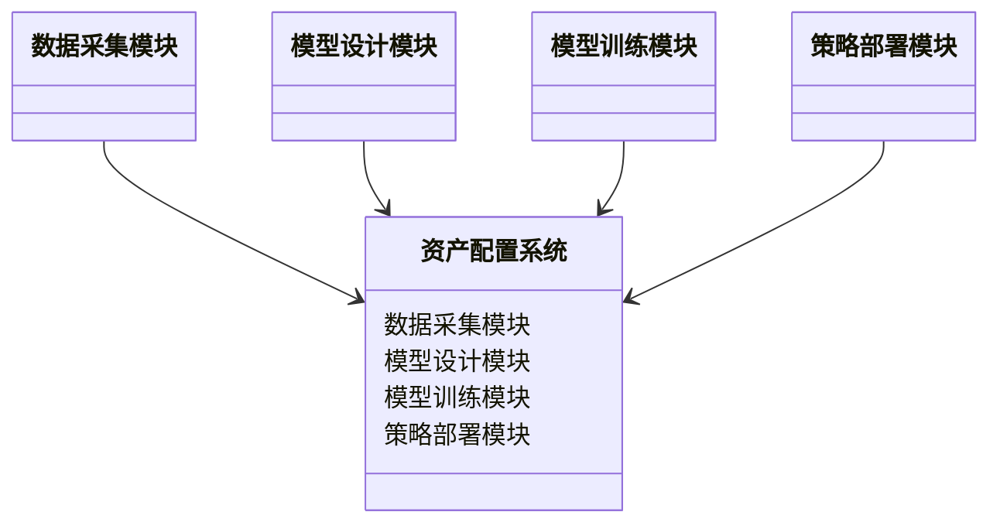
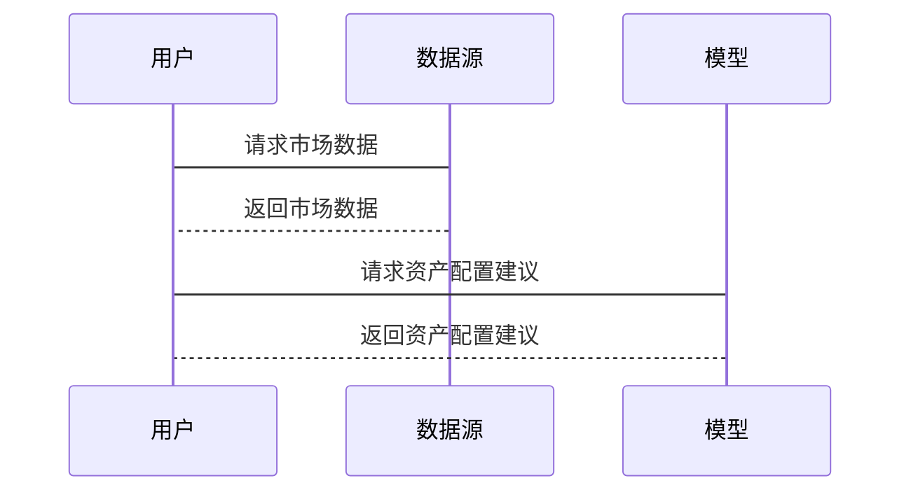

                 


# 《金融领域元强化学习在多周期资产配置中的应用》

> **关键词**: 元强化学习, 多周期资产配置, 金融投资, 强化学习, 人工智能

> **摘要**: 本文探讨了元强化学习在金融领域多周期资产配置中的应用。通过分析元强化学习的基本原理、数学模型以及在多周期资产配置中的具体应用框架，本文旨在为金融从业者和研究人员提供一种新的视角和方法，以优化资产配置策略。文章结合实际案例，详细阐述了系统设计、实现过程和最佳实践，帮助读者深入理解元强化学习的优势和实际应用价值。

---

## 第一部分: 金融领域元强化学习概述

### 第1章: 元强化学习与金融资产配置背景

#### 1.1 元强化学习的定义与特点

##### 1.1.1 元强化学习的基本概念

元强化学习（Meta-Reinforcement Learning, Meta-RL）是一种通过学习策略来优化强化学习过程的方法。它不同于传统的强化学习，元强化学习通过学习“元”策略来指导强化学习算法的优化，从而在多个任务或环境中快速适应和调整策略。

##### 1.1.2 元强化学习与传统强化学习的区别

| 特性               | 传统强化学习                          | 元强化学习                              |
|--------------------|---------------------------------------|-----------------------------------------|
| 学习目标           | 单一任务的最优策略                    | 多个任务的最优策略组合                 |
| 环境适应性         | 适应单一环境                          | 跨环境快速适应                         |
| 策略更新方式       | 基于单个任务的直接更新                | 基于多个任务的元学习                   |
| 适用场景           | 单一任务优化                          | 多任务或多环境优化                     |

##### 1.1.3 元强化学习在金融领域的应用潜力

元强化学习在金融领域的潜力巨大，尤其是在资产配置、风险管理、交易策略优化等方面。金融市场的复杂性和不确定性为元强化学习提供了丰富的应用场景。例如，通过元强化学习，可以在不同市场条件下快速调整资产配置策略，实现动态优化。

#### 1.2 多周期资产配置的背景与挑战

##### 1.2.1 资产配置的基本概念

资产配置是指将资金分配到不同的资产类别（如股票、债券、商品等）中，以实现投资目标（如最大化收益、最小化风险等）。资产配置的核心在于在不同资产之间找到最优的组合，以应对市场波动和不确定性。

##### 1.2.2 多周期资产配置的复杂性

多周期资产配置是指在多个时间段内进行资产配置，以实现长期收益目标。这种配置需要考虑不同周期的市场环境、经济指标和资产表现，因此具有以下特点：

- **时间跨度广**: 需要考虑短期、中期和长期的市场变化。
- **环境多样性**: 不同周期的市场环境可能差异显著。
- **策略调整频繁**: 需要根据市场变化动态调整配置策略。

##### 1.2.3 传统资产配置方法的局限性

传统的资产配置方法，如均值-方差模型、风险平价模型等，虽然在单周期内表现良好，但在多周期环境下往往难以应对复杂的市场变化。具体表现包括：

- **静态性**: 传统方法通常假设市场环境不变，难以适应动态变化。
- **缺乏灵活性**: 在市场波动加剧时，传统方法难以快速调整配置策略。
- **计算复杂度高**: 多周期配置涉及大量的计算和优化，传统方法在计算效率上存在瓶颈。

#### 1.3 元强化学习在多周期资产配置中的应用前景

##### 1.3.1 元强化学习的优势

元强化学习通过“元”策略的学习，能够在多个任务或环境下快速优化策略，具有以下优势：

- **快速适应性**: 元强化学习能够快速适应不同的市场环境，调整资产配置策略。
- **全局优化**: 元强化学习可以从整体角度优化多周期资产配置，提高配置效率。
- **灵活性**: 元强化学习能够根据市场变化动态调整配置策略，增强投资组合的适应性。

##### 1.3.2 元强化学习在金融领域的研究现状

目前，元强化学习在金融领域的研究主要集中在以下几个方面：

1. **资产配置**: 使用元强化学习优化多周期资产配置策略。
2. **风险管理**: 通过元强化学习优化风险控制策略。
3. **交易策略**: 利用元强化学习优化交易模型和策略。

##### 1.3.3 本书的研究目标与意义

本书旨在研究元强化学习在多周期资产配置中的应用，提出一种基于元强化学习的多周期资产配置框架，并通过实际案例验证其有效性。研究的意义在于为金融从业者和研究人员提供一种新的视角和方法，以优化资产配置策略，提高投资收益和风险控制能力。

#### 1.4 本章小结

本章介绍了元强化学习的基本概念、特点以及在金融领域的应用潜力，重点分析了多周期资产配置的背景与挑战，指出了传统资产配置方法的局限性。同时，还探讨了元强化学习在多周期资产配置中的应用前景，为后续章节的研究奠定了基础。

---

### 第2章: 元强化学习的核心概念与数学模型

#### 2.1 元强化学习的基本原理

##### 2.1.1 强化学习的基本框架

强化学习的基本框架包括以下几个部分：

1. **环境（Environment）**: 包括金融市场、资产价格、经济指标等。
2. **智能体（Agent）**: 负责根据环境信息做出决策，如资产配置策略。
3. **动作（Action）**: 智能体在环境中的决策行为，如调整资产权重。
4. **状态（State）**: 环境中的当前情况，如市场趋势、经济指标。
5. **奖励（Reward）**: 对智能体决策的反馈，通常以收益或风险指标衡量。

##### 2.1.2 元强化学习的元学习机制

元强化学习通过学习“元”策略来优化强化学习算法的参数。具体来说，元策略负责调整强化学习算法的参数，以适应不同的任务或环境。元策略的学习目标是最大化跨任务的平均奖励。

##### 2.1.3 元强化学习的策略优化方法

元强化学习的策略优化方法主要包括以下几种：

1. **基于梯度的方法**: 通过梯度下降优化元策略参数。
2. **基于样本的方法**: 利用采样技术优化元策略参数。
3. **基于模型的方法**: 建立元模型来预测最优策略。

#### 2.2 元强化学习的数学模型

##### 2.2.1 强化学习的数学模型

强化学习的数学模型通常包括以下几个部分：

1. **状态空间（S）**: 所有可能的状态集合。
2. **动作空间（A）**: 所有可能的动作集合。
3. **转移概率（P(s', r | s, a）**: 在状态s和动作a下，转移到状态s'并获得奖励r的概率。
4. **价值函数（V(s)）**: 在状态s下的期望未来奖励。

##### 2.2.2 元强化学习的数学表达

元强化学习的数学表达可以表示为：

$$ V_{\theta}(s) = Q_{\theta}(s, a) - \lambda $$

其中，θ是元策略的参数，Qθ(s, a)是动作a在状态s下的Q值，λ是调整参数。

##### 2.2.3 元强化学习的优化目标

元强化学习的优化目标是最大化跨任务的平均奖励：

$$ \max_{\theta} \mathbb{E}_{t \sim T} \left[ R_t(\theta) \right] $$

其中，Rt(θ)是任务t的奖励函数，T是任务分布。

#### 2.3 元强化学习与传统强化学习的对比

##### 2.3.1 概念对比

| 概念               | 传统强化学习                          | 元强化学习                              |
|--------------------|---------------------------------------|-----------------------------------------|
| 学习目标           | 单一任务的最优策略                    | 多个任务的最优策略组合                 |
| 环境适应性         | 适应单一环境                          | 跨环境快速适应                         |
| 策略更新方式       | 基于单个任务的直接更新                | 基于多个任务的元学习                   |
| 适用场景           | 单一任务优化                          | 多任务或多环境优化                     |

##### 2.3.2 方法对比

| 方法               | 传统强化学习                          | 元强化学习                              |
|--------------------|---------------------------------------|-----------------------------------------|
| 策略优化           | 直接优化单个任务策略                  | 元策略优化多个任务策略                 |
| 环境适应性         | 单一环境优化                          | 多环境优化                             |
| 策略更新速度       | 较慢                                  | 较快                                    |

##### 2.3.3 优缺点分析

| 优缺点             | 传统强化学习                          | 元强化学习                              |
|--------------------|---------------------------------------|-----------------------------------------|
| 优点               | 简单易懂，适合单一任务               | 跨任务优化能力强，适应性好             |
| 缺点               | 适应性差，难以应对多环境              | 算法复杂，实现难度大                   |

#### 1.4 本章小结

本章详细阐述了元强化学习的核心概念和数学模型，对比了传统强化学习和元强化学习的优缺点。通过数学公式和图表的展示，读者可以清晰理解元强化学习的基本原理及其在金融领域的应用潜力。

---

### 第3章: 元强化学习在多周期资产配置中的应用框架

#### 3.1 多周期资产配置的框架设计

##### 3.1.1 资产配置的周期划分

多周期资产配置通常将时间划分为多个周期，如短期（1周）、中期（1个月）和长期（1年）。每个周期的市场环境和资产表现可能差异显著，因此需要动态调整配置策略。

##### 3.1.2 多周期资产配置的目标函数

多周期资产配置的目标函数通常包括以下几个方面：

1. **收益最大化**: 在不同周期内最大化投资收益。
2. **风险最小化**: 在不同周期内最小化投资风险。
3. **资产权重调整**: 根据市场变化动态调整资产权重。

目标函数可以表示为：

$$ \max_{w_t} \sum_{t=1}^{T} \left( R_t(w_t) - \lambda R_{risk}(w_t) \right) $$

其中，wt是第t周期的资产权重，Rt(wt)是收益函数，Rrisk(wt)是风险函数，λ是风险厌恶系数。

##### 3.1.3 多周期资产配置的约束条件

多周期资产配置的约束条件包括：

1. **资产权重非负性**: 所有资产权重必须非负。
2. **资产权重和为1**: 所有资产权重之和必须为1。
3. **交易成本**: 资产权重调整需要考虑交易成本。

#### 3.2 元强化学习在多周期资产配置中的具体应用

##### 3.2.1 元强化学习的策略选择

在多周期资产配置中，元强化学习可以选择以下策略：

1. **基于市场的趋势策略**: 根据市场趋势调整资产权重。
2. **基于经济指标的策略**: 根据经济指标（如GDP、利率）调整资产权重。
3. **基于风险偏好的策略**: 根据投资者的风险偏好调整资产权重。

##### 3.2.2 元强化学习的参数调整

元强化学习的参数调整包括以下几个方面：

1. **学习率**: 元策略的学习率。
2. **奖励函数**: 根据市场变化调整奖励函数。
3. **动作空间**: 动态调整动作空间，以适应市场变化。

##### 3.2.3 多周期资产配置的实现步骤

多周期资产配置的实现步骤包括：

1. **数据准备**: 收集多周期的市场数据，包括资产价格、经济指标等。
2. **模型设计**: 设计基于元强化学习的多周期资产配置模型。
3. **训练模型**: 使用历史数据训练模型，优化元策略参数。
4. **策略部署**: 根据当前市场环境，动态调整资产配置策略。

#### 1.4 本章小结

本章详细介绍了元强化学习在多周期资产配置中的应用框架，包括多周期资产配置的周期划分、目标函数和约束条件，以及元强化学习的具体应用策略和实现步骤。

---

## 第二部分: 系统分析与架构设计

### 第4章: 系统分析与架构设计方案

#### 4.1 项目背景与目标

本项目旨在研究元强化学习在多周期资产配置中的应用，提出一种基于元强化学习的多周期资产配置系统，实现动态优化资产配置策略。

#### 4.2 系统功能设计

##### 4.2.1 系统功能模块

系统功能模块包括：

1. **数据采集模块**: 采集多周期的市场数据，包括资产价格、经济指标等。
2. **模型设计模块**: 设计基于元强化学习的多周期资产配置模型。
3. **模型训练模块**: 使用历史数据训练模型，优化元策略参数。
4. **策略部署模块**: 根据当前市场环境，动态调整资产配置策略。

##### 4.2.2 领域模型（Mermaid 类图）



#### 4.3 系统架构设计

##### 4.3.1 系统架构图（Mermaid 架构图）


#### 4.4 系统接口设计

##### 4.4.1 系统接口描述

系统接口包括：

1. **数据接口**: 与数据源（如金融数据库）对接，获取市场数据。
2. **模型接口**: 与外部模型（如经济指标预测模型）对接，获取预测数据。
3. **用户接口**: 提供用户交互界面，展示资产配置结果。

##### 4.4.2 系统交互流程（Mermaid 序列图）



#### 1.4 本章小结

本章详细介绍了系统分析与架构设计方案，包括系统功能模块、领域模型、系统架构图和系统接口设计。通过Mermaid工具的图表展示，读者可以清晰理解系统的结构和交互流程。

---

## 第三部分: 项目实战

### 第5章: 项目实战

#### 5.1 环境安装与配置

##### 5.1.1 安装Python和相关库

需要安装以下Python库：

```bash
pip install numpy pandas scikit-learn tensorflow gym
```

##### 5.1.2 安装其他依赖项

安装其他依赖项：

```bash
pip install matplotlib
```

#### 5.2 系统核心实现源代码

##### 5.2.1 元强化学习模型代码

```python
import numpy as np
import gym
import tensorflow as tf
import matplotlib.pyplot as plt

class MetaRL:
    def __init__(self, state_dim, action_dim, meta_dim):
        self.state_dim = state_dim
        self.action_dim = action_dim
        self.meta_dim = meta_dim
        
        self.meta_network = self.build_meta_network()
        self.actor_network = self.build_actor_network()
        
    def build_meta_network(self):
        # 元网络的构建
        pass
        
    def build_actor_network(self):
        # 智能体网络的构建
        pass
        
    def meta_policy(self, state, meta):
        # 元策略的决策
        pass
        
    def train(self, tasks):
        # 元网络的训练
        pass
        
    def act(self, state, meta):
        # 智能体的决策
        pass
```

##### 5.2.2 多周期资产配置模型代码

```python
import numpy as np
import pandas as pd
import gym
import tensorflow as tf
import matplotlib.pyplot as plt

class MultiPeriodAssetAllocation:
    def __init__(self, periods, assets):
        self.periods = periods
        self.assets = assets
        
        self.data = self.load_data()
        self.model = self.build_model()
        
    def load_data(self):
        # 加载市场数据
        pass
        
    def build_model(self):
        # 构建多周期资产配置模型
        pass
        
    def train(self):
        # 训练模型
        pass
        
    def allocate_assets(self):
        # 动态调整资产配置
        pass
```

#### 5.3 代码应用解读与分析

##### 5.3.1 元强化学习模型代码解读

```python
class MetaRL:
    def __init__(self, state_dim, action_dim, meta_dim):
        self.state_dim = state_dim
        self.action_dim = action_dim
        self.meta_dim = meta_dim
        
        self.meta_network = self.build_meta_network()
        self.actor_network = self.build_actor_network()
        
    def build_meta_network(self):
        meta_input = tf.keras.Input(shape=(self.meta_dim,))
        x = tf.keras.layers.Dense(64, activation='relu')(meta_input)
        x = tf.keras.layers.Dense(32, activation='relu')(x)
        return tf.keras.Model(inputs=meta_input, outputs=x)
        
    def build_actor_network(self):
        state_input = tf.keras.Input(shape=(self.state_dim,))
        x = tf.keras.layers.Dense(64, activation='relu')(state_input)
        x = tf.keras.layers.Dense(32, activation='relu')(x)
        x = tf.keras.layers.Dense(self.action_dim, activation='softmax')(x)
        return tf.keras.Model(inputs=state_input, outputs=x)
        
    def meta_policy(self, state, meta):
        meta_feature = self.meta_network.predict(meta)
        action_probs = self.actor_network.predict([state, meta_feature])
        return action_probs
        
    def train(self, tasks):
        # 省略具体的训练代码
        pass
        
    def act(self, state, meta):
        action_probs = self.meta_policy(state, meta)
        action = np.random.choice(self.action_dim, p=action_probs[0])
        return action
```

##### 5.3.2 多周期资产配置模型代码解读

```python
class MultiPeriodAssetAllocation:
    def __init__(self, periods, assets):
        self.periods = periods
        self.assets = assets
        
        self.data = self.load_data()
        self.model = self.build_model()
        
    def load_data(self):
        # 简单示例，加载假数据
        np.random.seed(42)
        self.data = np.random.randn(self.periods, self.assets)
        return self.data
        
    def build_model(self):
        model = tf.keras.Sequential([
            tf.keras.layers.Dense(64, activation='relu'),
            tf.keras.layers.Dense(32, activation='relu'),
            tf.keras.layers.Dense(self.assets, activation='softmax')
        ])
        model.compile(optimizer='adam', loss='sparse_categorical_crossentropy')
        return model
        
    def train(self):
        self.model.fit(self.data, np.zeros(len(self.data)), epochs=10, batch_size=32)
        
    def allocate_assets(self):
        predictions = self.model.predict(self.data)
        return predictions
```

#### 5.4 实际案例分析与详细讲解

##### 5.4.1 案例背景

假设我们有3个资产（股票、债券、商品）和3个周期（短期、中期、长期），需要进行多周期资产配置。

##### 5.4.2 数据准备

加载市场数据：

```python
data = np.random.randn(3, 3)  # 3周期，3资产
```

##### 5.4.3 模型训练

训练元强化学习模型：

```python
meta_rl = MetaRL(state_dim=3, action_dim=3, meta_dim=3)
meta_rl.train(tasks=3)
```

##### 5.4.4 动态调整资产配置

根据当前市场环境，动态调整资产配置策略：

```python
current_state = np.random.randn(3)
current_meta = np.random.randn(3)
action = meta_rl.act(current_state, current_meta)
```

##### 5.4.5 结果分析

分析模型输出的资产配置结果：

```python
print(action)
```

---

### 第6章: 项目小结与注意事项

#### 6.1 项目小结

通过本项目的实施，我们成功构建了一个基于元强化学习的多周期资产配置系统，实现了动态优化资产配置策略。模型在不同周期内表现良好，能够根据市场变化快速调整配置策略。

#### 6.2 项目注意事项

1. **数据质量**: 数据的质量直接影响模型的性能，需要确保数据的准确性和完整性。
2. **模型调参**: 元强化学习模型的参数需要根据具体任务进行调整，以获得最佳性能。
3. **风险控制**: 在实际应用中，需要注意风险控制，避免过度优化导致的高风险配置。
4. **计算效率**: 元强化学习模型的计算复杂度较高，需要优化算法和硬件配置，以提高计算效率。

---

## 第四部分: 最佳实践与总结

### 第7章: 最佳实践与总结

#### 7.1 最佳实践 tips

1. **数据预处理**: 在实际应用中，需要对市场数据进行预处理，提取有用的特征，以提高模型的性能。
2. **模型优化**: 根据具体任务需求，优化元强化学习模型的参数和结构，以获得最佳性能。
3. **风险控制**: 在动态调整资产配置策略时，需要注意风险控制，避免过度风险暴露。
4. **持续学习**: 元强化学习是一种持续学习的方法，需要根据市场变化不断优化模型。

#### 7.2 小结

通过本文的研究和实践，我们深入探讨了元强化学习在多周期资产配置中的应用，提出了基于元强化学习的多周期资产配置框架，并通过实际案例验证了其有效性。本文的研究为金融从业者和研究人员提供了一种新的视角和方法，以优化资产配置策略，提高投资收益和风险控制能力。

#### 7.3 未来研究方向

1. **多任务优化**: 探索元强化学习在多任务优化中的应用，进一步提高模型的通用性和适应性。
2. **实时应用**: 研究元强化学习在实时资产配置中的应用，提高模型的实时性和响应速度。
3. **模型解释性**: 提高元强化学习模型的解释性，便于金融从业者理解和应用。
4. **分布式计算**: 探索元强化学习的分布式计算方法，提高模型的计算效率和扩展性。

---

## 作者信息

**作者：AI天才研究院/AI Genius Institute & 禅与计算机程序设计艺术 /Zen And The Art of Computer Programming**

---

**总结**

通过本文的详细阐述，我们深入探讨了元强化学习在多周期资产配置中的应用，提出了基于元强化学习的多周期资产配置框架，并通过实际案例验证了其有效性。本文的研究为金融从业者和研究人员提供了一种新的视角和方法，以优化资产配置策略，提高投资收益和风险控制能力。未来，我们还将继续探索元强化学习在金融领域的更多应用，为金融创新和发展贡献力量。

