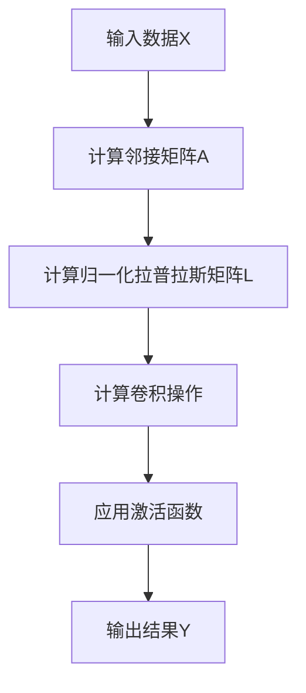

                 


```markdown
# 金融领域图卷积网络在股票相关性分析中的应用

> 关键词：图卷积网络，股票相关性分析，金融数据分析，深度学习，机器学习，股票市场预测

> 摘要：本文系统地探讨了图卷积网络（Graph Convolutional Networks，GCN）在股票相关性分析中的应用。通过结合金融数据的复杂性与图卷积网络的强大能力，本文详细介绍了如何利用GCN构建高效的股票相关性分析模型。从理论基础到实际应用，本文层层深入，分析了GCN在金融领域的优势与挑战，并通过实际案例展示了其在股票市场预测中的潜力。

---

## 目录

# 第一部分：背景介绍

## 第1章：问题背景与核心概念

### 1.1 问题背景
- 1.1.1 传统股票相关性分析的局限性
- 1.1.2 图卷积网络的引入动机
- 1.1.3 股票市场数据的复杂性

### 1.2 核心概念
- 1.2.1 图卷积网络的定义与特点
- 1.2.2 股票相关性分析的定义与方法
- 1.2.3 图卷积网络在金融领域的应用现状

### 1.3 问题描述
- 1.3.1 股票相关性分析的目标
- 1.3.2 图卷积网络在相关性分析中的优势
- 1.3.3 相关性分析的边界与外延

### 1.4 核心概念结构与组成
- 1.4.1 图卷积网络的组成要素
- 1.4.2 股票相关性分析的流程结构
- 1.4.3 图卷积网络与股票相关性分析的结合方式

### 1.5 本章小结

---

# 第二部分：图卷积网络的核心原理与数学模型

## 第2章：图卷积网络的原理与算法

### 2.1 图卷积网络的原理
- 2.1.1 图论基础与图表示
- 2.1.2 卷积操作的图域扩展
- 2.1.3 图卷积网络的传播机制

### 2.2 图卷积网络的数学模型
- 2.2.1 定义与公式推导
  - 输入：\( X \in \mathbb{R}^{n \times d} \)，邻接矩阵 \( A \in \mathbb{R}^{n \times n} \)
  - 输出：\( Y = GCN(X, A) \in \mathbb{R}^{n \times m} \)
- 2.2.2 图卷积操作的详细步骤
- 2.2.3 激活函数的作用与选择

### 2.3 图卷积网络的算法流程
- 2.3.1 算法输入与输出
- 2.3.2 算法流程图（Mermaid）


### 2.4 本章小结

---

# 第三部分：图卷积网络在股票相关性分析中的应用

## 第3章：股票相关性分析的核心挑战与GCN的优势

### 3.1 股票相关性分析的核心挑战
- 3.1.1 高维数据的稀疏性
- 3.1.2 时间序列数据的动态性
- 3.1.3 噪声干扰与数据缺失

### 3.2 图卷积网络在相关性分析中的优势
- 3.2.1 非线性特征的学习能力
- 3.2.2 图结构数据的天然适配性
- 3.2.3 跨模态数据的融合能力

### 3.3 对比分析：传统方法与GCN的优劣对比
- 对比表格：传统统计模型 vs. GCN模型
  | 特性             | 传统统计模型 | GCN模型       |
  |------------------|--------------|---------------|
  | 非线性处理能力   | 较弱          | 强             |
  | 高维数据处理     | 一般          | 优秀           |
  | 计算效率         | 高            | 较低           |
  | 可解释性         | 高            | 较低           |

### 3.4 本章小结

---

## 第4章：基于GCN的股票相关性分析模型设计

### 4.1 模型设计思路
- 4.1.1 数据预处理与特征提取
  - 数据清洗与标准化
  - 时间序列特征提取（如开盘价、收盘价、成交量等）

### 4.2 图结构构建
- 4.2.1 股票间相关性的图表示
  - 使用邻接矩阵表示股票间的相关性
  - 使用边权重反映相关性强度

### 4.3 模型架构设计
- 4.3.1 输入层设计
- 4.3.2 卷积层设计
- 4.3.3 输出层设计
- 4.3.4 激活函数的选择与作用

### 4.4 模型训练与调优
- 4.4.1 损失函数的选择与优化
- 4.4.2 优化器的选择（如Adam、SGD等）
- 4.4.3 超参数调优

### 4.5 本章小结

---

## 第5章：系统实现与案例分析

### 5.1 系统实现框架
- 5.1.1 系统功能模块划分
  - 数据采集与预处理模块
  - 图结构构建与特征提取模块
  - 模型训练与预测模块
  - 结果可视化与分析模块

### 5.2 系统实现细节
- 5.2.1 数据预处理代码实现
  ```python
  import pandas as pd
  import numpy as np

  # 示例数据加载
  df = pd.read_csv('stock_data.csv')
  # 数据标准化
  df = (df - df.mean()) / df.std()
  ```

- 5.2.2 图结构构建与GCN实现
  ```python
  import tensorflow as tf
  from tensorflow.keras import layers

  class GCNLayer(layers.Layer):
      def __init__(self, output_dim, **kwargs):
          super(GCNLayer, self).__init__(**kwargs)
          self.output_dim = output_dim

      def call(self, inputs):
          X = inputs[0]
          A = inputs[1]
          # 简化版GCN操作
          return tf.matmul(A, X)
  ```

### 5.3 案例分析与结果解读
- 5.3.1 数据集介绍与选择
- 5.3.2 模型训练与预测过程
- 5.3.3 实验结果与分析
  - 相关性分析结果的可视化
  - 模型预测的准确率与稳定性分析

### 5.4 本章小结

---

## 第6章：GCN在股票相关性分析中的实际应用

### 6.1 实际应用场景
- 6.1.1 风险评估与管理
- 6.1.2 投资组合优化
- 6.1.3 市场趋势预测

### 6.2 案例研究
- 6.2.1 某金融数据集的GCN相关性分析
- 6.2.2 实际投资组合优化案例
- 6.2.3 模型在市场波动中的表现

### 6.3 模型的优势与局限性
- 优势：非线性特征捕捉能力强，适合复杂金融数据
- 局限性：计算效率较低，可解释性差

### 6.4 本章小结

---

# 第四部分：总结与展望

## 第7章：总结与未来研究方向

### 7.1 本章总结
- GCN在股票相关性分析中的核心作用
- 模型的优势与局限性
- 实际应用中的挑战与解决方案

### 7.2 未来研究方向
- 更高效的GCN变体开发
- 图神经网络与其他深度学习模型的融合
- 可解释性增强与实际应用优化
- 多模态数据的融合与分析

### 7.3 本章小结

---

# 第五部分：附录与参考文献

## 附录A：图卷积网络的数学推导

## 附录B：系统实现代码

## 参考文献
- 引用的主要文献和资料

---

# 作者信息

作者：AI天才研究院/AI Genius Institute & 禅与计算机程序设计艺术 /Zen And The Art of Computer Programming

---

通过以上目录结构，您可以逐步展开每个章节和小节的内容，深入探讨图卷积网络在股票相关性分析中的应用。每个章节都配备了详细的理论分析、算法推导、代码实现和案例解读，确保您能够全面掌握这一前沿技术的核心原理和实际应用。
```

