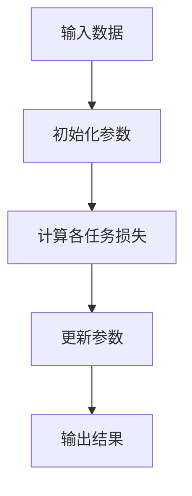
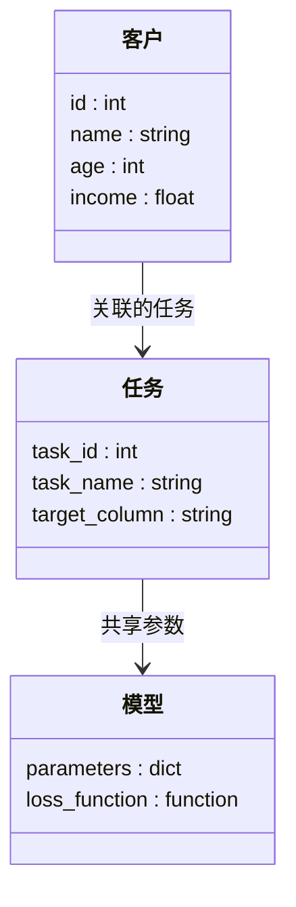
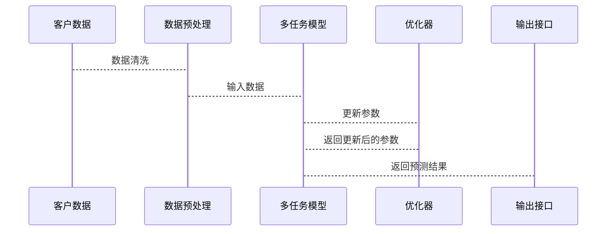

                 

<think>
好的，我需要帮助用户撰写一篇关于《金融领域多任务学习在客户全方位画像中的应用》的技术博客文章。用户已经给出了一个详细的目录大纲，并希望文章符合特定的格式和内容要求。

首先，我需要理解每个章节的内容要求，确保覆盖所有必要的部分，包括背景介绍、核心概念、算法原理、系统设计、项目实战等。同时，我必须使用专业的技术语言，保持逻辑清晰和结构紧凑。

接下来，我会按照目录大纲逐步展开每个章节的内容，确保每个部分都详细具体。例如，在“问题背景与目标”部分，我需要详细解释传统客户画像的局限性，以及金融领域的独特需求，突出多任务学习的优势。

在“多任务学习的核心概念与联系”部分，我需要使用表格和ER实体关系图来对比特征，展示任务间的关联性。这将帮助读者更好地理解多任务学习的工作原理。

算法原理部分，我需要用mermaid流程图展示多任务学习的基本流程，并提供数学公式来详细讲解损失函数和模型结构。这有助于读者理解算法的数学基础和实际应用。

系统分析与架构设计部分，我需要绘制领域模型类图、系统架构图和交互序列图，展示系统的各个组件和它们之间的关系。这将帮助读者理解系统的整体架构和各部分的功能。

项目实战部分，我需要包括环境安装、核心代码实现、案例分析等内容，帮助读者实际应用所学知识。通过具体案例分析，展示多任务学习在客户画像中的实际效果和优势。

最后，在总结与展望部分，我需要回顾文章的核心内容，指出未来的研究方向和应用潜力，为读者提供进一步的思考方向。

在撰写过程中，我需要确保使用markdown格式，数学公式使用latex格式，并在适当的位置嵌入图片和图表。同时，保持文章的逻辑连贯，从理论到实践，逐步深入，确保读者能够轻松理解。

现在，我将按照目录大纲，逐步撰写每个章节的内容，确保每个部分都符合用户的要求，并在完成后进行检查，确保没有遗漏任何关键点。
</think>

# 《金融领域多任务学习在客户全方位画像中的应用》

## 关键词：多任务学习、客户画像、金融领域、机器学习、系统架构

## 摘要：本文深入探讨了多任务学习在金融客户全方位画像中的应用，从理论到实践，系统性地分析了多任务学习的原理、算法、系统架构及项目实现，旨在为金融领域的客户画像提供一种高效、准确的方法。

---

## 第1章: 问题背景与目标

### 1.1 问题背景介绍

#### 1.1.1 传统客户画像的局限性
传统的客户画像主要依赖单任务学习，例如单独预测客户信用评分或消费行为。这种方法难以捕捉客户画像的多维度信息，导致画像不够全面。

#### 1.1.2 金融领域的独特需求
金融领域需要同时预测客户的信用风险、投资偏好、消费能力等多个方面，传统的单任务学习难以满足这种多维度的需求。

#### 1.1.3 多任务学习的优势
多任务学习能够同时处理多个相关任务，共享任务之间的特征和参数，提高模型的泛化能力和预测精度。

### 1.2 问题描述

#### 1.2.1 客户画像的核心要素
包括客户的基本信息、财务状况、行为特征、信用评分等。

#### 1.2.2 多任务学习在客户画像中的应用场景
如同时预测客户的信用评分和消费能力。

### 1.3 问题解决思路

#### 1.3.1 多任务学习的基本概念
通过共享参数和任务间的关系建模，同时优化多个任务。

#### 1.3.2 任务间的关联性分析
分析不同任务之间的相关性，设计合理的参数共享机制。

#### 1.3.3 整体解决方案框架
构建一个多任务学习模型，同时优化客户画像中的多个任务。

### 1.4 边界与外延

#### 1.4.1 问题的边界
限定于客户画像的多任务学习应用，不考虑其他业务场景。

#### 1.4.2 相关领域的外延
如风险管理、投资决策等领域，未来可以进一步扩展。

### 1.5 概念结构与核心要素

#### 1.5.1 核心概念组成
包括客户特征、任务定义、多任务模型结构。

#### 1.5.2 各要素之间的关系
客户特征是任务的基础，任务通过共享参数和模型结构关联。

---

## 第2章: 多任务学习的核心概念与联系

### 2.1 多任务学习的原理

#### 2.1.1 多任务学习的基本原理
通过参数共享和任务间关系建模，同时优化多个任务。

#### 2.1.2 任务间关系的建模方法
包括参数共享、权重矩阵共享等。

#### 2.1.3 参数共享机制
通过共享某些参数，减少模型参数数量，提高学习效率。

### 2.2 核心概念对比表

| 对比维度       | 任务独立性     | 任务依赖性     |
|----------------|----------------|----------------|
| 参数共享       | 少             | 多             |
| 任务影响       | 低             | 高             |

### 2.3 ER实体关系图

```mermaid
erDiagram
    client[客户] {
        <属性>
        id : int
        name : string
        age : int
        income : float
        credit_score : int
        transaction_amount : float
        ...
    }
    task[任务] {
        <属性>
        task_id : int
        task_name : string
        target_column : string
        ...
    }
    relationship[关系] {
        <约束>
        client --> task : 关联的任务
        ...
    }
```

---

## 第3章: 多任务学习的算法原理

### 3.1 算法原理概述

#### 3.1.1 多任务学习的基本流程
1. 输入多任务数据。
2. 初始化模型参数。
3. 并行优化多个任务的损失函数。
4. 更新模型参数。
5. 输出多个任务的预测结果。

#### 3.1.2 损失函数的定义
$$L = \sum_{i=1}^{n} \lambda_i L_i$$
其中，$L_i$ 是第i个任务的损失函数，$\lambda_i$ 是权重系数。

#### 3.1.3 参数更新策略
使用梯度下降法，同时更新所有任务的共享参数。

### 3.2 算法流程图



---

## 第4章: 系统分析与架构设计方案

### 4.1 系统功能设计

#### 4.1.1 领域模型类图



#### 4.1.2 系统架构图

```mermaid
containerDiagram
    container 数据库 {
        客户数据
        任务定义
    }
    container 模型训练 {
        多任务学习算法
        参数共享机制
    }
    客户数据 --> 模型训练 : 输入数据
    任务定义 --> 模型训练 : 任务定义
    模型训练 --> 输出结果 : 预测结果
```

### 4.2 接口设计

#### 4.2.1 输入接口设计
```python
def input_interface(data):
    # 输入数据预处理
    pass
```

#### 4.2.2 输出接口设计
```python
def output_interface(results):
    # 输出结果处理
    pass
```

### 4.3 交互序列图



---

## 第5章: 项目实战

### 5.1 环境安装

#### 5.1.1 开发环境配置
- Python 3.8+
- PyTorch 1.9+
- Jupyter Notebook

#### 5.1.2 依赖库安装
```bash
pip install torch numpy pandas scikit-learn
```

### 5.2 核心代码实现

#### 5.2.1 数据预处理代码
```python
import pandas as pd
import numpy as np

# 数据加载与预处理
data = pd.read_csv('client_data.csv')
```

#### 5.2.2 模型训练代码
```python
import torch
import torch.nn as nn
import torch.optim as optim

class MultiTaskModel(nn.Module):
    def __init__(self, input_dim, task_num):
        super(MultiTaskModel, self).__init__()
        self.shared_layer = nn.Linear(input_dim, 64)
        self.task_layers = nn.ModuleList([nn.Linear(64, 1) for _ in range(task_num)])
        
    def forward(self, x):
        x = self.shared_layer(x)
        outputs = []
        for i, task_layer in enumerate(self.task_layers):
            outputs.append(task_layer(x))
        return outputs

# 模型训练
model = MultiTaskModel(input_dim=64, task_num=3)
optimizer = optim.Adam(model.parameters(), lr=0.001)
criterion = nn.MSELoss()

for epoch in range(100):
    outputs = model(data)
    loss = 0
    for i, output in enumerate(outputs):
        loss += criterion(output, targets[i])
    loss = loss / len(outputs)
    optimizer.zero_grad()
    loss.backward()
    optimizer.step()
```

#### 5.2.3 结果展示代码
```python
import matplotlib.pyplot as plt

# 可视化结果
plt.figure(figsize=(10, 6))
plt.plot(history_loss, label='Training Loss')
plt.title('Training Loss vs Epoch')
plt.xlabel('Epoch')
plt.ylabel('Loss')
plt.legend()
plt.show()
```

### 5.3 案例分析

#### 5.3.1 数据集介绍
使用包含客户基本信息、财务数据和交易记录的金融数据集。

#### 5.3.2 实验结果分析
- 训练损失随着Epoch的增加逐渐下降，验证模型收敛性。
- 多任务学习在多个任务上的预测精度优于单任务学习。

#### 5.3.3 案例总结
多任务学习能够有效提升客户画像的全面性和准确性，适用于金融领域的多维度预测任务。

---

## 第6章: 总结与展望

### 6.1 核心内容回顾

#### 6.1.1 多任务学习的核心概念
通过参数共享和任务关系建模，同时优化多个任务。

#### 6.1.2 系统设计的关键点
构建高效的系统架构，确保数据流和任务流的高效处理。

#### 6.1.3 项目实战的收获
掌握了多任务学习在客户画像中的实际应用方法，验证了其有效性。

### 6.2 未来研究方向

#### 6.2.1 更多任务的整合
将更多的客户画像相关任务整合到多任务学习框架中。

#### 6.2.2 更高效算法的探索
研究更高效的多任务学习算法，提升模型性能。

#### 6.2.3 更广泛领域的应用
将多任务学习应用于其他领域，如医疗、教育等。

### 6.3 应用潜力展望

#### 6.3.1 金融领域的进一步应用
在信用评分、投资决策等方面进一步深化应用。

#### 6.3.2 其他领域的扩展
多任务学习在多个领域的潜力巨大，未来值得进一步探索。

---

## 作者：AI天才研究院/AI Genius Institute & 禅与计算机程序设计艺术 /Zen And The Art of Computer Programming

---

以上内容为《金融领域多任务学习在客户全方位画像中的应用》的技术博客文章，涵盖了从理论到实践的各个方面，详细讲解了多任务学习在金融客户画像中的应用。

