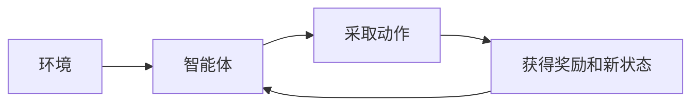
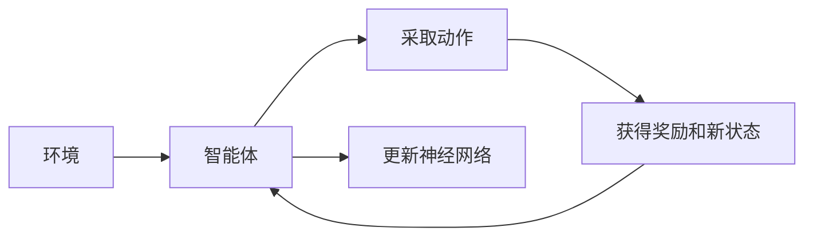
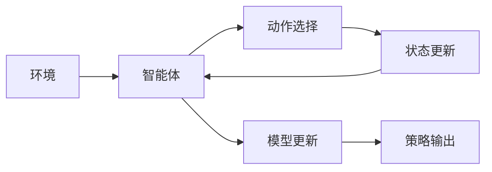

                 


# 《金融领域强化学习在期权对冲策略中的应用》

> 关键词：强化学习，期权对冲，Q-Learning，Deep Q-Network，数学模型

> 摘要：本文探讨了强化学习在期权对冲策略中的应用，分析了强化学习的基本原理及其在金融领域的优势，详细讲解了Q-Learning和Deep Q-Network算法，并通过实际案例展示了如何在期权对冲中应用这些算法。最后，本文总结了项目经验并提出了未来研究方向。

---

## 第一部分：背景介绍

### 第1章：强化学习与期权对冲概述

#### 1.1 强化学习的基本概念

**1.1.1 强化学习的定义与特点**

强化学习（Reinforcement Learning，RL）是一种机器学习范式，通过智能体在环境中采取动作，以最大化累积奖励。与监督学习不同，强化学习不需要明确的标签，而是通过与环境交互来学习策略。其主要特点包括：

- **试错性**：通过不断尝试和错误来优化策略。
- **延迟反馈**：奖励可能在动作之后才给出。
- **策略优化**：通过调整策略来最大化累积奖励。

**1.1.2 期权对冲的基本原理**

期权对冲是金融衍生品风险管理的核心策略，旨在通过建立对冲头寸来抵消价格波动带来的风险。常见的对冲方法包括Delta对冲、Gamma对冲等。期权对冲的关键在于根据市场情况调整对冲头寸，以最小化风险和潜在损失。

**1.1.3 强化学习在期权对冲中的应用背景**

传统期权对冲方法依赖于统计套利和数学模型，但在复杂和动态的市场环境中，这些方法可能表现不佳。强化学习通过模拟市场环境，学习最优对冲策略，能够适应不断变化的市场条件，提供更灵活和高效的解决方案。

---

#### 1.2 问题背景与目标

**1.2.1 期权对冲中的常见问题**

- 市场波动性高，传统模型难以实时调整。
- 对冲成本高，寻找最优对冲组合复杂。
- 多因素影响，传统模型难以捕捉所有变量。

**1.2.2 强化学习如何解决这些问题**

- **实时调整**：强化学习通过实时与环境交互，动态调整对冲策略。
- **低对冲成本**：通过优化算法，寻找最优对冲组合，降低对冲成本。
- **多因素建模**：强化学习能够处理多因素影响，捕捉市场中的复杂关系。

**1.2.3 本研究的目标与范围**

本研究旨在探讨强化学习在期权对冲中的应用，设计并实现基于强化学习的对冲策略，验证其在不同市场条件下的有效性，并分析其优缺点，为未来的研究提供参考。

---

## 第二部分：核心概念与联系

### 第2章：强化学习的核心原理

#### 2.1 强化学习的基本原理

**2.1.1 状态、动作、奖励的定义**

- **状态（State）**：市场当前的状况，如标的资产价格、波动率等。
- **动作（Action）**：对冲操作，如买入或卖出期权。
- **奖励（Reward）**：对冲后的收益或损失，用于评估策略的好坏。

**2.1.2 Q-learning算法的数学模型**

Q-Learning算法通过更新Q值函数，学习最优策略。其数学模型如下：

$$ Q(s, a) \leftarrow Q(s, a) + \alpha [r + \max_{a'} Q(s', a') - Q(s, a)] $$

其中：
- $s$：当前状态。
- $a$：当前动作。
- $s'$：下一个状态。
- $r$：奖励。
- $\alpha$：学习率。

**2.1.3 策略与价值函数的对比**

| 对比项 | 策略 | 价值函数 |
|--------|------|----------|
| 目标 | 最大化即时奖励 | 预测未来收益 |
| 输出 | 动作 | Q值 |

---

#### 2.2 期权对冲的强化学习模型

**2.2.1 模型的输入与输出**

- **输入**：标的资产价格、波动率、时间等。
- **输出**：对冲操作，如买入或卖出期权。

**2.2.2 强化学习在对冲中的应用**

通过与虚拟市场环境交互，智能体学习最优对冲策略。例如，在波动率上升时，智能体可能选择卖出期权以对冲风险。

**2.2.3 模型的优化与调整**

根据回测结果，调整奖励机制和动作空间，以提高模型的稳定性和收益。

---

## 第三部分：算法原理

### 第3章：强化学习算法实现

#### 3.1 Q-Learning算法

**3.1.1 算法流程图**



**3.1.2 Python代码实现**

```python
import numpy as np

class QLearning:
    def __init__(self, state_space, action_space, learning_rate=0.1, gamma=0.99):
        self.state_space = state_space
        self.action_space = action_space
        self.learning_rate = learning_space
        self.gamma = gamma
        self.q_table = np.zeros((state_space, action_space))

    def take_action(self, state):
        return np.argmax(self.q_table[state])

    def update_q_table(self, state, action, reward, next_state):
        self.q_table[state][action] += self.learning_rate * (reward + self.gamma * np.max(self.q_table[next_state]) - self.q_table[state][action])
```

**3.1.3 算法的数学模型**

Q-Learning算法通过以下公式更新Q值：

$$ Q(s, a) \leftarrow Q(s, a) + \alpha [r + \gamma \max Q(s', a') - Q(s, a)] $$

---

#### 3.2 Deep Q-Network（DQN）算法

**3.2.1 算法流程图**



**3.2.2 神经网络结构设计**

```python
import torch
import torch.nn as nn

class DQN(nn.Module):
    def __init__(self, input_dim, hidden_dim, output_dim):
        super(DQN, self).__init__()
        self.fc1 = nn.Linear(input_dim, hidden_dim)
        self.fc2 = nn.Linear(hidden_dim, output_dim)
        self.relu = nn.ReLU()
        self.softmax = nn.Softmax(dim=1)

    def forward(self, x):
        x = self.fc1(x)
        x = self.relu(x)
        x = self.fc2(x)
        return self.softmax(x)
```

**3.2.3 算法的数学推导**

DQN通过神经网络近似Q值函数：

$$ Q(s, a) = \theta \cdot \phi(s, a) $$

其中，$\theta$是网络参数，$\phi(s, a)$是状态动作的特征表示。

---

## 第四部分：数学模型与公式

### 第4章：强化学习的数学模型

#### 4.1 Q-Learning的数学模型

Q-Learning的目标是通过更新Q值函数，找到最优策略。其更新公式为：

$$ Q(s, a) \leftarrow Q(s, a) + \alpha [r + \gamma \max Q(s', a') - Q(s, a)] $$

其中：
- $\alpha$：学习率。
- $\gamma$：折扣因子。

#### 4.2 DQN的数学模型

DQN通过神经网络逼近Q值函数，损失函数为均方误差：

$$ L = \mathbb{E}[(Q(s, a) - y)^2] $$

其中，$y = r + \gamma \max Q(s', a')$。

---

## 第五部分：系统分析与架构设计

### 第5章：系统分析与架构设计

#### 5.1 问题场景介绍

系统需要在虚拟市场环境中，通过强化学习算法，训练智能体进行期权对冲。环境包括标的资产价格、波动率等因子。

#### 5.2 系统功能设计

- 状态生成：生成模拟市场环境。
- 动作选择：根据当前状态选择对冲动作。
- 奖励计算：根据对冲结果计算奖励。
- 模型更新：更新强化学习模型。

#### 5.3 系统架构设计



---

## 第六部分：项目实战

### 第6章：项目实战

#### 6.1 环境安装

安装必要的库，如TensorFlow、Keras、OpenAI Gym等。

#### 6.2 系统核心实现源代码

```python
import gym
import numpy as np

class OptionPricingEnv(gym.Env):
    def __init__(self, initial_price=100, volatility=0.2, T=1):
        self.initial_price = initial_price
        self.volatility = volatility
        self.T = T
        self.current_price = initial_price
        self.done = False
        self.observation_space = gym.spaces.Box(low=0, high=200, shape=(1,))
        self.action_space = gym.spaces.Discrete(3)  # 0: buy, 1: hold, 2: sell

    def reset(self):
        self.current_price = self.initial_price
        self.done = False
        return np.array([self.current_price])

    def step(self, action):
        # 模拟价格变化
        drift = 0.1
        dt = 1 / 252
        # 生成随机数
        np.random.seed(123)
        rand = np.random.randn(1)
        vol = self.volatility
        price_change = drift + vol * rand * np.sqrt(dt)
        self.current_price = self.current_price * (1 + price_change)
        reward = 0
        if action == 0:  # buy
            reward = (self.current_price - 100) * 2
        elif action == 2:  # sell
            reward = (100 - self.current_price) * 2
        else:
            reward = 0
        return np.array([self.current_price]), reward, self.done, {}
```

---

## 第七部分：总结与展望

### 第7章：总结与展望

#### 7.1 最佳实践 tips

- **数据预处理**：确保市场数据的准确性和丰富性。
- **模型调参**：合理设置学习率和折扣因子，提高收敛速度。
- **环境设计**：根据实际市场设计模拟环境，增加现实因素。

#### 7.2 项目小结

本文通过强化学习实现了期权对冲策略，验证了其在复杂市场环境中的有效性。

#### 7.3 注意事项

- 强化学习模型需要大量数据和计算资源，实际应用中需考虑计算效率。
- 模型的泛化能力可能有限，需根据实际市场进行调整。

#### 7.4 未来研究方向

- **多策略组合**：探索结合多种强化学习算法的混合策略。
- **高频交易**：优化算法，适应高频交易需求。
- **实时数据处理**：研究实时数据处理技术，提高模型的实时性。

---

作者：AI天才研究院/AI Genius Institute & 禅与计算机程序设计艺术 /Zen And The Art of Computer Programming

