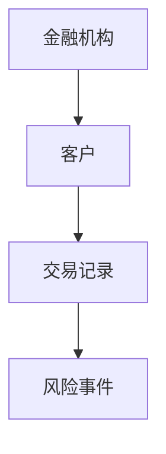
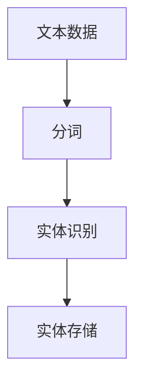
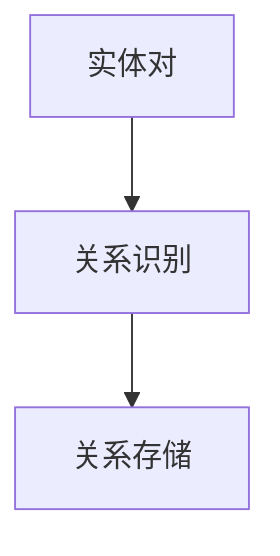
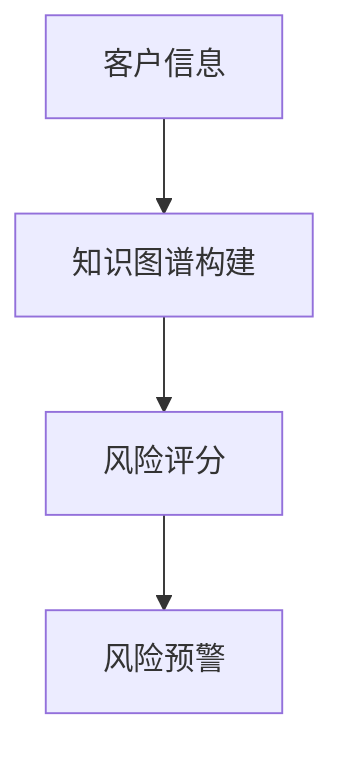
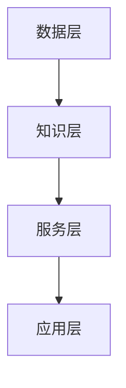
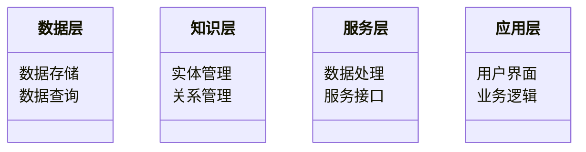
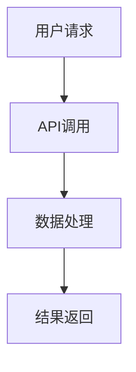

                 

# 《金融领域知识图谱的构建与应用》

---

## 关键词：
- 知识图谱
- 金融领域
- 数据挖掘
- 人工智能
- 金融风险管理
- 智能投顾

---

## 摘要：
金融领域的知识图谱构建与应用是当前人工智能与金融结合的热门方向。知识图谱通过将金融数据结构化、语义化，能够有效提升金融分析的效率与准确性。本文详细介绍了知识图谱的基本概念、构建方法以及在金融领域的具体应用，包括风险评估、智能投顾和金融监管等场景。通过结合实际案例和系统设计，本文为读者提供了一套完整的知识图谱构建与应用方案，帮助金融行业更好地利用知识图谱技术提升业务能力。

---

## 第一章：知识图谱的基本概念与背景

### 1.1 知识图谱的定义与特点

知识图谱是一种以图结构形式表示知识的数据库，其核心由实体（节点）和关系（边）组成。与传统数据库不同，知识图谱不仅存储数据，还通过语义关系将数据连接起来，形成一个网状的知识网络。

#### 特点对比表：

| 特性         | 知识图谱特点 | 传统数据库特点 |
|--------------|--------------|----------------|
| 数据结构     | 图结构       | 表结构         |
| 表达能力     | 高           | 低             |
| 查询效率     | 中           | 高             |
| 语义理解     | 高           | 低             |

### 1.2 金融领域的知识图谱构建背景

金融领域的数据具有复杂性高、关联性强的特点，传统的数据分析方法难以有效处理这些数据。知识图谱通过将金融数据结构化，能够更好地发现隐藏的关系和模式。

#### 实体关系图：

### 1.3 知识图谱的构建目标与意义

知识图谱的构建目标是将分散的金融数据整合成一个统一的知识网络，帮助金融机构更好地理解和利用数据。其意义在于提升金融分析的效率和准确性，降低风险。

---

## 第二章：金融领域知识图谱的构建方法

### 2.1 数据收集与预处理

数据是知识图谱构建的基础。金融数据来源多样，包括公开数据、内部数据和外部数据。

#### 数据来源与类型：

- **公开数据**：如央行数据、交易所数据。
- **内部数据**：如银行交易记录。
- **外部数据**：如新闻、社交媒体数据。

#### 数据清洗流程：

1. 数据去重
2. 数据格式统一
3. 数据标准化

### 2.2 知识抽取与表示

知识抽取是将数据中的实体和关系提取出来，并表示为结构化的形式。

#### 实体识别算法流程：

#### 关系抽取流程：

### 2.3 知识图谱的构建与优化

知识图谱的构建需要结合多种算法，如基于规则的算法和机器学习算法。

#### 知识图谱构建算法：

- **规则驱动法**：通过预定义规则提取知识。
- **机器学习法**：使用深度学习模型（如RNN）进行关系抽取。

#### 知识图谱优化策略：

1. 去除冗余关系
2. 优化实体关联度
3. 定期更新知识图谱

---

## 第三章：知识图谱在金融领域的应用

### 3.1 金融风险评估与管理

#### 风险评估流程：

#### 信用评估模型：

信用评分公式：

$$ \text{信用评分} = \alpha \times \text{收入} + \beta \times \text{负债} + \gamma \times \text{信用历史} $$

### 3.2 智能投顾与财富管理

#### 投资策略优化：

通过知识图谱分析市场趋势和企业关系，优化投资组合。

#### 客户画像构建：

使用知识图谱整合客户数据，形成完整的客户画像。

### 3.3 金融监管与合规

#### 反洗钱监测：

通过知识图谱分析资金流动，识别可疑交易。

#### 监管合规优化：

利用知识图谱整合监管规则，确保合规性。

---

## 第四章：知识图谱的系统架构与实现

### 4.1 系统整体架构

知识图谱系统分为数据层、知识层、服务层和应用层。

#### 系统架构图：

### 4.2 系统功能设计

#### 领域模型类图：

### 4.3 系统接口设计

知识图谱系统需要提供API接口，供上层应用调用。

#### 系统接口流程：

---

## 小结与展望

知识图谱在金融领域的应用前景广阔，通过构建知识图谱，金融机构能够更好地理解和利用数据，提升业务能力。未来，随着技术的发展，知识图谱将在更多金融场景中发挥重要作用。

---

## 作者信息

作者：AI天才研究院（AI Genius Institute） & 禅与计算机程序设计艺术（Zen And The Art of Computer Programming）

---

**本文为AI天才研究院原创，转载请注明出处。**

