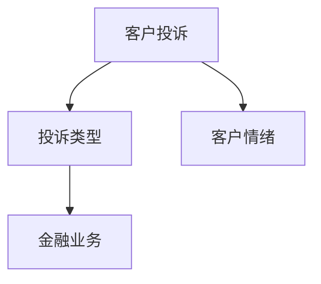
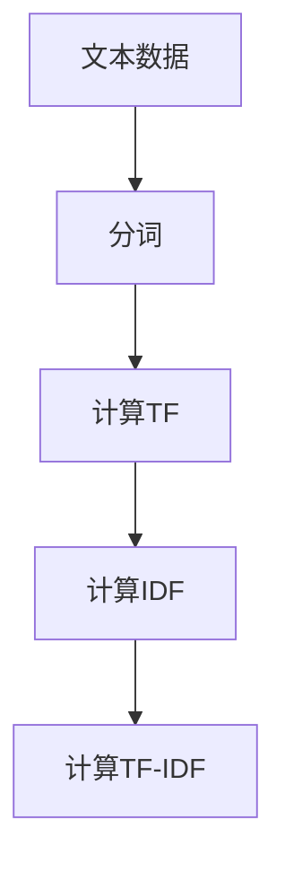
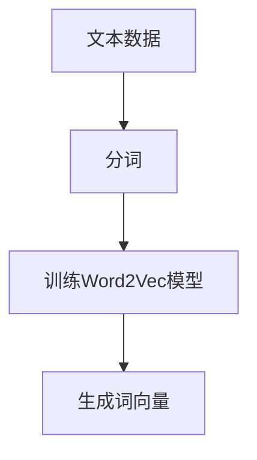
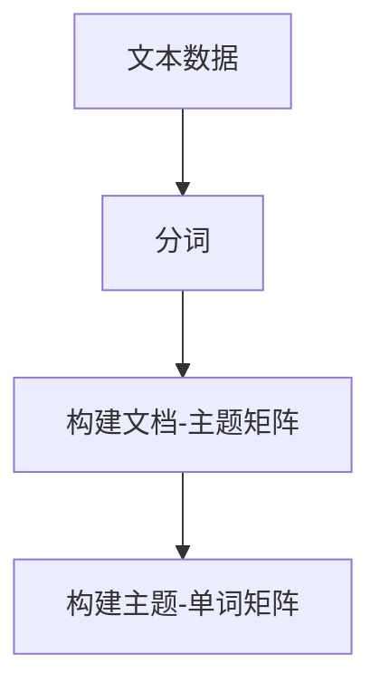
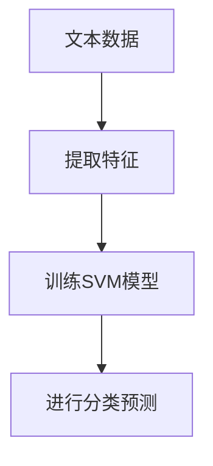
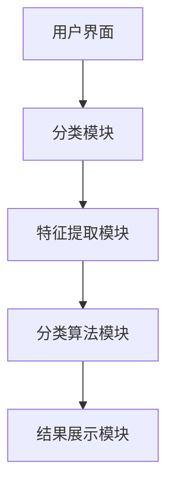
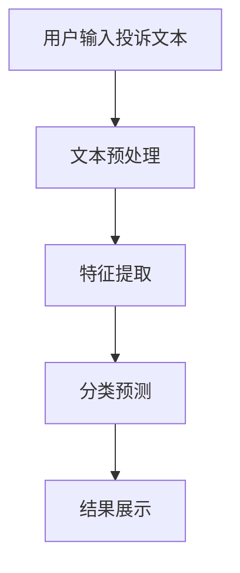
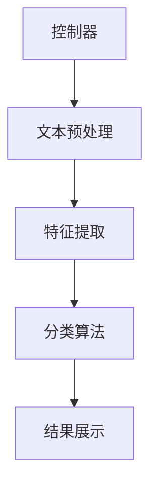
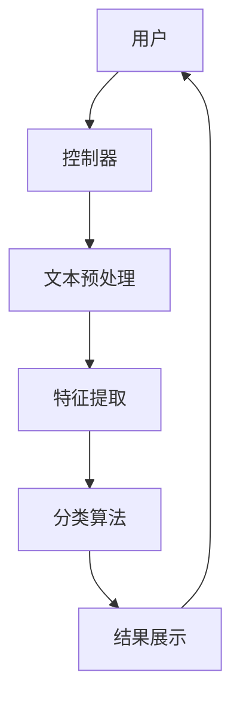

                 

<think>
好，我现在需要写一篇关于《金融领域自然语言处理在客户投诉分类中的应用》的技术博客文章。首先，我得明确文章的结构和各个部分需要包含的内容。

首先，标题和关键词。标题已经确定，关键词应该包括“金融领域”、“自然语言处理”、“客户投诉分类”、“文本挖掘”、“机器学习”这几个词。摘要部分要简明扼要地概括文章的核心内容，说明本文将探讨如何利用NLP技术来解决金融客户投诉分类的问题，并展示实际应用场景和效果。

接下来是目录大纲，用户已经提供了一个详细的结构。我需要按照这个结构一步步填充内容。首先是背景介绍，包括问题背景、解决思路和范围。这部分需要说明为什么客户投诉分类在金融领域很重要，传统方法的不足，以及NLP的优势。

然后是核心概念，这部分要详细讲解NLP的基础知识，比如词袋模型、词嵌入、语言模型等，并将投诉分类与文本分类进行对比，列出投诉文本的特征。这部分可能需要使用表格和Mermaid图来展示。

接下来是算法原理，这部分比较关键。我需要详细讲解TF-IDF、Word2Vec、LDA和SVM这四种算法。每个算法都要有流程图、代码实现和数学公式的详细解释。比如，TF-IDF的公式，Word2Vec的训练过程，LDA的主题模型构建，以及SVM的分类过程。这部分内容需要深入浅出，让读者能够理解每种算法的原理和实现步骤。

然后是系统分析与架构设计，这部分需要展示系统的整体架构，包括领域模型、架构图、接口设计和交互流程。可能需要使用Mermaid图来展示类图、架构图和序列图。这部分内容需要清晰展示系统的各个模块如何协同工作。

项目实战部分，我需要给出具体的代码实现，环境配置，代码解读，以及实际案例的分析。这部分需要读者能够动手实践，所以代码要详细，案例要具体，分析要深入。

最后是最佳实践，总结整个项目的成果，给出注意事项和未来的发展方向。这部分可以引用一些实际数据，展示模型的效果，并提出改进建议。

在写作过程中，我需要确保每个部分都详细具体，避免泛泛而谈。同时，语言要专业但易懂，逻辑清晰。使用适当的图表和代码示例，帮助读者更好地理解和应用这些技术。

总的来说，我需要系统地按照目录结构填充内容，确保每个章节都有足够的细节和深度，同时保持整体结构的连贯性和逻辑性。这样，读者才能全面理解金融领域NLP在客户投诉分类中的应用，并能够实际操作相关技术。
</think>

# 《金融领域自然语言处理在客户投诉分类中的应用》

## 关键词：金融领域，自然语言处理，客户投诉分类，文本挖掘，机器学习

## 摘要：  
本文探讨了在金融领域利用自然语言处理技术对客户投诉进行分类的应用。通过分析客户投诉文本的特点，结合文本挖掘和机器学习技术，提出了一种基于TF-IDF、Word2Vec、LDA和SVM的分类方法。文章详细讲解了算法原理、系统架构设计，并通过实际案例展示了模型的应用效果。本文旨在为金融领域的客户投诉分类提供一种高效、准确的技术方案。

---

## 第一部分: 金融领域客户投诉分类的背景与需求

### 第1章: 问题背景与描述

#### 1.1 金融领域客户投诉的现状
##### 1.1.1 金融行业客户投诉的特点
- **文本多样性**：客户投诉内容涉及信用卡、理财、贷款等多个业务领域，文本长度和复杂度差异较大。
- **情感倾向性**：投诉文本通常带有强烈的情感色彩，如不满、抱怨等。
- **业务关联性**：投诉内容往往与具体的金融产品或服务相关，具有较强的业务属性。

##### 1.1.2 传统客户投诉处理方式的局限性
- **人工处理效率低**：传统方法依赖人工阅读和分类，效率低下且容易出错。
- **分类标准不统一**：不同工作人员的分类标准可能存在差异，导致分类结果不一致。
- **难以挖掘深层信息**：人工处理难以发现投诉文本中隐含的模式和规律。

##### 1.1.3 自然语言处理在金融领域的潜力
- **提高分类效率**：通过自动化处理，大幅减少人工干预，提升处理效率。
- **挖掘潜在信息**：利用NLP技术挖掘投诉文本中的隐含信息，为业务优化提供数据支持。
- **个性化服务**：基于客户投诉分类结果，提供个性化的解决方案，提升客户满意度。

#### 1.2 客户投诉分类的目标与意义
##### 1.2.1 投诉分类的目标
- 将客户投诉按业务类型、问题类别等标准进行分类，便于后续处理和分析。
- 通过分类识别投诉中的关键信息，帮助金融机构快速定位问题根源。

##### 1.2.2 投诉分类在金融业务中的价值
- **优化客户服务**：通过分类了解客户主要的投诉点，针对性地改进产品和服务。
- **降低处理成本**：自动化分类可以减少人工处理的时间和成本。
- **支持决策分析**：分类结果为管理层提供数据支持，帮助制定业务策略。

##### 1.2.3 投诉分类对客户体验的提升作用
- **快速响应**：分类后可以快速将投诉分配到相关部门，缩短客户等待时间。
- **精准处理**：根据分类结果，提供针对性的解决方案，提升客户满意度。

#### 1.3 问题解决的思路与方法
##### 1.3.1 自然语言处理技术的核心作用
- **文本预处理**：包括分词、去停用词、词干提取等步骤，将文本转化为计算机可处理的形式。
- **特征提取**：通过TF-IDF、Word2Vec等方法提取文本特征，降低维度。
- **分类算法**：利用机器学习算法（如SVM、随机森林等）对投诉文本进行分类。

##### 1.3.2 数据驱动的分类方法
- **数据收集**：从客户投诉数据库中收集文本数据，标注类别信息。
- **数据预处理**：清洗数据，处理缺失值和噪声。
- **模型训练**：基于标注数据训练分类模型，评估模型性能。

##### 1.3.3 金融领域知识的结合
- **领域词典**：构建金融领域的专业词典，帮助模型更好地理解行业术语。
- **业务规则**：结合业务规则，优化分类结果，确保分类的准确性和合理性。

#### 1.4 问题的边界与外延
##### 1.4.1 客户投诉分类的适用范围
- 适用于信用卡、理财、贷款等主要业务领域的投诉分类。
- 适用于结构化和非结构化文本的混合数据。

##### 1.4.2 相关领域的区别与联系
- **区别**：与一般的文本分类任务相比，客户投诉分类具有更强的业务导向性和情感倾向性。
- **联系**：客户投诉分类可以借鉴通用的文本分类方法，但需要结合金融领域的特殊性进行优化。

##### 1.4.3 未来可能的发展方向
- **多模态数据融合**：结合语音、图像等多模态数据，提升分类的准确性和全面性。
- **实时处理能力**：优化模型的实时处理能力，支持在线投诉分类。
- **智能化升级**：结合深度学习技术，提升模型的智能性和自适应能力。

#### 1.5 概念结构与核心要素
##### 1.5.1 投诉分类的核心要素
- **投诉文本**：原始客户投诉内容。
- **分类标准**：根据业务需求制定的分类维度和规则。
- **分类结果**：投诉文本被分配到的类别。

##### 1.5.2 自然语言处理的关键技术
- **文本预处理**：包括分词、去停用词、词干提取等。
- **特征提取**：如TF-IDF、Word2Vec等方法。
- **分类算法**：如SVM、随机森林等。

##### 1.5.3 金融领域的特殊要求
- **行业术语支持**：需要理解金融领域的专业术语。
- **业务规则融合**：分类结果需要符合业务逻辑和规则。

---

## 第二部分: 核心概念与联系

### 第2章: 核心概念与联系

#### 2.1 自然语言处理的核心原理
##### 2.1.1 词袋模型
- **原理**：将文本表示为单词的集合，不考虑单词的顺序。
- **公式**：$$\text{TF-IDF}(w, d) = \text{TF}(w, d) \times \text{IDF}(w, D)$$

##### 2.1.2 词嵌入模型
- **原理**：通过神经网络训练，将单词映射为低维向量。
- **工具**：Word2Vec、GloVe等。

##### 2.1.3 语言模型的训练与优化
- **原理**：基于上下文预测单词，训练得到语言模型。
- **工具**：如BERT、GPT等。

#### 2.2 客户投诉分类的属性特征对比
##### 2.2.1 投诉类型分类的特征分析
- **业务类型**：如信用卡、理财等。
- **投诉原因**：如服务态度、产品问题等。
- **客户情绪**：如愤怒、不满等。

##### 2.2.2 不同分类方法的优劣势对比
| 分类方法       | 优点                           | 缺点                           |
|----------------|--------------------------------|--------------------------------|
| TF-IDF         | 实现简单，适合小规模数据       | 对语义理解较弱                 |
| Word2Vec       | 语义表达能力强                 | 需要大量数据训练               |
| LDA            | 可发现主题，适合主题分类       | 对主题数量敏感                 |
| SVM            | 分类性能稳定，适合小样本数据   | 对高维数据处理较慢             |

#### 2.3 ER实体关系图
##### 2.3.1 实体关系图的构建


##### 2.3.2 实体间的关系分析
- **客户投诉**与**投诉类型**之间是“属于”关系。
- **投诉类型**与**金融业务**之间是“影响”关系。
- **客户投诉**与**客户情绪**之间是“反映”关系。

##### 2.3.3 实体关系图在分类中的应用
- 通过实体关系图，可以明确投诉文本中各个实体之间的关系，辅助分类模型的构建。

#### 2.4 词袋模型与词嵌入模型的对比
##### 2.4.1 词袋模型的实现
- **步骤**：
  1. 分词：将文本分割成单词。
  2. 去停用词：去掉无意义的词（如“的”、“了”等）。
  3. 统计词频：计算每个单词在文本中的出现次数。
  4. 构建词袋向量：将词频统计结果表示为向量。

##### 2.4.2 词嵌入模型的实现
- **步骤**：
  1. 数据预处理：分词、去停用词。
  2. 训练模型：使用Word2Vec等工具训练词嵌入模型。
  3. 提取词向量：将每个单词映射为低维向量。

##### 2.4.3 两种模型的对比
| 特性       | 词袋模型                   | 词嵌入模型                   |
|------------|----------------------------|----------------------------|
| 语义理解   | 弱，仅考虑词频             | 强，考虑上下文关系           |
| 实现复杂度 | 简单                       | 较复杂，需要训练模型         |
| 适用场景   | 文本分类、主题分析         | 情感分析、语义相似度计算     |

---

## 第三部分: 算法原理与实现

### 第3章: 算法原理与实现

#### 3.1 基于TF-IDF的文本特征提取
##### 3.1.1 TF-IDF的计算公式
- **TF（Term Frequency）**：某词在文档中的出现次数占比。
  $$\text{TF}(w, d) = \frac{\text{词 }w\text{ 在文档 }d\text{ 中的出现次数}}{\text{文档 }d\text{ 的总词数}}$$
- **IDF（Inverse Document Frequency）**：词的逆文档频率，衡量词的重要程度。
  $$\text{IDF}(w, D) = \log\left(\frac{D}{\text{包含词 }w\text{ 的文档数}}\right)$$
- **TF-IDF**：综合TF和IDF的加权值。
  $$\text{TF-IDF}(w, d) = \text{TF}(w, d) \times \text{IDF}(w, D)$$

##### 3.1.2 TF-IDF的实现流程


##### 3.1.3 TF-IDF的Python代码实现
```python
from sklearn.feature_extraction.text import TfidfVectorizer

# 示例文本数据
corpus = [
    "信用卡收费过高",
    "理财产品的收益不稳定",
    "贷款利率太高",
    "客户服务态度差"
]

# 初始化TF-IDF模型
vectorizer = TfidfVectorizer()

# 训练模型并提取特征
tfidf_matrix = vectorizer.fit_transform(corpus)

# 输出特征向量
print(tfidf_matrix.toarray())
```

#### 3.2 基于Word2Vec的词向量生成
##### 3.2.1 Word2Vec的工作原理
- **训练目标**：通过上下文预测目标词，或通过目标词预测上下文。
- **训练方法**：使用Skip-Gram或CBOW模型。

##### 3.2.2 Word2Vec的实现流程


##### 3.2.3 Word2Vec的Python代码实现
```python
from gensim.models import Word2Vec

# 示例文本数据
corpus = [
    ["信用卡", "收费", "过高"],
    ["理财产品", "收益", "不稳定"],
    ["贷款", "利率", "太高"],
    ["客户服务", "态度", "差"]
]

# 初始化Word2Vec模型
model = Word2Vec(corpus, vector_size=10, window=2, min_count=1, workers=2)

# 查看词向量
print(model.wv["信用卡"])
```

#### 3.3 基于LDA的主题模型构建
##### 3.3.1 LDA的基本原理
- **层次生成过程**：首先生成主题，再根据主题生成单词。
- **训练目标**：通过观测数据（文本）推断隐藏的主题分布。

##### 3.3.2 LDA的实现流程


##### 3.3.3 LDA的Python代码实现
```python
from gensim.models import LdaModel
from gensim.corpora import Dictionary

# 示例文本数据
corpus = [
    "信用卡收费过高",
    "理财产品的收益不稳定",
    "贷款利率太高",
    "客户服务态度差"
]

# 分词并构建词典
words = [text.split() for text in corpus]
dictionary = Dictionary(words)
dictionary.save('dictionary.dict')

# 创建文档-词典表示
corpus bows = [dictionary.doc2bow(text.split()) for text in corpus]

# 初始化LDA模型
lda_model = LdaModel(bows, num_topics=4, id2word=dictionary)

# 查看主题分布
print(lda_model.print_topics())
```

#### 3.4 基于SVM的分类算法
##### 3.4.1 SVM的基本原理
- **分类原理**：通过构建超平面，将数据分为不同类别。
- **优化目标**：最大化分类间隔，最小化分类错误。

##### 3.4.2 SVM的实现流程


##### 3.4.3 SVM的Python代码实现
```python
from sklearn import svm

# 示例特征向量和标签
X = [
    [0.3, 0.6],  # 特征向量
    [0.5, 0.8],  # 特征向量
    [0.7, 0.4],  # 特征向量
    [0.2, 0.9]   # 特征向量
]

y = [0, 0, 1, 1] # 标签，0表示信用卡相关，1表示理财产品相关

# 初始化SVM模型
clf = svm.SVC()

# 训练模型
clf.fit(X, y)

# 进行预测
print(clf.predict([[0.4, 0.7]]))  # 预测结果
```

---

## 第四部分: 系统分析与架构设计

### 第4章: 系统分析与架构设计

#### 4.1 问题场景介绍
- **场景描述**：金融机构每天收到大量客户投诉，需要快速分类处理。
- **目标**：构建一个高效的客户投诉分类系统，支持自动化处理和分类。

#### 4.2 系统功能设计
##### 4.2.1 领域模型


##### 4.2.2 系统架构


##### 4.2.3 接口设计
- **输入接口**：接收客户投诉文本。
- **输出接口**：输出分类结果和相关信息。

##### 4.2.4 交互流程


#### 4.3 系统架构设计
##### 4.3.1 系统架构图


##### 4.3.2 接口设计
- **输入接口**：
  - **功能**：接收客户投诉文本。
  - **接口定义**：`/api/classify`
- **输出接口**：
  - **功能**：返回分类结果和相关信息。
  - **接口定义**：`/api/result`

##### 4.3.3 交互流程


---

## 第五部分: 项目实战

### 第5章: 项目实战

#### 5.1 环境安装与配置
- **工具安装**：
  - Python 3.8+
  - Jupyter Notebook
  - scikit-learn、gensim等NLP库

#### 5.2 系统核心实现
##### 5.2.1 特征提取模块
```python
from sklearn.feature_extraction.text import TfidfVectorizer

# 示例文本数据
corpus = [
    "信用卡收费过高",
    "理财产品的收益不稳定",
    "贷款利率太高",
    "客户服务态度差"
]

# 初始化TF-IDF模型
vectorizer = TfidfVectorizer()

# 提取特征向量
tfidf_matrix = vectorizer.fit_transform(corpus)
```

##### 5.2.2 分类算法实现
```python
from sklearn import svm

# 示例特征向量和标签
X = [
    [0.3, 0.6],  # 特征向量
    [0.5, 0.8],  # 特征向量
    [0.7, 0.4],  # 特征向量
    [0.2, 0.9]   # 特征向量
]

y = [0, 0, 1, 1] # 标签，0表示信用卡相关，1表示理财产品相关

# 初始化SVM模型
clf = svm.SVC()

# 训练模型
clf.fit(X, y)

# 进行预测
print(clf.predict([[0.4, 0.7]]))  # 预测结果
```

##### 5.2.3 系统交互流程


#### 5.3 实际案例分析
##### 5.3.1 案例背景
- 某银行收到大量客户投诉，需要快速分类处理。

##### 5.3.2 数据处理
```python
# 示例数据处理代码
import pandas as pd

# 读取投诉数据
df = pd.read_csv('customer_complaints.csv')

# 分词处理
from jieba import cut

df['complaints_segmented'] = df['complaint'].apply(lambda x: list(cut(x)))

# 提取特征向量
tfidf = TfidfVectorizer()
tfidf_matrix = tfidf.fit_transform(df['complaints_segmented'].apply(' '.join))
```

##### 5.3.3 分类结果展示
```python
# 示例分类结果展示代码
from sklearn.metrics import classification_report

# 训练模型
clf = svm.SVC()
clf.fit(tfidf_matrix, df['category'])

# 预测结果
y_pred = clf.predict(tfidf_matrix)

# 评估结果
print(classification_report(df['category'], y_pred))
```

#### 5.4 项目小结
##### 5.4.1 项目总结
- 成功构建了一个基于NLP的客户投诉分类系统。
- 系统实现包括文本预处理、特征提取、分类算法和结果展示四个模块。

##### 5.4.2 项目成果
- 提高了客户投诉的处理效率。
- 为金融机构提供了数据支持，优化了客户服务体验。

---

## 第六部分: 最佳实践与总结

### 第6章: 最佳实践与总结

#### 6.1 最佳实践
##### 6.1.1 小结
- 金融领域的客户投诉分类是一个复杂的NLP任务，需要结合领域知识和文本挖掘技术。
- 通过TF-IDF、Word2Vec、LDA和SVM等算法的结合，可以实现高效的分类。

##### 6.1.2 注意事项
- 数据预处理是关键，需要确保数据的干净和一致性。
- 模型选择要根据具体场景和数据特点进行调整。
- 系统设计要注重模块化和可扩展性。

##### 6.1.3 拓展阅读
- 《自然语言处理实战：基于Python的圣经》
- 《机器学习实战》
- 《金融数据挖掘与智能决策》

#### 6.2 总结
通过本文的探讨，我们可以看到自然语言处理技术在金融领域客户投诉分类中的巨大潜力。结合TF-IDF、Word2Vec、LDA和SVM等算法，可以实现高效、准确的分类。未来，随着NLP技术的不断发展，客户投诉分类系统将更加智能化和个性化，为金融机构提供更强大的支持。

---

## 作者：AI天才研究院/AI Genius Institute & 禅与计算机程序设计艺术 /Zen And The Art of Computer Programming

