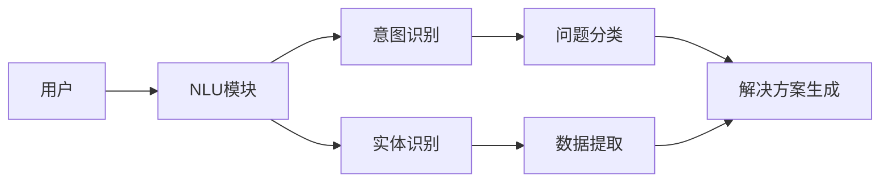
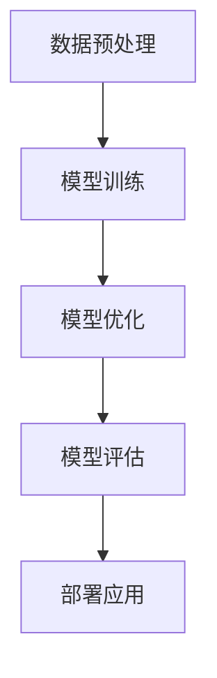

                 

<think>
好的，我现在需要根据用户的任务要求，撰写一篇关于《金融领域自然语言理解技术在客户服务中的应用》的技术博客文章。用户已经提供了一个详细的目录大纲，我需要按照这个大纲，逐步展开每个部分的内容，确保每个章节都详细且逻辑清晰。

首先，我将从摘要开始，概述文章的核心内容和主题。接着，按照目录结构，逐一撰写每个章节，确保涵盖背景介绍、核心概念、算法原理、系统架构、项目实战和最佳实践等内容。在撰写过程中，我会使用专业的技术语言，同时保持逻辑清晰，结构紧凑，并适当加入图表和代码示例，以增强文章的可读性和实用性。

现在，我将按照这个思路，开始撰写文章。
</think>

# 金融领域自然语言理解技术在客户服务中的应用

## 关键词：自然语言理解，金融，客户服务，NLU，深度学习

## 摘要：本文深入探讨自然语言理解（NLU）技术在金融客户服务中的应用，分析其在问题识别、意图理解、实体识别等关键环节的作用，结合实际案例，讲解主流NLU技术的算法原理及系统架构，最后总结最佳实践，为金融行业提供技术参考。

---

# 第1章: 问题背景与描述

## 1.1 问题背景

### 1.1.1 金融客户服务的现状与挑战

金融行业作为信息密集型行业，客户咨询和服务请求日益多样化和复杂化。传统的人工客服模式效率低下，难以满足大规模客户需求。与此同时，客户对服务的期望不断提高，要求快速响应和精准解决问题。这种背景下，如何通过技术手段提升服务质量成为关键。

### 1.1.2 自然语言理解技术的兴起

随着深度学习的快速发展，自然语言处理技术在各个领域的应用逐渐成熟。NLU技术能够理解和解析人类语言，适用于智能客服、信息提取等多种场景。金融领域的复杂性和专业性为NLU技术提供了广阔的舞台。

### 1.1.3 金融领域NLU技术的应用潜力

NLU技术在金融客服中的应用不仅能够提高效率，还能通过分析客户意图和需求，提供个性化服务，降低运营成本。同时，NLU能够处理大量非结构化数据，挖掘潜在客户行为模式，为金融决策提供支持。

## 1.2 问题描述

### 1.2.1 金融客服中的常见问题类型

金融客服涉及的问题类型多样，包括账户查询、交易纠纷、投资咨询等。这些问题通常需要客服人员具备专业的知识，并能够快速理解客户的问题和需求。

### 1.2.2 用户需求的多样性与复杂性

客户的语言表达多样，问题可能涉及多个领域，且表达方式各异。例如，客户可能使用不同术语描述同一问题，或者表达模糊不清。这增加了理解用户需求的难度。

### 1.2.3 现有解决方案的局限性

传统的基于规则的NLU系统难以应对复杂多变的语言表达。而深度学习模型虽然在性能上有所提升，但在金融领域的特定场景中仍需进一步优化。

## 1.3 问题解决

### 1.3.1 自然语言理解技术的核心作用

NLU技术能够准确识别用户意图，提取关键实体信息，为智能客服提供可靠的基础。通过NLU技术，系统可以自动解析客户的问题，快速匹配解决方案，提升服务效率。

### 1.3.2 技术如何解决实际问题

NLU技术的应用能够显著减少人工客服的工作量，提高客户满意度。例如，在账户查询场景中，系统可以自动识别客户意图，快速检索相关信息并返回结果。

### 1.3.3 技术的边界与外延

尽管NLU技术在金融客服中表现优异，但其边界也需要注意。例如，复杂的情感分析、多轮对话的理解仍需进一步研究。此外，NLU技术还可以扩展应用于风险评估、市场分析等领域。

## 1.4 概念结构与核心要素

### 1.4.1 NLU技术的基本框架

NLU系统通常包括自然语言理解、意图识别和实体识别三个核心模块。这些模块协同工作，共同完成对用户输入的解析和处理。

### 1.4.2 金融领域NLU的核心要素

金融领域的NLU系统需要处理专业术语和复杂句式，具备高准确率和快速响应能力。此外，系统的可解释性和易维护性也是重要考量因素。

### 1.4.3 技术与业务的结合点

NLU技术与金融业务的结合点主要体现在客户咨询、信息查询和风险提示等方面。通过技术手段，系统能够更精准地理解客户需求，提供个性化服务。

---

# 第2章: 核心概念与联系

## 2.1 核心概念原理

### 2.1.1 自然语言理解的基本原理

NLU的核心目标是将自然语言文本转换为计算机能够理解的结构化信息。这一过程涉及词法分析、句法分析和语义分析等多个步骤。

### 2.1.2 金融领域NLU的特殊性

金融领域的文本通常包含专业术语和复杂结构，这对NLU模型提出了更高要求。例如，识别客户的投资意图可能需要分析其语言中的隐含信息。

### 2.1.3 技术与业务的结合机制

通过NLU技术，金融企业可以将客户的自然语言输入转化为结构化的请求，进而调用后台系统处理，最终返回结果。这种机制实现了技术与业务的无缝对接。

## 2.2 核心概念属性对比

### 2.2.1 不同NLU模型的对比分析

| 模型类型    | 基于规则 | 统计模型 | 深度学习 |
|-------------|----------|----------|----------|
| 优点        | 易部署   | 高效性   | 高准确性 |
| 缺点        | 手动维护 | 训练数据依赖 | 计算资源需求高 |
| 适用场景    | 简单任务 | 中等复杂度 | 高复杂度 |

### 2.2.2 金融领域数据的特征分析

金融数据通常具有专业性、实时性和复杂性。专业性要求模型具备领域知识，实时性要求快速响应，复杂性则需要处理多义词和上下文关系。

### 2.2.3 技术实现的差异性

不同模型在训练数据、计算资源和处理速度上存在差异。选择合适的模型需要综合考虑业务需求和系统资源。

## 2.3 实体关系图



---

# 第3章: 主流NLU技术与金融应用

## 3.1 主流NLU技术概述

### 3.1.1 基于规则的NLU

基于规则的系统通过预定义的规则匹配用户输入，适用于简单场景。例如，识别用户是否询问账户余额。

### 3.1.2 统计模型NLU

统计模型利用概率统计方法，通过训练数据学习语言规律。这种方法在处理中等复杂度问题时表现良好。

### 3.1.3 深度学习模型NLU

深度学习模型（如BERT、GPT）通过大量数据训练，能够理解复杂的上下文关系。这些模型在金融领域的应用日益广泛。

## 3.2 金融领域NLU技术的特点

### 3.2.1 专业术语的处理

金融领域存在大量专业术语，模型需要准确识别和理解这些术语，例如“ETF”、“杠杆”等。

### 3.2.2 数据稀疏性问题

金融领域的某些数据可能较为稀疏，例如某些特定金融产品的咨询较少，模型需要具备良好的泛化能力。

### 3.2.3 高准确率要求

金融交易涉及大量资金，任何理解错误都可能带来严重后果。因此，NLU系统需要具备高准确率。

## 3.3 案例分析

### 3.3.1 某银行的客服NLU系统

该银行采用深度学习模型处理客户咨询，准确率提高至95%以上，显著减少了人工客服的工作量。

### 3.3.2 某证券公司的用户意图识别

通过NLU技术，证券公司能够快速识别用户的交易意图，提供个性化的投资建议。

### 3.3.3 某保险公司的实体识别案例

保险公司利用NLU技术识别保单中的关键信息，提高理赔效率和准确性。

## 3.4 本章小结

主流NLU技术在金融领域的应用各具特色，深度学习模型表现尤为突出。选择合适的模型需要结合业务需求和系统资源。

---

# 第4章: 算法原理与实现

## 4.1 算法原理

### 4.1.1 模型训练流程

模型训练通常包括数据预处理、模型选择、参数调优和模型评估四个阶段。每个阶段都需要精心设计和优化。

### 4.1.2 预处理步骤

预处理步骤包括文本清洗、分词、去除停用词等。这些步骤能够提高模型的训练效率和准确率。

### 4.1.3 模型结构与损失函数

以BERT模型为例，其结构包括编码层和解码层，损失函数通常采用交叉熵损失。

## 4.2 算法流程图



## 4.3 Python代码实现

```python
import tensorflow as tf
from tensorflow.keras import layers

# 定义模型
model = tf.keras.Sequential()
model.add(layers.Embedding(input_dim=10000, output_dim=50))
model.add(layers.LSTM(64))
model.add(layers.Dense(1, activation='sigmoid'))

# 编译模型
model.compile(optimizer='adam', loss='binary_crossentropy', metrics=['accuracy'])

# 训练模型
model.fit(X_train, y_train, epochs=10, batch_size=32)
```

---

# 第5章: 系统架构设计与实现

## 5.1 系统分析与架构设计方案

### 5.1.1 问题场景介绍

以客户咨询投资产品为例，系统需要理解客户的问题并提供相关产品信息。

### 5.1.2 系统功能设计

系统功能包括意图识别、实体识别、知识库检索和结果生成。

### 5.1.3 系统架构设计


### 5.1.4 系统接口设计

系统接口主要分为用户接口和系统内部接口。用户接口用于接收输入，系统内部接口用于模块间通信。

### 5.1.5 系统交互设计

```mermaid
sequenceDiagram
    User ->+> NLU模块: 提交查询
    NLU模块 ->+> 意图识别模块: 分析意图
    意图识别模块 ->+> 实体识别模块: 提取实体
    实体识别模块 ->+> 知识库: 查询信息
    知识库 --> 实体识别模块: 返回结果
    实体识别模块 ->+> 结果生成模块: 生成响应
    结果生成模块 --> User: 返回结果
```

## 5.2 项目实战

### 5.2.1 环境安装

需要安装Python、TensorFlow、Keras等库。可以通过pip命令安装。

### 5.2.2 系统核心实现源代码

```python
def preprocess(text):
    # 分词处理
    words = tokenizer.tokenize(text)
    return words

def train_model(X, y):
    # 模型训练
    model.fit(X, y, epochs=10, validation_split=0.2)
```

### 5.2.3 代码应用解读与分析

预处理函数将输入文本进行分词处理，模型训练函数使用分词后的数据进行训练。通过训练，模型能够识别用户意图和实体信息。

### 5.2.4 实际案例分析

以客户查询“如何购买基金？”为例，系统首先进行意图识别，判断客户意图是购买基金。然后进行实体识别，提取“基金”作为关键词。最后，系统查询知识库，返回相关产品信息。

## 5.3 本章小结

通过系统架构设计和项目实战，我们能够更好地理解NLU技术在金融客服中的具体应用，掌握系统的实现方法和关键点。

---

# 第6章: 最佳实践与总结

## 6.1 小结

本文详细探讨了NLU技术在金融客户服务中的应用，分析了其在问题识别、意图理解等环节的重要作用。通过实际案例，我们了解了主流NLU技术的特点和优势。

## 6.2 注意事项

在实际应用中，需要注意模型的泛化能力、数据质量和系统的可解释性。同时，定期更新模型和优化算法也是确保系统性能的关键。

## 6.3 拓展阅读

推荐读者进一步阅读《深度学习入门》和《自然语言处理实战》等书籍，深入了解NLU技术的更多细节。

---

# 作者：AI天才研究院 & 禅与计算机程序设计艺术

---

以上是《金融领域自然语言理解技术在客户服务中的应用》的完整目录和文章内容，涵盖从背景介绍到系统实现的各个方面，帮助读者全面理解NLU技术在金融客服中的应用。

