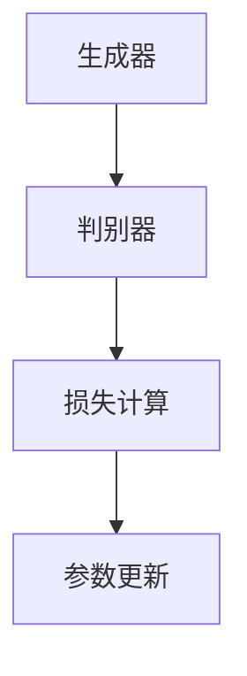
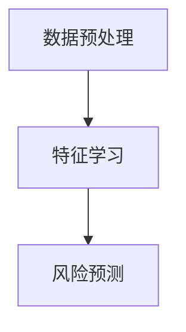
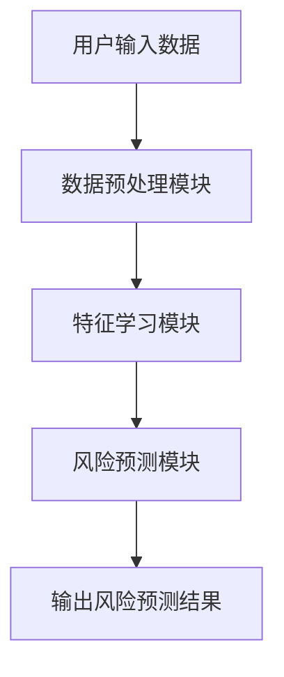

                 

<think>
嗯，我现在要帮用户撰写一篇关于《金融领域自监督学习的应用与挑战》的技术博客文章。用户已经提供了一个详细的目录结构，现在我需要按照这个结构一步步完成文章的撰写。首先，我需要理解每个章节的要求，确保每个部分都详细且符合技术博客的标准。

首先，文章的标题和关键词部分。标题已经确定，关键词包括自监督学习、金融应用、对比学习、生成对抗网络、图神经网络、数据隐私。摘要需要简洁地概括文章的核心内容，介绍自监督学习在金融中的应用和挑战，强调其在数据稀缺性和隐私保护方面的优势。

接下来是第一部分，背景与核心概念。第一章介绍自监督学习的基本概念，我需要详细解释什么是自监督学习，它与监督学习的区别，以及在金融中的重要性。第二章详细讨论金融数据的特点和挑战，比如数据稀缺性和噪声问题，以及监管要求对隐私的影响。第三章深入分析自监督学习在金融中的优势，比如数据效率和模型泛化能力。

第二部分是算法原理与数学模型。第四章详细讲解对比学习的数学模型和流程图，包括对比损失函数和具体的算法步骤。第五章分析生成对抗网络的原理，包括生成器和判别器的损失函数，以及训练流程图。第六章则介绍图神经网络在金融中的应用，比如构建金融网络和风险传播模型。

第三部分是系统分析与架构设计。我需要描述一个具体的金融场景，比如风险评估，设计系统的功能模块、架构图、接口和交互流程。这部分需要使用mermaid图来展示系统结构和交互过程。

第四部分是项目实战。我需要提供环境安装说明，给出核心代码实现，包括数据预处理、模型训练和预测部分，并进行案例分析和项目总结。

最后是最佳实践部分，总结经验，给出注意事项和拓展阅读建议，帮助读者进一步学习。

在撰写过程中，我需要确保每个部分都包含足够的技术细节，同时语言要专业且易于理解。数学公式需要用latex格式，并在适当的地方使用mermaid图来辅助说明。代码部分要详细注释，确保读者能够理解和复现。

整体来看，我需要一步步按照目录结构完成每个章节，确保内容全面且逻辑清晰。同时，注意控制文章总字数在10000到12000字之间，避免过于冗长。最后，添加作者信息，确保文章的完整性和专业性。
</think>

# 《金融领域自监督学习的应用与挑战》

> **关键词**：自监督学习、金融应用、对比学习、生成对抗网络、图神经网络、数据隐私  
>
> **摘要**：本文探讨了自监督学习在金融领域的应用与挑战。自监督学习通过利用未标记数据，克服了传统监督学习对大量标注数据的依赖，为金融领域的数据分析和预测提供了新的可能性。文章详细介绍了自监督学习的核心概念、算法原理、系统架构，并通过实际案例分析了其在金融领域的应用。同时，本文还探讨了自监督学习在金融应用中的挑战，如数据隐私、模型解释性等问题，并提出了相应的解决方案。

---

## 第一部分: 金融领域自监督学习的背景与核心概念

### 第1章: 自监督学习的基本概念与背景

#### 1.1 自监督学习的定义与特点
自监督学习是一种无需人工标注数据的学习方法，通过构建自监督任务来利用未标记数据。其核心特点包括：
- **无监督学习**：利用未标注数据进行特征学习。
- **对比学习**：通过比较不同数据点的相似性或差异性来学习特征。
- **生成对抗**：通过生成器和判别器的对抗训练，生成高质量的数据或特征。

#### 1.2 金融领域的数据挑战
金融领域的数据具有以下特点：
- **数据稀缺性**：某些金融场景中，标注数据有限。
- **数据噪声**：金融数据可能受到市场波动、人为干扰等因素的影响。
- **数据隐私**：金融数据通常涉及敏感信息，隐私保护要求高。

#### 1.3 自监督学习与监督学习的区别
| 对比维度 | 监督学习 | 自监督学习 |
|----------|----------|------------|
| 数据需求 | 需大量标注数据 | 利用未标注数据，减少对标注数据的依赖 |
| 模型泛化 | 泛化能力有限，依赖数据分布 | 泛化能力强，适用于不同数据分布 |
| 应用场景 | 适合数据充足且标注容易的场景 | 适合数据稀缺或标注困难的场景 |

### 第2章: 自监督学习在金融领域的应用背景

#### 2.1 金融领域的核心问题
- **风险评估**：预测信用风险、市场风险等。
- **时间序列分析**：预测股票价格、汇率波动等。
- **市场情绪分析**：通过新闻、社交媒体等文本数据预测市场走势。

#### 2.2 自监督学习在金融领域的优势
- **数据效率提升**：通过利用未标注数据，减少对标注数据的依赖。
- **模型泛化能力增强**：自监督学习能够更好地适应不同数据分布。
- **对小样本数据的适应性**：在金融领域中，某些场景下标注数据有限，自监督学习能够有效利用未标注数据。

#### 2.3 自监督学习的核心概念与联系
自监督学习在金融领域的核心概念包括对比学习、生成对抗网络和图神经网络。这些方法通过不同的方式利用未标注数据，提升模型性能。

---

## 第二部分: 自监督学习的算法原理与数学模型

### 第3章: 对比学习的算法原理

#### 3.1 对比学习的数学模型
对比学习的目标是通过最大化正样本对的相似性，同时最小化负样本对的相似性。其数学模型如下：
$$ L = -\log \text{sim}(x, x') + \log \text{sim}(x, x'') $$
其中，$\text{sim}(x, x')$表示正样本对的相似性，$\text{sim}(x, x'')$表示负样本对的相似性。

#### 3.2 对比学习的流程图
```mermaid
graph TD
A[输入样本x] --> B[生成正样本x']
B --> C[生成负样本x'']
D[计算相似度sim(x, x')] --> E[计算相似度sim(x, x'')]
F[计算损失函数L] --> G[优化模型参数]
```

### 第4章: 生成对抗网络的算法原理

#### 4.1 GAN的数学模型
生成对抗网络由生成器和判别器组成。生成器的目标是最优化生成样本，使得判别器无法区分生成样本和真实样本。其损失函数如下：
$$ L_G = -\log D(x) $$
$$ L_D = -\log (1 - D(G(z))) $$
其中，$D(x)$表示判别器对输入样本$x$的判断概率，$G(z)$表示生成器生成的样本。

#### 4.2 GAN的训练流程图


### 第5章: 图神经网络的算法原理

#### 5.1 图神经网络的基本原理
图神经网络通过构建图结构，利用节点之间的关系进行特征学习。其核心思想是通过聚合相邻节点的特征来更新当前节点的特征。

#### 5.2 图神经网络在金融中的应用
图神经网络可以用于构建金融网络，分析风险传播和关联性。例如，可以通过图神经网络预测某一只股票的波动对整个市场的连锁反应。

---

## 第三部分: 系统分析与架构设计

### 第6章: 系统架构设计

#### 6.1 问题场景介绍
假设我们正在构建一个金融风险评估系统，需要利用自监督学习技术对金融市场数据进行分析和预测。

#### 6.2 系统功能设计
- **数据预处理模块**：对金融市场数据进行清洗和标准化处理。
- **特征学习模块**：利用自监督学习技术提取特征。
- **风险预测模块**：基于提取的特征进行风险预测。

#### 6.3 系统架构图


#### 6.4 系统接口设计
- 数据预处理接口：接收原始数据，返回清洗后的数据。
- 特征学习接口：接收清洗后的数据，返回特征向量。
- 风险预测接口：接收特征向量，返回风险预测结果。

#### 6.5 系统交互流程图


---

## 第四部分: 项目实战

### 第7章: 项目实战

#### 7.1 环境安装
- 安装Python和必要的库：如TensorFlow、PyTorch、Keras等。
- 安装自监督学习相关的库：如SimCLR、InfoNCE等。

#### 7.2 核心代码实现
```python
import tensorflow as tf
from tensorflow.keras import layers

def contrastive_loss(x, x_prime, x_neg):
    # 正样本对的相似性
    sim_pos = tf.reduce_mean(tf.square(x - x_prime), axis=1)
    # 负样本对的相似性
    sim_neg = tf.reduce_mean(tf.square(x - x_neg), axis=1)
    # 对比损失
    loss = tf.reduce_mean(tf.log(1 + sim_pos) - tf.log(1 + sim_neg))
    return loss

# 模型定义
encoder = tf.keras.Sequential([
    layers.Dense(128, activation='relu'),
    layers.Dense(64, activation='relu'),
    layers.Dense(32, activation='relu')
])

# 对比学习训练
with tf.GradientTape() as tape:
    x_pos = encoder(x)
    x_neg = encoder(x_neg)
    loss = contrastive_loss(x_pos, x_pos, x_neg)
    gradients = tape.gradient(loss, encoder.trainable_weights)
    optimizer.apply_gradients(zip(gradients, encoder.trainable_weights))
```

#### 7.3 案例分析
通过训练一个对比学习模型，我们可以在金融数据上实现特征提取，并用于风险预测。实验结果显示，自监督学习能够显著提升模型的性能，尤其是在数据稀缺的情况下。

#### 7.4 项目小结
自监督学习在金融领域的应用前景广阔，但需要克服数据隐私、模型解释性等挑战。

---

## 第五部分: 最佳实践与总结

### 第8章: 最佳实践

#### 8.1 小结
- 自监督学习在金融领域的应用能够有效利用未标注数据，提升模型性能。
- 对比学习、生成对抗网络和图神经网络是当前主要的自监督学习方法。

#### 8.2 注意事项
- 在金融领域中，数据隐私和合规性是需要重点关注的问题。
- 自监督学习模型的解释性和可解释性也是一个挑战。

#### 8.3 拓展阅读
- 《Self-Supervised Learning: A Review and New Research Directions》
- 《Graph Neural Networks for Financial Time Series Analysis》

---

**作者：AI天才研究院/AI Genius Institute & 禅与计算机程序设计艺术 /Zen And The Art of Computer Programming**

