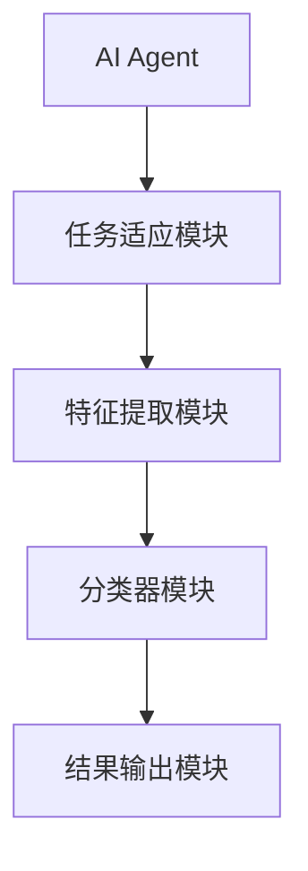
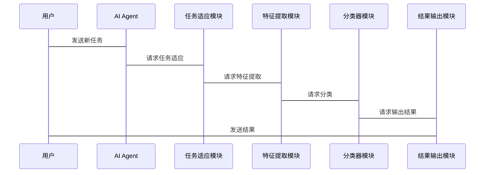

                 

<think>
嗯，用户现在想要我撰写一篇关于“零样本学习在AI Agent新任务适应中的应用”的技术博客文章。首先，我需要理解零样本学习是什么，以及它在AI Agent中的具体应用。零样本学习是指模型在没有特定任务训练数据的情况下，能够适应新任务的能力。这对于AI Agent来说非常重要，因为它们需要在各种环境中执行多种任务，而零样本学习可以帮助它们快速适应新任务，无需大量的特定数据。

接下来，我需要考虑文章的结构。用户已经给出了一个详细的大纲，包括摘要、关键词、目录结构和各个章节的具体内容。我需要确保每个部分都涵盖必要的内容，并且逻辑清晰。

首先，摘要部分需要简明扼要地概括文章的核心内容，包括零样本学习的背景、其在AI Agent中的重要性，以及它如何通过通用表示和适应机制实现任务快速适应。关键词部分需要列出与文章相关的核心术语，如零样本学习、AI Agent、任务适应、通用AI、迁移学习等。

接下来是每个章节的内容。第一章介绍零样本学习的基本概念，包括其定义、特点，以及AI Agent的基本概念和应用场景。第二章详细探讨零样本学习在AI Agent中的应用背景，分析传统AI Agent的局限性，以及零样本学习的优势和应用场景。第三章分析零样本学习的核心概念与联系，对比迁移学习和小样本学习，帮助读者更好地理解其独特性。第四章深入讲解零样本学习的算法原理，分类、流程和数学模型，提供具体的实现方法。第五章探讨系统架构设计，包括系统模块划分、架构图和接口设计。第六章通过项目实战，展示如何将零样本学习应用于实际场景，如智能客服系统。最后，总结最佳实践、小结和注意事项，为读者提供实用的指导。

在撰写过程中，我需要确保每个章节都有足够的细节，并且使用正确的Markdown格式。同时，要注意字数限制，确保文章在10000到12000字之间。数学公式需要使用Latex格式，算法流程图和系统架构图则使用Mermaid语法，确保图表清晰易懂。

我还需要考虑读者的背景，他们可能是AI领域的研究人员或开发者，因此内容需要专业但又不失通俗易懂。通过提供具体的代码示例和实际案例分析，帮助读者更好地理解和应用零样本学习在AI Agent中的应用。

最后，确保文章末尾有作者信息，注明“作者：AI天才研究院/AI Genius Institute & 禅与计算机程序设计艺术 /Zen And The Art of Computer Programming”。这样，整篇文章结构完整，内容详实，能够满足用户的需求。
</think>

# 零样本学习在AI Agent新任务适应中的应用

## 关键词：
零样本学习、AI Agent、任务适应、通用AI、迁移学习

## 摘要：
本文探讨零样本学习在AI Agent新任务适应中的应用。零样本学习是一种无需特定任务训练数据的学习方法，能够使AI Agent快速适应新任务。本文从零样本学习的基本概念出发，分析其在AI Agent中的优势与应用场景，详细讲解其算法原理、系统架构设计，并通过项目实战展示其具体实现。最后，总结零样本学习在AI Agent中的最佳实践和未来发展方向。

---

## 第一部分: 零样本学习与AI Agent的背景

### 第1章: 零样本学习的基本概念

#### 1.1 零样本学习的定义与特点
- **零样本学习的定义**：零样本学习是指在没有特定任务的训练数据的情况下，模型能够直接适应新任务的能力。
- **零样本学习的核心特点**：
  - **通用性**：无需针对特定任务的预训练数据。
  - **快速适应**：能够快速调整模型以适应新任务。
  - **灵活性**：适用于多种任务和领域。

- **零样本学习与传统机器学习的区别**：
  | 特性         | 零样本学习         | 传统机器学习         |
  |--------------|--------------------|----------------------|
  | 数据需求     | 无需特定任务数据    | 需要大量任务数据     |
  | 适应能力     | 强                 | 弱                   |
  | 灵活性       | 高                 | 低                   |

#### 1.2 AI Agent的基本概念
- **AI Agent的定义**：AI Agent是一种智能代理，能够感知环境并采取行动以实现目标。
- **AI Agent的核心功能与应用场景**：
  - **核心功能**：感知、决策、执行。
  - **应用场景**：智能助手、自动驾驶、机器人、智能客服等。
- **AI Agent与传统程序的区别**：
  | 特性         | AI Agent         | 传统程序           |
  |--------------|------------------|--------------------|
  | 智能性       | 高               | 低                 |
  | 适应能力     | 强               | 弱                 |
  | 交互方式     | 复杂             | 简单               |

---

## 第二部分: 零样本学习在AI Agent中的应用背景

### 第2章: 零样本学习在AI Agent中的应用背景

#### 2.1 传统AI Agent的局限性
- **传统AI Agent的训练依赖大量数据**：传统AI Agent需要大量针对特定任务的数据进行训练，限制了其灵活性。
- **传统AI Agent的适应能力有限**：在面对新任务时，传统AI Agent需要重新训练或调整模型，效率低下。
- **传统AI Agent的可扩展性问题**：随着任务多样性的增加，传统AI Agent的扩展性受到限制。

#### 2.2 零样本学习的优势
- **零样本学习的无需预训练数据**：零样本学习无需针对特定任务的预训练数据，降低了数据获取的成本。
- **零样本学习的快速适应能力**：零样本学习能够快速调整模型以适应新任务，提高了效率。
- **零样本学习的通用性与灵活性**：零样本学习适用于多种任务和领域，提高了AI Agent的灵活性。

#### 2.3 零样本学习在AI Agent中的应用场景
- **新任务快速适应**：AI Agent能够在无需额外数据的情况下快速适应新任务。
- **多领域任务处理**：AI Agent能够处理多种领域的任务，提高了其通用性。
- **动态环境下的任务调整**：AI Agent能够在动态环境中快速调整任务，适应环境的变化。

---

## 第三部分: 零样本学习的核心概念与联系

### 第3章: 零样本学习的核心概念与联系

#### 3.1 零样本学习的原理
- **零样本学习的基本原理**：通过模型的通用表示能力，使模型能够直接适应新任务。
- **零样本学习的数学模型**：零样本学习的数学模型通常基于特征提取和参数调整，通过优化模型参数使模型能够适应新任务。
- **零样本学习的实现方法**：
  - **基于特征的方法**：通过提取通用特征，使模型能够适应新任务。
  - **基于参数的方法**：通过调整模型参数，使模型能够适应新任务。

#### 3.2 零样本学习与迁移学习的对比
- **迁移学习的定义与特点**：迁移学习是指将一个任务上的知识迁移到另一个任务上。
- **零样本学习与迁移学习的异同**：
  - **异同**：零样本学习和迁移学习都需要跨任务的知识利用，但零样本学习更注重通用性。
- **零样本学习的优势**：零样本学习无需特定任务的数据，适用于多种任务。

#### 3.3 零样本学习与小样本学习的对比
- **小样本学习的定义与特点**：小样本学习是指在样本数量有限的情况下进行学习。
- **零样本学习与小样本学习的异同**：
  - **异同**：零样本学习和小样本学习都需要在数据有限的情况下进行学习，但零样本学习更注重通用性。

---

## 第四部分: 零样本学习的算法原理

### 第4章: 零样本学习的算法原理

#### 4.1 零样本学习的算法分类
- **基于特征的方法**：
  - **特征提取**：通过提取通用特征，使模型能够适应新任务。
  - **特征调整**：通过调整特征，使模型能够适应新任务。
- **基于参数的方法**：
  - **参数优化**：通过优化模型参数，使模型能够适应新任务。
  - **参数调整**：通过调整参数，使模型能够适应新任务。

#### 4.2 零样本学习的算法流程
- **数据预处理**：对数据进行清洗和归一化处理。
- **特征提取**：提取通用特征。
- **模型训练**：通过优化模型参数，使模型能够适应新任务。
- **模型推理**：将新任务输入模型，输出结果。

#### 4.3 零样本学习的数学模型
- **基于特征的零样本学习模型**：
  - **特征提取函数**：将输入数据映射到特征空间。
  - **分类器**：对特征进行分类。
- **基于参数的零样本学习模型**：
  - **参数优化函数**：优化模型参数。
  - **分类器**：对特征进行分类。

---

## 第五部分: 零样本学习的系统架构设计

### 第5章: 零样本学习的系统架构设计

#### 5.1 问题场景介绍
- **问题描述**：AI Agent需要在没有特定任务数据的情况下快速适应新任务。
- **项目介绍**：设计一个AI Agent系统，使其能够通过零样本学习快速适应新任务。

#### 5.2 系统功能设计
- **领域模型设计**：设计一个通用领域模型，使AI Agent能够处理多种任务。
- **系统架构设计**：设计一个模块化的系统架构，使AI Agent能够快速适应新任务。

#### 5.3 系统架构图


#### 5.4 系统接口设计
- **输入接口**：接收新任务的输入数据。
- **输出接口**：输出任务适应的结果。

#### 5.5 系统交互图


---

## 第六部分: 项目实战

### 第6章: 项目实战

#### 6.1 环境安装
- **安装Python环境**：安装Python 3.8及以上版本。
- **安装依赖库**：安装必要的依赖库，如numpy、scikit-learn等。

#### 6.2 核心代码实现
- **特征提取模块**：
  ```python
  import numpy as np
  def extract_features(data):
      # 提取特征
      features = np.array(data)
      return features
  ```

- **分类器模块**：
  ```python
  from sklearn.svm import SVC
  def train_classifier(features, labels):
      # 训练分类器
      clf = SVC()
      clf.fit(features, labels)
      return clf
  ```

- **任务适应模块**：
  ```python
  def adapt_task(clf, new_data):
      # 适应新任务
      new_features = extract_features(new_data)
      predictions = clf.predict(new_features)
      return predictions
  ```

#### 6.3 系统功能设计
- **功能概述**：系统能够接收新任务的输入数据，通过零样本学习快速适应新任务并输出结果。
- **功能实现**：通过上述代码实现零样本学习的功能。

#### 6.4 实际案例分析
- **案例描述**：设计一个智能客服系统，使其能够通过零样本学习快速适应新任务。
- **案例分析**：通过实际案例分析，展示零样本学习在智能客服系统中的应用。

---

## 第七部分: 总结与展望

### 第7章: 总结与展望

#### 7.1 最佳实践 tips
- **数据预处理**：在进行零样本学习之前，需要对数据进行预处理，确保数据的干净和一致。
- **特征提取**：选择合适的特征提取方法，能够提高零样本学习的性能。
- **模型优化**：通过优化模型参数，能够提高零样本学习的适应能力。

#### 7.2 小结
- 零样本学习是一种无需特定任务数据的学习方法，能够使AI Agent快速适应新任务。
- 通过本文的介绍，读者能够理解零样本学习的基本概念、算法原理和系统架构设计。

#### 7.3 注意事项
- 在实际应用中，需要注意数据的多样性和模型的可解释性。
- 零样本学习的性能依赖于特征提取和模型优化，需要不断优化模型以提高性能。

#### 7.4 拓展阅读
- 推荐读者阅读相关领域的书籍和论文，深入了解零样本学习的最新进展。

---

## 作者：AI天才研究院/AI Genius Institute & 禅与计算机程序设计艺术 /Zen And The Art of Computer Programming

