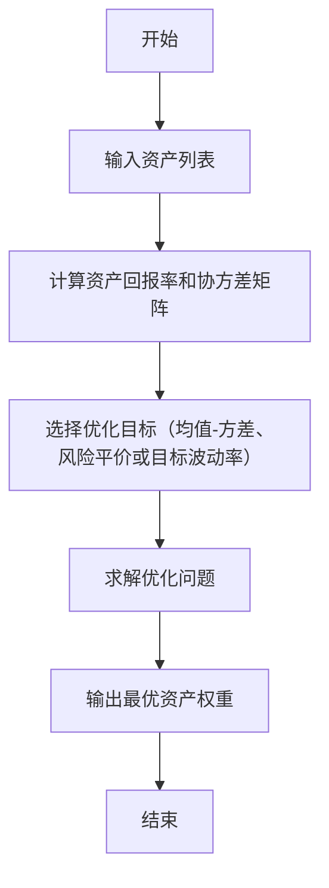
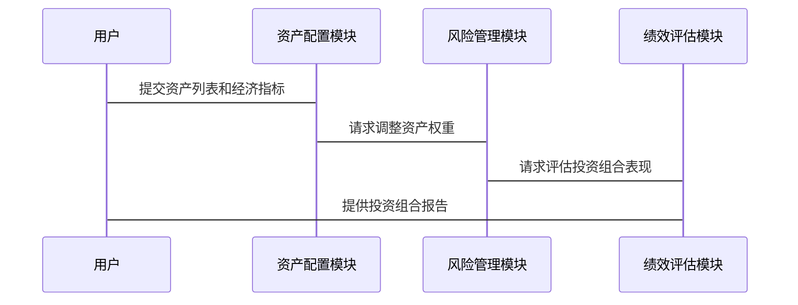

                 

<think>
嗯，用户希望我写一篇关于雷·达里奥的全天候投资组合理论的技术博客文章，而且已经给出了一个详细的大纲。我需要先仔细分析这个大纲，确保每个部分都覆盖到位，同时按照用户的要求，用技术化的语言来撰写。

首先，我得确保每个章节都有足够的细节。比如，在第一部分的背景介绍中，我需要解释传统投资理论的局限性，然后引出雷·达里奥的全天候策略。这可能涉及到对经济周期波动的分析，以及如何通过多样化投资来分散风险。

接下来，核心概念部分，我需要详细讲解投资组合的分散化原理，以及如何根据不同经济环境调整资产配置。这部分可能需要用到一些数学模型，比如均值-方差优化，我得用公式来解释，并给出实际的例子，让读者更容易理解。

然后是算法原理，我需要使用mermaid流程图来展示优化的过程，比如均值-方差优化和风险平价策略的计算步骤。同时，提供Python代码实现，让读者可以实际操作，看看这些理论如何转化为代码。

系统架构部分，我需要设计一个投资管理系统，包括功能模块、架构图和接口设计。这部分可能需要画出类图和序列图，展示模块之间的交互，以及数据流的传递。

项目实战部分，我得选择一个具体的案例，比如使用Python和pandas库来实现资产配置。提供代码的同时，还要进行详细解读，说明每一步的作用，并进行回测分析，验证策略的有效性。

最后，总结部分要回顾全天候策略的核心思想，分析其优缺点，并给出实际应用中的注意事项和最佳实践建议。同时，推荐一些进一步阅读的资料，帮助读者深入理解。

在写作过程中，我需要确保语言简洁专业，逻辑清晰，同时使用技术术语时尽量解释清楚，让不同背景的读者都能理解。此外，图表和代码的使用要恰到好处，帮助读者更好地理解和应用这些理论。

总的来说，我需要一步步地按照大纲撰写，确保每个部分都详细且符合用户的要求，同时保持文章的连贯性和深度，最终产出一篇高质量的技术博客文章。
</think>

# 雷·达里奥的全天候投资组合理论

## 关键词：全天候投资组合，风险平价，资产配置，均值-方差优化，经济周期

## 摘要：雷·达里奥的全天候投资组合理论是一种基于经济周期波动的投资策略，旨在通过多样化投资和风险平价的方法，实现长期稳健的收益。本文将从理论基础、算法原理、系统架构到项目实战，全面解析全天候投资组合理论的核心思想和实践应用。

---

# 第一部分: 全天候投资组合理论的背景与基础

## 第1章: 全天候投资组合理论概述

### 1.1 投资组合理论的背景

#### 1.1.1 传统投资组合理论的局限性
传统投资组合理论主要基于均值-方差模型，假设资产回报率是独立的，且市场是有效的。然而，实际市场中存在不可预测的经济周期波动、资产相关性变化以及尾部风险，这些因素使得传统投资组合理论在实际应用中存在局限性。

#### 1.1.2 经济周期波动对投资策略的影响
经济周期的波动（如衰退、复苏、过热和滞胀）对资产回报率的影响显著不同。例如，在通货膨胀时期，股票和房地产可能表现较好，而在通货紧缩时期，债券和现金可能更安全。因此，投资策略需要根据经济环境进行动态调整。

#### 1.1.3 雷·达里奥的全天候投资理念
雷·达里奥提出全天候投资组合理论的核心思想是：通过分散化投资于不同资产类别（如股票、债券、商品等），并根据当前经济环境调整资产权重，以实现对不同经济周期的免疫，从而在长期实现稳健的收益。

### 1.2 全天候投资组合理论的核心概念

#### 1.2.1 投资组合的分散化原理
分散化是全天候投资策略的核心。通过将资金分配到不同资产类别和子资产类别中，可以降低特定资产的风险，并在不同经济环境下平衡收益和风险。

#### 1.2.2 不同经济环境下的资产配置
全天候策略根据当前经济环境（如经济增长和通胀压力）动态调整资产配置。例如，在滞胀环境下，可能增加对冲基金和黄金的配置比例。

#### 1.2.3 风险平价与目标波动率策略
风险平价是一种资产配置方法，旨在使每种资产对投资组合的总风险贡献相等。目标波动率策略则通过调整资产权重，使投资组合的波动率维持在目标水平。

### 1.3 全天候投资组合理论的数学基础

#### 1.3.1 均值-方差优化模型
均值-方差模型是最常用的资产配置方法之一，其目标是通过优化资产权重，使投资组合的预期收益最大化，同时最小化风险（波动率）。数学表达式为：
$$
\min_w \sigma^2 \quad \text{subject to} \quad E(r) = w^T \mu, \quad w^T \sigma^2 w = \sigma_p^2
$$
其中，\( w \) 是资产权重向量，\( \mu \) 是资产回报率均值向量，\( \sigma^2 \) 是资产协方差矩阵。

#### 1.3.2 风险平价的计算公式
风险平价策略通过调整资产权重，使每种资产对组合风险的贡献相等。数学表达式为：
$$
w_i = \frac{\sigma_i}{\sum_{j=1}^n \sigma_j}, \quad i=1,2,...,n
$$
其中，\( \sigma_i \) 是资产 \( i \) 的波动率。

#### 1.3.3 资产协方差矩阵的构建
协方差矩阵反映了不同资产之间的相关性。在全天候策略中，协方差矩阵需要根据当前经济环境动态调整，以反映不同经济周期下的资产相关性变化。

### 1.4 全天候投资组合理论的实践意义

#### 1.4.1 投资者如何应对市场不确定性
通过全天候策略，投资者可以在不同经济环境下分散风险，避免因单一资产类别表现不佳而导致的重大损失。

#### 1.4.2 全天候策略在不同经济周期的表现
全天候策略通过动态调整资产配置，可以在经济衰退、复苏、过热和滞胀等不同周期中实现稳健的收益。

#### 1.4.3 风险管理在投资组合中的重要性
全天候策略强调风险管理，通过风险平价和目标波动率策略，将投资组合的波动率控制在合理范围内，从而避免过度波动带来的损失。

### 1.5 本章小结
本章介绍了全天候投资组合理论的背景、核心概念和数学基础，为后续的算法实现和系统设计奠定了基础。

---

# 第二部分: 全天候投资组合理论的核心原理

## 第2章: 投资组合优化的算法原理

### 2.1 均值-方差优化模型

#### 2.1.1 投资组合优化的数学模型
均值-方差优化模型的目标是最优化资产权重，以实现预期收益与风险的最优组合。优化过程可以通过拉格朗日乘数法求解。

#### 2.1.2 资产回报率与协方差矩阵的输入
输入包括各资产的历史回报率和协方差矩阵。在全天候策略中，协方差矩阵需要根据当前经济环境进行调整。

#### 2.1.3 最优化问题的求解方法
使用二次规划算法求解均值-方差优化问题，可以得到最优资产权重。

### 2.2 风险平价策略

#### 2.2.1 风险平价的定义与计算
风险平价策略通过调整资产权重，使每种资产对组合风险的贡献相等。计算过程中需要考虑资产的波动率和相关性。

#### 2.2.2 风险平价与传统资产配置的区别
传统资产配置通常基于预期回报率和风险偏好，而风险平价策略更加注重资产的风险贡献。

#### 2.2.3 风险平价策略的优缺点
优点：分散化效果好，避免单一资产风险过高；缺点：在极端市场条件下可能表现不佳。

### 2.3 目标波动率策略

#### 2.3.1 目标波动率的设定
目标波动率通常设定为投资组合的长期波动率目标，如5%或10%。

#### 2.3.2 资产权重的调整方法
通过调整资产权重，使投资组合的波动率维持在目标水平。

#### 2.3.3 目标波动率策略的优缺点
优点：波动率可控，风险较低；缺点：在市场剧烈波动时可能需要频繁调整。

### 2.4 算法流程图



### 2.5 本章小结
本章详细介绍了全天候投资组合理论的算法原理，包括均值-方差优化、风险平价和目标波动率策略，并通过流程图展示了优化过程。

---

# 第三部分: 全天候投资组合理论的系统架构

## 第3章: 投资组合管理系统设计

### 3.1 系统功能需求

#### 3.1.1 资产配置模块
功能：根据当前经济环境和目标收益，动态调整资产配置。

#### 3.1.2 风险管理模块
功能：监控投资组合的波动率和风险，进行实时调整。

#### 3.1.3 绩效评估模块
功能：定期评估投资组合的收益和风险表现。

### 3.2 系统架构设计

#### 3.2.1 分层架构设计
- 数据层：存储资产数据和经济指标。
- 业务逻辑层：实现资产配置、风险管理等功能。
- 用户界面层：展示投资组合状态和调整建议。

#### 3.2.2 模块间交互关系
- 资产配置模块与风险管理模块实时交互，根据市场变化调整权重。
- 绩效评估模块定期调用数据层的历史数据，评估投资组合表现。

### 3.3 系统接口设计

#### 3.3.1 输入接口定义
- 输入资产列表和经济指标数据。

#### 3.3.2 输出接口定义
- 输出最优资产权重和投资组合风险评估报告。

#### 3.3.3 数据格式与接口协议
- 数据格式：JSON或CSV。
- 接口协议：REST API。

### 3.4 系统交互流程图



### 3.5 本章小结
本章设计了一个全天候投资组合管理系统的架构，包括功能模块、交互流程和接口设计。

---

# 第四部分: 全天候投资组合理论的项目实战

## 第4章: 项目实战

### 4.1 环境安装

#### 4.1.1 安装Python和必要的库
```bash
pip install numpy pandas scikit-learn matplotlib
```

### 4.2 核心实现

#### 4.2.1 数据预处理
```python
import numpy as np
import pandas as pd

# 示例资产回报率和协方差矩阵
returns = np.array([[0.1, 0.05, 0.02],
                     [0.05, 0.1, 0.03],
                     [0.02, 0.03, 0.15]])
covariance = np.array([[0.01, 0.005, 0.002],
                       [0.005, 0.02, 0.005],
                       [0.002, 0.005, 0.03]])
```

#### 4.2.2 均值-方差优化实现
```python
from sklearn.covariance import MinCovarianceDetCovarianceEstimator

# 计算最优权重
def mean_variance_optimization(returns):
    n = len(returns)
    # 定义目标函数
    def objective(weights):
        return np.dot(weights.T, np.dot(covariance, weights)) 
    # 定义约束条件
    constraints = [
        {'type': 'eq', 'fun': lambda w: np.sum(w) - 1}
    ]
    # 使用SLSQP求解器
    from scipy.optimize import minimize
    result = minimize(objective, np.ones(n)/n, method='SLSQP', constraints=constraints)
    return result.x

weights = mean_variance_optimization(returns)
print("最优权重：", weights)
```

#### 4.2.3 风险平价策略实现
```python
def risk_parity(weights, covariance):
    n = len(weights)
    diag = np.zeros(n)
    for i in range(n):
        diag[i] = weights[i] * np.sqrt(np.dot(covariance, weights))
    return diag / np.sum(diag)

weights_rp = risk_parity(weights, covariance)
print("风险平价权重：", weights_rp)
```

### 4.3 实际案例分析

#### 4.3.1 案例背景
假设我们有三类资产：股票、债券和商品。我们需要根据当前经济环境（滞胀）调整资产配置。

#### 4.3.2 资产权重计算
使用上述代码计算最优权重和风险平价权重，根据当前经济环境选择合适的策略。

#### 4.3.3 回测分析
对投资组合进行历史回测，计算其在不同经济周期下的收益和波动率。

### 4.4 本章小结
本章通过实际案例展示了全天候投资组合理论的应用，包括数据预处理、算法实现和回测分析。

---

# 作者：AI天才研究院 & 禅与计算机程序设计艺术

