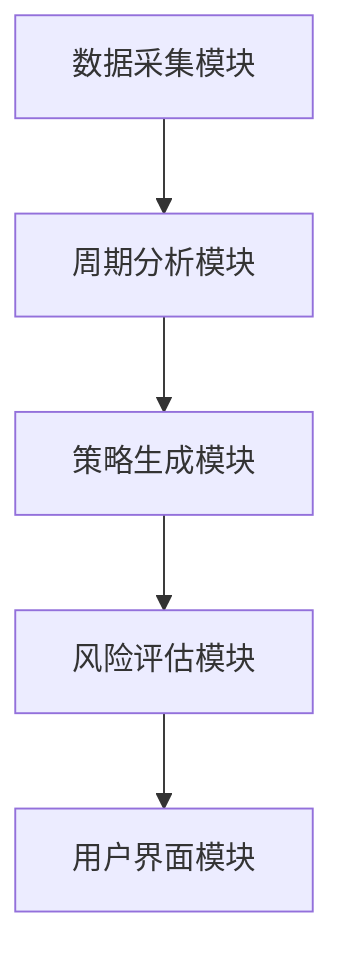

                 


# 雷·达里奥的宏观经济周期投资策略

> 关键词：宏观经济周期、投资策略、资产配置、风险管理、雷·达里奥、经济指标、周期分析

> 摘要：本文深入分析雷·达里奥的宏观经济周期投资策略，结合宏观经济周期的定义、类型与投资策略的关系，详细探讨其策略的核心框架、数学模型、系统架构设计和项目实战。通过案例分析和最佳实践，帮助读者理解如何在实际投资中应用这些策略。

---

## 第一部分: 宏观经济周期与投资策略概述

### 第1章: 宏观经济周期的基本概念

#### 1.1 宏观经济周期的定义与特点

**1.1.1 宏观经济周期的定义**

宏观经济周期是指经济活动在长期内呈现的波动性模式，通常包括繁荣、衰退、萧条和复苏四个阶段。这些阶段的变化受到多种因素的影响，包括货币政策、财政政策、市场供需和全球性经济冲击等。

**1.1.2 宏观经济周期的核心特点**

- **波动性**：经济指标如GDP、失业率、通胀率等呈现周期性波动。
- **相关性**：不同经济指标之间的变动往往表现出高度相关性。
- **周期性**：经济活动呈现周期性，具有一定的规律性。

**1.1.3 宏观经济周期与投资策略的关系**

经济周期的变化直接影响资产的回报率和风险水平。通过分析经济周期，投资者可以调整资产配置，优化投资组合，从而提高收益、降低风险。

#### 1.2 雷·达里奥的投资策略简介

**1.2.1 雷·达里奥的背景与投资理念**

雷·达里奥是桥水基金的创始人，以其独特的宏观经济分析方法闻名。他认为，市场波动和经济周期是投资决策的核心因素，通过识别经济周期的变化，可以制定有效的投资策略。

**1.2.2 宏观经济周期分析在投资中的应用**

雷·达里奥的投资策略基于对经济周期的深入分析，他将经济周期分为多个阶段，并根据不同阶段的特点调整资产配置。

**1.2.3 雷·达里奥策略的核心框架**

雷·达里奥的策略包括以下几个方面：

1. **经济周期的识别**：通过分析宏观经济指标，判断当前经济所处的周期阶段。
2. **资产配置优化**：根据不同周期阶段的资产表现，动态调整投资组合。
3. **风险管理**：通过分散投资和对冲策略，降低投资组合的整体风险。

---

### 第2章: 宏观经济周期的分类与分析

#### 2.1 宏观经济周期的类型

**2.1.1 经济周期的四个阶段**

1. **繁荣阶段**：经济增长迅速，通胀上升，企业盈利增加。
2. **衰退阶段**：经济增长放缓，企业盈利下降，失业率上升。
3. **萧条阶段**：经济活动低迷，通胀率低，企业盈利能力差。
4. **复苏阶段**：经济逐渐恢复，通胀率上升，企业盈利开始回升。

**2.1.2 不同阶段的经济特征**

| 阶段       | 主要特征                         |
|------------|----------------------------------|
| 繁荣阶段    | GDP增长快，通胀上升，企业盈利增加 |
| 衰退阶段    | GDP增长放缓，通胀下降，失业率上升 |
| 萧条阶段    | GDP负增长，通胀率低，企业盈利下降 |
| 复苏阶段    | GDP逐渐恢复，通胀率上升，企业盈利回升 |

**2.1.3 经济周期的驱动因素**

- **货币政策**：央行的利率政策和货币供应量变化。
- **财政政策**：政府的支出和税收政策。
- **市场供需**：市场供需失衡导致的价格波动。
- **外部冲击**：如全球性经济危机、地缘政治冲突等。

#### 2.2 宏观经济指标与周期判断

**2.2.1 主要宏观经济指标**

1. **GDP（国内生产总值）**：衡量经济整体增长的重要指标。
2. **失业率**：反映劳动力市场状况的指标。
3. **通胀率**：衡量价格水平的变化。
4. **利率水平**：影响市场流动性的关键因素。
5. **PMI（采购经理人指数）**：反映制造业和服务业的经济活动。

**2.2.2 指标之间的相互关系**

通过分析这些指标之间的相关性，可以更好地判断经济周期所处的阶段。

**2.2.3 周期判断的方法与工具**

1. **时间序列分析**：通过统计方法分析指标的变动趋势。
2. **马尔可夫链模型**：用于状态转移分析，判断经济周期的阶段。
3. **动态因子模型**：用于提取宏观经济指标的共性因子。

---

### 第3章: 雷·达里奥投资策略的核心框架

#### 3.1 宏观经济周期与资产配置

**3.1.1 不同周期下的资产表现**

| 阶段       | 适合的资产类型                     |
|------------|----------------------------------|
| 繁荣阶段    | 股票、房地产等风险资产             |
| 衰退阶段    | 债券、现金等防御性资产             |
| 萧条阶段    | 避险资产如黄金、美元等             |
| 复苏阶段    | 股票、商品等风险资产               |

**3.1.2 资产配置的基本原则**

1. **分散投资**：通过配置不同类型的资产降低风险。
2. **动态调整**：根据经济周期的变化及时调整资产配置。
3. **风险管理**：设定止损点，避免重大损失。

#### 3.2 风险管理与投资组合优化

**3.2.1 风险管理的核心理念**

1. **风险分散**：通过投资不同资产类别降低特定风险。
2. **风险对冲**：利用衍生工具对冲市场风险。
3. **风险量化**：通过VaR（风险价值）等指标量化投资组合的风险。

**3.2.2 投资组合优化的数学模型**

投资组合优化可以通过以下数学模型实现：

$$
\text{最大化 } \mu^T w - \lambda w^T \Sigma w
$$

其中，$\mu$ 是资产的预期收益率向量，$\Sigma$ 是资产收益的协方差矩阵，$w$ 是投资权重向量，$\lambda$ 是风险厌恶系数。

**3.2.3 风险调整后的收益评估**

通过夏普比率（Sharpe Ratio）评估投资组合的风险调整后收益：

$$
\text{夏普比率} = \frac{\mu_p - r_f}{\sigma_p}
$$

其中，$\mu_p$ 是投资组合的预期收益，$r_f$ 是无风险利率，$\sigma_p$ 是投资组合的收益标准差。

---

## 第4章: 宏观经济周期分析的数学模型

### 4.1 经济周期的数学描述

#### 4.1.1 经济周期的波动模型

经济周期的波动可以用以下模型描述：

$$
y_t = \alpha + \beta t + \gamma \sin(\omega t + \phi) + \epsilon_t
$$

其中，$y_t$ 是经济指标，$\alpha$ 是截距，$\beta$ 是趋势系数，$\gamma$ 是波动幅度，$\omega$ 是波动频率，$\phi$ 是相位角，$\epsilon_t$ 是随机误差。

#### 4.1.2 时间序列分析方法

常用的时间序列分析方法包括ARIMA（自回归积分滑动平均模型）和GARCH（广义自回归条件异方差模型）。

#### 4.1.3 马尔可夫链与状态转移模型

马尔可夫链可以用来描述经济周期的状态转移：

$$
P(s_{t+1} = j | s_t = i) = \theta_{ij}
$$

其中，$\theta_{ij}$ 是从状态$i$转移到状态$j$的概率。

### 4.2 资产回报与经济周期的关系

#### 4.2.1 资产回报的周期性特征

资产回报与经济周期密切相关，可以通过多元回归模型进行分析：

$$
r_t = \beta_0 + \beta_1 x_t + \epsilon_t
$$

其中，$r_t$ 是资产回报，$x_t$ 是宏观经济指标，$\beta_0$ 和 $\beta_1$ 是回归系数。

#### 4.2.2 资产回报的因子分解模型

通过因子分析模型可以提取影响资产回报的主要因子：

$$
r_t = \lambda_{t} F + \epsilon_t
$$

其中，$F$ 是因子向量，$\lambda_{t}$ 是因子载荷矩阵。

---

## 第5章: 雷·达里奥策略的系统架构设计

### 5.1 系统功能设计

#### 5.1.1 数据采集模块

1. **数据源**：获取宏观经济指标数据，如GDP、通胀率、失业率等。
2. **数据清洗**：处理缺失值和异常值。

#### 5.1.2 周期分析模块

1. **周期识别**：通过时间序列分析和马尔可夫链模型判断当前经济周期阶段。
2. **状态转移**：分析周期之间的转移概率。

#### 5.1.3 策略生成模块

1. **资产配置**：根据周期阶段生成相应的资产配置建议。
2. **风险对冲**：制定风险对冲策略，如使用衍生工具。

#### 5.1.4 风险评估模块

1. **风险量化**：计算投资组合的风险价值（VaR）。
2. **风险调整**：优化投资组合以降低风险。

### 5.2 系统架构图

#### 5.2.1 系统模块划分



#### 5.2.2 模块之间的交互关系


---

## 第6章: 项目实战与案例分析

### 6.1 环境搭建与数据准备

#### 6.1.1 Python环境安装

安装Python和必要的库，如Pandas、NumPy、Matplotlib、Scikit-learn等。

#### 6.1.2 数据源获取与处理

从公开数据源获取宏观经济指标数据，如GDP、通胀率、失业率等。

### 6.2 核心代码实现

#### 6.2.1 时间序列分析代码

```python
import pandas as pd
import numpy as np
from statsmodels.tsa.arima_model import ARIMA
import matplotlib.pyplot as plt

# 数据加载
data = pd.read_csv('economic_indicators.csv')
data.index = pd.to_datetime(data['date'])

# 时间序列建模
model = ARIMA(data['GDP'], order=(5, 1, 0))
model_fit = model.fit(disp=0)

# 模型预测
forecast = model_fit.forecast(steps=10)[0]
plt.plot(data['GDP'], label='实际值')
plt.plot(forecast, label='预测值')
plt.legend()
plt.show()
```

#### 6.2.2 马尔可夫链模型代码

```python
import numpy as np
from sklearn.metrics import pairwise_distances

# 状态转移矩阵
states = ['繁荣', '衰退', '萧条', '复苏']
n_states = len(states)

# 计算状态间相似度
distance_matrix = pairwise_distances([np.array([i]) for i in range(n_states)])

# 状态转移概率矩阵
transition_matrix = np.exp(-distance_matrix)
transition_matrix = transition_matrix / transition_matrix.sum(axis=1, keepdims=True)
```

### 6.3 实际案例分析

#### 6.3.1 案例背景

以2008年全球金融危机为例，分析雷·达里奥策略在不同经济周期阶段的表现。

#### 6.3.2 策略应用

在繁荣阶段，建议增加风险资产配置；在衰退阶段，增加防御性资产配置。

---

## 第7章: 最佳实践与总结

### 7.1 小结

雷·达里奥的宏观经济周期投资策略通过分析经济周期的变化，动态调整资产配置，从而实现稳健的投资收益。

### 7.2 注意事项

1. **数据质量**：确保数据的准确性和完整性。
2. **模型选择**：根据不同经济环境选择合适的模型。
3. **风险管理**：始终将风险管理放在首位。

### 7.3 拓展阅读

- 《The Agile Samurai》
- 《The Lean Startup》
- 《The Theory of the Business》

---

作者：AI天才研究院/AI Genius Institute & 禅与计算机程序设计艺术/Zen And The Art of Computer Programming

---

**本文通过详细分析雷·达里奥的宏观经济周期投资策略，结合数学模型、系统架构设计和项目实战，为投资者提供了科学的投资决策方法。**

