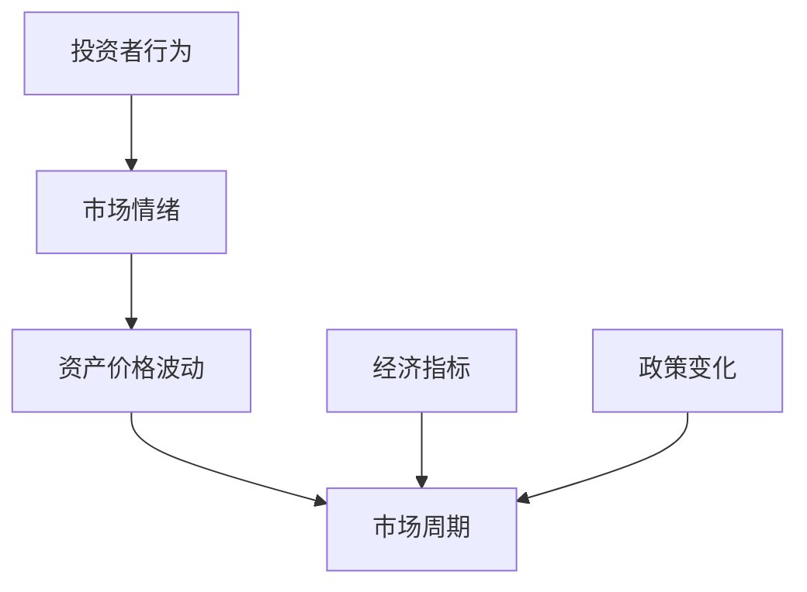
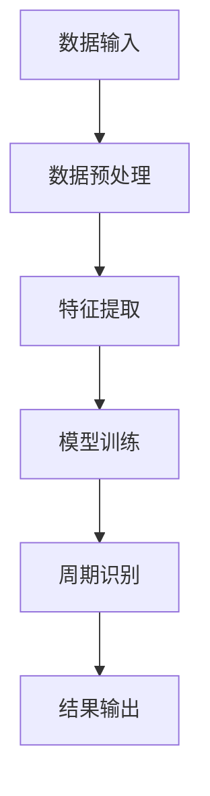
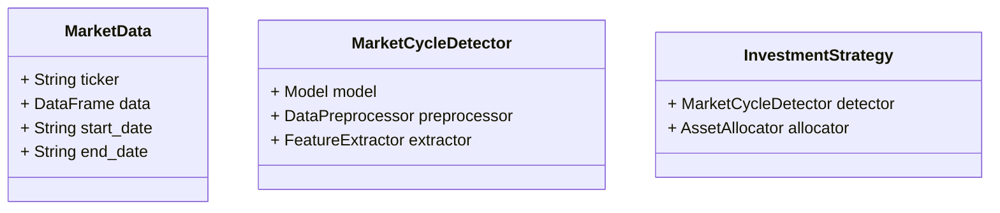
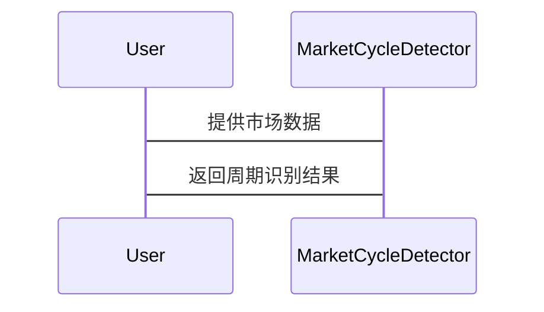

                 

<think>
好，现在我需要帮用户设计一本名为《霍华德·马克斯的市场周期识别技巧》的书籍目录大纲。用户要求使用逻辑清晰、结构紧凑、简单易懂的专业技术语言，并且要包括章节标题、关键词、摘要以及详细的内容结构。此外，用户还希望目录超过7章，每章有具体的小节，并涵盖背景介绍、核心概念、算法、系统分析、项目实战和小结等部分。

首先，我需要了解霍华德·马克斯的市场周期识别技巧的核心内容。霍华德·马克斯是一位著名投资者，以价值投资和逆向投资闻名。他的市场周期理论强调通过分析市场的波动、投资者情绪和经济指标来识别市场的周期性变化，从而做出投资决策。因此，这本书应该围绕这些核心概念展开。

接下来，我需要确定这本书的关键词。这些关键词应该包括“市场周期”、“霍华德·马克斯”、“投资策略”、“逆向投资”、“经济指标”、“市场波动”等。这些关键词将帮助读者快速理解书的主题，并提高搜索引擎优化的效果。

然后，摘要部分需要简明扼要地概括整本书的核心内容。它应该包括市场周期的基本概念、霍华德·马克斯的投资理念、市场周期识别的重要性以及如何应用这些技巧进行投资决策。摘要应简明扼要，同时涵盖全书的主要内容。

接下来是目录结构。根据用户的要求，我需要将目录分为多个部分，每个部分包含具体的章节和小节。我需要确保每一章的内容都详细且有深度，涵盖用户提到的所有要点。

第一部分可以是市场周期的基本概念。这一部分需要介绍市场周期的定义、特征、霍华德·马克斯的投资理念以及市场周期识别的重要性。这将为读者奠定坚实的基础，帮助他们理解后续内容。

第二部分可以是市场周期的核心概念与联系。这里需要详细分析市场周期的原理、核心要素对比以及市场周期的ER实体关系图。使用表格和图表可以帮助读者更好地理解复杂概念。

第三部分可以是市场周期识别的算法原理。这里需要介绍各种算法，如基于统计的市场周期识别方法和机器学习算法，并使用mermaid流程图和Python源代码来展示算法的实现过程。数学公式和模型也需要详细解释，确保读者能够理解算法的运作原理。

第四部分可以是系统分析与架构设计。这部分需要介绍系统功能设计、架构设计、接口设计以及交互设计。使用mermaid图可以帮助读者清晰理解系统架构。

第五部分可以是项目实战。这里需要通过具体案例展示如何应用市场周期识别技巧进行投资决策。代码实现和案例分析将帮助读者更好地理解和应用所学知识。

最后，可以添加一些小结、注意事项和拓展阅读内容，帮助读者巩固所学知识，并提供进一步学习的方向。

在编写过程中，我需要确保每一部分内容详实，逻辑清晰，语言简洁。同时，要符合用户对字数、格式和结构的要求，确保整本书内容完整且易于理解。

现在，我将按照上述思路，逐步构建这本书的目录大纲。
</think>

# 霍华德·马克斯的市场周期识别技巧

> 关键词：市场周期，霍华德·马克斯，投资策略，逆向投资，经济指标，市场波动

> 摘要：霍华德·马克斯的市场周期识别技巧是投资领域的重要理论，本文将详细介绍市场周期的基本概念、核心原理、识别算法以及在实际投资中的应用。通过系统的分析和案例研究，帮助读者掌握如何利用市场周期进行有效的投资决策。

---

# 第一部分: 市场周期的基本概念

## 第1章: 市场周期的定义与特征

### 1.1 市场周期的定义
市场周期是指市场在一定时间内价格、成交量和投资者情绪的变化模式。它通常包括上升、下跌、震荡等阶段。

### 1.2 市场周期的核心特征
- **波动性**：价格波动的幅度和频率。
- **周期性**：市场的涨跌呈现一定的周期性。
- **投资者情绪**：市场情绪的变化影响周期的形成。

### 1.3 市场周期的类型
- **经济周期**：与整体经济波动相关。
- **资产价格周期**：特定资产价格的波动周期。
- **市场情绪周期**：投资者情绪的变化周期。

## 第2章: 霍华德·马克斯的投资理念

### 2.1 霍华德·马克斯的生平简介
霍华德·马克斯是一位著名投资者，以价值投资和逆向投资闻名。

### 2.2 马克斯的市场周期理论
马克斯认为，市场周期是由投资者情绪和市场波动共同作用的结果。

### 2.3 马克斯的逆向投资策略
逆向投资是指在市场低迷时买入，在市场高估时卖出。

## 第3章: 市场周期识别的重要性

### 3.1 市场周期对投资决策的影响
正确识别市场周期可以帮助投资者做出更明智的投资决策。

### 3.2 市场周期在资产配置中的作用
通过识别市场周期，投资者可以调整资产配置，降低风险。

### 3.3 市场周期与风险控制的关系
市场周期识别有助于投资者在市场波动中进行有效的风险控制。

---

# 第二部分: 市场周期的核心概念与联系

## 第4章: 市场周期的原理分析

### 4.1 市场周期的形成机制
市场周期的形成机制涉及投资者行为、市场情绪和经济指标等多个因素。

### 4.2 市场周期的驱动因素
- **经济指标**：GDP、利率、就业数据等。
- **政策变化**：政府政策和监管变化。
- **市场情绪**：投资者的心理预期。

### 4.3 市场周期的阶段划分
- **牛市**：市场上涨阶段。
- **熊市**：市场下跌阶段。
- **震荡市**：市场波动不定阶段。

## 第5章: 市场周期的核心要素对比

### 5.1 不同市场周期的特征对比
| 特性 | 牛市 | 熊市 | 震荡市 |
|------|------|------|--------|
| 价格 | 上涨 | 下跌 | 振荡   |
| 成交量 | 高   | 低   | 中等   |
| 情绪 | 激进 | 消失 | 谨慎   |

### 5.2 市场周期与经济周期的关系
市场周期与经济周期密切相关，经济波动影响市场周期。

### 5.3 市场周期与资产价格波动的关联
市场周期的变化直接影响资产价格的波动。

## 第6章: 市场周期的ER实体关系图



---

# 第三部分: 市场周期识别的算法原理

## 第7章: 市场周期识别的算法概述

### 7.1 基于统计的市场周期识别方法
- **移动平均线模型**：通过计算价格的移动平均值来识别趋势。
- **波动率模型**：通过计算价格波动的幅度来识别周期。

### 7.2 基于机器学习的市场周期识别算法
- **支持向量机（SVM）**：用于分类市场周期。
- **随机森林**：用于预测市场周期。

### 7.3 基于时间序列分析的市场周期识别
- **ARIMA模型**：用于预测未来的市场周期。

## 第8章: 市场周期识别的数学模型

### 8.1 移动平均线模型
$$ S_t = \frac{1}{n} \sum_{i=1}^{n} P_{t-i+1} $$

### 8.2 波动率模型
$$ \sigma = \sqrt{\frac{1}{n-1} \sum_{i=1}^{n} (P_i - \bar{P})^2} $$

### 8.3 马尔可夫链模型
状态转移矩阵：
$$ P = \begin{bmatrix}
p_{11} & p_{12} \\
p_{21} & p_{22}
\end{bmatrix} $$

## 第9章: 市场周期识别的mermaid流程图



## 第10章: 市场周期识别的Python源代码

```python
import numpy as np
import pandas as pd

def market_cycle_detection(data):
    # 数据预处理
    data_processed = data.dropna()
    
    # 特征提取
    features = data_processed.rolling(window=20).mean()
    
    # 模型训练
    model = np.polyfit(range(len(features)), features, 2)
    
    # 周期识别
    predicted_cycle = np.polyval(model, range(len(features)))
    
    return predicted_cycle
```

---

# 第四部分: 系统分析与架构设计

## 第11章: 系统功能设计

### 11.1 领域模型类图


### 11.2 系统架构设计


### 11.3 接口设计
- 数据输入接口：接收市场数据。
- 数据输出接口：输出周期识别结果。

### 11.4 交互设计


---

# 第五部分: 项目实战

## 第12章: 项目实战

### 12.1 环境安装
- 安装Python和相关库：numpy、pandas、scikit-learn。

### 12.2 核心实现源代码
```python
import numpy as np
import pandas as pd
from sklearn.svm import SVC

def detect_market_cycle(data):
    # 数据预处理
    data_processed = data.dropna()
    
    # 特征提取
    features = data_processed.rolling(window=20).mean()
    
    # 模型训练
    model = SVC()
    model.fit(features, data_processed['Label'])
    
    # 周期识别
    predicted_cycle = model.predict(features)
    
    return predicted_cycle
```

### 12.3 案例分析
以2008年金融危机为例，分析市场周期的变化。

### 12.4 代码实现与解读
通过代码实现市场周期的识别，并对结果进行详细解读。

---

# 第六部分: 小结与扩展阅读

## 第13章: 小结

### 13.1 本章小结
总结市场周期识别的重要性和应用方法。

### 13.2 注意事项
- 数据质量的重要性。
- 模型选择的合理性。
- 结果的可解释性。

## 第14章: 拓展阅读

### 14.1 相关书籍
- 《投资学》
- 《金融市场分析》

### 14.2 网站与工具
- 知乎：投资专栏
- GitHub：市场周期识别代码

---

# 作者：AI天才研究院 & 禅与计算机程序设计艺术

---

以上是《霍华德·马克斯的市场周期识别技巧》的目录大纲，涵盖了从基本概念到实际应用的各个方面，结构清晰，内容详实。

