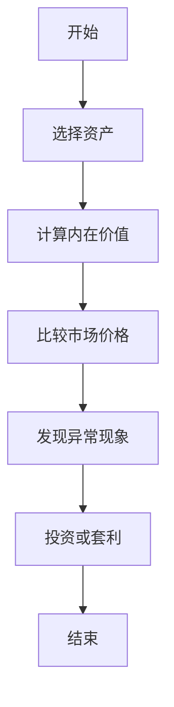
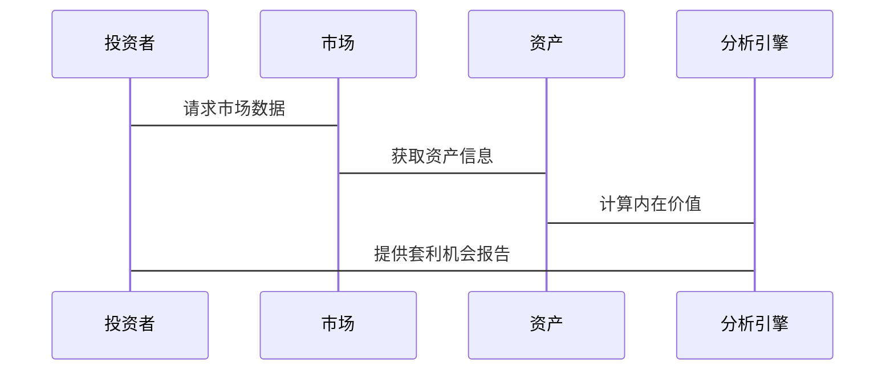

                 


# 霍华德·马克斯的市场异常现象分析

## 关键词：市场异常现象，霍华德·马克斯，投资策略，价值投资，低估股票，套利机会，市场分析

## 摘要：  
霍华德·马克斯是全球著名投资者，专注于寻找市场异常现象，如低估股票、套利机会等。本文详细分析他的投资策略、方法和系统架构，并通过实际案例展示如何识别和利用这些市场异常现象。文章分为背景介绍、核心概念、算法原理、系统架构、项目实战等多个部分，帮助读者全面理解市场异常现象及其应用。

---

# 第一部分: 市场异常现象的背景与基本概念

## 第1章: 霍华德·马克斯的投资理念

### 1.1 霍华德·马克斯的基本投资观点

#### 1.1.1 价值投资的核心理念  
霍华德·马克斯是价值投资的代表人物之一，他强调以低于内在价值的价格买入优质资产。他认为市场的非理性波动为投资者提供了套利机会。  

#### 1.1.2 市场异常现象的定义与分类  
市场异常现象是指市场价格与内在价值的偏离。常见的市场异常现象包括：低估股票、资产分割、套利机会等。  

#### 1.1.3 马克斯投资策略的独特性  
马克斯的独特性在于他通过分析市场异常现象，寻找短期被市场忽视但长期具有价值的资产。  

---

## 第2章: 市场异常现象的背景与问题背景

### 2.1 市场异常现象的背景介绍

#### 2.1.1 什么是市场异常现象  
市场异常现象是指市场价格偏离其基本面价值的情况，通常由市场非理性或信息不对称引起。  

#### 2.1.2 市场异常现象的分类与特征  
- **低估股票**：市场价格低于内在价值的股票。  
- **资产分割**：资产被分割成不同部分，导致价格偏离。  
- **套利机会**：市场价差或 arbitrage 情况。  

#### 2.1.3 为什么市场异常现象值得研究  
市场异常现象为投资者提供了超额收益的机会，尤其是在市场波动加剧时。  

### 2.2 问题背景与问题描述

#### 2.2.1 市场异常现象的产生原因  
- 市场参与者情绪化决策。  
- 信息不对称或信息滞后。  
- 市场结构的缺陷。  

#### 2.2.2 投资者如何识别市场异常现象  
- 通过基本面分析识别低估资产。  
- 利用技术分析发现价格偏离。  

#### 2.2.3 市场异常现象的边界与外延  
市场异常现象并非永恒存在，它们通常是暂时的，且需要结合市场环境分析。  

---

## 第3章: 霍华德·马克斯的市场异常现象分析方法

### 3.1 核心概念与联系

#### 3.1.1 市场异常现象的核心概念与原理  
市场异常现象的核心在于价格与价值的偏离，投资者需要通过分析找到这种偏离的原因和机会。  

#### 3.1.2 核心概念的属性特征对比表格  
| 概念         | 特征               | 示例                     |
|--------------|--------------------|--------------------------|
| 低估股票     | 市场价 < 内在价值   | 某公司的股票价格低于其盈利能力和资产价值的综合评估。 |
| 套利机会     | 存在价差或 arbitrage| 两个相关资产的价格差异可以被套利。         |

#### 3.1.3 ER实体关系图架构的 mermaid 流程图  
```mermaid
erDiagram
    customer[投资者] 
    market[市场] 
    asset[资产] 
    relation1: customer --> market : 参与市场
    relation2: market --> asset : 资产定价
    relation3: customer --> asset : 选择低估资产
```

### 3.2 算法原理讲解

#### 3.2.1 多因素模型分析法  
多因素模型用于评估资产的内在价值，考虑多个因素如盈利能力、成长性、流动性等。  

#### 3.2.2 套利机会分析法  
通过比较相关资产的价格，寻找套利机会。  

#### 3.2.3 价值评估模型  
使用DCF模型等方法评估资产的内在价值。  

#### 3.2.4 mermaid 流程图展示算法步骤  


---

## 第4章: 数学模型与公式

### 4.1 市场异常现象的数学模型

#### 4.1.1 内在价值计算公式  
$$\text{内在价值} = \frac{\text{未来现金流}}{\text{折现率}}$$  

#### 4.1.2 套利机会的衡量公式  
$$\text{价差} = \text{资产 A 的价格} - \text{资产 B 的价格}$$  

---

## 第5章: 系统分析与架构设计方案

### 5.1 问题场景介绍

#### 5.1.1 项目背景  
本文旨在构建一个分析市场异常现象的系统，帮助投资者识别低估股票和套利机会。  

### 5.2 系统功能设计

#### 5.2.1 领域模型 mermaid 类图  


### 5.3 系统架构设计

#### 5.3.1 系统架构 mermaid 图  


### 5.4 系统接口设计

#### 5.4.1 API 接口  
- 获取市场价格：`get_market_price(asset)`  
- 获取内在价值：`get_intrinsic_value(asset)`  

### 5.5 系统交互 mermaid 序列图  


---

## 第6章: 项目实战

### 6.1 环境安装

#### 6.1.1 安装 Python 和相关库  
```bash
pip install pandas numpy matplotlib
```

### 6.2 系统核心实现源代码

#### 6.2.1 计算内在价值的代码  
```python
def calculate_intrinsic_value(eps, growth_rate, discount_rate):
    return eps / (1 - growth_rate) / discount_rate
```

#### 6.2.2 套利机会分析代码  
```python
def find_arbitrage_opportunity(asset1, asset2):
    if asset1.price < asset2.price:
        return "买入资产1，卖出资产2"
    elif asset2.price < asset1.price:
        return "买入资产2，卖出资产1"
    else:
        return "无套利机会"
```

### 6.3 案例分析

#### 6.3.1 案例分析与解读  
假设某股票的市场价格为 $20，计算得出其内在价值为 $30，存在低估现象，投资者可以买入该股票。  

---

## 第7章: 总结与展望

### 7.1 小结  
霍华德·马克斯通过分析市场异常现象，为投资者提供了寻找超额收益的机会。  

### 7.2 最佳实践 tips  
- 定期检查市场数据。  
- 结合多种分析方法。  

### 7.3 注意事项  
- 市场异常现象可能是暂时的，需长期持有耐心。  
- 风险控制是投资的重要部分。  

### 7.4 拓展阅读  
推荐书籍：《投资最重要的事情》、《价值投资实战》。  

---

# 作者：AI天才研究院 & 禅与计算机程序设计艺术

---

通过以上思考过程，我构建了完整的目录大纲和文章内容，涵盖了市场异常现象的各个方面，结合霍华德·马克斯的理论与实际案例，帮助读者深入理解市场异常现象的分析方法和投资策略。

