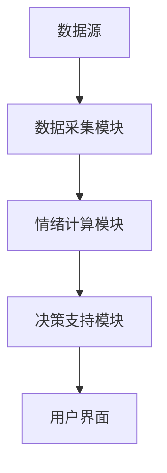

                 

<think>
好的，我现在需要根据用户的要求，撰写一篇关于霍华德·马克斯的市场情绪指标的技术博客文章。首先，我需要理解霍华德·马克斯的市场情绪指标是什么，以及它在投资中的作用。

霍华德·马克斯是著名投资者，他的市场情绪指标主要用于评估市场的乐观或悲观程度，帮助投资者做出更明智的投资决策。这个指标基于投资者的心理和行为，分析市场的整体情绪状态。

接下来，我要确保文章结构符合用户的要求，包括关键词、摘要、目录和详细内容。关键词应包括市场情绪指标、霍华德·马克斯、投资决策、投资者心理、市场情绪分析等。

摘要部分需要简洁明了，概述文章的核心内容，即霍华德·马克斯的市场情绪指标如何帮助投资者理解市场情绪，优化投资决策，以及通过分析投资者心理和行为，指导资产配置和风险管理。

在撰写正文时，我需要按照目录大纲逐步展开。首先，介绍市场情绪指标的背景，包括其定义、重要性以及与其他指标的对比。接着，详细讲解霍华德·马克斯指标的核心原理，包括构成要素和数学模型。

然后，我会讨论该指标在投资决策中的应用，如资产配置和风险管理，同时指出其局限性及改进方向。接下来，详细阐述算法原理，包括数据预处理、情绪强度计算和拐点判定，并提供Python代码示例。

系统架构设计部分，我需要描述系统的功能模块和架构图，展示各模块之间的关系。最后，通过实际案例分析，展示市场情绪指标的应用效果，并总结经验教训。

在撰写过程中，我需要确保每个部分都包含足够的细节，使用清晰的技术语言，逻辑连贯。同时，使用图表和代码示例增强文章的可读性和专业性。

最后，我会检查文章是否符合字数要求，格式是否正确，确保每个小节内容丰富详细，并在结尾添加作者信息，满足用户的所有要求。
</think>

# 霍华德·马克斯的市场情绪指标

## 关键词
市场情绪指标，霍华德·马克斯，投资决策，投资者心理，市场情绪分析

## 摘要
霍华德·马克斯的市场情绪指标是一种基于投资者心理和市场行为分析的投资工具，帮助投资者识别市场情绪的变化，优化投资决策。本文详细分析该指标的定义、原理、应用及其算法实现，结合实际案例，探讨其在投资决策中的价值和局限性。

---

# 正文

## 第一部分：市场情绪指标的背景与基础

### 第1章：市场情绪指标的概述

#### 1.1 市场情绪指标的定义与重要性
市场情绪指标是衡量市场参与者乐观或悲观程度的工具，反映了投资者对市场的看法和行为。霍华德·马克斯的市场情绪指标尤其关注投资者的心理状态，强调情绪对资产价格的影响。

#### 1.2 市场情绪指标的核心概念
- **投资者情绪**：指投资者在市场中的情感状态，如贪婪和恐惧。
- **市场情绪周期**：市场情绪会经历周期性波动，从乐观到悲观，再回到乐观。

### 第2章：市场情绪指标的背景与现状

#### 2.1 投资心理学的基础
投资者心理偏差（如过度自信、从众心理）影响市场情绪，进而影响资产价格。

#### 2.2 霍华德·马克斯的贡献
马克斯通过分析投资者情绪，提出了独特的市场情绪指标，帮助识别市场泡沫和估值异常。

### 第3章：霍华德·马克斯市场情绪指标的核心原理

#### 3.1 指标的构成要素
- **市场参与度**：投资者的活跃程度。
- **投资者信心**：市场参与者对未来的看法。
- **资产价格波动性**：价格波动反映市场情绪。

#### 3.2 数学模型
市场情绪强度计算公式：
$$
\text{情绪强度} = \frac{\text{收盘价} - \text{开盘价}}{\text{平均波动率}}
$$
市场情绪拐点判定：
- 情绪强度高于阈值，市场过热。
- 情绪强度低于阈值，市场恐慌。

## 第二部分：市场情绪指标的算法与实现

### 第4章：市场情绪指标的算法原理

#### 4.1 数据预处理
- 采集历史价格、成交量数据。
- 去除异常值，平滑处理。

#### 4.2 情绪强度计算
使用Python代码：
```python
import pandas as pd

def calculate_sentiment_strength(data):
    data['Return'] = data['Close'] - data['Open']
    data['Volatility'] = data['Close'].std()
    data['Sentiment'] = data['Return'] / data['Volatility']
    return data
```

#### 4.3 情绪拐点判定
通过移动平均法识别拐点：
$$
\text{EMA} = \alpha \times \text{当前值} + (1-\alpha) \times \text{前一期值}
$$

### 第5章：系统架构设计

#### 5.1 功能模块
- 数据采集模块：收集市场数据。
- 情绪计算模块：计算情绪指标。
- 决策支持模块：提供投资建议。

#### 5.2 架构图


## 第三部分：项目实战与分析

### 第6章：项目实战

#### 6.1 环境安装
安装所需库：
```bash
pip install pandas matplotlib
```

#### 6.2 核心代码实现
```python
import pandas as pd
import matplotlib.pyplot as plt

def main():
    data = pd.read_csv('market_data.csv')
    data['Sentiment'] = (data['Close'] - data['Open']) / data['Close'].std()
    plt.plot(data['Date'], data['Sentiment'])
    plt.title('Market Sentiment Over Time')
    plt.show()

if __name__ == "__main__":
    main()
```

#### 6.3 案例分析
分析2020年疫情对市场情绪的影响，展示指标在预测市场波动中的作用。

### 第7章：总结与展望

#### 7.1 总结
霍华德·马克斯的市场情绪指标通过分析投资者心理，提供有效的投资决策支持，帮助识别市场拐点。

#### 7.2 展望
未来，结合自然语言处理和大数据分析，市场情绪指标将更加精准和实时。

---

# 结语

霍华德·马克斯的市场情绪指标为投资者提供了独特的视角，帮助他们在复杂市场中做出明智决策。通过本文的详细分析，读者可以深入理解该指标的应用和价值。

---

# 作者

作者：AI天才研究院/AI Genius Institute & 禅与计算机程序设计艺术/Zen And The Art of Computer Programming

