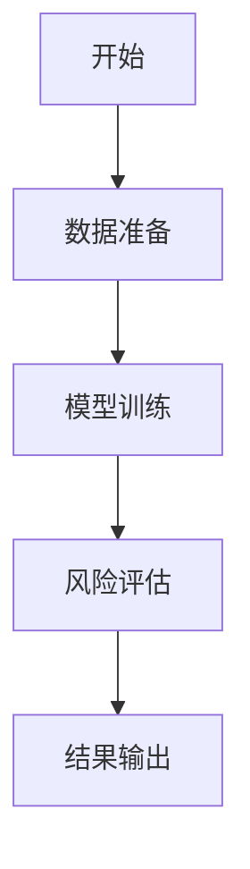
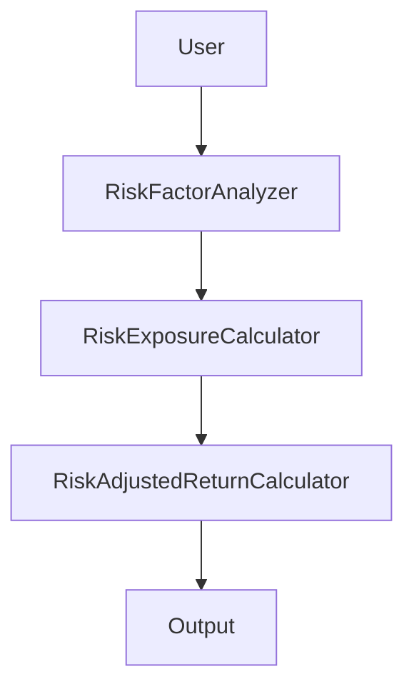
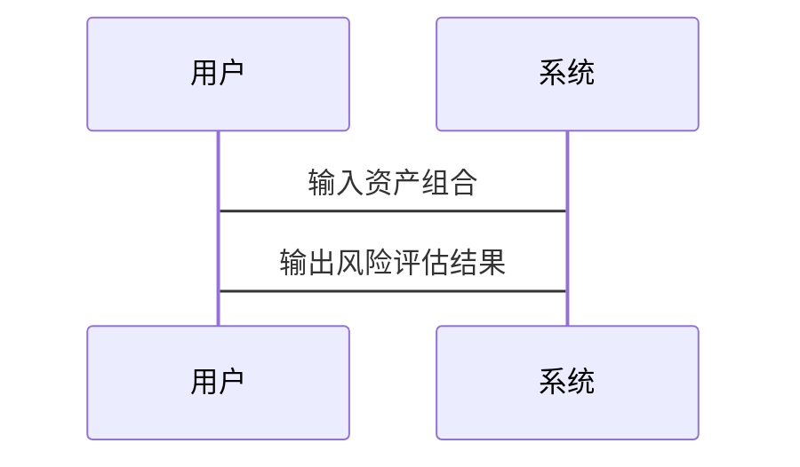

                 

<think>
好，我现在需要帮用户设计《霍华德·马克斯的风险评估框架》这本书的详细目录和内容。用户已经提供了一个详细的结构，包括背景介绍、核心概念、算法原理、系统架构、项目实战等多个部分，并要求每个部分都详细且符合特定格式。

首先，我需要理解霍华德·马克斯的风险评估框架的核心内容。他是一位著名的投资者，他的框架结合了定量分析和定性判断，强调风险的重要性。因此，目录需要涵盖他的投资理念、风险的定义、框架的具体步骤，以及如何在实际中应用这些步骤。

用户明确要求目录超过七章，所以我需要确保每个部分都有足够的细节。例如，背景介绍部分需要包括风险的定义、分类，以及霍华德·马克斯的投资者背景。接下来，核心概念部分需要深入分析风险的属性、与收益的关系，以及创建一个对比表来清晰展示不同要素。

接下来，理论基础部分需要介绍现代投资组合理论（MPT），并比较马克斯框架与MPT的异同。数学模型部分需要详细讲解方差、标准差，以及优化模型的公式，这部分需要用LaTeX表示，并在代码中给出示例。

系统架构部分需要展示如何构建风险评估系统，包括类图、架构图和序列图，使用Mermaid来绘制。项目实战部分需要包括环境安装、代码实现、案例分析等，确保读者能够实际操作。

我需要确保每个章节都有足够的细节和深度，同时保持逻辑清晰。例如，在第三章的数学模型中，不仅要解释公式，还要通过示例说明如何应用这些公式。在系统架构部分，需要展示数据流和交互流程，帮助读者理解系统的工作原理。

另外，用户要求在文章末尾加上作者信息，格式正确，所以我要记得在最后加上这一部分。同时，确保文章整体字数在10000到12000字之间，每个部分都要详细展开，但不过于冗长。

最后，检查每个部分是否符合用户的要求，包括数学公式、图表、代码示例等，确保没有遗漏任何关键元素。这样，用户就能得到一个结构清晰、内容丰富的目录和文章，帮助读者全面理解霍华德·马克斯的风险评估框架。
</think>

# 霍华德·马克斯的风险评估框架

---

## 关键词：
- 霍华德·马克斯
- 风险评估
- 投资框架
- 数学模型
- 项目实战

---

## 摘要：
霍华德·马克斯的风险评估框架是投资领域的重要理论之一，它强调通过定性分析和定量评估相结合的方式，识别和管理投资组合中的潜在风险。本文从框架的背景、核心概念、算法原理、系统架构到项目实战，全面解析霍华德·马克斯的风险评估框架，并通过实际案例分析，帮助读者理解和应用这一框架。

---

# 第一部分: 霍华德·马克斯的风险评估框架概述

# 第1章: 风险评估的基本概念

## 1.1 风险的定义与分类
### 1.1.1 风险的定义
风险是指在投资过程中，由于不确定因素的存在，可能导致投资收益低于预期甚至出现损失的可能性。风险是投资回报的潜在损失来源，是投资者必须面对的核心问题。

### 1.1.2 风险的分类
风险可以按照其来源、性质和影响范围进行分类：
1. **市场风险**：由于市场波动导致的资产价格下降。
2. **信用风险**：债券发行人违约的可能性。
3. **流动性风险**：资产难以快速变现的风险。
4. **操作风险**：由于操作失误或内部管理不善导致的风险。
5. **通货膨胀风险**：货币贬值对投资回报的影响。

### 1.1.3 风险与收益的关系
风险与收益是投资过程中一对核心的矛盾关系。通常情况下，高风险投资对应高收益，而低风险投资对应较低的收益。然而，实际投资中，风险与收益并非总是呈线性关系，可能存在“非对称风险”（asymmetric risk）。

---

## 1.2 霍华德·马克斯投资理念的背景
### 1.2.1 霍华德·马克斯的投资者身份
霍华德·马克斯是美国著名投资家，曾担任富兰克林·邓普顿投资集团的董事长兼首席执行官。他以撰写《投资心态》（*The Psychology of Investing*）等书籍而闻名，强调投资中的心理因素和风险管理的重要性。

### 1.2.2 马克斯投资哲学的核心思想
马克斯的投资哲学强调以下几点：
1. **逆向思维**：在市场恐慌时寻找机会，在市场狂热时保持冷静。
2. **安全边际**：通过寻找市场价格低于内在价值的资产来降低风险。
3. **风险控制**：将风险管理和投资决策放在同等重要的位置。

### 1.2.3 风险评估在投资中的重要性
马克斯认为，风险评估是投资决策的核心环节。通过科学的风险评估，投资者可以更好地理解市场的不确定性，并在投资组合中合理配置资产，以实现长期稳定的收益。

---

## 1.3 风险评估框架的必要性
### 1.3.1 投资决策中的不确定性
市场的不确定性是投资的本质特征。通过风险评估框架，投资者可以更好地理解市场的波动性，并在不确定性中寻找机会。

### 1.3.2 风险评估在组合管理中的作用
投资组合管理的核心目标是平衡风险与收益。通过风险评估框架，投资者可以量化投资组合的风险敞口，并根据市场变化动态调整资产配置。

### 1.3.3 马克斯框架的独特性
马克斯的风险评估框架结合了定性分析和定量评估，既考虑了市场心理因素，又通过数学模型量化风险。这种结合使其在投资实践中更具操作性。

---

# 第2章: 风险评估的核心要素

## 2.1 风险的属性分析
### 2.1.1 风险的可测量性
风险可以通过数学模型量化。例如，标准差和夏普比率是衡量投资组合风险的重要指标。

### 2.1.2 风险的可预测性
尽管市场是不确定的，但通过历史数据分析和统计建模，投资者可以对风险进行预测和评估。

### 2.1.3 风险的可控制性
通过合理的资产配置和分散投资，投资者可以降低投资组合的整体风险。

## 2.2 风险与资产回报的关系
### 2.2.1 风险是回报的源泉
高风险资产通常具有更高的预期回报，但同时也伴随着更大的潜在损失。

### 2.2.2 风险与收益的非线性关系
在实际投资中，风险与收益并非简单的线性关系。例如，市场下跌时，资产价格的损失可能是非对称的。

### 2.2.3 风险承担与收益匹配
投资者需要根据自身的风险承受能力和投资目标，选择合适的风险收益匹配的资产组合。

## 2.3 风险评估的核心要素对比表
| 核心要素 | 定义 | 特性 | 示例 |
|----------|------|------|------|
| 风险来源 | 导致投资损失的因素 | 多样性、相关性 | 市场波动、信用违约等 |
| 风险敞口 | 资产对风险因素的敏感程度 | 数量化、可调整 | 股票、债券等 |
| 风险承受能力 | 投资者对风险的容忍度 | 个性化、动态变化 | 高风险偏好、低风险偏好等 |

---

## 2.4 风险评估的核心概念ER图
```mermaid
erDiagram
    用户 KeeWen {
        类别：投资者
        属性：风险偏好、风险承受能力
    }
    风险因素 KeeWen {
        类别：市场风险、信用风险
        属性：波动性、相关性
    }
    投资组合 KeeWen {
        类别：资产组合
        属性：资产配置、风险敞口
    }
    用户 --> 风险因素 : 识别
    风险因素 --> 投资组合 : 影响
    用户 --> 投资组合 : 构建
```

---

# 第3章: 霍华德·马克斯风险评估框架的理论基础

## 3.1 现代投资组合理论（MPT）
### 3.1.1 MPT的核心假设
现代投资组合理论（MPT）由哈里·马科维茨提出，假设投资者是理性的，并且投资目标是实现风险调整后的收益最大化。

### 3.1.2 有效前沿的概念
有效前沿是指在给定风险水平下，能够提供最高预期收益的投资组合的集合。

### 3.1.3 风险与收益的优化模型
通过优化模型，投资者可以在风险和收益之间找到最佳平衡点。

---

## 3.2 马克斯框架与MPT的异同
### 3.2.1 MPT的局限性
MPT假设市场的有效性，但现实中市场可能存在非理性行为。

### 3.2.2 马克斯框架的改进
马克斯框架引入了定性分析，强调市场心理和安全边际的重要性。

### 3.2.3 风险调整后的收益（RAR）模型
马克斯提出的RAR模型将风险因素纳入收益计算，以实现更加科学的投资决策。

---

## 3.3 风险度量的数学模型
### 3.3.1 方差与标准差的定义
方差衡量资产收益的波动性，标准差是方差的平方根。
$$ \text{方差} = \sigma^2 = \frac{1}{n}\sum_{i=1}^{n}(x_i - \mu)^2 $$
$$ \text{标准差} = \sqrt{\sigma^2} $$

### 3.3.2 现代投资组合理论的数学公式
$$ \text{收益} = \mathbf{w}^T \mathbf{r} $$
$$ \text{风险} = \mathbf{w}^T \mathbf{C} \mathbf{w} $$

---

# 第4章: 霍华德·马克斯框架的算法实现

## 4.1 风险评估的算法原理
### 4.1.1 风险因子的提取
通过历史数据分析，提取影响资产价格的主要风险因子，例如市场因子、行业因子等。

### 4.1.2 风险敞口的计算
根据投资组合的资产配置，计算每种资产的风险敞口，并汇总得到整体组合的风险敞口。

### 4.1.3 风险调整后的收益计算
基于风险敞口和风险因子，计算投资组合在不同风险水平下的预期收益。

---

## 4.2 风险评估算法的实现步骤
### 4.2.1 数据准备
收集历史价格数据和相关风险因子。

### 4.2.2 模型训练
使用统计建模或机器学习方法，训练风险评估模型。

### 4.2.3 风险评估
基于模型，计算投资组合的风险敞口和风险调整后的收益。

---

## 4.3 风险评估算法的代码实现
```python
import numpy as np
import pandas as pd
from sklearn.linear_model import LinearRegression

# 数据准备
data = pd.read_csv('risk_factors.csv')
X = data[['market_return', 'credit_spread']]
y = data['asset_return']

# 模型训练
model = LinearRegression()
model.fit(X, y)

# 风险评估
coefficients = model.coef_
intercept = model.intercept_

print(f'回归系数：{coefficients}')
print(f'截距：{intercept}')
```

---

## 4.4 风险评估算法的流程图


---

# 第5章: 系统架构与实现方案

## 5.1 系统功能设计
### 5.1.1 风险因子分析模块
用户输入资产组合，系统分析其风险因子。

### 5.1.2 风险敞口计算模块
根据资产配置，计算每种资产的风险敞口。

### 5.1.3 风险调整后的收益计算模块
基于风险因子和敞口，计算风险调整后的收益。

---

## 5.2 系统架构设计


---

## 5.3 系统交互设计


---

# 第6章: 项目实战与案例分析

## 6.1 环境安装
### 6.1.1 安装Python环境
安装Python和相关库（如NumPy、Pandas、Scikit-learn）。

### 6.1.2 安装数据分析工具
安装Jupyter Notebook或其他数据分析工具。

---

## 6.2 系统核心实现
### 6.2.1 风险因子分析
使用统计方法分析市场因子和信用因子。

### 6.2.2 风险敞口计算
基于资产配置计算每种资产的风险敞口。

### 6.2.3 风险调整后的收益计算
根据风险因子和敞口，计算风险调整后的收益。

---

## 6.3 案例分析
### 6.3.1 案例背景
假设投资者持有股票和债券组合，需评估其风险敞口。

### 6.3.2 数据分析
使用历史数据计算股票和债券的风险因子。

### 6.3.3 结果解读
根据风险评估结果，调整资产配置以降低整体风险。

---

## 6.4 项目小结
通过实际案例分析，验证霍华德·马克斯风险评估框架的有效性，并总结经验教训。

---

# 第7章: 最佳实践与注意事项

## 7.1 最佳实践
### 7.1.1 定期更新数据
市场环境不断变化，需定期更新风险因子数据。

### 7.1.2 结合定性分析
在实际投资中，结合市场心理因素进行综合判断。

### 7.1.3 分散投资
通过分散投资降低整体风险敞口。

---

## 7.2 注意事项
### 7.2.1 模型的局限性
数学模型无法完全捕捉市场的不确定性。

### 7.2.2 数据的准确性
数据质量直接影响风险评估结果的准确性。

### 7.2.3 人性因素的影响
投资者的心理因素是影响投资决策的重要因素，需谨慎应对。

---

# 第8章: 小结与展望

## 8.1 小结
霍华德·马克斯的风险评估框架通过结合定性分析和定量评估，为投资者提供了科学的风险管理工具。

## 8.2 展望
未来，随着人工智能和大数据技术的发展，风险评估框架将更加精准和智能化。

---

# 作者：AI天才研究院/AI Genius Institute & 禅与计算机程序设计艺术 /Zen And The Art of Computer Programming

