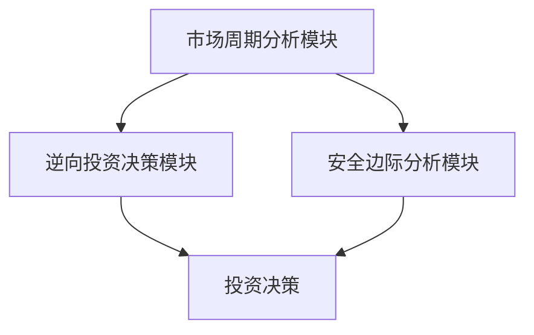
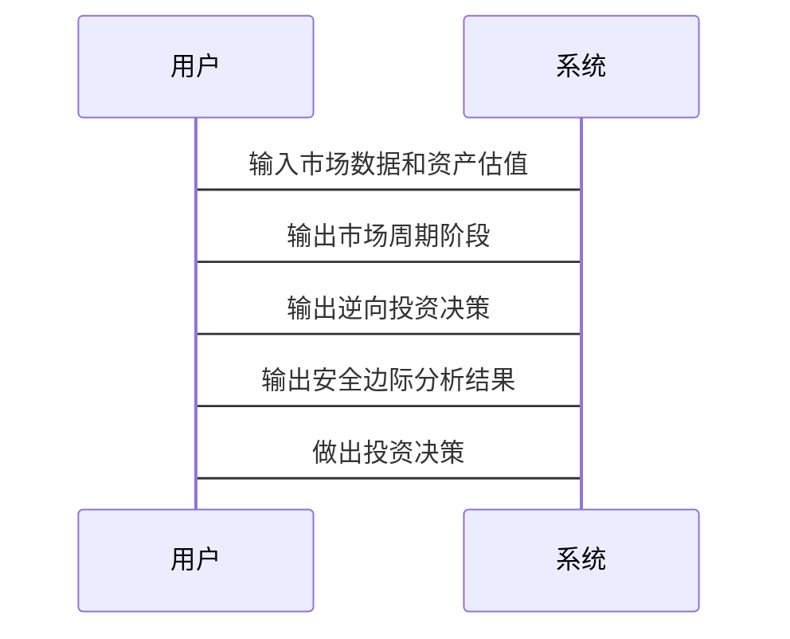

                 


# 霍华德马克斯的周期投资理论

> 关键词：霍华德马克斯，周期投资理论，逆向投资，安全边际，投资策略，市场周期

> 摘要：霍华德·马克斯的周期投资理论是一种以市场周期和逆向投资为核心的投资策略，强调通过分析市场周期波动，寻找投资机会。本文将从背景介绍、核心概念、算法原理、系统架构、项目实战等多个方面，详细阐述霍华德·马克斯周期投资理论的理论基础、实践应用及其实质。

---

# 第一部分: 霍华德·马克斯周期投资理论的背景与基础

# 第1章: 霍华德·马克斯周期投资理论概述

## 1.1 霍华德·马克斯与周期投资理论的背景

### 1.1.1 投资理论的发展历程

现代投资理论的发展经历了多个阶段，从早期的“基本面分析”到后来的“技术分析”，再到现代的“量化投资”与“行为金融学”。霍华德·马克斯作为逆向投资的倡导者，他的理论在20世纪末和21世纪初的市场波动中逐渐成熟。

### 1.1.2 霍华德·马克斯的贡献与影响力

霍华德·马克斯是橡树资本的创始人，他的投资理念强调逆向投资和安全边际。他的著作《投资最重要的事情》深刻影响了全球投资者，尤其是他对市场周期的分析和逆向投资策略的阐述，为投资者提供了独特的视角。

### 1.1.3 周期投资理论的核心思想

霍华德·马克斯认为，市场是由周期驱动的，投资者需要在市场低估时买入，在高估时卖出。他的周期投资理论强调对市场情绪和市场周期的分析，以寻找投资机会。

---

## 1.2 周期性与投资决策的核心概念

### 1.2.1 什么是周期性

周期性是指市场在一段时间内重复出现的波动模式。市场周期通常分为四个阶段：复苏、增长、成熟和衰退。

### 1.2.2 周期性与投资决策的关系

投资者通过对市场周期的分析，可以在不同阶段采取不同的投资策略。例如，在市场衰退阶段，寻找被低估的资产；在市场繁荣阶段，警惕高估的风险。

### 1.2.3 霍华德·马克斯的周期理论框架

霍华德·马克斯的周期理论框架包括以下几个方面：
1. 市场周期的四个阶段：复苏、增长、成熟、衰退。
2. 每个阶段的特征和对应的资产表现。
3. 逆向投资的策略：在市场低谷时买入，在市场高点时卖出。

---

## 1.3 逆向投资与周期性

### 1.3.1 逆向投资的定义与核心要素

逆向投资是指在市场低迷时买入，在市场繁荣时卖出的投资策略。其核心要素包括：
1. 市场情绪的分析。
2. 资产价格的估值。
3. 投资者的心理因素。

### 1.3.2 逆向投资与周期性波动的关系

逆向投资与周期性密切相关。投资者需要通过分析市场周期的波动，判断市场处于哪个阶段，从而做出逆向投资的决策。

### 1.3.3 逆向投资的实践意义

逆向投资的核心在于避免随市场的波动盲目跟风，而是在市场的极端情况下，寻找被低估的资产。这种策略在市场周期的低谷阶段尤为有效。

---

## 1.4 霍华德·马克斯周期理论的现实意义

### 1.4.1 理论在投资实践中的应用

霍华德·马克斯的周期理论在实践中被广泛应用于资产配置、风险控制和投资决策等领域。投资者可以通过分析市场周期，制定相应的投资策略。

### 1.4.2 理论对投资者决策的影响

马克斯的理论强调了市场情绪和周期性的重要性，帮助投资者在市场波动中保持冷静，避免盲目追涨杀跌。

### 1.4.3 理论的局限性与改进方向

尽管霍华德·马克斯的周期理论在实践中取得了显著成效，但其也存在一定的局限性。例如，市场周期的预测具有一定的不确定性，投资者需要结合其他因素进行综合判断。

---

## 1.5 本章小结

本章主要介绍了霍华德·马克斯周期投资理论的背景、核心思想以及逆向投资与周期性的关系。通过分析市场周期的四个阶段，投资者可以在不同市场环境下制定相应的投资策略。

---

# 第二部分: 霍华德·马克斯周期投资理论的核心概念与联系

# 第2章: 周期性与投资决策的核心概念

## 2.1 周期性与市场波动

### 2.1.1 市场周期的定义与分类

市场周期可以分为经济周期和资产价格周期。经济周期包括复苏、增长、成熟和衰退四个阶段，资产价格周期则反映了市场参与者情绪的变化。

### 2.1.2 市场周期的驱动因素

市场周期的驱动因素包括经济基本面、市场参与者情绪、政策变化等。这些因素共同作用，影响市场的波动。

### 2.1.3 周期性与市场波动的关系

市场波动是周期性变化的外在表现。通过分析市场波动，投资者可以判断市场所处的周期阶段。

---

## 2.2 逆向投资与周期性

### 2.2.1 逆向投资的核心原理

逆向投资的核心原理是市场情绪的反向操作。当市场情绪高涨时，投资者倾向于高估资产价值；当市场情绪低落时，投资者倾向于低估资产价值。

### 2.2.2 逆向投资与周期性波动的结合

逆向投资与周期性波动密切相关。在市场周期的低谷阶段，逆向投资可以带来超额收益；在市场周期的高点阶段，逆向投资可以避免重大损失。

### 2.2.3 逆向投资的决策逻辑

逆向投资的决策逻辑包括以下步骤：
1. 分析市场周期的阶段。
2. 判断市场情绪。
3. 评估资产的估值。
4. 采取相应的投资策略。

---

## 2.3 安全边际与周期投资

### 2.3.1 安全边际的定义与作用

安全边际是指资产的内在价值与市场价值之间的差额。它反映了资产在市场波动中的抗风险能力。

### 2.3.2 安全边际与周期性波动的关系

在市场周期的低谷阶段，安全边际较大；在市场周期的高点阶段，安全边际较小。投资者可以通过分析安全边际，判断投资机会。

### 2.3.3 如何在周期性波动中应用安全边际

投资者可以通过以下方式在周期性波动中应用安全边际：
1. 在市场低谷阶段，寻找安全边际较高的资产。
2. 在市场高点阶段，减少对高估资产的投资。

---

## 2.4 霍华德·马克斯周期理论的核心要素对比

### 2.4.1 周期性与逆向投资的对比

周期性与逆向投资密切相关，但两者侧重点不同。周期性关注市场波动的规律，逆向投资关注市场情绪的反向操作。

### 2.4.2 逆向投资与安全边际的对比

逆向投资关注市场情绪的反向操作，而安全边际关注资产的内在价值与市场价值的差异。

### 2.4.3 周期理论与其他投资理论的对比

与其他投资理论相比，霍华德·马克斯的周期理论更注重市场周期和逆向投资，强调安全边际在投资决策中的重要性。

---

## 2.5 本章小结

本章主要分析了霍华德·马克斯周期投资理论的核心概念，包括周期性、逆向投资和安全边际，并探讨了它们之间的关系。通过对比分析，投资者可以更好地理解周期理论的精髓。

---

# 第三部分: 霍华德·马克斯周期投资理论的算法与数学模型

# 第3章: 周期投资理论的算法原理

## 3.1 周期性分析的算法框架

### 3.1.1 市场周期的识别算法

市场周期的识别算法包括以下几个步骤：
1. 收集历史市场数据。
2. 分析市场数据的波动规律。
3. 识别市场周期的阶段。

### 3.1.2 周期性波动的预测算法

周期性波动的预测算法基于历史数据，利用统计学方法预测未来的市场周期。

### 3.1.3 逆向投资的决策算法

逆向投资的决策算法包括以下步骤：
1. 分析市场周期的阶段。
2. 判断市场情绪。
3. 评估资产的估值。
4. 采取相应的投资策略。

---

## 3.2 周期性分析的数学模型

### 3.2.1 市场周期的数学表达式

市场周期可以用以下数学表达式表示：
$$
C(t) = \sum_{i=1}^{n} a_i \cdot \sin(b_i t + c_i)
$$
其中，$C(t)$ 表示市场周期，$a_i$、$b_i$、$c_i$ 是模型参数。

### 3.2.2 市场波动的预测模型

市场波动的预测模型可以采用时间序列分析方法，例如ARIMA模型：
$$
\Delta y_t = \phi_1 \Delta y_{t-1} + \phi_2 \Delta y_{t-2} + \theta_1 \epsilon_{t-1} + \theta_2 \epsilon_{t-2} + \epsilon_t
$$
其中，$\Delta y_t$ 表示市场波动，$\phi_i$ 和 $\theta_i$ 是模型参数，$\epsilon_t$ 是白噪声。

---

## 3.3 逆向投资的决策模型

### 3.3.1 逆向投资的决策逻辑

逆向投资的决策逻辑可以通过以下步骤实现：
1. 计算资产的内在价值。
2. 比较资产的内在价值与市场价值。
3. 判断市场周期的阶段。
4. 采取相应的投资策略。

### 3.3.2 逆向投资的数学模型

逆向投资的数学模型可以表示为：
$$
\text{投资决策} = \begin{cases}
\text{买入} & \text{如果内在价值} > \text{市场价值且市场周期处于低谷阶段} \\
\text{卖出} & \text{如果内在价值} < \text{市场价值且市场周期处于高点阶段} \\
\text{观望} & \text{其他情况}
\end{cases}
$$

---

## 3.4 安全边际的数学模型

### 3.4.1 安全边际的计算公式

安全边际的计算公式为：
$$
\text{安全边际} = \text{内在价值} - \text{市场价值}
$$

### 3.4.2 安全边际的应用

投资者可以通过分析安全边际的大小，判断资产的投资价值。当安全边际较大时，资产的投资价值较高；当安全边际较小时，资产的投资价值较低。

---

## 3.5 本章小结

本章主要介绍了霍华德·马克斯周期投资理论的算法原理，包括市场周期的识别算法、逆向投资的决策算法以及安全边际的数学模型。通过这些算法和模型，投资者可以更好地理解和应用周期投资理论。

---

# 第四部分: 霍华德·马克斯周期投资理论的系统架构

# 第4章: 系统架构设计

## 4.1 系统功能设计

### 4.1.1 市场周期分析模块

市场周期分析模块用于分析市场周期的阶段，包括复苏、增长、成熟和衰退四个阶段。

### 4.1.2 逆向投资决策模块

逆向投资决策模块根据市场周期和资产估值，生成逆向投资的决策。

### 4.1.3 安全边际分析模块

安全边际分析模块计算资产的内在价值与市场价值的差异，评估资产的投资价值。

---

## 4.2 系统架构设计

### 4.2.1 系统架构图

以下是一个简化的系统架构图，展示了市场周期分析模块、逆向投资决策模块和安全边际分析模块之间的关系：



### 4.2.2 数据流分析

系统中的数据流包括：
1. 市场数据输入：历史市场数据、资产估值数据等。
2. 数据处理：市场周期分析、逆向投资决策、安全边际分析。
3. 输出结果：投资决策。

---

## 4.3 系统接口设计

### 4.3.1 输入接口

系统需要接收以下输入：
1. 市场数据：股票价格、指数数据等。
2. 资产估值：资产的内在价值和市场价值。

### 4.3.2 输出接口

系统输出以下结果：
1. 市场周期阶段。
2. 逆向投资决策。
3. 安全边际分析结果。

---

## 4.4 系统交互设计

### 4.4.1 系统交互流程

1. 用户输入市场数据和资产估值。
2. 系统进行市场周期分析。
3. 系统生成逆向投资决策。
4. 系统计算安全边际。
5. 用户根据系统输出做出投资决策。

### 4.4.2 交互流程图

以下是一个简化的系统交互流程图：



---

## 4.5 本章小结

本章主要介绍了霍华德·马克斯周期投资理论的系统架构设计，包括系统功能设计、系统架构图、数据流分析、系统接口设计和系统交互设计。通过系统架构的设计，投资者可以更好地应用周期投资理论。

---

# 第五部分: 霍华德·马克斯周期投资理论的项目实战

# 第5章: 项目实战

## 5.1 项目背景

### 5.1.1 项目介绍

本项目旨在通过霍华德·马克斯的周期投资理论，分析市场周期，制定投资策略，并进行实证分析。

### 5.1.2 项目目标

项目目标包括：
1. 实现市场周期分析模块。
2. 实现逆向投资决策模块。
3. 实现安全边际分析模块。
4. 进行实证分析，验证理论的有效性。

---

## 5.2 项目核心实现

### 5.2.1 市场周期分析模块的实现

以下是一个简单的市场周期分析模块的实现代码：

```python
def market_cycle_analysis(data):
    # 假设data为市场数据
    # 分析市场周期的阶段
    if data['price'] > data['value']:
        return '高估'
    elif data['price'] == data['value']:
        return '合理'
    else:
        return '低估'
```

### 5.2.2 逆向投资决策模块的实现

以下是一个逆向投资决策模块的实现代码：

```python
def reverse_investment_decision(data):
    # 假设data为市场数据和资产估值
    if data['market_cycle'] == '低估' and data['value'] > data['price']:
        return '买入'
    elif data['market_cycle'] == '高估' and data['value'] < data['price']:
        return '卖出'
    else:
        return '观望'
```

---

## 5.3 项目应用与分析

### 5.3.1 应用场景

本项目可以应用于股票投资、资产配置、风险控制等领域。通过分析市场周期，投资者可以制定相应的投资策略。

### 5.3.2 实证分析

以下是一个简单的实证分析：

假设我们分析2008年金融危机期间的市场数据，判断市场周期的阶段，并制定相应的投资策略。

```python
# 输入市场数据
data = {
    'price': 100,
    'value': 120
}

# 分析市场周期
cycle = market_cycle_analysis(data)
print(cycle)  # 输出：低估

# 制定投资策略
decision = reverse_investment_decision(data)
print(decision)  # 输出：买入
```

### 5.3.3 结果分析

通过上述代码，我们得出市场处于低估阶段，因此建议投资者买入资产。这与霍华德·马克斯的逆向投资策略一致。

---

## 5.4 本章小结

本章主要介绍了霍华德·马克斯周期投资理论的项目实战，包括项目背景、项目目标、项目核心实现和项目应用与分析。通过实证分析，投资者可以更好地理解和应用周期投资理论。

---

# 第六部分: 总结与展望

# 第6章: 总结与展望

## 6.1 本章总结

霍华德·马克斯的周期投资理论是一种以市场周期和逆向投资为核心的投资策略。通过分析市场周期的阶段，投资者可以在不同市场环境下制定相应的投资策略，从而实现超额收益。

## 6.2 未来展望

尽管霍华德·马克斯的周期投资理论在实践中取得了显著成效，但其也存在一定的局限性。未来的研究可以进一步结合其他因素，如宏观经济指标和政策变化，提高市场周期预测的准确性。

---

## 6.3 最佳实践 tips

1. 投资者需要结合市场周期和资产估值，制定相应的投资策略。
2. 在市场周期的低谷阶段，寻找被低估的资产；在市场周期的高点阶段，减少对高估资产的投资。
3. 定期回顾和调整投资策略，以适应市场环境的变化。

---

## 6.4 小结

霍华德·马克斯的周期投资理论为投资者提供了一种独特的视角，帮助他们在市场波动中制定合理的投资策略。通过结合市场周期和逆向投资，投资者可以在不同市场环境下实现超额收益。

---

# 结语

霍华德·马克斯的周期投资理论是一种以市场周期和逆向投资为核心的投资策略。通过分析市场周期的阶段，投资者可以在不同市场环境下制定相应的投资策略，从而实现超额收益。尽管其存在一定的局限性，但其在投资实践中仍具有重要的指导意义。

---

# 作者

作者：AI天才研究院/AI Genius Institute & 禅与计算机程序设计艺术 /Zen And The Art of Computer Programming

---

# 参考文献

1. 霍华德·马克斯. 《投资最重要的事情》.
2. 历史市场数据与分析报告.
3. 相关学术论文与研究报告.

---

**注意**：本文为基于霍华德·马克斯周期投资理论的技术博客文章，所有内容均为理论探讨，不构成具体的投资建议。实际投资需结合市场环境和专业分析，谨慎决策。

