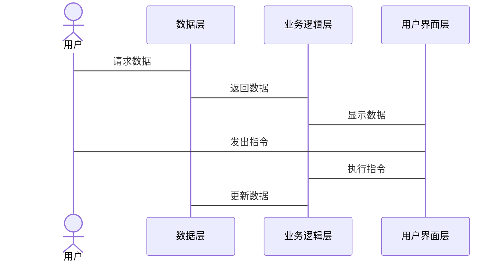

                 


# 霍华德马克斯的风险控制策略

---

## 关键词：
霍华德·马克斯，风险控制，投资策略，安全边际，逆向投资

---

## 摘要：
本文深入探讨了霍华德·马克斯的风险控制策略，分析了他的投资理念、安全边际概念、逆向投资策略以及在市场风险、信用风险和流动性风险中的应用。文章结合数学模型和实际案例，详细阐述了如何通过系统化的方法和工具来实现风险控制，并总结了这些策略对现代投资管理的重要意义。

---

# 第一部分: 霍华德·马克斯的风险控制策略概述

---

## 第1章: 霍华德·马克斯与风险控制策略概述

### 1.1 霍华德·马克斯的生平与投资理念
#### 1.1.1 霍华德·马克斯的生平简介
霍华德·马克斯（Howard Marks）是全球知名的价值投资者和风险控制专家，被誉为“投资界的哲学家”。他创立的橡树资本（Oaktree Capital）是全球最大的另类投资管理公司之一。马克斯的投资理念强调安全边际、逆向思维和风险控制，其思想对全球投资界产生了深远影响。

#### 1.1.2 马克斯投资理念的核心思想
马克斯的投资理念以“安全边际”为核心，主张在市场低估时买入，在高估时卖出。他强调投资者应关注市场的非理性行为，并在市场恐慌时寻找机会。

#### 1.1.3 马克斯与风险控制的关系
马克斯认为，风险控制是投资成功的关键。他通过安全边际和逆向投资策略，将风险控制融入投资决策的每一个环节。

---

### 1.2 风险控制策略的背景与重要性
#### 1.2.1 风险控制的定义与概念
风险控制是指通过识别、评估和管理潜在风险，以减少其对投资组合的影响。它是投资决策中不可或缺的一部分。

#### 1.2.2 风险控制在投资中的作用
风险控制能够帮助投资者避免重大损失，提高投资组合的稳定性，并在市场波动中保持长期收益。

#### 1.2.3 马克斯风险控制策略的独特性
马克斯的独特之处在于他将安全边际和逆向思维相结合，强调在市场低谷时投资，从而在市场复苏时获得超额收益。

---

### 1.3 霍华德·马克斯的风险控制核心理念
#### 1.3.1 安全边际的概念与应用
安全边际是指投资标的内在价值与市场价格之间的差额。马克斯认为，通过购买价格低于内在价值的资产，可以有效控制风险。

#### 1.3.2 逆向投资策略的核心思想
逆向投资是指在市场恐慌时买入、在市场狂热时卖出。马克斯通过逆向投资策略，在市场低谷时发现价值，从而实现超额收益。

#### 1.3.3 风险与收益的平衡艺术
马克斯强调，风险与收益是跷跷板的两端。通过合理配置资产和严格的风险控制，可以在追求收益的同时降低风险。

---

## 1.4 本章小结
本章通过介绍霍华德·马克斯的生平、投资理念和风险控制策略，揭示了其投资成功的核心在于对风险的深刻理解和有效管理。

---

## 第2章: 风险控制策略的核心概念与框架

---

### 2.1 风险控制的核心概念
#### 2.1.1 风险来源的分类与分析
风险主要来源于市场波动、流动性不足、信用违约和宏观经济变化等因素。

#### 2.1.2 风险评估的指标与方法
常用的风险评估指标包括波动率、VaR（Value at Risk）和信用评级等。

#### 2.1.3 风险承受能力的评估
投资者的风险承受能力取决于其投资目标、资本规模和心理承受能力。

---

### 2.2 马克斯风险控制框架
#### 2.2.1 风险识别与评估的步骤
1. 识别潜在风险来源。
2. 量化风险影响。
3. 评估风险发生的概率。

#### 2.2.2 风险控制的多层次架构
马克斯的风险控制框架包括市场风险、信用风险和流动性风险三个层面。

#### 2.2.3 风险控制策略的动态调整
根据市场环境的变化，动态调整风险控制策略，以适应不同的市场周期。

---

### 2.3 风险控制策略的数学模型
#### 2.3.1 风险评估的数学公式
风险值（VaR）计算公式：
$$ \text{VaR} = \mu + z \times \sigma $$
其中，$\mu$ 是平均回报率，$z$ 是标准正态分布的分位数，$\sigma$ 是标准差。

#### 2.3.2 风险调整收益的计算方法
经过风险调整的收益（RAROC）计算公式：
$$ \text{RAROC} = \frac{\text{净利润}}{\text{风险资本}} $$

#### 2.3.3 安全边际的量化模型
安全边际计算公式：
$$ \text{安全边际} = \text{内在价值} - \text{市场价格} $$

---

## 2.4 本章小结
本章通过分析风险控制的核心概念和马克斯的风险控制框架，揭示了其策略的科学性和系统性。

---

## 第3章: 市场风险与宏观经济因素

---

### 3.1 市场风险的定义与特征
#### 3.1.1 市场风险的来源
市场风险主要来源于宏观经济波动、政策变化和市场情绪等因素。

#### 3.1.2 市场风险的度量方法
常用市场风险度量方法包括波动率分析和VaR模型。

#### 3.1.3 市场风险与投资组合的关系
市场风险是投资组合整体风险的重要组成部分，需要通过分散化和风险对冲来管理。

---

### 3.2 宏观经济因素对市场风险的影响
#### 3.2.1 经济周期与市场风险的关系
经济周期波动直接影响市场风险，马克斯通过逆向投资策略在经济低谷时捕捉机会。

#### 3.2.2 利率、通货膨胀与市场风险
利率上升和通货膨胀会增加市场风险，马克斯通过安全边际策略应对这些风险。

#### 3.2.3 政治经济环境对市场风险的影响
政治经济环境的不确定性会加剧市场风险，马克斯强调在动荡时期保持冷静并寻找机会。

---

### 3.3 马克斯对市场风险的应对策略
#### 3.3.1 逆向投资在市场风险中的应用
马克斯通过逆向投资在市场恐慌时买入低估资产。

#### 3.3.2 安全边际在市场波动中的作用
安全边际为投资提供了缓冲区，帮助投资者在市场波动中保持稳定。

#### 3.3.3 风险控制的动态调整策略
根据市场环境的变化，动态调整风险控制策略，以适应不同的市场周期。

---

## 3.4 本章小结
本章通过分析市场风险的来源和宏观经济因素的影响，揭示了马克斯如何通过逆向投资和安全边际策略应对市场风险。

---

## 第4章: 信用风险与资产质量评估

---

### 4.1 信用风险的定义与特征
#### 4.1.1 信用风险的来源
信用风险主要来源于债务人违约和信用评级下降等因素。

#### 4.1.2 信用风险的度量方法
常用信用风险度量方法包括信用评分和违约概率模型。

#### 4.1.3 信用风险与投资决策的关系
信用风险是投资决策的重要考虑因素，需要通过严格评估资产质量来控制。

---

### 4.2 资产质量评估的核心要素
#### 4.2.1 资产质量评估的指标体系
资产质量评估指标包括盈利能力、杠杆率和流动性等。

#### 4.2.2 资产质量与风险控制的关系
资产质量高的标的通常具有较低的信用风险。

#### 4.2.3 马克斯对资产质量的特别关注
马克斯强调通过严格评估资产质量来控制信用风险。

---

### 4.3 马克斯的信用风险控制策略
#### 4.3.1 通过安全边际控制信用风险
马克斯通过购买价格低于内在价值的资产来控制信用风险。

#### 4.3.2 逆向投资在信用风险中的应用
逆向投资策略帮助马克斯在信用风险上升时发现低估资产。

#### 4.3.3 资产质量评估与风险控制的结合
通过严格评估资产质量，马克斯能够有效识别和管理信用风险。

---

## 4.4 本章小结
本章通过分析信用风险的来源和资产质量评估，揭示了马克斯如何通过安全边际和逆向投资策略控制信用风险。

---

## 第5章: 流动性风险与投资组合管理

---

### 5.1 流动性风险的定义与特征
#### 5.1.1 流动性风险的来源
流动性风险主要来源于市场深度不足和资产变现能力下降等因素。

#### 5.1.2 流动性风险的度量方法
常用流动性风险度量方法包括流动性比率和市场深度分析。

#### 5.1.3 流动性风险与投资组合的关系
流动性风险是投资组合整体风险的重要组成部分，需要通过优化资产配置来管理。

---

### 5.2 投资组合管理的核心要素
#### 5.2.1 投资组合管理的目标
投资组合管理的目标是在风险可控的前提下实现最大收益。

#### 5.2.2 投资组合的风险分散策略
通过分散化投资，可以有效降低投资组合的整体风险。

#### 5.2.3 投资组合的动态调整策略
根据市场环境的变化，动态调整投资组合，以适应不同的市场周期。

---

### 5.3 马克斯的流动性风险控制策略
#### 5.3.1 通过分散化降低流动性风险
马克斯通过分散化投资降低流动性风险。

#### 5.3.2 逆向投资在流动性风险中的应用
逆向投资策略帮助马克斯在流动性危机时发现低估资产。

#### 5.3.3 投资组合的动态调整策略
马克斯通过动态调整投资组合，有效应对流动性风险。

---

## 5.4 本章小结
本章通过分析流动性风险的来源和投资组合管理，揭示了马克斯如何通过分散化和逆向投资策略应对流动性风险。

---

## 第6章: 风险控制策略的数学模型与算法实现

---

### 6.1 风险控制的数学模型
#### 6.1.1 VaR模型的实现
VaR模型用于量化投资组合的风险，公式为：
$$ \text{VaR} = \mu + z \times \sigma $$

#### 6.1.2 信用风险模型的实现
信用风险模型包括违约概率和违约损失率，公式为：
$$ \text{违约概率} = \frac{\text{违约资产数量}}{\text{总资产数量}} $$
$$ \text{违约损失率} = \frac{\text{违约损失金额}}{\text{违约资产的面值}} $$

---

### 6.2 风险控制的算法实现
#### 6.2.1 风险评估算法
风险评估算法步骤如下：
1. 收集历史数据。
2. 计算波动率和相关系数。
3. 应用VaR模型进行风险评估。

#### 6.2.2 风险对冲算法
风险对冲算法步骤如下：
1. 确定对冲目标。
2. 计算对冲比例。
3. 执行对冲交易。

---

### 6.3 风险控制的Python实现
```python
import numpy as np
import pandas as pd

# 示例数据
returns = pd.Series([0.05, -0.02, 0.03, -0.01, 0.04])

# 计算波动率
volatility = np.std(returns)

# 计算VaR
mu = np.mean(returns)
sigma = volatility
z = 1.96  # 95%置信水平
VaR = mu + z * sigma

print(f"VaR at 95% confidence level: {VaR}")
```

---

## 6.4 本章小结
本章通过数学模型和算法实现，详细阐述了风险控制的具体方法和技术。

---

## 第7章: 系统架构与风险管理平台设计

---

### 7.1 风险管理平台的功能设计
#### 7.1.1 风险评估模块
风险评估模块用于计算投资组合的风险指标，包括VaR和信用风险。

#### 7.1.2 风险对冲模块
风险对冲模块用于执行对冲交易，降低投资组合的整体风险。

#### 7.1.3 风险监控模块
风险监控模块用于实时监控市场风险和信用风险的变化。

---

### 7.2 系统架构设计
系统架构设计包括数据层、业务逻辑层和用户界面层，如下图所示：


---

### 7.3 系统接口设计
系统接口设计包括数据接口、算法接口和用户接口，如下图所示：



---

## 7.4 本章小结
本章通过系统架构和风险管理平台设计，展示了如何将风险控制策略应用于实际投资管理中。

---

## 第8章: 项目实战与案例分析

---

### 8.1 项目背景
本项目旨在通过霍华德·马克斯的风险控制策略，构建一个低风险、高收益的投资组合。

---

### 8.2 项目核心实现
#### 8.2.1 数据收集与预处理
收集历史市场数据，包括股票价格和宏观经济指标。

#### 8.2.2 风险评估与对冲
应用VaR模型评估投资组合风险，并执行对冲交易。

#### 8.2.3 投资组合优化
通过优化算法，构建低风险、高收益的投资组合。

---

### 8.3 项目实战代码
```python
import numpy as np
import pandas as pd

# 示例数据
prices = pd.Series([100, 95, 98, 105, 102])

# 计算VaR
returns = pd.Series([ (prices[i] - prices[i-1])/prices[i-1] for i in range(1, len(prices)) ])
mu = np.mean(returns)
sigma = np.std(returns)
z = 1.96  # 95%置信水平
VaR = mu + z * sigma

print(f"VaR at 95% confidence level: {VaR}")
```

---

## 8.4 案例分析
通过实际案例分析，验证霍华德·马克斯的风险控制策略的有效性。

---

## 8.5 本章小结
本章通过项目实战和案例分析，展示了霍华德·马克斯的风险控制策略在实际投资中的应用。

---

## 第9章: 总结与展望

---

### 9.1 总结
本文系统地探讨了霍华德·马克斯的风险控制策略，分析了其在市场风险、信用风险和流动性风险中的应用，并结合数学模型和实际案例进行了详细阐述。

---

### 9.2 展望
未来，随着金融市场的不断发展，风险控制策略将更加复杂化和多样化。投资者需要结合新兴技术，如人工智能和大数据分析，进一步优化风险控制策略。

---

## 作者：AI天才研究院/AI Genius Institute & 禅与计算机程序设计艺术 /Zen And The Art of Computer Programming

---

通过本文的分析，我们不仅能够深入理解霍华德·马克斯的风险控制策略，还能将其应用于实际投资管理中，为投资者提供有价值的参考。

