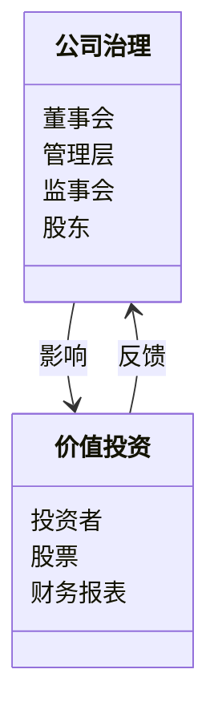

                 

<think>
好的，我需要按照用户的要求，逐步完成《马丁·惠特曼的公司治理价值投资：推动变革创造价值》这篇文章的撰写。用户希望文章结构清晰，逻辑严谨，并且包含背景介绍、核心概念、算法原理、系统架构、项目实战和最佳实践等多个部分。同时，用户还特别强调要使用技术语言，结合数学公式和图表进行详细讲解。

首先，我会从文章的摘要开始，概述整篇文章的核心内容和主题思想，帮助读者快速了解文章的主要内容。接着，我会列出文章的关键词，以便更好地进行后续的撰写和优化。

接下来，我会按照目录大纲的结构，逐步撰写每个章节的内容。每个章节都需要细化到三级目录，并且在每个部分中，我需要详细解释相关概念，使用表格、图表和数学公式来增强文章的可读性和专业性。

在撰写过程中，我会确保每个部分之间逻辑连贯，从理论到实践逐步深入，让读者能够循序渐进地理解公司治理与价值投资之间的关系，以及马丁·惠特曼的理论如何推动变革并创造价值。

最后，我会总结文章的主要观点，并提出一些最佳实践和注意事项，帮助读者更好地应用这些理论到实际工作中。

现在，我将开始撰写这篇文章，确保每一部分内容都符合用户的要求，逻辑清晰，结构紧凑，语言专业，同时保持简单易懂，便于读者理解和应用。
</think>

# 马丁·惠特曼的公司治理价值投资：推动变革创造价值

> 关键词：公司治理，价值投资，马丁·惠特曼，股东价值，企业绩效，变革管理，安全边际

> 摘要：本文系统阐述了马丁·惠特曼的公司治理价值投资理论，深入分析了公司治理与价值投资的内在联系，结合数学模型和实际案例，探讨了如何通过优化公司治理结构和践行价值投资理念，推动企业变革，实现股东价值最大化。文章从理论基础到系统架构，再到项目实战，全面解析了马丁·惠特曼的公司治理价值投资方法，为投资者和企业管理者提供了实践指导和操作建议。

---

## 第一部分: 公司治理与价值投资的背景介绍

### 第1章: 公司治理的基本概念

#### 1.1.1 公司治理的定义与内涵
公司治理是企业管理和运作的核心机制，涉及股东、董事会、高管和利益相关者之间的权利分配和监督关系。其内涵包括：  
- **所有权与控制权分离**：股东作为所有者，通过董事会和管理层实现对企业控制。  
- **利益相关者平衡**：公司在追求股东价值的同时，还需关注员工、客户、债权人和环境等利益相关者。  
- **透明与制衡**：通过信息披露、内部审计和外部监管确保公司行为的透明性和可控性。

#### 1.1.2 公司治理的演进历程
公司治理的演变经历了以下几个阶段：  
1. **古典资本主义阶段**：强调股东利益最大化，忽视其他利益相关者。  
2. **利益相关者资本主义阶段**：引入利益相关者概念，注重企业社会责任。  
3. **现代治理阶段**：通过制度化、规范化的方式优化治理结构，提升企业绩效。

#### 1.1.3 公司治理的核心要素
公司治理的核心要素包括：  
- **治理结构**：董事会、监事会、管理层的组织架构。  
- **治理机制**：决策机制、监督机制、激励机制和约束机制。  
- **治理文化**：企业价值观、道德规范和透明文化。

---

### 第2章: 价值投资的基本概念

#### 2.1.1 价值投资的定义与特点
价值投资是一种投资策略，强调以低于内在价值的价格购买优质资产。其特点包括：  
- **长期导向**：注重长期收益，而非短期波动。  
- **基本面分析**：通过分析财务报表、行业地位和竞争优势，评估企业的内在价值。  
- **安全边际**：买入价格低于内在价值，以降低投资风险。

#### 2.1.2 价值投资的历史发展
价值投资理论起源于本杰明·格雷厄姆和戴维·多德的工作，后经 Warren Buffett 等人发扬光大。其发展经历了以下几个阶段：  
1. **格雷厄姆与多德时期**：提出“安全边际”和“内在价值”概念。  
2. **巴菲特时期**：将价值投资与企业竞争优势相结合，强调长期持有优质企业。  
3. **现代价值投资**：结合市场变化和技术进步，优化投资策略。

#### 2.1.3 价值投资的核心理念
价值投资的核心理念包括：  
- **寻找低估资产**：通过分析市场估值与企业内在价值的差异，寻找被市场低估的投资标的。  
- **注重长期回报**：避免短期市场波动，关注企业的长期盈利能力。  
- **分散投资风险**：通过多元化投资降低特定资产的风险。

---

## 第二部分: 公司治理与价值投资的核心概念与联系

### 第3章: 公司治理的理论基础

#### 3.1.1 股东价值最大化与利益相关者平衡
股东价值最大化是公司治理的核心目标，但需平衡其他利益相关者的需求。例如：  
- **员工**：合理的薪酬和职业发展机会。  
- **客户**：优质的产品和服务。  
- **债权人**：按时偿还债务。  
- **环境**：减少污染和资源浪费。

#### 3.1.2 公司治理的结构与功能
公司治理的结构包括：  
- **董事会**：作为决策和监督机构，负责制定公司战略和监督管理层。  
- **监事会**：作为独立监督机构，确保公司治理的合规性和有效性。  
- **管理层**：执行董事会决策，负责日常经营和管理。

#### 3.1.3 公司治理与企业绩效的关系
研究表明，有效的公司治理能够显著提升企业绩效，主要体现在：  
- **提高透明度**：增强投资者和利益相关者的信任。  
- **优化决策效率**：通过科学的决策机制提升企业竞争力。  
- **降低代理成本**：通过制衡机制减少管理层与股东之间的利益冲突。

---

### 第4章: 价值投资的理论基础

#### 4.1.1 股票估值的核心公式
股票的内在价值可以通过以下公式估算：  
$$ V = \frac{CF}{r - g} $$  
其中，\( V \) 为内在价值，\( CF \) 为自由现金流，\( r \) 为折现率，\( g \) 为现金流增长率。

#### 4.1.2 价值投资的选股标准
价值投资者通常关注以下指标：  
- **市盈率（P/E）**：衡量股价与每股收益的比例。  
- **市净率（P/B）**：衡量股价与每股净资产的比例。  
- **股息率**：衡量公司派发股息的能力。

#### 4.1.3 长期投资与安全边际的概念
安全边际是指买入价格与内在价值的差距，公式为：  
$$ \text{安全边际} = \text{内在价值} - \text{买入价格} $$  
安全边际越大，投资风险越小。

---

### 第5章: 公司治理与价值投资的联系

#### 5.1.1 公司治理对股东价值的影响
有效的公司治理能够提升股东价值，主要体现在：  
- **优化资本结构**：通过合理分配债务和股权，降低资本成本。  
- **提升管理效率**：通过科学的激励机制和监督机制，提高管理层的工作效率。  
- **增强投资者信心**：通过透明的披露和合规的运作，增强投资者对公司的信任。

#### 5.1.2 价值投资视角下的公司治理评估
价值投资者在评估公司治理时，通常关注以下方面：  
- **董事会结构**：是否独立、专业且有效。  
- **管理层激励**：是否与公司绩效挂钩，避免短期行为。  
- **股东权利**：股东是否拥有充分的知情权和参与权。

#### 5.1.3 马丁·惠特曼的公司治理价值投资模型
马丁·惠特曼提出了一种整合公司治理与价值投资的模型，包括以下几个步骤：  
1. **评估公司治理结构**：分析董事会、管理层和监事会的职责和效率。  
2. **评估企业内在价值**：通过基本面分析和估值模型确定企业的内在价值。  
3. **结合治理因素调整投资决策**：根据公司治理的优劣，调整买入价格和投资策略。

---

## 第三部分: 公司治理与价值投资的数学模型与算法原理

### 第6章: 公司治理的评估模型

#### 6.1.1 治理结构的量化评估
公司治理的量化评估可以采用以下指标：  
- **董事会独立性**：独立董事比例。  
- **监事会有效性**：监事会的监督能力和效率。  
- **管理层激励**：激励机制的合理性和透明度。

#### 6.1.2 股东权益的数学表达
股东权益可以通过以下公式计算：  
$$ \text{股东权益} = \text{资产} - \text{负债} $$  
其中，资产包括流动资产和非流动资产，负债包括流动负债和非流动负债。

#### 6.1.3 治理效率的优化算法
治理效率的优化可以通过以下步骤实现：  
1. **分析治理结构**：识别治理结构中的瓶颈和低效环节。  
2. **设计优化方案**：通过调整组织架构和流程，提升治理效率。  
3. **实施与监控**：逐步实施优化方案，并通过监控和反馈机制持续改进。

---

### 第7章: 价值投资的数学模型

#### 7.1.1 股票内在价值的计算公式
股票的内在价值可以通过以下公式估算：  
$$ V = \sum_{t=1}^{n} \frac{CF_t}{(1 + r)^t} $$  
其中，\( CF_t \) 为第 \( t \) 年的自由现金流，\( r \) 为折现率，\( n \) 为预测年数。

#### 7.1.2 市盈率与市净率的比较分析
市盈率和市净率的比较可以通过以下表格实现：

| 指标 | 定义 | 适用场景 |
|------|------|----------|
| 市盈率 | \( \text{P/E} = \frac{\text{股价}}{\text{每股收益}} \) | 适用于盈利稳定的公司。 |
| 市净率 | \( \text{P/B} = \frac{\text{股价}}{\text{每股净资产}} \) | 适用于净资产较高的公司。 |

---

## 第四部分: 公司治理与价值投资的系统分析与架构设计

### 第8章: 系统分析

#### 8.1.1 问题场景介绍
公司治理与价值投资的系统分析需要解决以下问题：  
- 如何量化公司治理的优劣？  
- 如何通过公司治理优化提升股东价值？  
- 如何结合价值投资理念设计投资策略？

#### 8.1.2 领域模型设计（Mermaid 类图）
以下是领域模型设计的 Mermaid 类图：



---

#### 8.1.3 系统功能设计
系统功能设计包括以下几个模块：  
- **数据采集模块**：收集公司治理和财务数据。  
- **评估模块**：计算公司治理评分和股票内在价值。  
- **策略模块**：生成投资策略和优化建议。

---

### 第9章: 系统架构设计

#### 9.1.1 模块划分与功能分配
系统架构设计包括以下几个模块：  
- **输入模块**：接收用户输入的公司数据。  
- **计算模块**：计算公司治理评分和股票估值。  
- **输出模块**：生成投资策略和优化建议。

#### 9.1.2 系统架构图（Mermaid 架构图）
以下是系统架构图的 Mermaid 设计：


---

#### 9.1.3 接口设计与交互流程
接口设计包括以下几个步骤：  
1. **用户输入**：用户输入公司治理和财务数据。  
2. **数据处理**：系统对数据进行清洗和预处理。  
3. **计算与分析**：系统计算公司治理评分和股票估值。  
4. **生成报告**：系统生成投资策略和优化建议。

---

## 第五部分: 项目实战

### 第10章: 项目实战

#### 10.1.1 环境安装
项目实战需要以下环境：  
- **操作系统**：Windows、MacOS 或 Linux。  
- **编程语言**：Python 3.8 或更高版本。  
- **开发工具**：PyCharm、VS Code 等。

#### 10.1.2 核心实现源代码
以下是核心实现的 Python 代码：

```python
def calculate_intrinsic_value(cash_flows, discount_rate, growth_rate):
    return sum(cf / (1 + discount_rate) ** t for t, cf in enumerate(cash_flows))

def calculate_governance_score(boards, managers,监事会):
    return (boards + managers + 监事会) / 3
```

---

#### 10.1.3 案例分析与详细解读
以某公司为例，假设其自由现金流为 $100, $120, $140，折现率为 10%，则其内在价值为：  
$$ V = \frac{100}{1.1} + \frac{120}{1.1^2} + \frac{140}{1.1^3} \approx 301.88 $$  
如果当前股价为 $280，则该股票具有较高的投资价值。

---

## 第六部分: 最佳实践

### 第11章: 最佳实践

#### 11.1.1 小结
公司治理与价值投资是相辅相成的，通过优化公司治理结构和践行价值投资理念，可以实现股东价值最大化。

#### 11.1.2 注意事项
- **数据质量**：确保输入数据的准确性和完整性。  
- **模型优化**：根据实际情况不断优化评估模型和投资策略。  
- **风险控制**：合理分散投资风险，避免过度集中。

#### 11.1.3 拓展阅读
推荐阅读以下书籍：  
- 《The Intelligent Investor》——本杰明·格雷厄姆  
- 《公司治理与企业绩效》——约翰·科特

---

## 结语

马丁·惠特曼的公司治理价值投资理论为我们提供了重要的启示，通过优化公司治理结构和践行价值投资理念，我们可以推动企业变革，实现股东价值最大化。希望本文能为投资者和企业管理者提供有益的指导和实践建议。

---

**作者：AI天才研究院/AI Genius Institute & 禅与计算机程序设计艺术 /Zen And The Art of Computer Programming**

