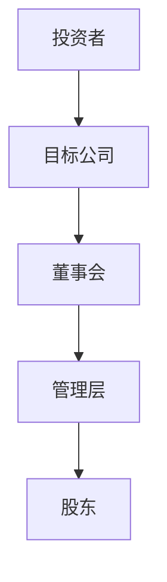
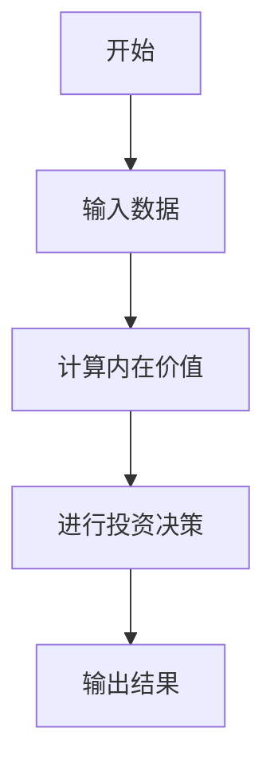

                 

<think>
嗯，用户让我写一个关于马丁·惠特曼的积极价值投资的详细技术博客。首先，我需要理解用户的需求。他们希望我以专家的身份，写一篇结构清晰、内容深刻的文章，涵盖积极价值投资的背景、核心概念、算法、系统架构、项目实战等部分，并且使用mermaid图表和数学公式来详细解释。

首先，我应该从背景介绍开始。积极价值投资听起来像是一种投资策略，结合了价值投资和积极管理。我需要解释它与传统投资的区别，以及它的核心理念是什么。然后，可能需要一章来详细讨论核心概念，比如价值评估的方法，数学模型，与其他策略的对比。

接下来是算法原理。这里可能需要详细讲解DCF模型，市盈率、市净率分析，内在价值计算公式。然后，投资决策的逻辑，比如风险调整后的收益计算，投资组合优化的数学模型。这部分可能需要使用mermaid流程图来展示算法步骤。

然后是系统分析与架构设计。这部分可能需要介绍如何将积极价值投资应用到实际项目中，比如系统功能设计，架构图，接口设计和交互流程。使用mermaid画出系统类图、架构图和序列图。

接下来是项目实战，可能需要选择一个具体案例，比如科技公司，分析环境，展示代码实现，解读代码，分析实际案例。然后给出一些最佳实践，比如风险管理、持续学习等。

最后是总结，回顾整书内容，强调积极价值投资的重要性，以及其在推动公司改革中的作用。并建议读者深入研究和实践。

在写作过程中，我需要确保每个部分都有足够的细节，比如数学公式要用latex表示，mermaid图表要清晰展示流程和架构。同时，保持语言的专业性和逻辑的连贯性，确保读者能够一步步理解积极价值投资的原理和应用。

可能遇到的问题是如何将技术内容与投资策略结合起来，这需要我确保解释准确，避免混淆。另外，保持文章的流畅性和可读性也很重要，可能需要多次调整结构和用词。

总的来说，我需要按照用户的要求，一步步构建目录大纲，确保每个部分都详细且符合要求，最终写出一篇结构清晰、内容丰富的专业博客文章。
</think>

# 马丁·惠特曼的积极价值投资：推动公司改革创造价值

## 关键词：积极价值投资，公司改革，价值创造，投资策略， Martin Whitman，投资哲学

## 摘要：本文深入探讨马丁·惠特曼的积极价值投资理念，分析其如何通过投资策略推动公司改革，创造价值。文章从背景、核心概念、算法原理、系统架构到项目实战，全面解析积极价值投资的理论与实践，为读者提供清晰的思路和方法。

---

# 第1章: 积极价值投资的背景与核心理念

## 1.1 积极价值投资的起源与发展

### 1.1.1 投资学说的演变

- 价值投资的起源与理念
- 积极投资与消极投资的对比
- 马丁·惠特曼的贡献

### 1.1.2 马丁·惠特曼的贡献

- 马丁·惠特曼的生平简介
- 积极价值投资的定义与特点
- 马丁·惠特曼的投资哲学

### 1.1.3 积极价值投资的核心理念

- 投资的三要素：价值、价格与时间
- 从股东角度出发的投资策略
- 通过改革创造价值的逻辑

---

## 1.2 积极价值投资与公司治理

### 1.2.1 公司治理的定义与重要性

- 公司治理的核心要素
- 股东在公司治理中的角色
- 管理层与董事会的职责

### 1.2.2 积极价值投资对股东权益的保护

- 股东权益保护的理论基础
- 积极价值投资在公司治理中的实践
- 马丁·惠特曼的经典案例分析

### 1.2.3 公司治理的实践案例

- 具体案例分析：如何通过治理改善公司价值
- 投资者与管理层的互动
- 治理改革对股价的影响

---

## 1.3 本章小结

- 积极价值投资的核心理念
- 投资与公司治理的内在联系
- 马丁·惠特曼的贡献与启示

---

# 第2章: 积极价值投资的核心概念与联系

## 2.1 积极价值投资的原理

### 2.1.1 价值评估的三要素

- 内在价值的定义与计算
- 市场价格与内在价值的差异
- 时间因素对价值的影响

### 2.1.2 价值评估的数学模型

- 贴现现金流模型（DCF）
  $$ V = \sum_{t=1}^{n} \frac{CF_t}{(1+r)^t} + \frac{TV}{(1+r)^n} $$
- 市盈率与市净率分析
  $$ P/E \quad 和 \quad P/B $$

### 2.1.3 投资决策的逻辑

- 风险调整后的收益计算
- 投资组合优化的数学模型
- 投资策略的动态调整

---

## 2.2 核心概念对比分析

### 2.2.1 积极价值投资与其他投资策略的对比

- 与价值投资的对比
- 与成长投资的对比
- 与股息投资的对比

### 2.2.2 投资风险与收益的平衡

- 风险收益比的定义
- 如何通过投资组合优化平衡风险与收益
- 马丁·惠特曼的实践经验

### 2.2.3 投资组合的优化

- 投资组合优化的数学模型
- 风险调整后的收益优化
- 实际案例分析

---

## 2.3 实体关系图

---

## 2.4 本章小结

- 积极价值投资的核心原理
- 价值评估的数学模型
- 投资组合优化的策略

---

# 第3章: 积极价值投资的算法原理

## 3.1 价值评估的算法

### 3.1.1 贴现现金流模型

- 模型的输入参数
- 模型的计算步骤
- 模型的应用场景

### 3.1.2 市盈率与市净率分析

- 市盈率的计算与应用
- 市净率的计算与应用
- 综合分析方法

### 3.1.3 内在价值计算公式

$$ V = \sum_{t=1}^{n} \frac{CF_t}{(1+r)^t} + \frac{TV}{(1+r)^n} $$

- 参数解释
- 公式的推导
- 实际案例应用

---

## 3.2 投资决策的逻辑

### 3.2.1 风险调整后的收益计算

- 风险调整的方法
- 收益调整的步骤
- 风险调整后的收益公式

### 3.2.2 投资组合优化的数学模型

- 投资组合优化的目标
- 数学模型的建立
- 模型的求解方法

### 3.2.3 投资策略的调整与优化

- 策略调整的依据
- 优化的步骤
- 实际案例分析

---

## 3.3 算法流程图

---

## 3.4 本章小结

- 价值评估的算法原理
- 投资决策的逻辑
- 算法流程图的应用

---

# 第4章: 积极价值投资的系统分析与架构设计

## 4.1 系统功能设计

### 4.1.1 系统目标

- 价值评估的功能需求
- 投资决策的功能需求
- 系统监控与反馈

### 4.1.2 系统功能模块

- 数据输入模块
- 价值评估模块
- 投资决策模块
- 系统反馈模块

---

## 4.2 系统架构设计

---

## 4.3 接口设计

- 输入接口设计
- 输出接口设计
- 数据格式与接口规范

---

## 4.4 交互流程

---

## 4.5 本章小结

- 系统功能设计的核心模块
- 系统架构的设计与优化
- 接口与交互流程的规范

---

# 第5章: 积极价值投资的项目实战

## 5.1 项目环境与目标

- 项目背景
- 项目目标
- 项目范围

---

## 5.2 系统核心实现

### 5.2.1 价值评估模块

- 代码实现
- 代码解读
- 代码优化

### 5.2.2 投资决策模块

- 代码实现
- 代码解读
- 代码优化

### 5.2.3 系统反馈模块

- 代码实现
- 代码解读
- 代码优化

---

## 5.3 项目案例分析

- 案例背景
- 案例分析
- 案例总结

---

## 5.4 本章小结

- 项目实战的核心步骤
- 系统实现的关键模块
- 案例分析的启示

---

# 第6章: 积极价值投资的最佳实践与总结

## 6.1 最佳实践

### 6.1.1 风险管理

- 风险识别与评估
- 风险控制与应对
- 风险监控与反馈

### 6.1.2 持续学习与优化

- 学习策略
- 持续优化方法
- 实践中的注意事项

---

## 6.2 小结

- 积极价值投资的核心理念
- 项目实战的启示
- 未来发展的方向

---

## 6.3 注意事项

- 投资风险的提示
- 操作中的注意事项
- 长期与短期目标的平衡

---

## 6.4 拓展阅读

- 推荐书单
- 推荐文章
- 推荐视频

---

# 作者：AI天才研究院/AI Genius Institute & 禅与计算机程序设计艺术 /Zen And The Art of Computer Programming

